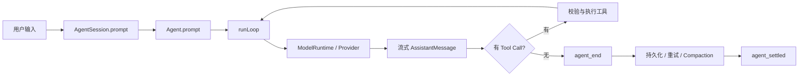

# Pi 0.84 源码学习课程

> 从“用户输入一句话”开始，顺着真实运行链读懂 Pi，而不是从类型定义和文件列表开始背源码。

## 你最终要掌握什么

学完后，你应该能够不用背代码，自己讲清楚下面这条链：



你还要能回答：

- `Agent`、`AgentSession`、`SessionManager` 为什么不能合成一个类？
- Tool Result 为什么必须回到下一次模型请求，而不是工具执行完就结束？
- `steer`、`followUp`、`abort` 分别在哪个安全边界生效？
- Session 为什么是树，而不是一条只能追加的聊天数组？
- Compaction 为什么不能随便从 Tool Result 中间切断？
- `ModelRuntime` 为什么同时维护模型目录、鉴权与可用性快照？
- Extension、Skill、Tool 各自扩展的是什么？
- 经典 `Agent` 与新的 durable `AgentHarness` 当前分别能做什么？
- 产品 Runtime Host 怎样借用 Pi，而不复制第二套 Agent 内核？

## 源码基线

本课程固定在以下可复现基线：

| 项目 | 值 |
|---|---|
| 仓库 | `7155/pi` |
| 课程源码分支 | `integration/upstream-0.84-runtime-host` |
| 课程源码提交 | `1cafa4567357ba6d211033e99f58c19385ccacf1` |
| 上游 Pi 基线 | `0.84.2` |
| 上游提交 | `59a71b235dadb4ad0d67557a8abb0aaa093e68b4` |
| 产品适配器 | `integrations/rag-ime-runtime-host` |

详细证据见 [source-baseline.md](source-baseline.md)。当源码发生变化时，不要只修改文案；
先按 [`course-manifest.json`](course-manifest.json) 重新核对源文件。

## 课程地图

### 第一阶段：先跑通一条请求

| 课时 | 主题 | 学完后的关键能力 |
|---|---|---|
| [00](lessons/00-architecture-and-learning-map/README.md) | 架构地图与学习方法 | 知道每一层解决什么问题 |
| [01](lessons/01-create-agent-session/README.md) | 创建 AgentSession | 看懂模型、工具、资源与 Session 如何装配 |
| [02](lessons/02-agent-state-and-run-lifecycle/README.md) | Agent 状态与一次 Run | 看懂 `activeRun`、事件与 settlement |
| [03](lessons/03-model-turn-and-tool-loop/README.md) | 模型 Turn 与 Tool Loop | 手推一次模型→工具→模型循环 |

### 第二阶段：理解长时间运行

| 课时 | 主题 | 学完后的关键能力 |
|---|---|---|
| [04](lessons/04-steer-follow-up-and-abort/README.md) | Steer、Follow-up、Abort | 解释中途改方向、排队与取消 |
| [05](lessons/05-agent-session-orchestration/README.md) | AgentSession 编排 | 理解持久化、扩展、重试、压缩和 `agent_settled` |
| [06](lessons/06-session-tree-and-recovery/README.md) | Session 树与恢复 | 解释 Fork、Rewind、恢复和 JSONL |
| [07](lessons/07-context-compaction/README.md) | Context Compaction | 解释何时压缩、保留什么、为何能继续工作 |

### 第三阶段：理解可扩展产品

| 课时 | 主题 | 学完后的关键能力 |
|---|---|---|
| [08](lessons/08-model-runtime-and-provider-boundary/README.md) | ModelRuntime 与 Provider | 解释多模型、鉴权、刷新和请求边界 |
| [09](lessons/09-extensions-skills-and-resources/README.md) | Extension、Skill、Resource | 设计渐进披露和扩展边界 |
| [10](lessons/10-tui-event-driven-rendering/README.md) | TUI 事件驱动渲染 | 解释流式 UI 为什么能稳定更新 |
| [11](lessons/11-durable-harness-and-lanes/README.md) | Durable Harness 与 Lane | 分清当前能力与新架构方向 |
| [12](lessons/12-product-runtime-host/README.md) | 产品 Runtime Host | 把 Pi 接入自己的 Agent 产品 |
| [13](lessons/13-build-your-own-agent-app/README.md) | 结课项目 | 完成可面试展示的数据准备 Agent |

## 每课怎么学

每课建议按四遍完成：

1. **第一遍只看图和真实场景。** 不看源码，先说出“为什么需要这一层”。
2. **第二遍读核心代码。** 每次只追 5～15 行，并把运行时真实值写在旁边。
3. **第三遍手推事件和状态。** 用表格写出输入、修改状态、输出与失败。
4. **第四遍做“练习题”。** 不能只复述，要能自己设计或排错。

不要把“看懂了”当成学会。每课的完成标准都是：可以脱离文档，用自己的话画出流程并解释一次失败路径。

## 推荐运行方式

在仓库根目录执行：

```bash
npm ci --ignore-scripts
npm run build:offline
npm run check
```

只想研究产品 Runtime Host 时：

```bash
npm run build:rag-ime-runtime-host
npm run test:rag-ime-runtime-host
```

课程主要是源码阅读，不要求一开始就调通真实模型。可以先用测试、伪造 Stream 或已有 Session 理解机制，再接 API Key。

## 一条总原则

> Pi 的核心价值不是“会调用大模型”，而是把模型请求、工具副作用、用户中途输入、持久化、取消、压缩和恢复放进可解释的生命周期里。
