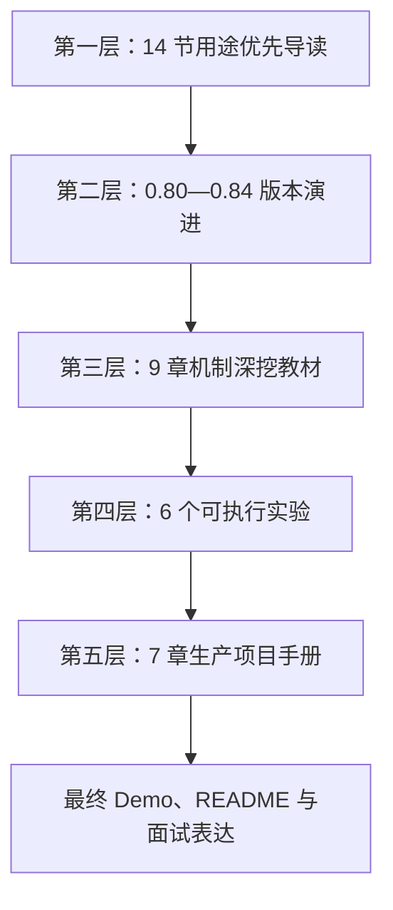
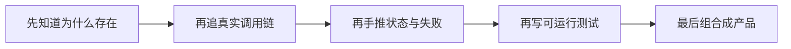
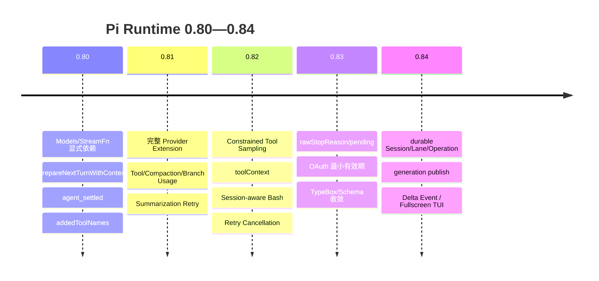
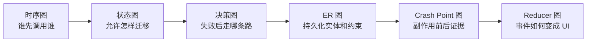
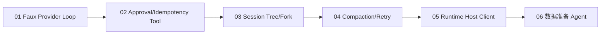
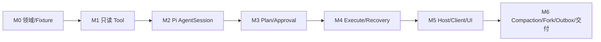

# Pi 0.84 源码到完整 Agent 项目课程

> 这不是 Pi API 速查表，也不是 14 篇短导读。课程从一条真实 Prompt 出发，逐层读到 Provider、Tool、Session、Compaction、Extension、Runtime Host 和 UI，再用六个实验与一套生产项目手册完成数据准备 Agent。

## 1. 学完后要真正做到什么

课程完成标准不是“看懂几个类名”，而是能够独立完成下面五类工作。

### 源码理解

你能从：

```text
createAgentSession()
→ AgentSession.prompt()
→ Agent.prompt()
→ runLoop()
→ ModelRuntime / Provider
→ Tool Call / Tool Result
→ SessionManager
→ Retry / Compaction
→ agent_settled
```

逐函数解释：输入从哪里来、谁拥有状态、事件怎样传播、失败和取消由谁结算。

### Runtime 工程

你能设计并验证：

- Steer、Follow-up、Abort 的安全边界；
- 同 Session 单 Active Run；
- Tool 参数校验、审批、幂等和 Crash Recovery；
- Session Tree、Fork、Reopen 与 Stale Context；
- Context Compaction、Overflow Recovery 和可取消 Retry；
- Provider/Auth/Catalog Refresh 与 Prompt Cache；
- 多 Session Runtime Host、严格 Framing、Snapshot 和 Outbox；
- TUI/Web Delta Reducer、差分渲染和 Late Event Guard。

### 版本判断

你能说清 Pi `0.80 → 0.84` 为什么演进，而不是只背更新日志：

```text
0.80：显式模型依赖、下一 Turn 刷新、settlement、动态 Tool 锚点
0.81：完整 Provider、完整 Usage、摘要 Retry
0.82：约束 Tool 输入、toolContext、Session-aware Bash、贯穿取消
0.83：raw Stop Reason、Deferred Pending、OAuth 有效期、Schema 收敛
0.84：durable Session/Lane/Operation、generation publish、delta、全屏 TUI
```

### 项目实现

你能完成一个数据准备 Agent：自然语言需求 → 数据搜索与检查 → 证据比较 → 不可变下载计划 → 审批 → 幂等执行 → Checksum → 可复现实验报告。

### 面试表达

你能用 30 秒、90 秒和 5 分钟三个版本讲清：为什么需要 Agent、Pi 与产品的边界、最难的状态机和副作用问题、如何证明恢复没有重复执行。

---

## 2. 课程源码基线

| 项目 | 值 |
|---|---|
| 仓库 | `7155/pi` |
| 课程源码分支 | `integration/upstream-0.84-runtime-host` |
| 课程源码提交 | `1cafa4567357ba6d211033e99f58c19385ccacf1` |
| 上游 Pi 基线 | `0.84.2` |
| 上游提交 | `59a71b235dadb4ad0d67557a8abb0aaa093e68b4` |
| 产品适配器 | `integrations/rag-ime-runtime-host` |

课程分支中的教学文件不修改 Runtime 代码。源码更新时，先读 [`course-manifest.json`](course-manifest.json) 和 [`source-baseline.md`](source-baseline.md)，比较证据文件，再更新受影响章节。

---

## 3. 五层课程结构

原有 14 课现在明确定位为**导读层**：先建立用途和调用链。真正做到“只读课程就能完成项目”的内容在版本专题、机制教材、实验和项目手册中继续展开。



### 为什么这样分层



直接从 `types.ts` 第一行开始，会记住字段却不知道它们解决什么。只看导读，又不足以实现恢复和并发。五层结构让理解、源码、实验和项目互相校验。

---

# 第一层：14 节用途优先导读

这些课用于第一次建立地图。每课读完后，继续进入表中对应的机制深挖与实验，不要在导读层停止。

## 阶段 A：跑通一条请求

| 课时 | 主题 | 继续深入 |
|---|---|---|
| [00](lessons/00-architecture-and-learning-map/README.md) | Pi 分层与学习地图 | [完整调用图](deep-dives/01-runtime-call-graph.md) |
| [01](lessons/01-create-agent-session/README.md) | `createAgentSession()` 装配 | [Provider/Auth](deep-dives/06-model-provider-auth-cache.md) |
| [02](lessons/02-agent-state-and-run-lifecycle/README.md) | Agent Run 与 `activeRun` | [事件与 settlement](deep-dives/02-event-lifecycle-settlement.md) |
| [03](lessons/03-model-turn-and-tool-loop/README.md) | Turn、Tool Batch、Tool Result | [Tool 副作用](deep-dives/03-tool-execution-side-effects.md)、[实验 01](labs/01-fake-provider-loop/README.md) |

## 阶段 B：理解长时间运行

| 课时 | 主题 | 继续深入 |
|---|---|---|
| [04](lessons/04-steer-follow-up-and-abort/README.md) | Steer、Follow-up、Abort | [事件与 settlement](deep-dives/02-event-lifecycle-settlement.md) |
| [05](lessons/05-agent-session-orchestration/README.md) | AgentSession 编排 | [完整调用图](deep-dives/01-runtime-call-graph.md) |
| [06](lessons/06-session-tree-and-recovery/README.md) | Session 树、Fork、恢复 | [Session JSONL](deep-dives/04-session-tree-jsonl.md)、[实验 03](labs/03-session-fork-recovery/README.md) |
| [07](lessons/07-context-compaction/README.md) | Context Compaction | [长任务教材](deep-dives/05-compaction-retry-recovery.md)、[实验 04](labs/04-long-run-compaction/README.md) |

## 阶段 C：理解可扩展产品

| 课时 | 主题 | 继续深入 |
|---|---|---|
| [08](lessons/08-model-runtime-and-provider-boundary/README.md) | ModelRuntime 与 Provider | [模型/Auth/Cache](deep-dives/06-model-provider-auth-cache.md) |
| [09](lessons/09-extensions-skills-and-resources/README.md) | Extension、Skill、Resource | [扩展边界](deep-dives/07-extension-skill-tool-boundaries.md) |
| [10](lessons/10-tui-event-driven-rendering/README.md) | TUI 增量渲染 | [TUI/Web Reducer](deep-dives/09-tui-event-rendering.md) |
| [11](lessons/11-durable-harness-and-lanes/README.md) | Durable Harness 与 Lane | [0.84 专题](evolution/0.84.md) |
| [12](lessons/12-product-runtime-host/README.md) | 产品 Runtime Host | [Host 并发教材](deep-dives/08-runtime-host-protocol-concurrency.md)、[实验 05](labs/05-runtime-host-client/README.md) |
| [13](lessons/13-build-your-own-agent-app/README.md) | 结课项目导读 | [完整项目手册](project/README.md)、[实验 06](labs/06-data-preparation-agent/README.md) |

---

# 第二层：Pi 0.80 → 0.84 版本演进专题

入口：[版本专题首页](evolution/README.md)



| 章节 | 重点 |
|---|---|
| [0.80](evolution/0.80.md) | 从隐式模型/鉴权到 `Models`，下一 Turn 刷新、`agent_settled`、动态 Tool 锚点 |
| [0.81](evolution/0.81.md) | 完整 Provider 平台、Usage Ledger、Compaction 队列与摘要补偿 |
| [0.82](evolution/0.82.md) | 严格/Grammar Tool 输入、`toolContext`、Bash 关联、贯穿取消 |
| [0.83](evolution/0.83.md) | Stop Reason 原始证据、Deferred Pending、OAuth 有效期、Schema 语义 |
| [0.84](evolution/0.84.md) | v4 Session/Repo/Lane/Operation、原子 JSONL、Generation、Delta、TUI、实验 Protocol |
| [旧 Fork 迁移图](evolution/migration-map.md) | 判断“删除、适配、移到产品层，还是保留最小 Core Patch” |

每章都按：

```text
旧设计哪里不够
→ 新机制是什么
→ 运行时状态怎样变化
→ 当前源码落点
→ 对 7155/pi Fork 的迁移影响
→ 练习题
```

版本专题不是 Changelog 摘抄。它将更新转成架构决策和迁移证据。

---

# 第三层：9 章机制深挖教材

入口：[机制教材首页](deep-dives/README.md)

| 编号 | 教材 | 你要能完成的事 |
|---|---|---|
| 01 | [一条 Prompt 的完整函数调用图](deep-dives/01-runtime-call-graph.md) | 从 SDK 装配追到 Provider、Tool、Session 和 Settled |
| 02 | [事件、状态归约与 settlement](deep-dives/02-event-lifecycle-settlement.md) | 手推 Run/Turn/Message/Tool、Retry、Compaction、Late Event |
| 03 | [Tool 执行与副作用恢复](deep-dives/03-tool-execution-side-effects.md) | 参数、审批、并行顺序、幂等、Crash Point、Replay Policy |
| 04 | [Session JSONL 与恢复](deep-dives/04-session-tree-jsonl.md) | 还原 Branch、区分 Entry、Fork、迁移、Torn Tail |
| 05 | [Compaction、Retry 与长任务](deep-dives/05-compaction-retry-recovery.md) | 手算 Token、Cut Point、Split Turn、Overflow、队列保留 |
| 06 | [ModelRuntime、Provider、Auth 与 Cache](deep-dives/06-model-provider-auth-cache.md) | Provider 组合、OAuth 锁、Catalog Generation、Prompt Cache |
| 07 | [Extension、Skill、Tool 与产品边界](deep-dives/07-extension-skill-tool-boundaries.md) | 为新能力选择正确扩展机制并保持权限权威 |
| 08 | [Runtime Host 协议与并发](deep-dives/08-runtime-host-protocol-concurrency.md) | Framing、请求身份、Session Pool、取消域、Outbox |
| 09 | [TUI/Web 增量投影](deep-dives/09-tui-event-rendering.md) | Delta Reducer、Snapshot、差分渲染、焦点和 Stale Guard |

## 图不再只有框架图

机制教材中使用多种图表达不同问题：



- **时序图**：Prompt、Tool、Abort、OAuth、Host 请求；
- **状态图**：Run、Retry、Compaction、Plan、Attempt、Overlay；
- **决策图**：Tool 权限、Stop Reason、Migration、Recovery；
- **ER 图**：Plan、Approval、Attempt、Artifact、Outbox；
- **Crash Point 图**：Intent—Effect—Settlement；
- **数据流图**：Provider Context、Session Projection、Prompt Cache；
- **Reducer 图**：Delta、Snapshot、Sequence Gap、Late Event。

---

# 第四层：6 个可执行实验

入口：[实验首页](labs/README.md)



| 实验 | 关键证据 |
|---|---|
| [01](labs/01-fake-provider-loop/README.md) | 完整 Event Trace、Tool Result 回流、Listener Settlement |
| [02](labs/02-custom-tool-approval/README.md) | Approval Digest、Idempotency、Unknown Outcome、Crash Recovery |
| [03](labs/03-session-fork-recovery/README.md) | Branch/Leaf、Compaction Projection、Fork、Tree Validator |
| [04](labs/04-long-run-compaction/README.md) | Context 手算、Cut Point、Overflow Recovery、Retry Abort |
| [05](labs/05-runtime-host-client/README.md) | Strict JSONL、并发 Response、Session/Turn/Sequence、Host Exit |
| [06](labs/06-data-preparation-agent/README.md) | 领域 Tool、计划、审批、下载、Checksum、Report、Fork/Compaction |

每个实验要求提交：

```text
README-notes.md
EVENT_TRACE.jsonl
TEST_RESULTS.md
FAILURE_MATRIX.md
ARCHITECTURE.md
```

成功一次不算完成；必须注入参数错误、权限拒绝、Abort、重试、Crash 和重启。

---

# 第五层：生产项目手册

入口：[完整项目手册](project/README.md)

| 章节 | 交付 |
|---|---|
| [01 需求与边界](project/01-requirements-boundaries.md) | 用户故事、非目标、所有权、不变量、验收状态机 |
| [02 领域与持久化](project/02-domain-session-data-model.md) | Requirement、Evidence、Plan、Approval、Attempt、Artifact、Outbox 表结构 |
| [03 协议与幂等](project/03-protocol-idempotency.md) | Request/Session/Turn/Tool/Event 身份、Snapshot、Outbox |
| [04 实施计划](project/04-implementation-plan.md) | M0—M6 目录、接口、源码路径和退出条件 |
| [05 故障矩阵](project/05-test-failure-matrix.md) | 领域、Tool、Crash、Session、Compaction、Auth、Host、UI、安全测试 |
| [06 调试 Playbook](project/06-debugging-playbook.md) | 从“思考中/重复/回魂/Locked”追到权威状态和源码入口 |
| [07 Demo 与面试](project/07-demo-and-interview.md) | README 结构、五分钟 Demo、90 秒表达、源码追问路线 |

## 项目里程碑



每个里程碑的退出门不是“代码写完”，而是：

```text
行为测试
+ 失败注入
+ 状态/事件证据
+ 持久化证据
+ 用户可见结果
+ 文档解释
```

---

## 4. 六周学习与实现路径

这是一条推荐节奏，不是时间承诺。未通过本周退出门，就不要用“看过了”代替掌握。

### 第 1 周：Core Loop

读：导读 00—05、深挖 01—03、0.80。

做：实验 01、02。

退出门：能画完整 Prompt/Tool/Event 链；Faux Provider 测试、Approval/Idempotency/Crash 测试通过。

### 第 2 周：Session 与长任务

读：导读 06—08、深挖 04—06、0.81—0.83。

做：实验 03、04。

退出门：能手工还原 Branch、计算 Context、解释 Split Turn、完成 Overflow/Abort 测试。

### 第 3 周：产品扩展与 Host/UI

读：导读 09—12、深挖 07—09、0.84 和 Migration Map。

做：实验 05。

退出门：Host Control Plane 并发、Session Pool、Sequence Gap/Snapshot、Late Event 测试通过。

### 第 4 周：项目 M0—M2

完成领域 Fixture、只读 Tool、Faux AgentSession 和真实模型只读 Demo。

退出门：推荐只引用 Tool Evidence，Event Trace 完整。

### 第 5 周：项目 M3—M4

完成不可变 Plan、Approval、Idempotent Execution、Artifact 与 Crash Recovery。

退出门：Effect 后崩溃恢复且外部调用次数仍为 1。

### 第 6 周：项目 M5—M6

完成 Host/Client/UI、Compaction、Fork、Memory、Outbox、报告和 Demo。

退出门：P0 故障矩阵全绿，五分钟 Demo 展示一次真实失败恢复。

---

## 5. 推荐源码阅读顺序

```text
packages/coding-agent/src/core/sdk.ts
→ packages/coding-agent/src/core/agent-session.ts
→ packages/agent/src/agent.ts
→ packages/agent/src/agent-loop.ts
→ packages/coding-agent/src/core/session-manager.ts
→ packages/coding-agent/src/core/compaction/
→ packages/coding-agent/src/core/model-runtime.ts
→ packages/coding-agent/src/core/resource-loader.ts
→ packages/tui/src/tui.ts
→ packages/agent/src/harness/
→ integrations/rag-ime-runtime-host/
```

每读一个函数，固定回答：

```text
这个函数解决什么真实问题？
谁调用它？
输入来自哪里？
读取和修改哪些权威状态？
发出什么事件或结果？
失败、取消和并发怎样处理？
项目中应该复用它，还是只在产品层适配？
```

---

## 6. 运行命令

仓库根目录：

```bash
npm ci --ignore-scripts
npm run build:offline
npm run check
```

Runtime Host：

```bash
npm run build:rag-ime-runtime-host
npm run test:rag-ime-runtime-host
```

实验使用各 README 中的 Focused Vitest 命令。真实模型 E2E 依赖凭证；没有凭证时，Faux Provider 测试仍应完整运行，不能拿“没 Key”作为不验证 Runtime 的理由。

---

## 7. 最终完成定义

不看课程，你能做到：

1. 从 `createAgentSession()` 讲到 Provider 和 Tool Result 回流；
2. 解释 `agent_end`、Retry、Compaction 与 `agent_settled`；
3. 手工还原一个 Forked Session Branch；
4. 解释 Intent—Effect—Settlement 与 Unknown Outcome；
5. 演示 Crash 后恢复且不重复副作用；
6. 演示 Steer、Follow-up、Abort、Compaction、Fork；
7. 展示 Delta/Sequence/Snapshot Reducer 防止 Late Event；
8. 明确 Pi、Adapter、Product Gateway 的职责；
9. 交付测试矩阵、事件 Trace、报告与 Checksum；
10. 用 90 秒和 5 分钟讲清项目，并能回答具体源码函数链。

> Pi 的核心价值不是“会调用大模型”，而是把模型请求、工具副作用、用户中途输入、持久化、取消、压缩、恢复和 UI 放进可解释、可验证的生命周期里。
