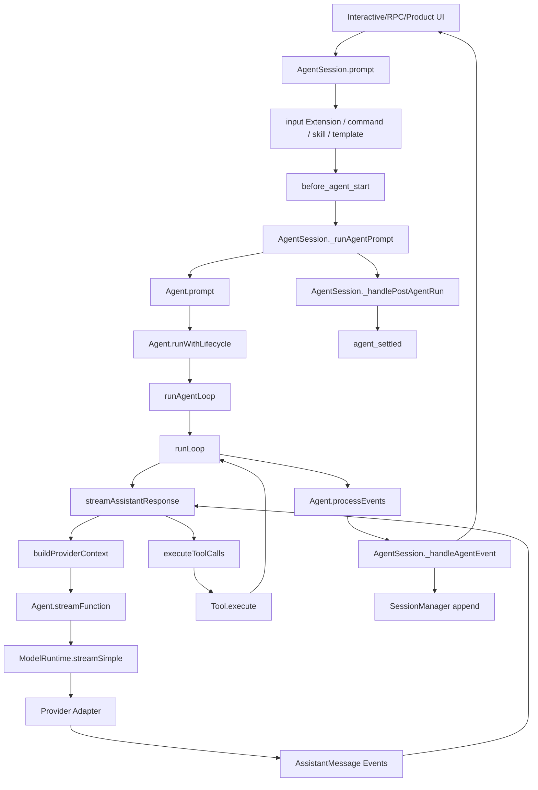
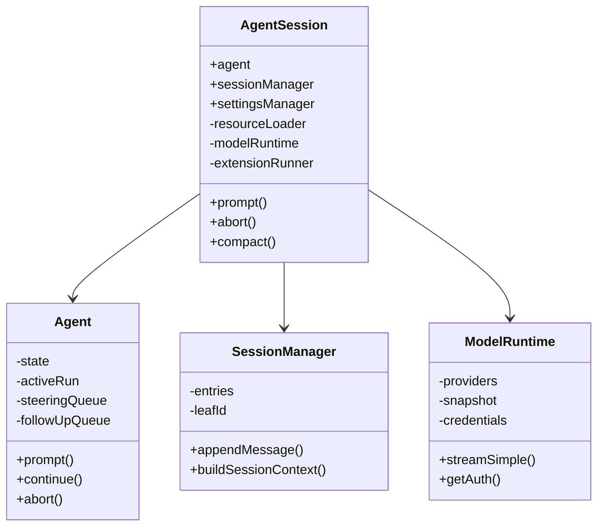
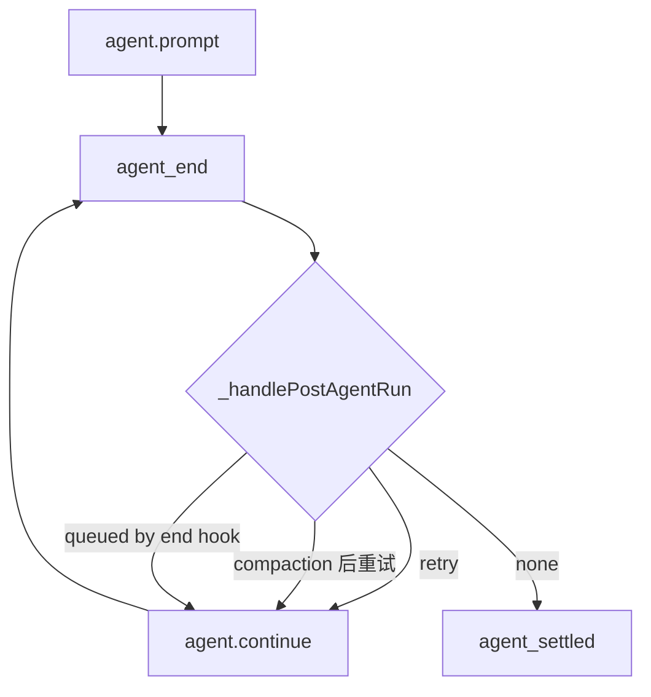
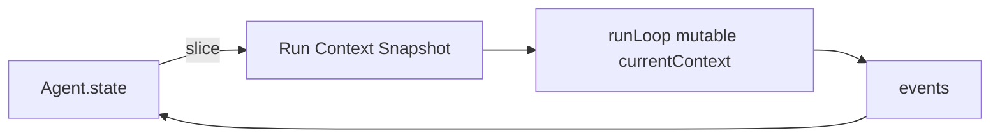
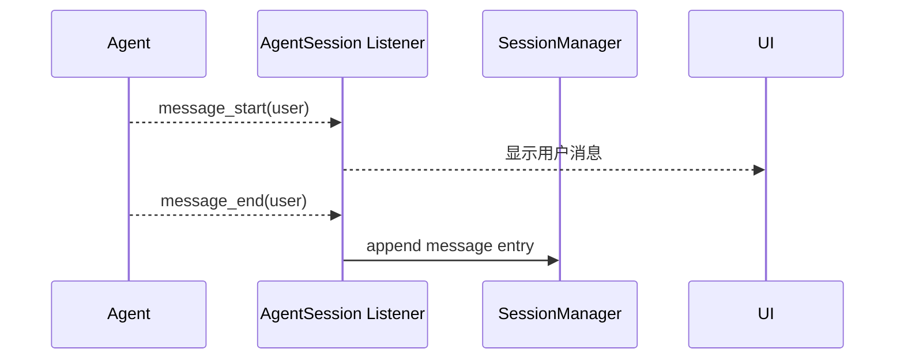
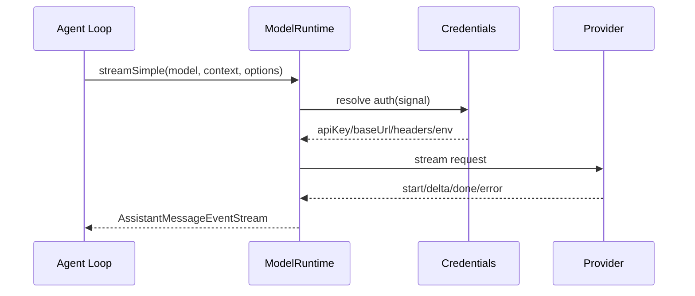
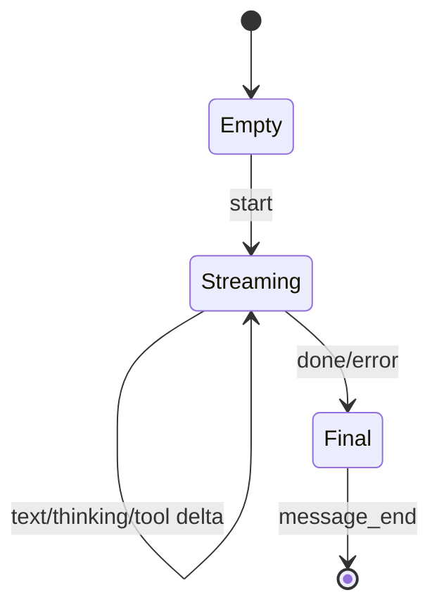
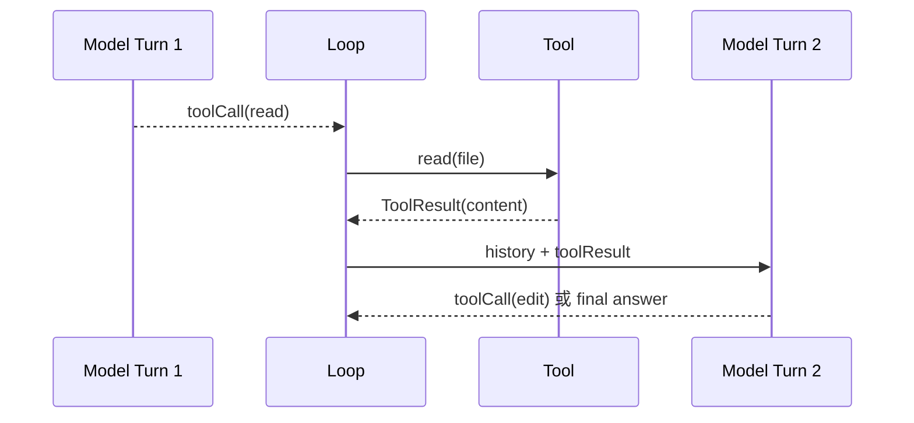
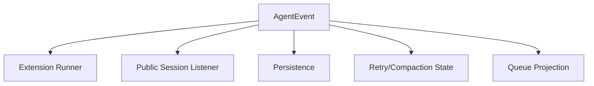

# 深挖 01：一条 Prompt 的完整函数调用图

## 场景

用户在 Pi 中输入：

> 找出登录失败的原因，修改代码并运行测试。

这一句话从编辑器进入后，至少经过：输入预处理、Session 编排、Agent Run、Provider Stream、Tool Pipeline、Session 持久化和 UI 投影。任何一层都可能失败，也都有自己的权威状态。

## 1. 先看函数级主链



这张图的重点不是背函数名，而是分清五个边界：

| 边界 | 入口 | 谁拥有权威状态 |
|---|---|---|
| 产品输入边界 | `AgentSession.prompt()` | AgentSession/Extension |
| 一次 Run 边界 | `Agent.prompt()` | Agent.activeRun |
| Provider 边界 | `streamFunction()` | ModelRuntime/Provider |
| Tool 副作用边界 | `Tool.execute()` | Agent Loop + Tool/Gateway |
| Session 结算边界 | `agent_settled` | AgentSession |

## 2. 创建阶段有哪些对象已经存在

调用 Prompt 前，`createAgentSession()` 已经装配：

```text
cwd = /workspace/project
agentDir = ~/.pi/agent
modelRuntime = ModelRuntime
settingsManager = SettingsManager
sessionManager = SessionManager
resourceLoader = DefaultResourceLoader
agent = Agent
session = AgentSession
extensionRunner = ExtensionRunner
```



如果某个对象的 cwd、Session ID 或 ModelRuntime 不是同一套，后面即使编译通过，也会形成隐蔽串线。

## 3. 第一个入口：`AgentSession.prompt()`

### 它为什么不能直接调用模型

`AgentSession.prompt()` 先处理：

```text
1. Extension Command
2. Compaction 冲突
3. input Extension Event
4. Skill / Prompt Template 展开
5. Streaming 时选择 steer/followUp
6. 模型与 Auth Preflight
7. before_agent_start
8. 构造 UserMessage
9. _runAgentPrompt
```

教学化伪代码：

```ts
async prompt(text: string, options?: PromptOptions) {
    if (isExtensionCommand(text)) {
        if (await executeExtensionCommand(text)) return;
    }

    assertNotCompacting();
    const transformed = await extensionRunner.emitInput(text, options?.images);
    const expanded = expandSkillAndTemplate(transformed.text);

    if (isStreaming) {
        return queueByBehavior(expanded, options?.streamingBehavior);
    }

    await preflightModelAndAuth();
    const prepared = await beforeAgentStart(expanded);
    await this._runAgentPrompt(prepared.messages);
}
```

### 运行时真实值

```text
text = "找出登录失败的原因，修改代码并运行测试。"
source = "interactive"
expandPromptTemplates = true
isStreaming = false
model = openai-codex/gpt-5.6-luna
thinkingLevel = high
activeTools = [read, bash, edit, write]
```

`prompt()` 返回的 Promise 代表整个 Session 请求的 settlement，不只是第一轮模型返回。

## 4. `_runAgentPrompt()`：为什么有第二层循环

当前结构：

```ts
private async _runAgentPrompt(messages: AgentMessage | AgentMessage[]) {
    this._isAgentRunActive = true;
    try {
        await this.agent.prompt(messages);
        while (await this._handlePostAgentRun()) {
            await this.agent.continue();
        }
    } finally {
        this._systemPromptOverride = undefined;
        this._flushPendingBashMessages();
        await this._emitAgentSettled();
    }
}
```

`Agent.prompt()` 自己已经包含多个 Tool Turn，为什么还要 `continue()`？因为 Agent Core 一次 Run 结束后，AgentSession 可能发现：

- Provider 错误可 Retry；
- 上下文需要自动 Compaction；
- `agent_end` Extension 又排入消息；
- Overflow Recovery 压缩后要重试原请求。



因此前端若只订阅 Agent Core 的 `agent_end`，就会过早结束。

## 5. `Agent.prompt()`：建立唯一 ActiveRun

关键源码结构：

```ts
if (this.activeRun) {
    throw new Error("Agent is already processing a prompt...");
}

const abortController = new AbortController();
let resolvePromise = () => {};
const promise = new Promise<void>((resolve) => {
    resolvePromise = resolve;
});
this.activeRun = { promise, resolve: resolvePromise, abortController };
```

### 运行时快照

```text
activeRun.promise = Promise<pending>
activeRun.resolve = finishRun 内部闭包
activeRun.abortController.signal.aborted = false
state.isStreaming = true
state.messages.length = 42
state.pendingToolCalls = Set()
```

这里建立了一个不变量：

> 同一 Agent 实例同一时刻只能有一个写 transcript 的 Run。

并行工作必须创建不同 Agent/Session/Lane，不能在同一 Agent 上并发调用 `prompt()`。

## 6. Context Snapshot：为什么要复制顶层数组

Agent 进入 Loop 前：

```ts
private createContextSnapshot(): AgentContext {
    return {
        systemPrompt: this._state.systemPrompt,
        messages: this._state.messages.slice(),
        tools: this._state.tools.slice(),
    };
}
```

它不是深拷贝整个消息，而是冻结“这次 Loop 的顶层集合起点”。



为什么不直接把 `state.messages` 引用交给 Loop？因为 `processEvents()` 也会向 Agent State 归约消息；共享数组会造成重复 push 或难以判断谁拥有当前写入。

## 7. `runAgentLoop()`：先把用户消息变成事件

新 Prompt 进入时：

```text
emit agent_start
emit turn_start
emit message_start(user)
emit message_end(user)
进入 runLoop
```

用户消息也走 `message_start/message_end`，因此 Session 持久化和 UI 不需要另一套“用户输入路径”。



## 8. `runLoop()` 的两个循环

```ts
while (true) {
    let hasMoreToolCalls = true;
    while (hasMoreToolCalls || pendingMessages.length > 0) {
        // 一个或多个 Turn
    }

    const followUps = await config.getFollowUpMessages?.();
    if (followUps?.length) {
        pendingMessages = followUps;
        continue;
    }
    break;
}
```

### 内层循环

处理当前任务的连续性：

```text
Tool Call
Steering Message
下一模型 Turn
```

### 外层循环

处理“任务已经本可停止，但用户要求追加”：

```text
Follow-up
```

这个结构使 Steer 和 Follow-up 的生效边界天然不同。

## 9. Provider Context 构造

在每个 Assistant Turn 前：

```ts
let messages = context.messages;
if (config.transformContext) {
    messages = await config.transformContext(messages, signal);
}
const llmMessages = await config.convertToLlm(messages);
return {
    systemPrompt: context.systemPrompt,
    messages: llmMessages,
    tools: context.tools,
};
```

### 两次转换分别做什么

| 阶段 | 输入输出 | 典型用途 |
|---|---|---|
| `transformContext` | AgentMessage[] → AgentMessage[] | Extension 注入、过滤、压缩投影 |
| `convertToLlm` | AgentMessage[] → Provider-neutral Message[] | 去掉 UI-only 消息，转换 Custom 类型 |

不应在 `convertToLlm` 中访问产品数据库；它最好保持确定、快速。动态检索更适合在 `before_agent_start` 或明确 Context Provider 中完成。

## 10. Provider 请求链

当前 SDK 注入的 StreamFn大致是：

```ts
streamFn: async (model, context, options) => {
    const auth = await modelRuntime.getAuth(model);
    return modelRuntime.streamSimple(model, context, {
        ...options,
        timeoutMs,
        maxRetries,
        transformHeaders,
    });
}
```



### 关键传入值

```text
sessionId = native Pi session id
signal = ActiveRun AbortSignal
reasoning = high
transport = auto
maxRetryDelayMs = settings value
tools = 当前 active schemas
```

## 11. Assistant Stream 怎样归约成 Message

`streamAssistantResponse()` 维护 `partialMessage`：

```text
start          → push partial to currentContext
text_delta     → replace last partial
thinking_delta → replace last partial
toolcall_delta → replace last partial
done/error     → response.result() 得到权威 final message
```

事件链：



`message_update` 是 UI/Telemetry 的暂态；`message_end` 才能持久化。

## 12. Tool Call 回流

若 final AssistantMessage 含 Tool Call：

```text
executeToolCalls
→ Tool Result Messages
→ push 到 currentContext
→ emit turn_end
→ prepareNextTurn
→ 下一模型调用
```



Tool Result 不回模型，模型就不知道工具到底成功、失败或返回了什么。

## 13. `processEvents()`：先更新 Agent State，再通知 Listener

顺序非常重要：

```ts
switch (event.type) {
    case "message_end":
        this._state.messages.push(event.message);
        break;
    case "tool_execution_start":
        pendingToolCalls.add(event.toolCallId);
        break;
}

for (const listener of this.listeners) {
    await listener(event, signal);
}
```

Listener 看到的 State 已经对应当前事件。

若先通知再归约，UI 在 `message_end` Listener 中读取 `agent.state.messages` 会看不到刚完成的消息。

## 14. AgentSession Listener 的多重职责

`_handleAgentEvent` 会：

- 更新显示队列；
- 触发 Extension Event；
- 通知 SDK/TUI Listener；
- 在 `message_end` 写 Session；
- 记录最后 AssistantMessage；
- 触发 Auto Compaction/Retry 所需状态；
- 最终协助 `agent_settled`。



一个事件被多个消费者读取，但只应有一个消费者拥有每类权威状态。

## 15. 完成与失败的完整路径

### 正常完成

```text
message_end(final assistant)
→ turn_end
→ agent_end
→ Agent.finishRun
→ AgentSession post-run = false
→ agent_settled
→ prompt Promise resolve
```

### Provider 错误可重试

```text
assistant stopReason=error
→ agent_end(willRetry=true)
→ prepareRetry
→ agent.continue
→ 新 Provider Request
→ 最终 agent_settled
```

### Context Overflow

```text
assistant error=overflow
→ agent_end
→ auto compaction
→ Session Entry 更新
→ agent.continue
→ 重放原用户/Tool Context
→ settled
```

### Abort

```text
AgentSession.abort
→ abort retry
→ Agent.abort
→ signal 传播到 Provider/Tool
→ aborted AssistantMessage
→ agent_end
→ post-run 不再继续
→ settled
```

## 16. 调试一条请求的最小观测字段

建议 Debug Context 记录：

```text
externalSessionId
nativeSessionId
turnId
clientMessageId
sequence
model/provider/thinking
activeToolNames
message counts
pendingToolCallIds
steering/followUp queues
retryAttempt
isCompacting
last stopReason/rawStopReason
session file/leaf id
```

不要记录完整 API Key、OAuth Token 或未脱敏 Tool 参数。

## 17. 源码阅读任务

按顺序打开：

1. `packages/coding-agent/src/core/sdk.ts`
2. `packages/coding-agent/src/core/agent-session.ts` 的 `prompt()` 与 `_runAgentPrompt()`
3. `packages/agent/src/agent.ts` 的 `prompt()`、`runWithLifecycle()`、`processEvents()`
4. `packages/agent/src/agent-loop.ts` 的 `runLoop()`、`streamAssistantResponse()`
5. `packages/coding-agent/src/core/model-runtime.ts` 的请求入口
6. `session-manager.ts` 的 append/build context

每读一个函数，写：

```text
输入来自谁
读取哪些权威状态
修改哪些状态
发出什么事件
失败时由谁结算
```

## 18. 实验

使用 Faux Stream 构造：

```text
Turn 1 → read Tool Call
Tool Result → "file content"
Turn 2 → final text
```

订阅所有 Agent Event，断言：

```text
agent_start
turn_start
message_start(user)
message_end(user)
message_start(assistant)
message_update*
message_end(assistant tool call)
tool_execution_start
tool_execution_end
message_start(tool result)
message_end(tool result)
turn_end
turn_start
message_start(assistant final)
message_end
turn_end
agent_end
```

再在 `agent_end` Listener 延迟 100ms，验证 `waitForIdle()` 不提前完成。

## 练习题

1. 为什么 `AgentSession.prompt()` 不能直接调用 `ModelRuntime.streamSimple()`？
2. `_runAgentPrompt()` 和 `runLoop()` 各自为什么需要循环？
3. Context Snapshot 只复制顶层数组，解决了什么所有权问题？
4. `transformContext` 与 `convertToLlm` 应分别承担什么职责？
5. Provider 错误后为什么可能出现两次 `agent_end`，但只有一次产品级 settled？
6. 写出 Tool Call 从 delta 到 Session Entry 的完整函数链。
7. 设计一个调试日志，能定位“前端一直思考中”但不泄露敏感信息。
8. 在哪个边界添加产品 Memory 最不容易污染 transcript？说明理由。
