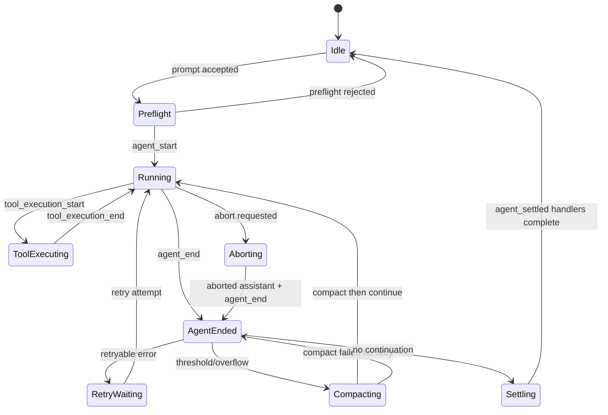
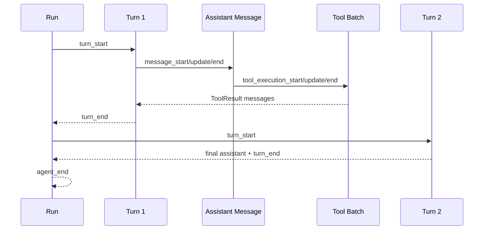
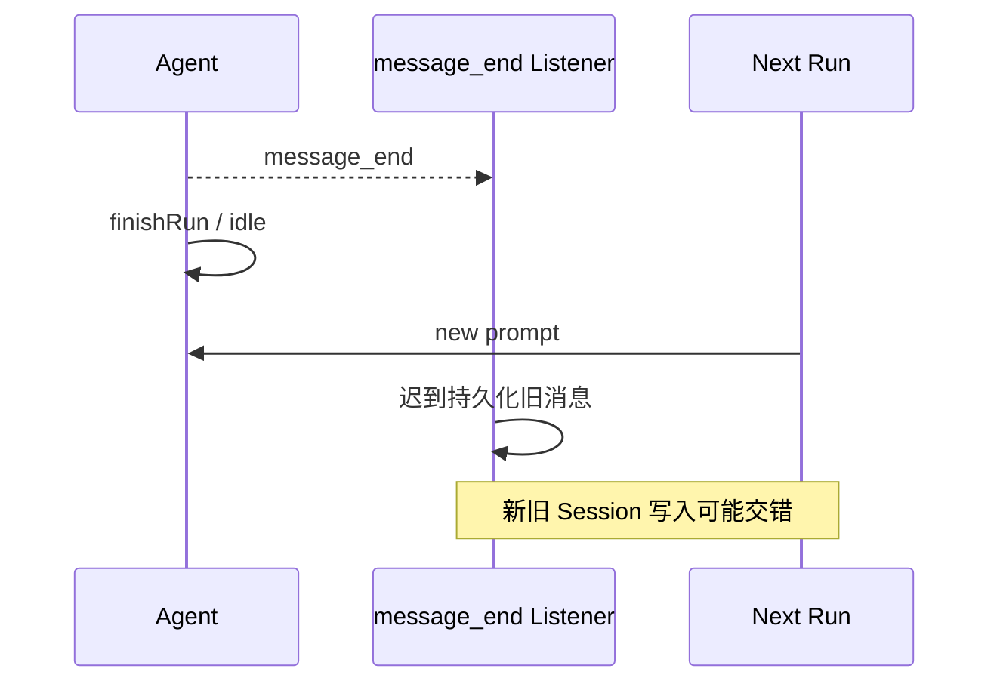
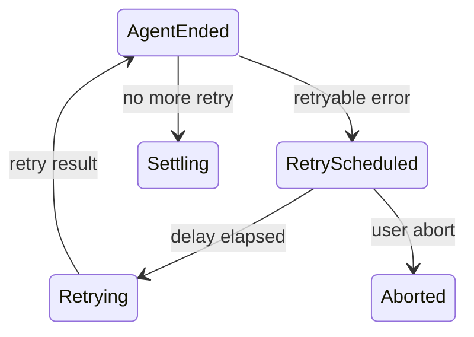
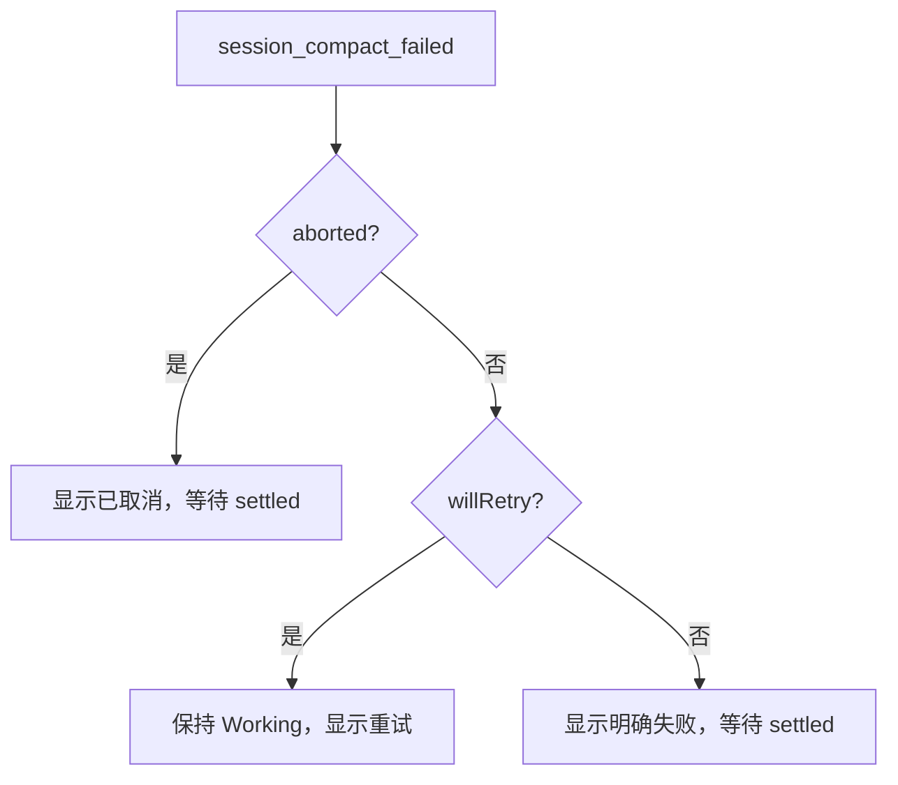
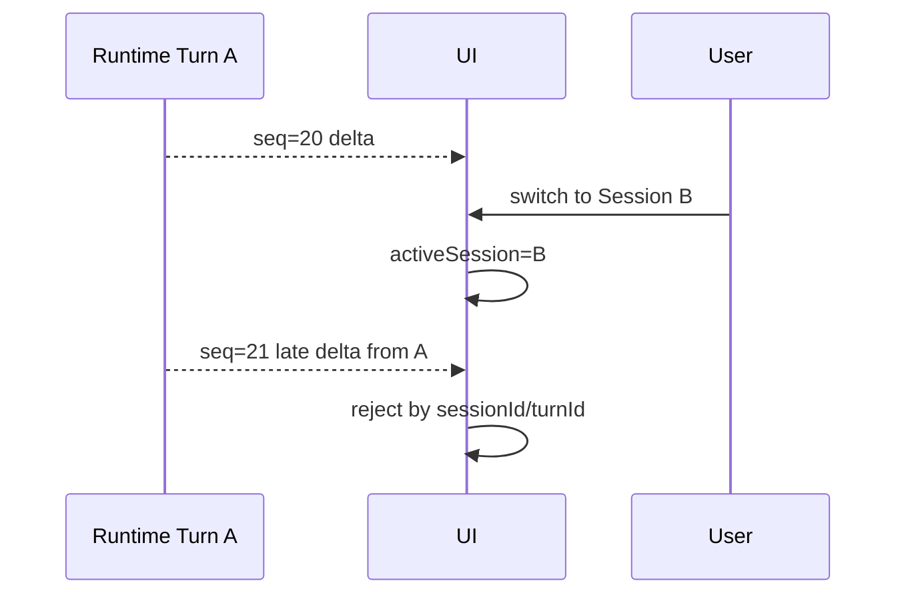

# 深挖 02：事件、状态归约与最终 settlement

## 为什么这一章最重要

Agent 产品最难的 Bug 往往不是“模型回答错”，而是：

- 已经结束却一直显示思考中；
- 用户取消后旧消息又回来；
- Tool 结束了但 UI 仍显示运行中；
- `agent_end` 之后又自动重试，前端却已允许新请求；
- Session 切换后旧 Listener 继续写新页面；
- Compaction 失败没有明确状态，只剩空白卡片。

这些都属于**事件与权威状态没有对齐**。

## 1. 事件不是日志，而是状态机输入

Pi Agent Core 的主要事件可以分成四组：

| 组 | 事件 | 表达什么 |
|---|---|---|
| Run | `agent_start`、`agent_end` | 一次 Agent Core Run 的边界 |
| Turn | `turn_start`、`turn_end` | 一个 Assistant 响应与 Tool Batch 的边界 |
| Message | `message_start`、`message_update`、`message_end` | 流式消息生命周期 |
| Tool | `tool_execution_start/update/end` | Tool 副作用生命周期 |

Coding Agent 再增加：

```text
queue_update
auto_retry_start / scheduled / attempt / end
session_before_compact
session_compact
session_compact_failed
agent_settled
session_shutdown
```

产品 Host 还会映射成：

```text
turn.accepted
turn.delta
turn.tool.started
turn.tool.completed
turn.retrying
turn.compacting
turn.settled
```

每加一层都应是**投影**，而不是重新猜一套状态。

## 2. 核心状态机



注意：

- `agent_end` 只说明本次 Agent Core Loop 停止发事件；
- `AgentSession` 可能从 AgentEnded 再回 Running；
- 最终 Idle 必须由 `agent_settled` 驱动。

## 3. Run、Turn、Message、Tool 四层嵌套



### 典型误解

- 一个 Run 不等于一个模型调用；
- 一个 Turn 可以包含多个并行 Tool；
- Tool Result 也是 Message；
- `message_end` 不等于 Turn 结束，因为 Tool 还没执行；
- `turn_end` 不等于 Run 结束，因为可能还有 Tool/Steer/Follow-up。

## 4. Agent Core 如何归约事件

核心原则：**先修改内部状态，再等待 Listener。**

教学化摘录：

```ts
private async processEvents(event: AgentEvent): Promise<void> {
    switch (event.type) {
        case "message_start":
            this._state.streamingMessage = event.message;
            break;
        case "message_end":
            this._state.streamingMessage = undefined;
            this._state.messages.push(event.message);
            break;
        case "tool_execution_start":
            this._state.pendingToolCalls.add(event.toolCallId);
            break;
        case "tool_execution_end":
            this._state.pendingToolCalls.delete(event.toolCallId);
            break;
    }

    for (const listener of this.listeners) {
        await listener(event, signal);
    }
}
```

实际实现会复制 `Set` 再赋回 State，以避免外部持有旧引用后看到静默突变。

## 5. 每个事件后的真实状态

假设 Agent 调用两个并行 Tool：`read(a)` 和 `read(b)`。

| 事件 | `streamingMessage` | `pendingToolCalls` | `messages` |
|---|---|---|---|
| `message_start(assistant)` | partial assistant | `{}` | 旧历史 |
| `message_update` | 新 partial | `{}` | 旧历史 |
| `message_end(assistant)` | `undefined` | `{}` | 加入 Assistant |
| `tool_execution_start(a)` | `undefined` | `{a}` | 不变 |
| `tool_execution_start(b)` | `undefined` | `{a,b}` | 不变 |
| `tool_execution_end(b)` | `undefined` | `{a}` | 不变 |
| `tool_execution_end(a)` | `undefined` | `{}` | 不变 |
| `message_end(result a)` | `undefined` | `{}` | 加入 Result a |
| `message_end(result b)` | `undefined` | `{}` | 加入 Result b |

UI 可以按真实 Tool Event 显示完成顺序，但 transcript 按模型请求顺序写 Tool Result。

## 6. 为什么 Listener Promise 必须被等待

`Agent.subscribe()` 的 Listener 可能执行：

- Session 持久化；
- Extension Hook；
- Lifecycle Outbox；
- 关键遥测；
- UI 事件推送。

如果 `processEvents()` 只 fire-and-forget：



等待 Listener 让事件本身拥有 settlement；但也意味着 Listener 不能做无界后台工作。长网络交付应写本地 Outbox 后快速返回，再由独立 sender 可靠发送。

## 7. `agent_end` 为什么不是 Idle

Agent Core 的 `runWithLifecycle()` 最终：

```text
executor 完成
→ 所有 agent_end Listener 完成
→ finishRun()
→ activeRun.resolve()
→ activeRun = undefined
```

但 `AgentSession._runAgentPrompt()` 在 `await agent.prompt()` 后还会：

```text
_handlePostAgentRun()
→ Retry?
→ Compaction?
→ Queue?
```

所以有两个 idle 概念：

| 层 | Idle 含义 |
|---|---|
| Agent | 当前 Core Run 与 Listener 已结算 |
| AgentSession | 当前产品请求的全部 Retry/Compaction/Continuation 已结算 |

产品/UI 应使用后者。

## 8. `agent_settled` 的精确顺序

```ts
private async _emitAgentSettled(): Promise<void> {
    this._isAgentRunActive = false;
    try {
        await this._extensionRunner.emit({ type: "agent_settled" });
        this._emit({ type: "agent_settled" });
    } finally {
        this._resolveIdleWaitIfIdle();
    }
}
```

顺序说明：

1. 先把 Session 标记不再有 Active Run；
2. 等 Extension `agent_settled`；
3. 再通知公共 Listener；
4. 最后 resolve `waitForIdle()`。

如果 Extension settled Handler 写入必要的审计记录，那么 `abort()` 返回时这些记录也已完成。

## 9. 自动 Retry 的事件模型

一个可恢复 Provider 错误可能产生：

```text
message_end(error assistant)
turn_end
agent_end(willRetry=true)
auto_retry_start
auto_retry_scheduled
auto_retry_attempt_start
agent_start / turn_start / ...
auto_retry_end(success=true)
agent_settled
```



### UI 不应做什么

- 不应看到 `agent_end` 就清除 Assistant Working Card；
- 不应把 Error Assistant 永久显示为最终答案，如果 `willRetry=true`；
- 不应让新的普通 Prompt 与 Retry 并发；
- 不应丢弃 Retry Attempt 的 correlation identity。

## 10. Compaction 生命周期

```text
session_before_compact
→ summarization request/retry events
→ session_compact 或 session_compact_failed
→ 更新 Agent Context
→ overflow 时 continue
```

`session_compact_failed` 至少需要产品映射：

```ts
type CompactFailureProjection = {
    sessionId: string;
    reason: "manual" | "threshold" | "overflow";
    aborted: boolean;
    willRetry: boolean;
    errorMessage?: string;
    source: "pi" | "extension";
};
```

### 决策图



## 11. Abort 与 Late Event

AbortSignal 不是时间机器。收到 Abort 时：

- Provider 可能已经发出最后一个 delta；
- Tool 可能已完成副作用；
- Listener 可能已经排队；
- RPC/网络中的旧事件可能稍后到达。

因此前端仍需 Identity Guard：

```ts
function acceptEvent(event: ProductEvent, view: ViewState): boolean {
    if (event.sessionId !== view.sessionId) return false;
    if (event.turnId !== view.activeTurnId) return false;
    if (event.sequence <= view.lastSequence) return false;
    return true;
}
```



Runtime settlement 与 UI stale guard 缺一不可：前者停止新写入，后者防传输中的旧消息污染当前视图。

## 12. Session 替换与 Stale Extension Context

`AgentSessionRuntime` 在切换/Fork 前：

```text
abort old session
→ wait settlement
→ session_shutdown
→ beforeSessionInvalidate
→ dispose old session
→ invalidate Extension Context
→ create/bind new runtime
```

旧 Extension 若捕获 `ctx` 并在未来异步调用，必须收到 stale error，而不是写到新 Session。

这类防护与 React unmounted component、数据库过期 transaction 本质相同：对象的生命周期已经结束，旧引用不再有写权限。

## 13. Event Reducer 的推荐设计

前端不要在多个组件里分别处理 Runtime Event。建立一个纯 Reducer：

```ts
type TurnState = {
    status: "accepted" | "running" | "retrying" | "compacting" | "settling" | "settled" | "failed";
    messageDraft?: AssistantDraft;
    messages: MessageView[];
    tools: Record<string, ToolView>;
    retry?: RetryView;
    compaction?: CompactionView;
    lastSequence: number;
};

function reduceTurn(state: TurnState, event: ProductEvent): TurnState {
    // identity + sequence guard
    // deterministic event reduction
}
```

优点：

- 可重放一条事件日志复现 UI；
- 测试不依赖真实终端/浏览器；
- 同一事件不会被多个组件各解释一次；
- Snapshot 可以覆盖校正 Projection。

## 14. 状态与展示不能一一等同

| Runtime 状态 | UI 建议 |
|---|---|
| Running/Streaming | 一个增量 Assistant Card + Stop |
| Tool Executing | 同一 Turn 下增量 Tool Card |
| RetryScheduled | 保留当前错误证据，显示等待重试 |
| Compacting | 显示“整理上下文”，不要创建空 Assistant Card |
| Settling | 文本完成但仍禁止普通新 Prompt，可显示轻量收尾 |
| Settled | 关闭 Working 状态，允许新 Prompt |
| Failed no retry | 显示具体失败及可操作恢复入口 |

## 15. 常见 Bug 的事件证据

### 一直“思考中”

检查：

```text
是否收到 agent_settled？
Extension settled Handler 是否卡住？
waitForIdle Promise 是否未 resolve？
UI 是否因 sequence 缺口丢掉 settled？
```

### 重复 Assistant Card

检查：

```text
message_update 是否被当成新 message？
retry attempt 是否错误复用/新建 correlation？
message_end 是否 append 了已有 draft 而非 finalize？
```

### Abort 后旧文本回魂

检查：

```text
Session/Turn identity guard
Abort settlement 是否等待
传输层是否重连重放旧事件
组件是否保留旧 Listener
```

### Tool 永远 Running

检查：

```text
tool_execution_end 是否发出
Tool execute 是否无界 Promise
late progress callback 是否被忽略
ToolCallId 是否在 Provider 转换中丢失
```

## 16. 测试模板

### Agent Listener settlement

```ts
it("waits for agent_end listeners before becoming idle", async () => {
    let release!: () => void;
    const listenerPending = new Promise<void>((resolve) => (release = resolve));

    agent.subscribe(async (event) => {
        if (event.type === "agent_end") await listenerPending;
    });

    const run = agent.prompt("hello");
    await waitUntilAgentEndWasEmitted();
    expect(agent.state.isStreaming).toBe(true);

    release();
    await run;
    expect(agent.state.isStreaming).toBe(false);
});
```

### UI stale guard

```ts
const stateB = reduce(stateA, { sessionId: "B", type: "session.opened", sequence: 1 });
const unchanged = reduce(stateB, { sessionId: "A", type: "message.delta", sequence: 99 });
expect(unchanged).toEqual(stateB);
```

## 17. 源码追踪任务

```bash
rg "processEvents|_handleAgentEvent|_emitAgentSettled|_handlePostAgentRun" packages
rg "session_compact_failed|auto_retry|queue_update" packages/coding-agent
rg "message_start|message_update|message_end" packages/coding-agent/src/modes packages/tui
```

逐函数写下：

```text
Event Producer
Reducer/Owner
Public Projection
Settlement Promise
Abort Behavior
```

## 练习题

1. 为什么 Listener Promise 必须被等待，但 Lifecycle 网络发送又不应直接阻塞 Listener？
2. 列出 `agent_end` 后仍可能发生的四件事。
3. 为 Retry + Compaction 连续发生的场景画完整事件序列。
4. `message_end` 已到但 `agent_settled` 未到时，UI 应允许用户做什么？
5. Session 切换后旧 Extension Context 怎样被技术性地禁止写入？
6. 设计一个纯 Event Reducer，处理 delta、Tool、Retry、Compaction、Settled。
7. 为什么 Runtime 已正确 Abort，前端仍需要 Session/Turn stale guard？
8. 根据“Tool 永远 Running”列出至少五个跨层排查点。
