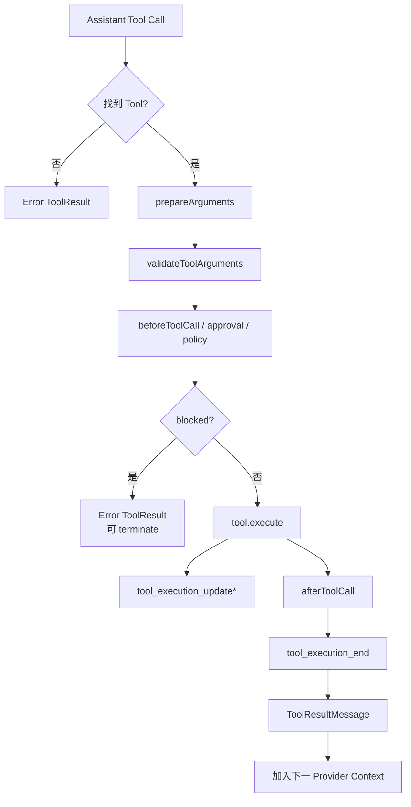
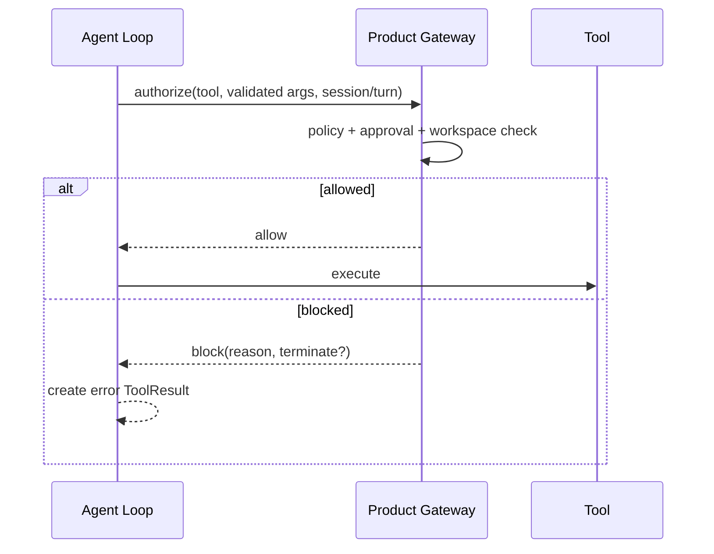
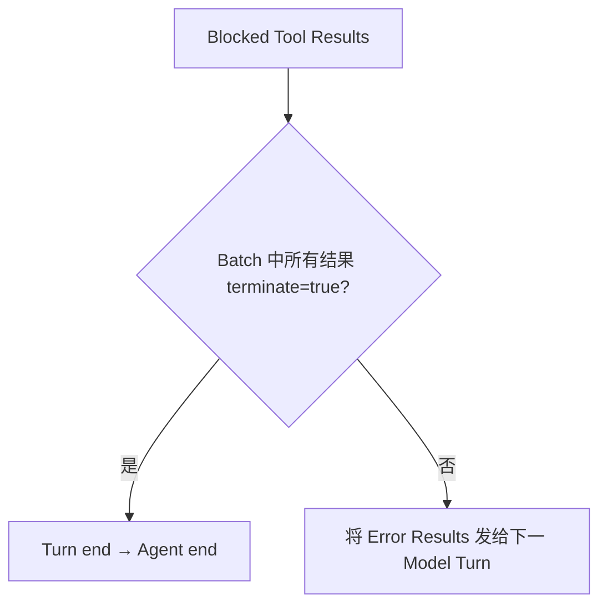
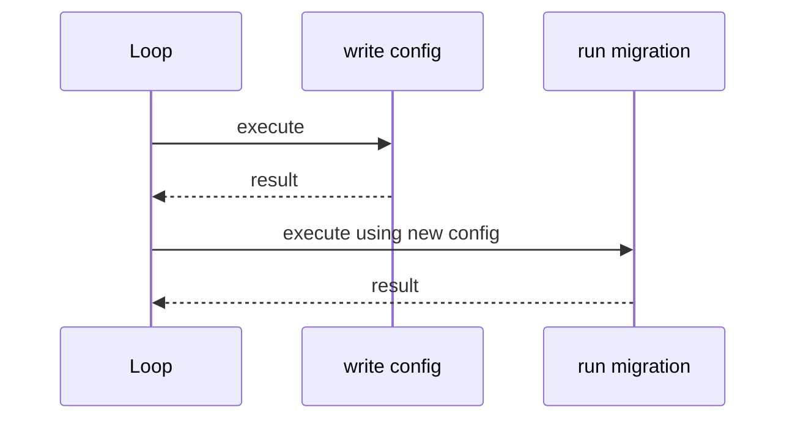
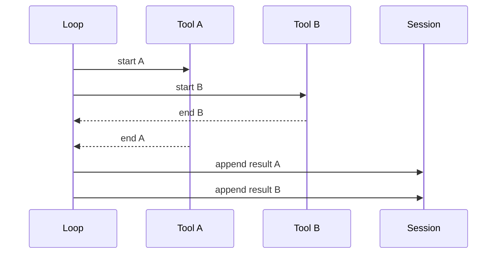
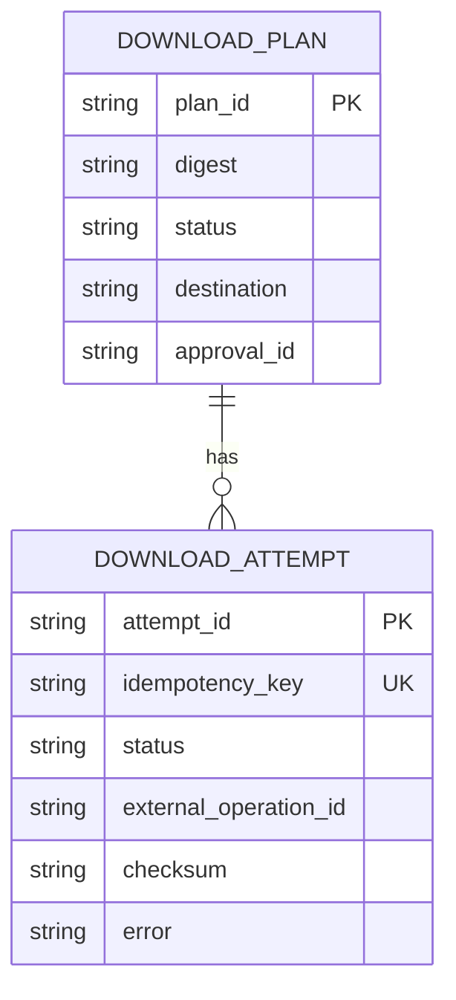
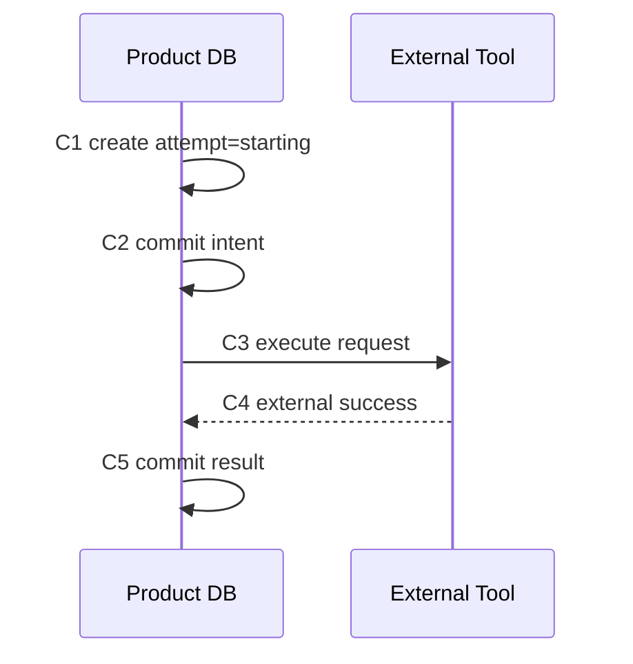
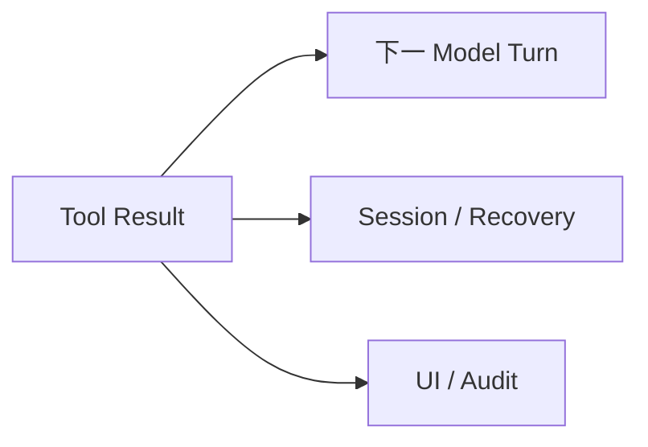
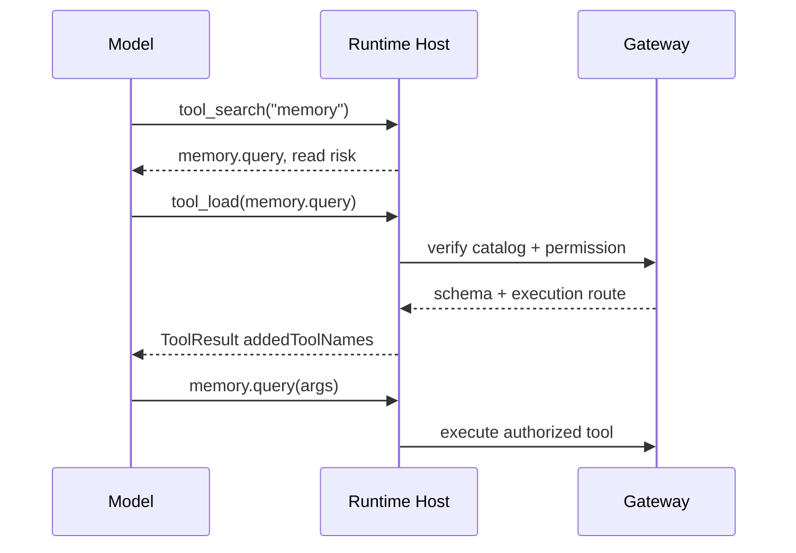

# 深挖 03：Tool 执行、副作用、审批、幂等与恢复

## 场景

模型输出：

```json
{
  "id": "call-42",
  "name": "download.execute",
  "arguments": {
    "planId": "plan-7",
    "destination": "data/fimbul.nc"
  }
}
```

从这一刻开始，Runtime 不再只是处理文本，而是在修改真实世界。一个 Tool Pipeline 必须回答：

- 工具是否存在？
- 参数是否完整且合法？
- 调用者是否有权限？
- 是否已审批？
- 重复调用会不会执行两次？
- 用户取消时能停到哪里？
- 进程崩溃后能否判断是否已发生副作用？
- Tool Result 怎样回到模型和 Session？

## 1. Tool Pipeline 全景



每一步都故意存在。将它们合并成“直接 `tool.execute(args)`”会失去安全边界和可观察性。

## 2. Tool Definition 与 Tool Instance

概念上，一个 Tool 至少包含：

```ts
type AgentTool<TArgs, TDetails> = {
    name: string;
    description: string;
    parameters: JSONSchema;
    executionMode?: "parallel" | "sequential";
    prepareArguments?: (raw: unknown) => unknown;
    execute: (
        toolCallId: string,
        args: TArgs,
        signal: AbortSignal | undefined,
        onUpdate: (partial: AgentToolResult<TDetails>) => void,
    ) => Promise<AgentToolResult<TDetails>>;
};
```

### 运行时真实值

```text
name = download.execute
description = Execute an approved immutable download plan
parameters = {
  type: object,
  required: [planId, approvalToken, idempotencyKey],
  properties: ...
}
executionMode = sequential
execute = async function reference
```

函数本身也是值：Tool Registry 保存的是可执行函数引用，不只是 Schema。

## 3. `prepareArguments` 与 Validation 的区别

`prepareArguments` 用于兼容或标准化输入：

```ts
prepareArguments(raw) {
    if (isSingleEditObject(raw)) return { edits: [raw] };
    return raw;
}
```

Validation 用于证明标准化后参数满足 Schema：

```text
raw model output
→ compatibility normalization
→ schema validation
→ typed args
```

不能在 `prepareArguments` 中悄悄补业务关键字段，例如自动生成 approval token。否则模型绕过了本应显式提供的安全事实。

## 4. 为什么 Tool 不存在也要返回 ToolResult

模型可能调用过期或幻觉工具。Runtime 可以抛异常终止，但更好的 Loop 语义是：

```ts
{
  role: "toolResult",
  toolCallId: "call-42",
  toolName: "unknown.tool",
  isError: true,
  content: [{ type: "text", text: "Tool unknown.tool not found" }]
}
```

这样模型能在下一 Turn 修正选择。错误 Tool Result 仍保持 Tool Call/Result 配对，Session 也可审计。

## 5. `beforeToolCall`：权限、审批与 Act Gate 的位置

`beforeToolCall` 发生在：

```text
工具已找到
+ 参数已校验
- 副作用尚未发生
```

这是最适合执行：

- 工作区范围校验；
- Read/Write Risk Policy；
- 用户审批；
- Act Gate；
- 租户权限；
- 禁止目录；
- 当前 Goal/Budget 检查。



Prompt 中写“不要执行未批准 Tool”只是模型提示；真正权限必须在这里或 Tool Gateway 强制。

## 6. `terminate`：阻止自动下一模型调用

被阻止的 Tool 默认会产生错误 Tool Result，模型通常会再响应一次解释或换方案。

某些场景不应继续：

- 用户明确拒绝审批；
- `room_commit` 已完成；
- Goal Budget 用尽；
- 所有 Tool Call 都要求等待外部事件；
- 当前 Turn 必须在安全点停止。

`BeforeToolCallResult.terminate` 与 Tool Result `terminate` 可参与 Batch 终止规则：当整个 Batch 都终止时，不再自动发下一次模型请求。



## 7. 并行与顺序执行

### 默认并行

同一个 AssistantMessage 的多个独立只读 Tool 可以并行：

```text
read(a)
read(b)
grep(c)
```

### 强制顺序

任一 Tool 标记 `executionMode: "sequential"`，整个 Batch 采用顺序执行。常见原因：

- 两个 Edit 可能修改同一文件；
- 后一个 Tool依赖前一个产物；
- 审批对顺序敏感；
- Tool 使用共享事务或外部会话；
- 并行会导致不可预测副作用。



## 8. 并行完成顺序与 transcript 顺序

并行 Tool 的 `tool_execution_end` 按真实完成顺序发出，但 Tool Result Message 按原始 Tool Call 顺序写入：



这同时满足：

- UI 可显示真实进度；
- Provider replay 顺序稳定；
- 测试结果可预测；
- Tool Call 与 Result 索引一致。

## 9. Tool Progress 与 Late Update

Tool 可通过 `onUpdate(partialResult)` 发进度：

```text
下载 10%
下载 35%
下载 90%
```

Agent Loop 在 Tool settle 后停止接受更新：

```ts
let acceptingUpdates = true;
try {
    const result = await tool.execute(..., (partial) => {
        if (!acceptingUpdates) return;
        updateEvents.push(emitUpdate(partial));
    });
    acceptingUpdates = false;
    await Promise.all(updateEvents);
    return result;
} finally {
    acceptingUpdates = false;
}
```

否则后台回调可能在 `tool_execution_end` 后继续修改 UI，形成“完成后又倒退到 90%”。

## 10. Abort 对 Tool 的真实保证

Tool 接收 `AbortSignal`，但不同 Tool 的取消能力不同：

| Tool | Abort 能力 |
|---|---|
| 纯读取 HTTP | 通常可中断请求 |
| 子进程 | 可发 signal，但子进程可能忽略 |
| 文件写入 | 无法撤销已经写入的字节 |
| 数据库事务 | 可 rollback 尚未 commit 的事务 |
| 外部 API 创建资源 | 请求可能已在服务端完成 |

因此 Abort 的保证是：

> Runtime 不再主动开始后续工作，并尽力取消当前可取消操作；它不能自动撤销已经发生的外部副作用。

产品必须用状态与幂等机制处理“结果未知”。

## 11. 幂等 Tool 设计

### 错误设计

```ts
execute({ url, destination }) {
    return download(url, destination);
}
```

Runtime 重试或用户重复提交会下载两次、覆盖或产生两个任务。

### 推荐输入

```ts
type DownloadExecuteArgs = {
    planId: string;
    planDigest: string;
    approvalToken: string;
    idempotencyKey: string;
};
```

### 产品数据库



执行逻辑：

```text
begin transaction
→ 查 idempotencyKey
→ 若 completed：返回同一结果
→ 若 running：返回/等待当前 Attempt
→ 若 absent：创建 Attempt=starting
→ commit intent
→ 执行外部副作用
→ 写 completed/checksum 或 unknown/failed
```

## 12. Crash Point 分析



| 崩溃点 | 数据库 | 外部世界 | 恢复策略 |
|---|---|---|---|
| C1 前 | 无 Attempt | 未执行 | 可正常重试 |
| C2 后 C3 前 | starting | 未执行 | 安全重试，沿用 Attempt |
| C3 后 C4 前 | starting | 未知 | 用 external id/status API 核验 |
| C4 后 C5 前 | starting | 已成功 | 禁止盲重放，查询/校验目标 |
| C5 后 | completed | 已成功 | 返回持久结果 |

这也是 durable Harness `replay: safe | never` 想表达的问题。

## 13. Tool Replay Policy

### `replay: safe`

适合：

- 幂等读；
- 由 Idempotency-Key 保护的外部请求；
- 确定性本地计算；
- 可安全重复的状态同步。

### `replay: never`

适合：

- 发送邮件；
- 发布消息；
- 支付；
- 无幂等键的创建资源；
- 不可检测是否完成的 Shell 脚本。

恢复时 `replay: never` 进入 suspended/unknown，而不是自动再次执行。

## 14. `afterToolCall` 的用途与限制

适合：

- 统一错误格式；
- 裁剪超长输出；
- 图片归一化；
- 脱敏；
- 添加 Usage；
- 将底层结果映射为模型易懂内容；
- 根据结果设置 terminate。

不适合：

- 把另一个关键副作用藏在 After Hook 中；
- 未持久化地修改产品权威状态；
- 吞掉所有错误并伪装成功；
- 改变 Tool Call 身份。

若 After Hook 抛错，Pi 将其转为错误 Tool Result，保持 Loop 可解释。

## 15. Tool Result 的三类消费者



因此 Tool Result 设计要同时满足：

- 对模型：简洁、明确、可继续决策；
- 对恢复：稳定身份、状态与证据；
- 对 UI：进度、错误与产物链接可展示。

可以把详细二进制/大对象放产品存储，只在 Tool Result 中返回引用和摘要。

## 16. 动态 Tool 的披露与执行

`tool_load` 不应直接把产品 Catalog 的所有 Tool 注册给模型。推荐：

```text
固定 tool_search/tool_load
→ tool_search 只返回名称/用途/风险
→ tool_load 校验授权
→ 激活一个 Schema
→ Tool Result addedToolNames=[name]
→ 下一 Turn 可调用
→ 真正执行仍走 Product Gateway
```



## 17. Tool 失败分类

| 分类 | 示例 | 是否重试 |
|---|---|---|
| 参数错误 | 缺少必填字段 | 模型重新调用，不做 Runtime 自动重试 |
| 权限拒绝 | 未审批/越界 | 等用户/产品状态，不自动绕过 |
| 临时外部错误 | 503/timeout | 由 Tool/产品策略按幂等性重试 |
| 永久外部错误 | 资源不存在 | 返回明确证据，模型调整计划 |
| Abort | 用户取消 | 停止后续，保留已发生事实 |
| Unknown outcome | 请求发出后连接断开 | 核验外部状态，禁止盲目重放 |

模型看到的错误文本不应包含秘密、内部 Stack 或可利用路径。

## 18. 测试矩阵

### 基础

- Tool 不存在；
- 参数缺失/类型错误；
- `prepareArguments` 兼容单对象；
- Before Hook allow/block/terminate；
- After Hook 修改内容和 Usage；
- Tool execute 抛错。

### 并发

- 两个只读 Tool 并行；
- 一个 sequential Tool 强制 Batch 顺序；
- 完成顺序不同但 Result 顺序稳定；
- Abort 时不再启动后续 sequential Tool；
- Tool settle 后 late progress 被忽略。

### 副作用

- 同 Idempotency-Key 重复请求只执行一次；
- Crash 在每个 Commit 点；
- external success / local result missing；
- Approval 过期；
- Plan Digest 不匹配；
- Workspace 越界；
- Host Restart 后恢复 Attempt。

## 19. 建议的 Tool Gateway 返回结构

```ts
type ToolGatewayResult = {
    status: "completed" | "failed" | "cancelled" | "unknown";
    operationId: string;
    idempotencyKey: string;
    summary: string;
    artifacts?: Array<{
        id: string;
        path?: string;
        checksum?: string;
        mediaType?: string;
    }>;
    retryable?: boolean;
    safeToReplay?: boolean;
    usage?: Usage;
    diagnostics?: Record<string, unknown>;
};
```

Tool Result 给模型的 Content 是它的简洁投影；完整结构保存在 details/产品数据库。

## 20. 源码追踪任务

```bash
rg "prepareToolCall|executeToolCallsParallel|executeToolCallsSequential" packages/agent/src/agent-loop.ts
rg "beforeToolCall|afterToolCall|terminate|addedToolNames" packages/agent packages/coding-agent
rg "executionMode" packages/coding-agent/src/core/tools packages/agent/src/harness/tools
```

按一个 `edit` Tool 和一个 `bash` Tool 分别追：

```text
Definition
→ Registry
→ Active Tool Set
→ Provider Schema
→ Tool Call Parsing
→ Validation
→ Execute
→ Progress
→ Result
→ Session Entry
```

## 练习题

1. `prepareArguments` 为什么不能自动补 Approval Token？
2. Tool 不存在时，抛异常和错误 Tool Result 各有什么后果？
3. 设计一个 `download.execute` 的完整 Schema、幂等字段和审批字段。
4. 两个 Tool 并行完成顺序与 transcript 顺序为何必须分离？
5. `replay: never` Tool 在结果未知时，产品应提供什么恢复 UI？
6. Abort 后文件已写一半，哪些层分别负责处理？
7. 为什么 After Hook 不应隐藏另一个副作用？
8. 为动态 `tool_load` 写出 Catalog、Schema、权限和执行的所有权边界。
9. 设计至少十个 Crash/并发测试覆盖 Tool Gateway。
