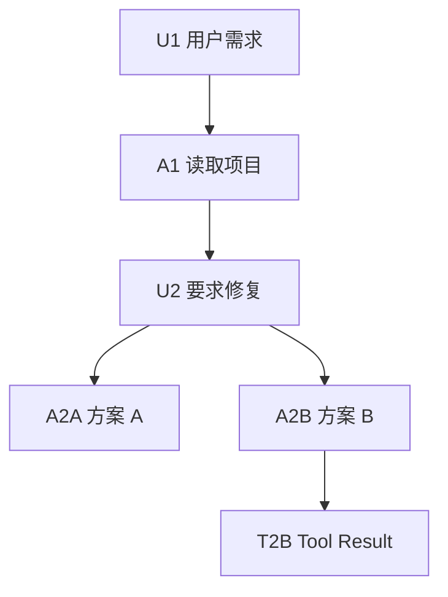
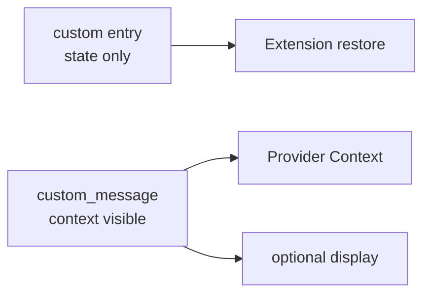
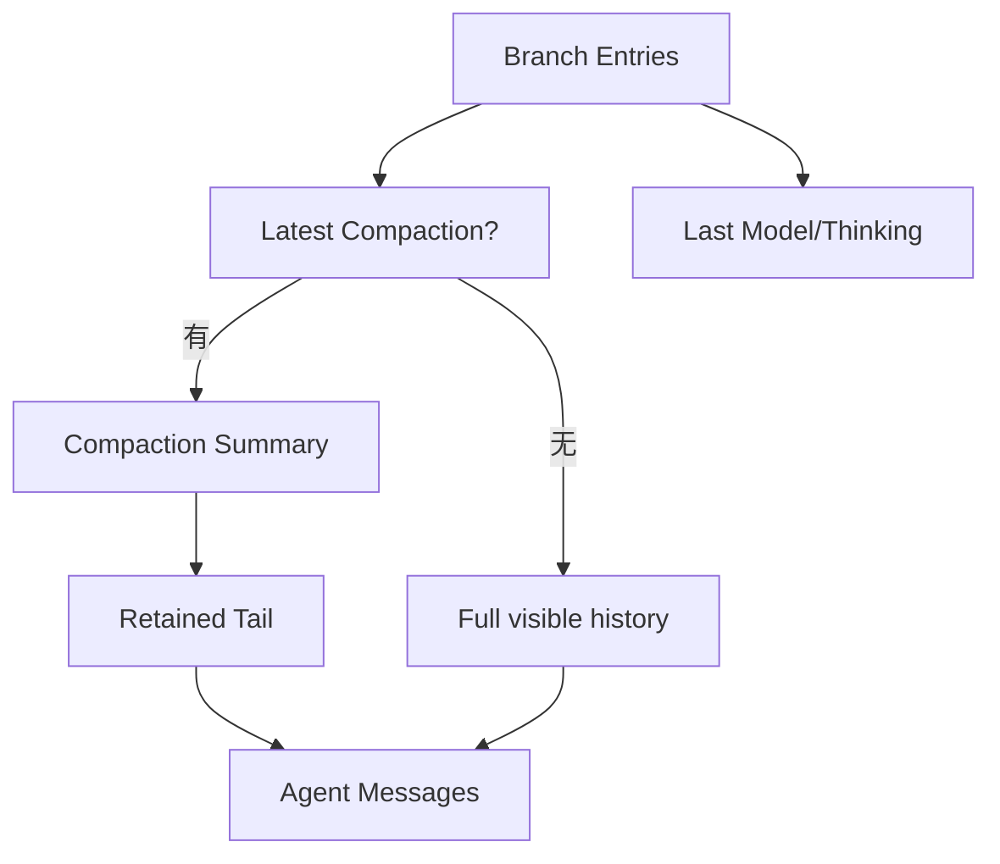
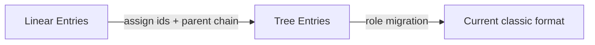
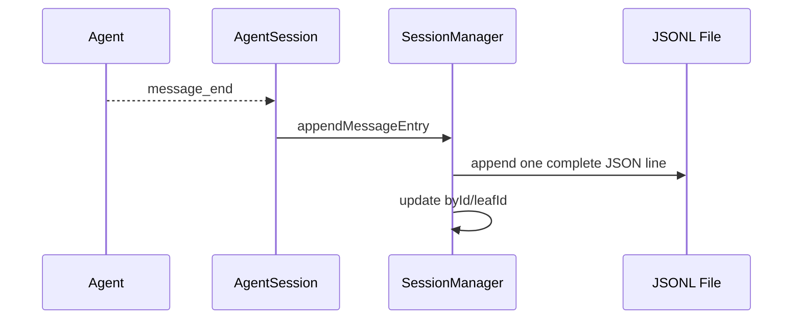
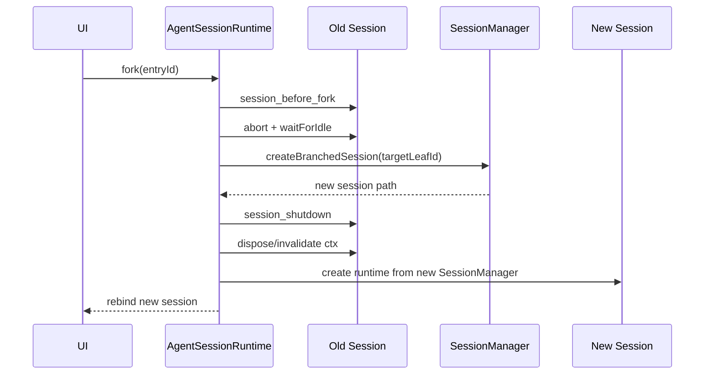
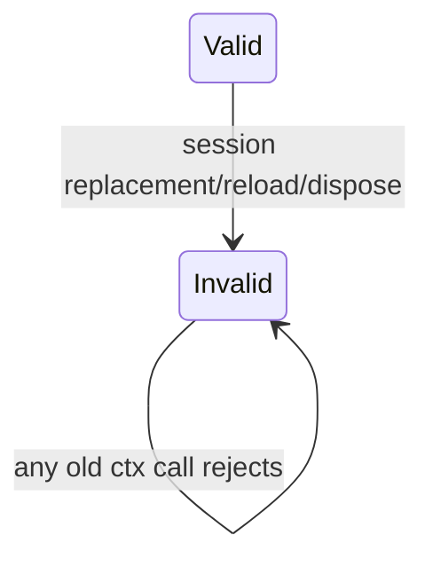
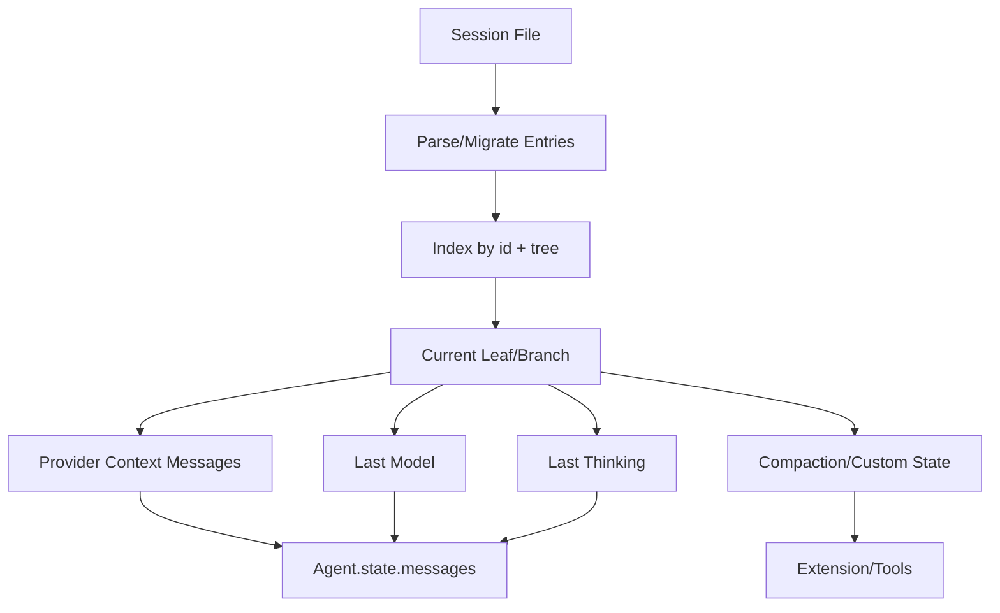
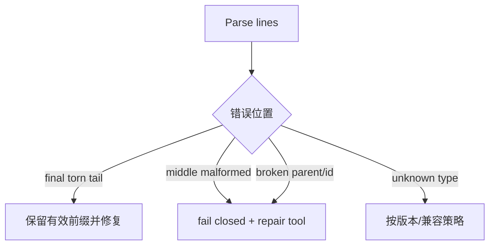
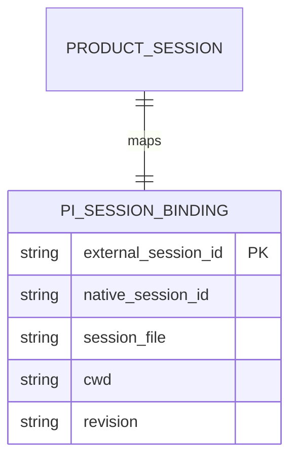

# 深挖 04：Session JSONL、树结构、Fork 与恢复

## 1. Session 不只是聊天记录

一个可恢复 Coding Session 至少要保存：

- 用户、Assistant、Tool Result；
- 当前分支与分叉历史；
- Model/Thinking 变化；
- Compaction 与 Branch Summary；
- Extension 自定义状态；
- 动态 Tool 披露位置；
- Session 名称、标签和父 Session；
- Usage；
- 当前工作目录。

单一 `messages[]` 只能表示一条线，无法同时保留完整历史、当前分支和非模型状态。

## 2. Header 与 Entry

经典 Session 文件第一行是 Header：

```json
{
  "type": "session",
  "version": 3,
  "id": "0198...",
  "timestamp": "2026-08-19T00:00:00.000Z",
  "cwd": "/workspace/project",
  "parentSession": "/sessions/parent.jsonl"
}
```

后续每行是 Entry：

```ts
interface SessionEntryBase {
    type: string;
    id: string;
    parentId: string | null;
    timestamp: string;
}
```

`parentId` 让 append-only 文件形成树。

## 3. 物理行顺序与逻辑分支不是一回事

```text
line 1: session header
line 2: U1 parent=null
line 3: A1 parent=U1
line 4: U2 parent=A1
line 5: A2A parent=U2
line 6: A2B parent=U2
line 7: T2B parent=A2B
```



当前 `leafId=T2B` 时，活动分支是：

```text
U1 → A1 → U2 → A2B → T2B
```

文件中的 A2A 仍保留，但不进入当前 Context。

## 4. `buildSessionPath()` 怎样还原 Branch

教学化代码：

```ts
function buildSessionPath(entries, leafId) {
    const byId = new Map(entries.map((entry) => [entry.id, entry]));
    let current = leafId ? byId.get(leafId) : entries.at(-1);
    const path = [];

    while (current) {
        path.push(current);
        current = current.parentId ? byId.get(current.parentId) : undefined;
    }

    return path.reverse();
}
```

### 运行时真实值

```text
leafId = "T2B"
current sequence = T2B → A2B → U2 → A1 → U1
path after reverse = U1 → A1 → U2 → A2B → T2B
```

如果 Parent 不存在，Session 已经损坏或导入不完整，不能静默跳过后继续构造看似正常的 Context。

## 5. Entry 类型与模型可见性

| Entry | 进入 Provider Context | 说明 |
|---|---:|---|
| `message` | 是 | User/Assistant/ToolResult |
| `thinking_level_change` | 否，恢复配置 | 控制后续模型行为 |
| `model_change` | 否，恢复配置 | 恢复 Provider/Model |
| `compaction` | 是，投影为 Summary | 替换更早活动历史 |
| `branch_summary` | 是 | 从另一分支切换时补上下文 |
| `custom` | 否 | Extension 持久状态 |
| `custom_message` | 是 | Extension 明确注入模型的消息 |
| `label` | 否 | 导航元数据 |
| `session_info` | 否 | 名称等展示信息 |

### `custom` 与 `custom_message`



例如：

- `custom`: 插件版本、审批游标、内部索引；
- `custom_message`: “当前用户已批准执行 Plan 7”的模型可见事实。

产品数据库的权威审批状态仍不应只存于 Custom Message。

## 6. Context 投影不是简单筛选 Message

`buildSessionContext()` 需要处理：

```text
当前 Branch
→ 找最后 Compaction
→ 将 Summary 放在保留尾部前
→ 投影 Custom Message
→ 恢复 Model/Thinking
→ 处理 Branch Summary
→ 生成 AgentMessage[]
```



Session 文件是审计历史；Provider Context 是它的当前投影。

## 7. 为什么 JSONL 适合 Session

优点：

- Append 一条 Entry 成本低；
- 文本可检查；
- 已完成行在崩溃后通常仍可恢复；
- Tree Entry 天然追加；
- 迁移可逐行/逐版本处理；
- Fork 可以复制有效前缀/分支。

缺点：

- 大文件读取和索引成本；
- 多写者需要严格所有权；
- Torn tail；
- 跨多个事实的事务困难；
- 外部产品不能直接把它当数据库表更新。

## 8. Session 版本迁移

当前经典格式版本为 3。

### v1 → v2

为旧线性 Entry 增加：

```text
id
parentId
```

并把旧 `firstKeptEntryIndex` 转成 `firstKeptEntryId`。

### v2 → v3

把旧消息角色 `hookMessage` 重命名为 `custom`。



迁移应是确定且可重复的；不能在每次读取时生成不同 ID。

## 9. Append 的权威写者

在经典 AgentSession 中，`message_end` Listener 调用 SessionManager Append。这样一个 Session Runtime 是唯一写者。



若产品后端同时直接 Append 同一个文件：

- 两行可能交错；
- Parent 都指向同一个旧 Leaf；
- 内存索引不知道外部新 Entry；
- 后续 Branch 取决于写入竞态。

所以产品必须通过 Runtime API，不直接修改 Session 文件。

## 10. Fork 的两种位置语义

### `position: before`

选中 UserMessage 时，新 Session 停在它之前，并把用户文本返回编辑器，方便修改后重发。

```text
A1 → U2(selected) → A2
fork before U2
新 Branch leaf = A1
editor = U2 text
```

### `position: at`

新 Session 直接以所选 Entry 为 Leaf，包含该 Entry。

```text
fork at A2
新 Branch leaf = A2
```

两者不能混为“从这条消息分叉”，因为上下文和下一次 Prompt 不同。

## 11. 持久 Fork 的完整时序



为什么先 Abort：旧 Session 仍在写入时复制分支，可能漏掉或复制一半的 Turn。

## 12. Fork 的原子性

可能的失败：

```text
目标文件创建
→ 复制 Header/Entries 一半
→ 进程崩溃
```

0.84 v4 JSONL Repo 使用临时文件 + 同文件系统 Rename 原子发布。经典实现也应至少保证失败时清理不完整目标，不能把半个 Session 暴露给恢复列表。

## 13. Rewind 与 Fork 的区别

| 操作 | 源 Session | 目标身份 | 适合场景 |
|---|---|---|---|
| Navigate/Rewind | 改当前 Leaf | 同一 Session | 在树内切换当前路径 |
| Fork | 不改源 | 新 Session/文件 | 保留原路线，创建独立工作线 |
| New Session | 不继承或只记 parent | 新 Session | 完全新任务 |
| Import | 切换到外部文件 | 取决于导入 | 迁移/共享历史 |

产品 UI 应明确显示哪个操作会保留源分支，避免用户误以为“回退”删除历史。

## 14. Session Runtime Replacement

切换 Session 不只是替换 `sessionManager` 字段。所有 cwd-bound 服务都可能需要重建：

```text
SettingsManager
ResourceLoader
Extensions
Tools
System Prompt
Model Selection
AgentSession
TUI bindings
```

`AgentSessionRuntime` 封装当前 Session + Services，并在替换时：

```text
teardown old
→ create new runtime
→ apply result
→ rebind UI
→ withSession(new ctx)
```

若只替换 Messages，Tool 仍可能指向旧 cwd。

## 15. Stale Context

旧 Extension Context 捕获：

```ts
const oldCtx = ctx;
setTimeout(() => oldCtx.sendMessage(...), 5000);
```

在 Session 切换后，它必须失败。Runtime 会 invalidate 旧 Runner/Context，并给出明确 stale 错误。



不要让旧 Context 自动重定向到新 Session，因为调用者没有显式选择新身份。

## 16. 恢复 Session 需要重建什么



只恢复聊天气泡会漏掉：

- 模型；
- Thinking；
- Dynamic Tool；
- Compaction 边界；
- Extension State；
- cwd 与资源。

## 17. Torn Tail 与坏行

经典 `parseSessionEntries()` 对 malformed line 可以跳过，但生产恢复要区分：

- 最后一行因崩溃截断；
- 中间行损坏；
- 未知新 Entry 类型；
- 合法 JSON 但 Schema 错误；
- Parent 不存在；
- 重复 ID。

推荐策略：



跳过中间坏行可能让后续 Parent 指向不存在节点，产生更隐蔽的数据丢失。

## 18. Session Identity 的三层

在产品集成中常见：

```text
externalSessionId = 产品稳定 ID
nativeSessionId = Pi Header ID
sessionFile = 当前物理存储路径
```

它们不能混用：

- 产品 ID 用于 API/数据库关系；
- Native ID 用于 Provider affinity、Pi 内部恢复；
- File Path 是实现细节，可能因 Fork/迁移改变。

产品绑定表：



## 19. 调试 Session 的命令路线

```bash
# 找 Header、Entry 类型和 parent 链
head -n 5 <session.jsonl>
rg '"type":"(compaction|branch_summary|custom|model_change)"' <session.jsonl>

# 源码
rg "buildSessionPath|buildSessionContext|createBranchedSession" packages/coding-agent/src/core/session-manager.ts
rg "switchSession|newSession|fork|teardownCurrent" packages/coding-agent/src/core/agent-session-runtime.ts
```

调试时不要手改生产 Session。复制一份到临时目录，再用 Parser/Repair Test 处理。

## 20. 实验

构造如下 Entry：

```text
U1 → A1 → U2
           ├→ A2A
           └→ A2B → T2B
```

完成：

1. 手算 leaf=A2A 和 leaf=T2B 的 Branch；
2. 在 U2 前 Fork，检查 returned selectedText；
3. 在 A2B at Fork，检查新 Leaf；
4. 加一条 Compaction Entry，观察 Context 投影；
5. 加 Custom 与 CustomMessage，比较模型消息；
6. 截断最后一行，测试恢复；
7. 删除中间 Parent，验证 fail closed。

## 练习题

1. 物理 JSONL 行顺序为什么不能直接作为当前对话？
2. `custom` 和 `custom_message` 各适合存什么？
3. Fork before UserMessage 与 fork at AssistantMessage 的结果分别是什么？
4. Session 切换为什么必须重建 ResourceLoader 和 Tool？
5. 外部产品直接 Append Session JSONL 会破坏哪些不变量？
6. 设计一个 Product Session → Native Session 绑定表。
7. 最后一行截断与中间行损坏为什么要采取不同策略？
8. 只恢复 Messages 不恢复 Dynamic Tool，会出现什么运行错误？
9. 用七条 Entry 手工画树并构造两个 Context。
