# 深挖 05：Compaction、Retry、Overflow Recovery 与长时间 Agent Loop

## 为什么长任务会在这里失败

短对话只要模型能回答即可。长时间 Agent 任务还会遇到：

- 上下文越来越长，下一次请求超过模型窗口；
- Tool Result 和日志比普通聊天增长更快；
- Provider 在摘要时出现 429、超时或临时断线；
- 用户在 Compaction 期间继续发送 Steer/Follow-up；
- 自动压缩和手动压缩同时启动；
- 压缩完成后模型忘了目标、文件状态或未完成步骤；
- Overflow Recovery 重试了两次，造成重复副作用；
- UI 把“正在压缩”误画成新的空 Assistant 消息。

Compaction 不是可选的文本优化，而是长任务 Runtime 的一部分。

## 1. 三种长度概念

| 概念 | 含义 | 谁提供 |
|---|---|---|
| `contextWindow` | 模型允许的输入与输出总预算 | Model Metadata |
| `contextTokens` | 当前活动上下文估计占用 | Provider Usage + 本地估算 |
| `reserveTokens` | 给下一次输出、Tool Result 和估算误差预留 | Compaction Settings |

触发公式：

\[
\text{shouldCompact} =
\text{enabled} \land
\left(
\text{contextTokens} >
\text{contextWindow} - \text{reserveTokens}
\right)
\]

当前默认值：

```ts
export const DEFAULT_COMPACTION_SETTINGS = {
    enabled: true,
    reserveTokens: 16384,
    keepRecentTokens: 20000,
};
```

### 数值例子

```text
contextWindow   = 128000
reserveTokens   = 16384
触发阈值         = 111616
当前 context     = 108000  → 不压缩
当前 context     = 114000  → 压缩
```

`keepRecentTokens` 不是触发阈值，而是压缩后希望原样保留的最近历史规模。

## 2. 为什么不能全部用 `字符数 ÷ 4`

Pi 优先使用最近一个有效 AssistantMessage 的 Provider Usage：

```text
usage.input
usage.output
usage.cacheRead
usage.cacheWrite
usage.totalTokens
```

再估算该消息之后新增的尾部消息：

\[
\text{estimatedContextTokens} =
\text{lastValidUsage.totalTokens} +
\text{estimate(trailingMessages)}
\]

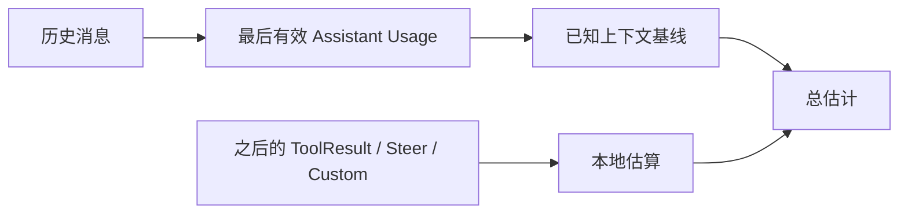

### 为什么跳过错误 Usage

以下 AssistantMessage 不能当作可靠基线：

- `stopReason=aborted`；
- `stopReason=error`；
- Usage 全为 0；
- Provider 没有形成有效响应。

否则一个错误消息会把真实 100k 上下文错误重置为 0。

## 3. 本地估算做了什么

教学化规则：

```text
Text            → 字符数 / 4
Image           → 固定保守字符等价值
Tool Call       → 工具名 + JSON 参数长度
Tool Result     → 文本与图像
Compaction      → 摘要长度
Branch Summary  → 摘要长度
```

这是保守估计，不追求 tokenizer 级精确。真正目标是：

> 在 Provider 拒绝请求之前，足够早地识别危险上下文。

产品不要依赖这套估算做精确计费；计费应使用 Usage Ledger。

## 4. Compaction 的输入不是整个 Session 文件

它只处理当前 Branch 的活动 Context：

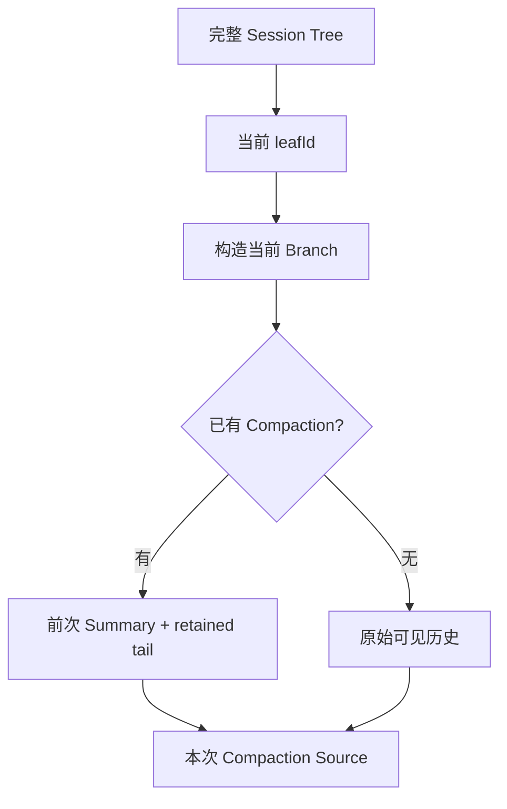

其他分支仍保留在 Session 文件中，但不会混进当前摘要。

## 5. Cut Point 为什么最难

目标是保留最近约 `keepRecentTokens`，但不能破坏消息语义。

### 不合法的切法

```text
Assistant(toolCall id=42)
--- CUT ---
ToolResult(toolCallId=42)
```

模型会看到一个没有对应 Tool Call 的 Tool Result。

### 合法切点

- UserMessage；
- AssistantMessage；
- BashExecutionMessage；
- CustomMessage；
- BranchSummary；
- CompactionSummary；
- 不从 ToolResult 开始。

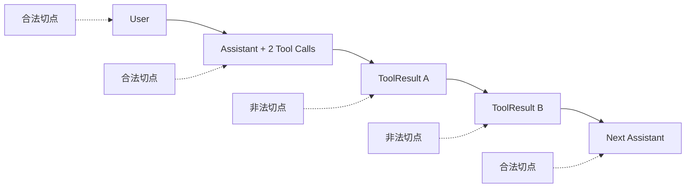

## 6. Split Turn Compaction

有时保留预算要求从一个 Turn 的 AssistantMessage 开始，而该 Turn 的 UserMessage 在更早位置。

```text
User：修复登录
Assistant：先读取文件
ToolResult：文件内容
Assistant：继续分析
```

如果从第一个 Assistant 开始保留，模型缺少发起该 Turn 的用户目标。因此 Pi 会识别：

```text
firstKeptEntryIndex
turnStartIndex
isSplitTurn
```

并为被切掉的 Turn 前缀生成额外摘要，再和总体摘要组合。

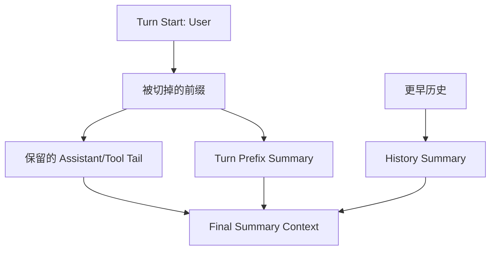

0.80.4 还修复了 Split-turn Summary 的并发：对只允许单并发的本地 Provider，两次摘要请求必须串行，否则会互相 429。

## 7. 摘要必须保存工程状态，而不是聊天主题

差的摘要：

> 用户在修复登录问题，已经分析了一些代码。

可继续工作的摘要：

```markdown
## Goal
修复 OAuth 回调后 Session 未写入导致的登录失败，不改变现有公开 API。

## Decisions
- Session cookie 仍由 gateway 设置。
- 不把 OAuth Token 写入前端 localStorage。

## Completed
- 读取 `src/auth/callback.ts`、`src/session/store.ts`。
- 确认 callback 在数据库提交前返回 302。
- 添加失败复现测试 `auth-callback.test.ts`。

## Files
- Read: `src/auth/callback.ts`, `src/session/store.ts`
- Modified: `test/auth-callback.test.ts`

## Evidence
- 测试当前失败：expected one stored session, received zero。

## Pending
- 将 redirect 移到 transaction commit 之后。
- 运行 auth focused tests 和完整 typecheck。
```

摘要需要保留：目标、约束、决策、已完成、证据、文件、失败和下一步。

## 8. 文件操作追踪

Pi Compaction 会从消息中的 Tool Call/Result 提取：

```text
readFiles
modifiedFiles
```

并把它们存入 `CompactionEntry.details`。下一次压缩可以继承前次追踪，再合并本次新增文件。

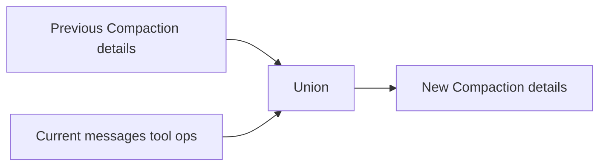

这避免多次压缩后“模型只记得最近读过的文件”。

## 9. Compaction Entry 的结构

概念结构：

```ts
type CompactionEntry = {
    type: "compaction";
    id: string;
    parentId: string | null;
    summary: string;
    firstKeptEntryId: string;
    tokensBefore: number;
    usage?: Usage;
    details?: {
        readFiles: string[];
        modifiedFiles: string[];
    };
    fromHook?: boolean;
};
```

重要字段：

- `firstKeptEntryId`：摘要替代到哪里；
- `tokensBefore`：压缩前规模证据；
- `usage`：摘要模型调用成本；
- `details`：恢复工程上下文；
- `fromHook`：区分 Pi 与 Extension 生成。

## 10. Context 如何使用 Compaction Entry

压缩不会删除旧 Entry。下一次 Context 构造：

```text
Compaction Summary
+ firstKeptEntryId 开始的原始尾部
+ 后续新消息
```

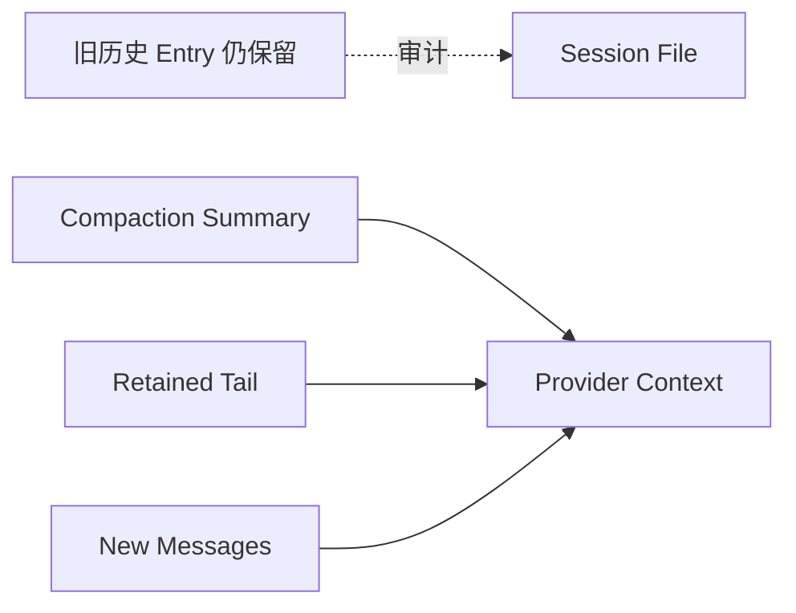

这允许：

- 恢复当前工作；
- Fork 到压缩前历史；
- 导出完整审计；
- 重新生成更好的摘要。

## 11. 三种 Compaction 原因

| 原因 | 触发者 | 后续行为 |
|---|---|---|
| `manual` | 用户 `/compact` 或 API | 压缩后通常停在 Idle |
| `threshold` | Context 超过预设阈值 | 压缩后后续 Turn 可继续 |
| `overflow` | Provider 已拒绝上下文 | 压缩后重试原请求一次 |

### 为什么 Overflow 只应有限重试

若压缩后仍超过窗口，继续无限压缩/重试可能：

- 重复摘要费用；
- 重复 Tool 前后的控制流；
- Session 永不 settled；
- 隐藏真正的模型元数据或 Context Bug。

`_overflowRecoveryAttempted` 这类状态用于保证同一用户输入的 Overflow Recovery 有上限。

## 12. Overflow Recovery 时序

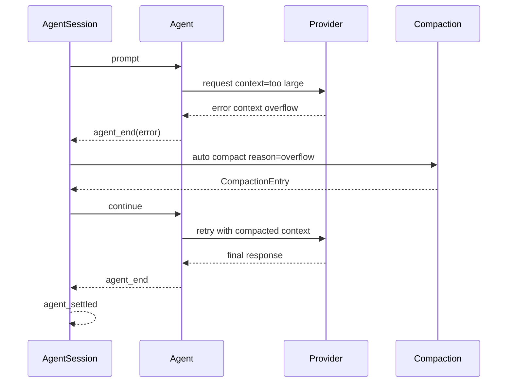

不应重新 append 同一 UserMessage；`continue()` 从现有 Context 重试。

## 13. Retry 分类

不是所有 Error 都应该自动 Retry。

| 错误 | 自动 Retry | 原因 |
|---|---:|---|
| 429 / transient 5xx | 是，受 Policy 限制 | 临时容量问题 |
| DNS `EAI_AGAIN` | 是 | 临时网络问题 |
| Socket Drop | 是 | 连接暂态 |
| Auth 缺失 | 否 | 需要用户配置 |
| Tool 参数非法 | 否，由模型新 Turn 修正 | 重发相同请求无意义 |
| Context Overflow | 走 Compaction Recovery | 不是普通 Delay Retry |
| Safety/Policy Refusal | 否 | 重发相同内容不会解决 |
| Abort | 否 | 用户明确停止 |

## 14. Retry Policy

概念结构：

```ts
type RetryPolicy = {
    enabled: boolean;
    maxRetries: number;
    baseDelayMs: number;
    maxDelayMs?: number;
};
```

常见指数退避：

\[
\text{delay}_n =
\min(\text{maxDelay},
\text{baseDelay} \times 2^{n-1})
\]

若 Provider 返回 `Retry-After`，还要受产品配置的 `maxRetryDelayMs` 限制，避免一次请求把共享 Host 挂起数分钟。

## 15. Retry Delay 必须绑定 AbortSignal

错误代码：

```ts
await new Promise((resolve) => setTimeout(resolve, delayMs));
```

可取消思路：

```ts
async function sleepWithSignal(delayMs: number, signal: AbortSignal) {
    signal.throwIfAborted();
    await new Promise<void>((resolve, reject) => {
        const timer = setTimeout(resolve, delayMs);
        signal.addEventListener("abort", () => {
            clearTimeout(timer);
            reject(signal.reason ?? new Error("aborted"));
        }, { once: true });
    });
}
```

生产实现还要移除 Listener，避免长期 Session 累积。

## 16. Summarization Retry 与主 Agent Retry

两者使用相同 Retry 原则，但身份和 UI 不同：

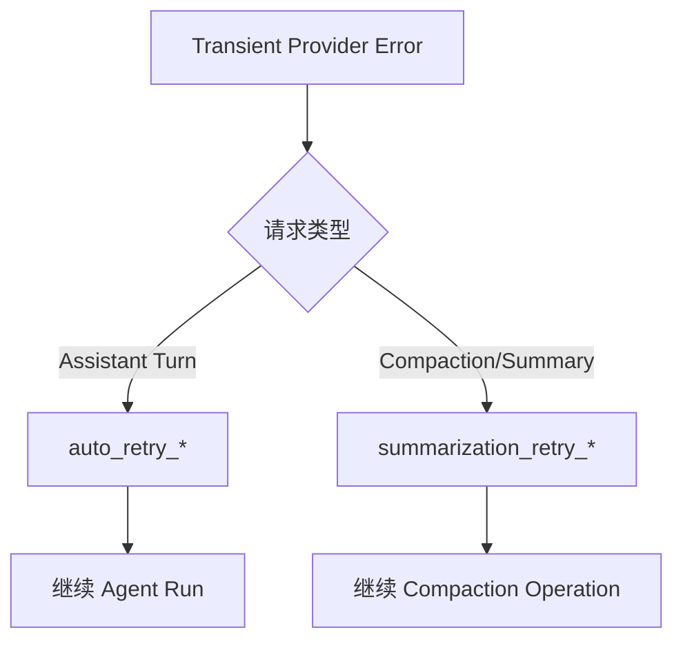

不能把摘要重试显示成新的 Assistant 回答；它属于维护操作。

## 17. Compaction 与 Prompt Cache

摘要请求的 Prompt 与主会话不同，因此应使用新的 Provider Routing Session ID，并在支持时禁用缓存。

主会话缓存：

```text
stable system prompt
+ stable active tools
+ retained conversation prefix
```

摘要请求：

```text
summarization system prompt
+ serialized source history
```

共享 Cache Key 会污染主会话命中与 Provider continuation。

## 18. Compaction 期间的 Steer/Follow-up

关键不变量：

```text
Compaction 替换历史投影
≠
清空运行控制队列
```

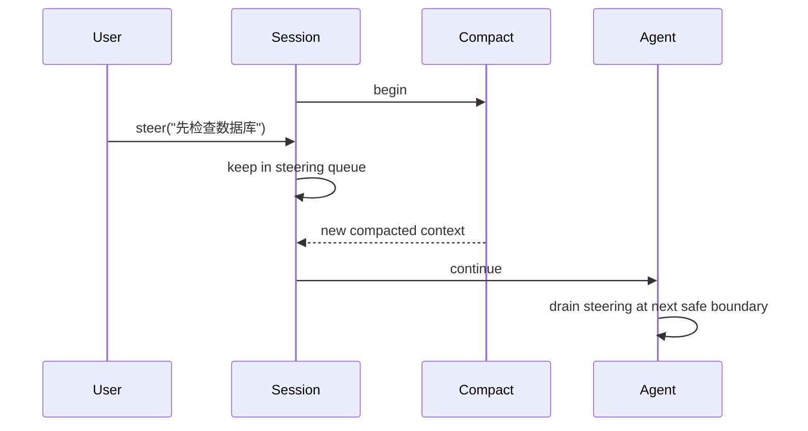

手动 Compaction 与自动 threshold Compaction 必须互斥，否则两个摘要会基于不同 Snapshot 同时提交。

## 19. Compaction 成功/失败事件

成功：

```text
session_before_compact
summarization events...
session_compact
```

失败：

```text
session_before_compact
summarization events...
session_compact_failed {
  reason,
  errorMessage,
  aborted,
  willRetry,
  fromExtension
}
```

产品 Lifecycle Outbox 应保存成功和失败，使用稳定 Event ID。不能只在内存 Toast 中显示失败。

## 20. 长任务的三层 Memory

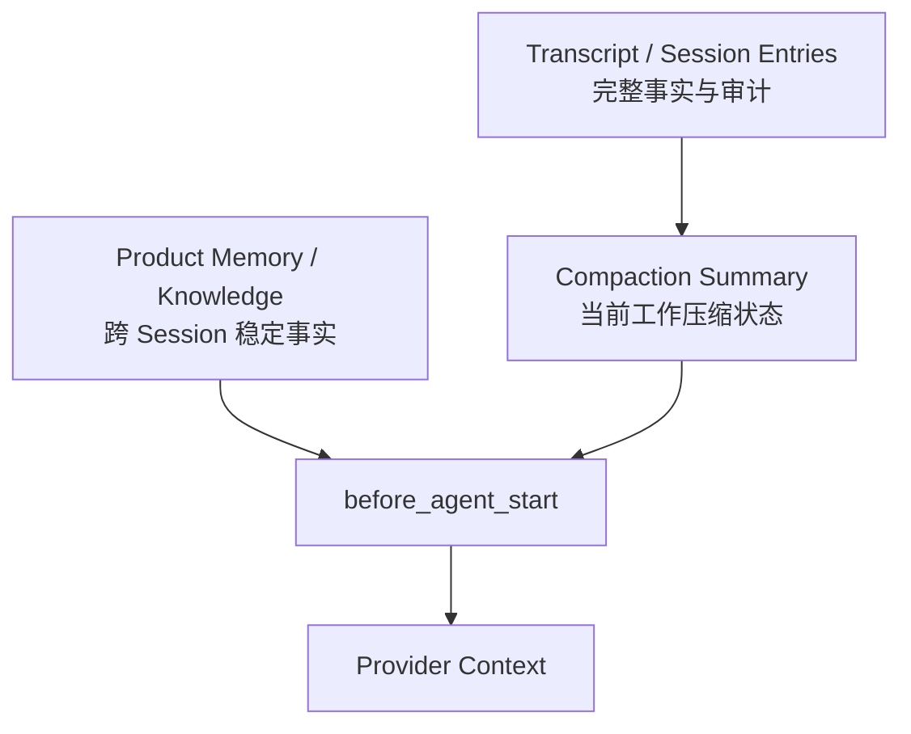

- Transcript：发生过什么；
- Compaction：本任务当前要继续什么；
- Product Memory：跨任务稳定偏好、项目规则和知识。

不要把所有内容压成一份“永久记忆”。

## 21. 长时间 Agent Loop 的项目模式

推荐每个里程碑写稳定工作文档：

```text
VISION.md
REQUIREMENTS.md
ARCHITECTURE.md
CURRENT_STATE.md
TEST_EVIDENCE.md
```

Compaction Summary 引用这些稳定文件，而不是把所有细节复制进摘要。

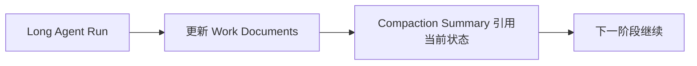

这不是强制 Handoff；同一 Session 可以继续，只是让关键状态脱离短期上下文。

## 22. 调试 Playbook

### 反复 Overflow

检查：

```text
model.contextWindow 是否正确
last valid usage 是否来自压缩前旧消息
Compaction Summary 是否过长
Tool Result 是否携带大对象/图片
Custom Message 是否重复注入
Prompt/Tool Catalog 是否每轮增长
```

### Compaction 后忘记任务

检查：

```text
摘要是否保存 Goal/Constraints/Pending
firstKeptEntryId 是否选错
Split-turn prefix 是否总结
Files/Decisions 是否进入 details/summary
Product Memory 是否在下一 before_agent_start 注入
```

### Stop 后仍卡住

检查：

```text
Summarization Retry Delay 是否监听 Signal
OAuth/Auth/Model Store 是否可取消
Extension session_before_compact Handler 是否无界
自定义 Provider 是否忽略 Signal
AgentSession 是否等待错误的 Promise
```

### 压缩期间消息丢失

检查：

```text
是否错误调用 Agent.reset()
Queue 是否存于 Agent 而非 messages 投影
Context 替换是否覆盖 Queue
手动/自动 Compaction 是否并发
```

## 23. 测试矩阵

### Token 与 Cut Point

- 无 Provider Usage，全本地估算；
- 有 Usage + trailing Tool Results；
- Last Usage 为 error/zero；
- 保留点落在 User；
- 保留点落在 Assistant Tool Call；
- 不允许落在 Tool Result；
- Split Turn 双摘要；
- Previous Compaction + New Tail。

### Retry

- transient error 成功重试；
- Retry 次数耗尽；
- Provider Retry-After 超过 max；
- Delay 期间 Abort；
- Auth Error 不 Retry；
- Overflow 走 Compaction 而非普通 Retry。

### 并发/恢复

- 手动与自动 Compaction 互斥；
- Compaction 中 Steer 保留；
- Summary Request 失败后事件完整；
- Overflow 只恢复一次；
- Host Restart 后使用 Compaction Entry 构造 Context；
- Compaction Usage 进入 Session Ledger。

## 24. 实验

1. 构造 30 条消息，其中包含三个 Tool Batch；
2. 给第 20 条 Assistant 设置真实 Usage；
3. 在后面加两个大 Tool Result；
4. 计算 Context Estimate；
5. 设置很小 `keepRecentTokens` 触发 Split Turn；
6. 打印 `firstKeptEntryId`、`turnStartIndex`、摘要输入；
7. Faux Provider 第一次返回 Overflow，Compaction 后成功；
8. 在 Summary Retry Delay 中 Abort；
9. 验证最终只有一次 `agent_settled`。

## 练习题

1. `reserveTokens` 与 `keepRecentTokens` 分别控制什么？
2. 为什么 Last Assistant Usage 后还要计算 trailing tokens？
3. 给出一个不能从 Tool Result 开始保留的具体 Provider 错误。
4. Split Turn 为什么可能需要两个摘要？
5. Overflow Recovery 为什么使用 `continue()` 而不是重新 `prompt()`？
6. 自动 Retry 与 Summarization Retry 的 UI 应怎样区分？
7. Compaction 期间 Steer 属于哪个状态域？
8. 为什么主 Agent 与 Summary Request 不应共享 Routing Session ID？
9. 写一份能支持继续修改代码的 Compaction Summary。
10. 设计十二项长任务测试，覆盖长度、失败、取消、队列与恢复。
