# 深挖 06：ModelRuntime、Provider、Auth、Catalog 与 Prompt Cache

## 为什么“选一个模型”背后有这么多对象

用户在 UI 里选择：

```text
openai-codex / gpt-5.6-luna / high
```

Runtime 真正要解决：

- 这个模型来自哪个 Provider？
- Provider 是内置、Extension 注册，还是 `models.json` 组合出来的？
- 当前凭证来自 API Key、OAuth、环境变量还是 Gateway？
- Token 是否还有足够有效期？
- Base URL 和 Headers 是否由凭证动态决定？
- 模型目录是缓存、远程最新，还是账户特有结果？
- 两个并发 Refresh 谁有权发布？
- Provider 是否支持当前 Thinking、图片、Strict Tool、Deferred Tool？
- Prompt Cache Key、Session Affinity 和 Tool Schema 前缀如何稳定？

`ModelRuntime` 是这些事实的聚合边界，不只是 `Model[]`。

## 1. 五个核心概念

| 概念 | 负责什么 |
|---|---|
| `Model` | 某个可选模型的能力、成本、窗口和 Compat 元数据 |
| `Provider` | Auth、Catalog、Stream、Complete、Deferred 等行为 |
| `Models` | 注册 Provider，并按模型执行统一请求 |
| `ModelRuntime` | 将内置 Provider、Extension、配置、Credential 和 Snapshot 组合起来 |
| `RuntimeCredentials` | 读写、检查、刷新并串行化 Provider 凭证操作 |

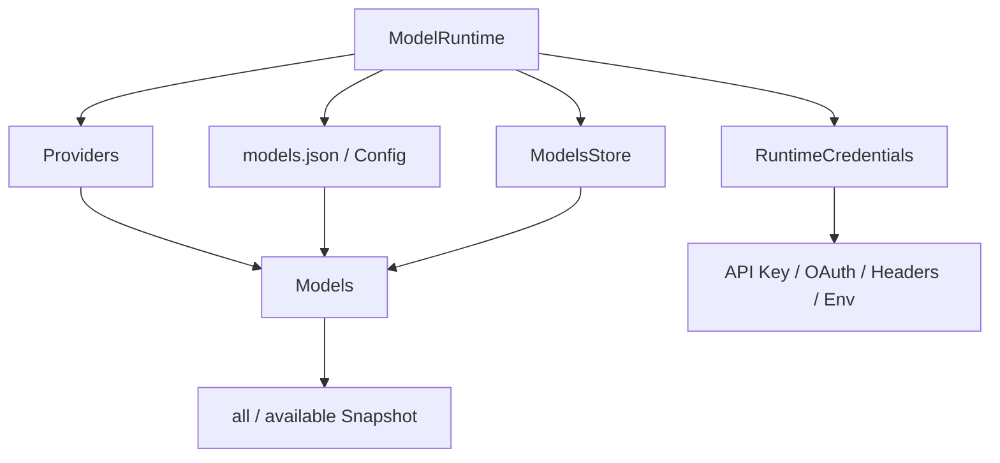

## 2. Model Metadata 不是装饰

概念结构：

```ts
type Model<ApiName> = {
    id: string;
    name: string;
    provider: string;
    api: ApiName;
    baseUrl: string;
    reasoning: boolean;
    input: Array<"text" | "image">;
    contextWindow: number;
    maxTokens: number;
    cost: {
        input: number;
        output: number;
        cacheRead: number;
        cacheWrite: number;
    };
    compat?: ProviderCompat;
};
```

这些字段直接影响：

```text
contextWindow → Compaction 触发
maxTokens → 输出预算
reasoning/compat → Thinking Level 映射
input → 是否可发送图片
cost → Session 费用
api → 选择具体 Adapter
baseUrl → 请求目标
compat → Tool/Cache/Deferred/Sampling 行为
```

模型 ID 相同但 Provider 不同，能力、鉴权和成本仍可能完全不同。

## 3. `all` 与 `available` 为什么分开

`ModelRuntime` 维护 Snapshot：

```ts
private snapshot = {
    all: [],
    available: [],
    configuredProviders: new Set(),
    storedProviders: new Set(),
    auth: new Map(),
};
```

运行时例子：

```text
all = [
  openai/gpt-x,
  anthropic/claude-y,
  llama.cpp/local-z
]

configuredProviders = {openai, llama.cpp}
storedProviders = {openai}
available = [openai/gpt-x, llama.cpp/local-z]
```

| 集合 | 用途 |
|---|---|
| `all` | 展示完整目录、解析配置、诊断不可用模型 |
| `available` | 默认选择、模型循环、真正请求 |
| `configuredProviders` | Auth Check 已证明可配置/可调用 |
| `storedProviders` | Credential Store 中存在记录，不等于当前有效 |

“存了凭证”可能已经过期；“目录有模型”也可能没有 Auth。

## 4. Provider 来源如何组合

当前 `ModelRuntime` 可能同时看到：

```text
内置 Provider
原生 Extension Provider
models.json Provider Config
Extension Provider Config Input
Radius/Gateway 动态 Provider
```

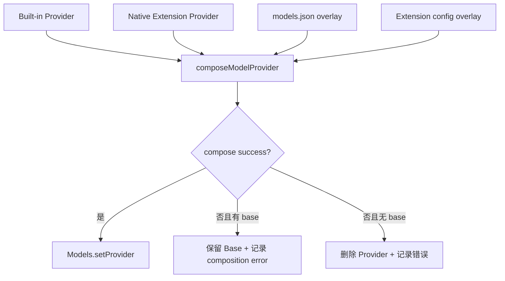

### 为什么组合失败不能静默

例如配置写了：

```json
{
  "provider": "openai",
  "baseUrl": "not-a-url",
  "models": [{ "id": "gpt-x" }]
}
```

若 Runtime 仍展示模型但请求走到旧 Base URL，用户会误以为配置生效。正确行为是保留明确错误，并只在有安全 Base Provider 时使用未覆盖版本。

## 5. `ModelRuntime.create()` 的装配顺序

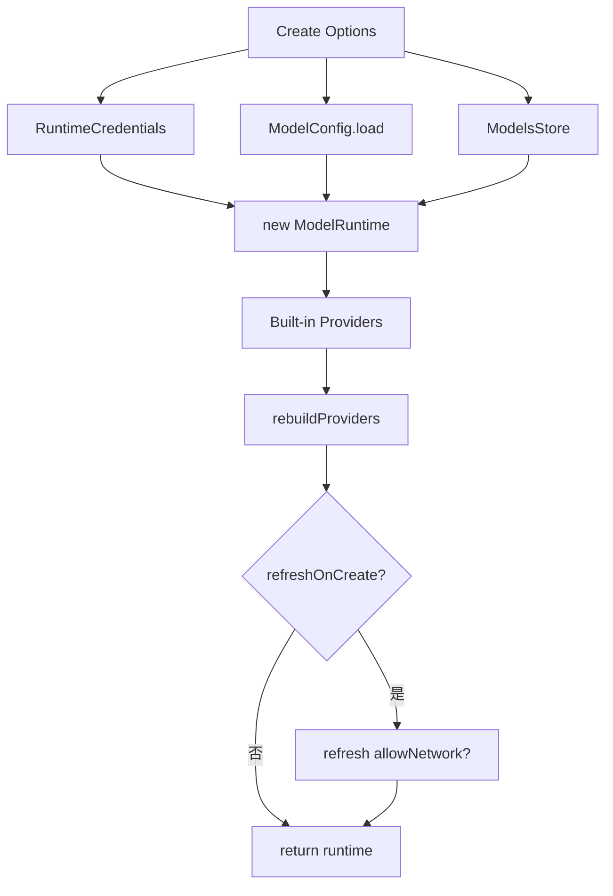

关键配置：

```text
authPath
modelsPath
modelsStorePath
allowModelNetwork
refreshOnCreate
modelRefreshTimeoutMs
signal
catalogBaseUrl
```

产品 Host 通常应：

```text
启动先读本地缓存
UI/请求可用
后台有界刷新
```

而不是每个 Prompt 都阻塞等待互联网目录。

## 6. Provider Auth 不只是 API Key

统一 Auth 结果可能包含：

```ts
type AuthResult = {
    auth: {
        apiKey?: string;
        headers?: Record<string, string | null>;
        baseUrl?: string;
    };
    env?: Record<string, string>;
};
```

### 为什么 Base URL 可以来自凭证

GitHub Copilot Business/Enterprise、企业 Gateway 或区域路由可能根据账户决定 Endpoint。模型静态 `baseUrl` 不是最终答案。

### 为什么 Header 允许 `null`

`null` 表示删除继承 Header，例如防止占位 OpenAI Credential 经过 Gateway 被发送。它和 `undefined` 的语义不同：

```text
undefined → 不提供覆盖
null      → 明确删除
string    → 设置/替换
```

## 7. Auth 请求链

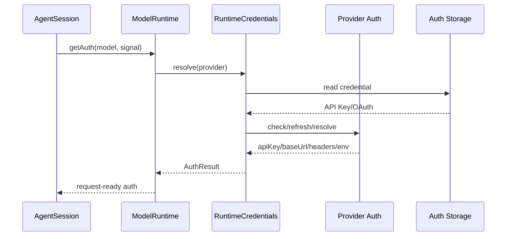

任何等待都应接受同一 Operation Signal：文件锁、OAuth Refresh、网络 Auth Check、Credential Queue。

## 8. OAuth 生命周期

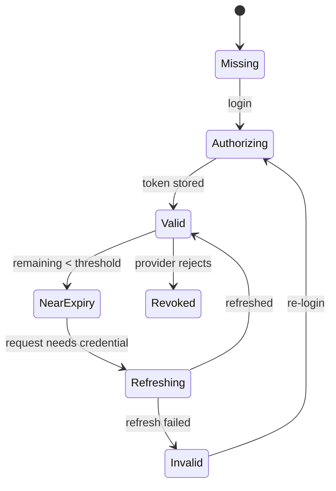

### “未过期”为什么仍可能不可用

请求预计持续 120 秒，Token 只剩 30 秒。`minOAuthValidityMs` 应要求先刷新。

```ts
resolveAuth({ minOAuthValidityMs: 180_000, signal });
```

外部客户端必须调用 Auth API/CLI 获取经过刷新和最小有效期校验的凭证，不直接读 `auth.json`。

## 9. Credential 单飞与锁

并发请求可能同时触发刷新：

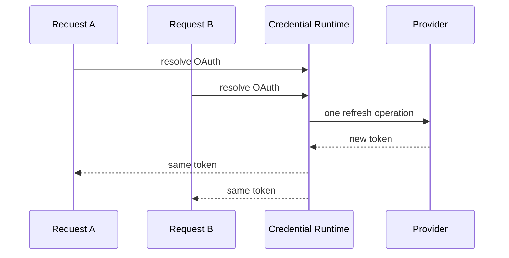

需要按 Provider 串行化 read-modify-write，防止：

- 两个 Refresh Token 同时使用，后一个失效；
- A 写回时覆盖 B 更新的其他 Provider；
- 文件锁形成 convoy；
- 已取消请求在等待锁后仍继续写凭证。

0.84 的重要改进是：等待锁和刷新都可取消，stalled refresh 不能永久占有 Credential Store。

## 10. Model Catalog 的三层真相

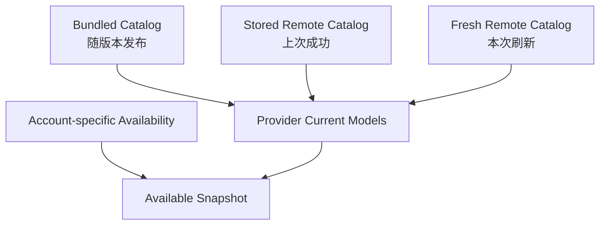

- Bundled：离线可用，但可能旧；
- Stored：比 Bundle 新，也可能过期；
- Fresh：联网最新，但可能失败或慢；
- Available：还要结合当前 Auth/账户策略。

## 11. ETag 与 304

Remote Catalog 可保存：

```text
models
checkedAt
etag
```

下一次请求发送 `If-None-Match`：

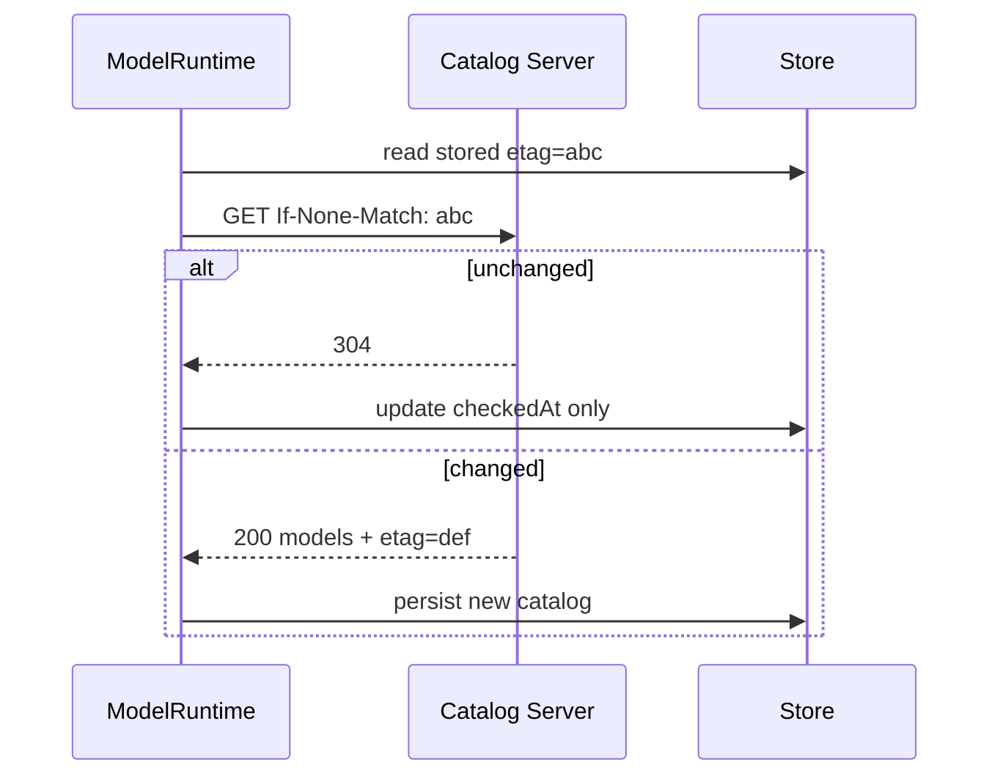

这减少启动和后台刷新流量。

## 12. 为什么旧 Refresh 会覆盖新状态

竞态：

```text
Refresh A(gen 5) 开始，网络很慢
用户登录，Refresh B(gen 6) 开始
B 返回新账户目录并发布
A 最后返回旧公共目录并覆盖 B
```

0.84 的 `context.publish()` 解决：

```ts
const refreshed = await fetchModels(context.signal);
if (context.signal.aborted) return;

const published = await context.publish({
    persist: { models: refreshed, checkedAt: Date.now() },
    update: () => { currentModels = refreshed; },
});

if (!published) return; // generation 已过期
```

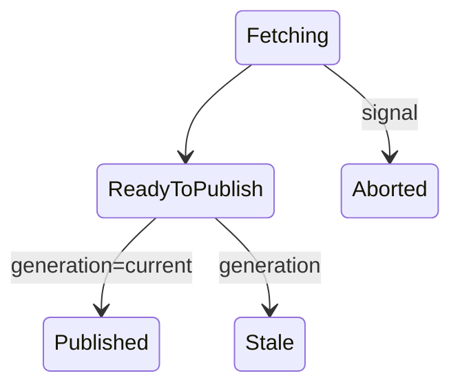

核心不变量：

> 只有仍然代表最新意图的异步操作，才有权修改权威 Snapshot 和 Store。

## 13. Provider 忽略 AbortSignal 怎么办

自定义 Provider 可能没有正确将 Signal 传给 Fetch。调用者不能因此永久等待。

外层 orchestration 可以将 Provider Promise 与 Signal Race：

```ts
await Promise.race([
    provider.refreshModels(context),
    rejectWhenAborted(signal),
]);
```

这只能停止调用者等待，不能强制停止 Provider 内部网络活动。因此过期 `publish()` 仍必须拒绝它以后返回的结果。

```text
可取消等待
+
generation guard
=
既快速返回，又阻止迟到写入
```

## 14. Model Selection 与恢复

Session 恢复优先读历史最后 Model：

```text
Session model change
→ ModelRuntime.getModel(provider, id)
→ 检查当前 Auth
→ 可用则恢复
→ 不可用则记录 fallback message
→ 选择设置默认/首个可用模型
```

不应悄悄切换而不告知，因为：

- 能力可能不同；
- 成本不同；
- Context Window 不同；
- Tool/Thinking 支持不同；
- 结果可复现性下降。

## 15. Thinking Level 不是统一整数

产品看到：

```text
off
minimal
low
medium
high
xhigh
max
```

Provider 可能使用：

```text
reasoning_effort
auto/adaptive thinking
thinking budget
chat_template_args
thinking_token_budget
不支持 off payload
```

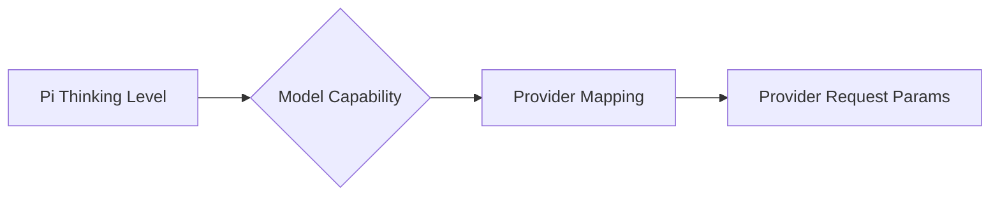

`getSupportedThinkingLevels(model)` 和 `clampThinkingLevel()` 应在发送前决定有效级别。产品不能把 UI 的 `max` 原样塞给所有 Provider。

## 16. Tool Capability 也属于 Model Metadata

模型/Provider可能声明：

```text
supportsStrictTools
supportsGrammarTools
supportsFinishReason
supportsPromptCacheKey
supportsDeferredTools
supportsMessageAnchoredTools
```

Tool 请求应通过能力决策：

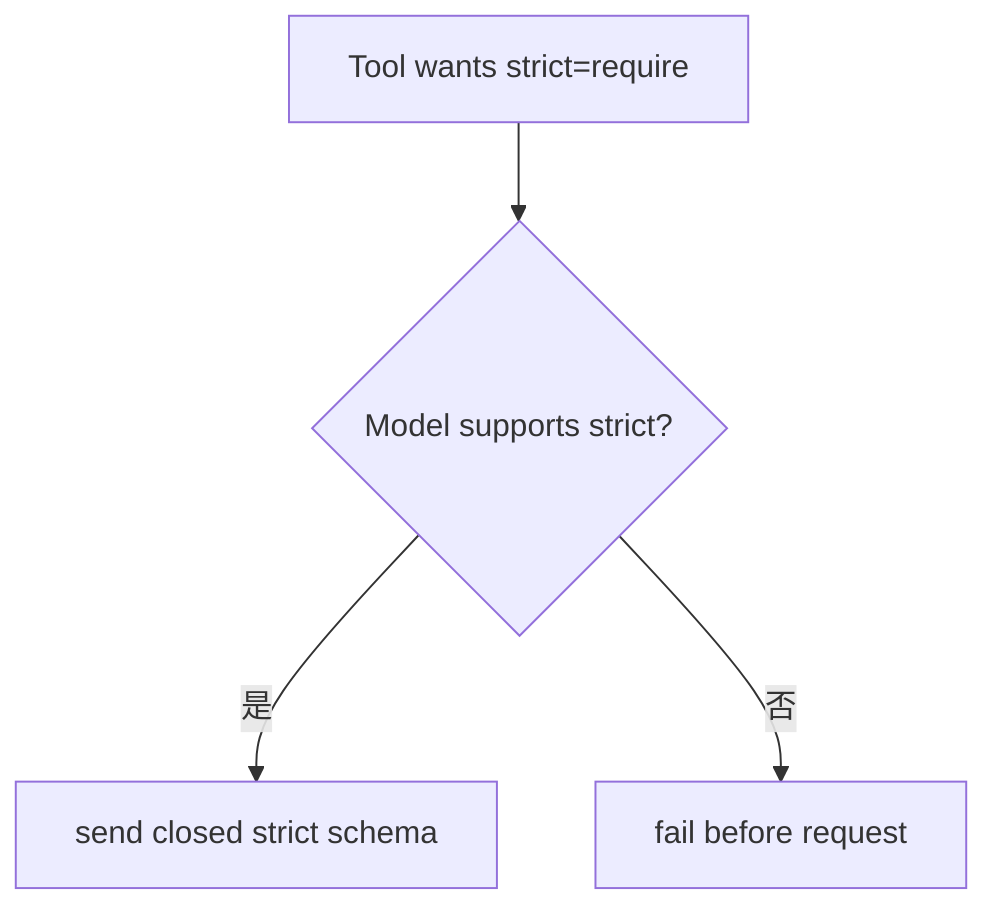

不要等待 Provider 返回模糊 400。

## 17. Provider Stop Reason 与 Runtime 控制流

Adapter 同时输出：

```text
stopReason     = Pi 统一控制语义
rawStopReason  = Provider 原始证据
```

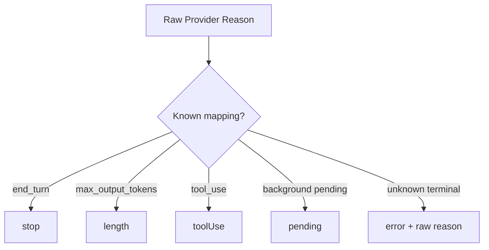

未知原因不能默认为成功。

## 18. Prompt Cache 的三类机制

### Provider-managed prefix cache

Provider 根据相同 Prompt Prefix 自动命中。

### Explicit cache key / session affinity

Runtime 发送稳定 Key/Header，让 Provider 把同一 Session 请求关联。

### Continuation identity

OpenAI Responses/WebSocket 等使用 previous response/session identity 继续服务端状态。

三者不能混为一谈。Compaction Summary 通常应使用新 Routing ID，避免污染主 Agent Continuation。

## 19. 稳定 Prompt 前缀

理想请求结构：

```text
稳定区：
- Persona/System Prompt
- 固定 Tool Search/Load Schema
- 稳定排序的已激活 Tool
- 已稳定的历史前缀

增量区：
- 新 User Message
- Tool Result
- 本 Turn Retrieval Evidence
- 新披露 Tool
```

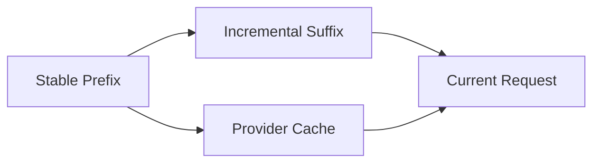

每轮重新排序 Tool、加入当前时间或全量 Memory，会破坏 Cache。

## 20. Dynamic Tool 与 Cache

`addedToolNames` / message-anchored `additional_tools` 让新 Tool 在历史中的披露点出现：

```text
固定 Tool 集合不变
→ tool_load Result
→ 从该消息后添加 Schema
```

相较每轮顶层重发全 Catalog：

- 旧前缀保持字节稳定；
- Session 重放能恢复能力；
- 模型知道 Tool 何时出现；
- Catalog 未披露部分不占 Token。

## 21. Memory 对 Cache 的影响

错误做法：每轮把所有长期 Memory 按当前召回分数重新排序进 System Prompt。

```text
Turn 1: [A,B,C]
Turn 2: [C,A,B]
```

即使内容相同，Prefix 也变化。

更稳方案：

```text
稳定 Session Memory：按 ID/类别稳定排序，变更时产生 Revision
Transient Retrieval：放增量 suffix，只属于当前 Turn
```

Compaction 后刷新 Session Memory，但在下一正常 Provider Start 注入，不篡改已结算的 Compaction Entry。

## 22. 一次请求的 Header 合并

概念顺序：

```text
Provider defaults
→ Model/Compat headers
→ Credential-resolved headers/baseUrl
→ Settings attribution/session affinity
→ Extension before_provider_headers
→ 删除 null markers
→ Send
```

产品 Header Hook 应避免：

- 覆盖 Provider 必需 Auth；
- 把敏感值写入日志；
- 每次生成随机 Cache Key；
- 根据非权威 UI 状态路由租户。

## 23. ModelRuntime 不应负责什么

- Session Tree；
- Tool 执行；
- Room/WorkItem；
- 产品预算扣减；
- Memory 召回；
- UI Working 状态；
- Plugin 审批。

它只负责模型调用所需的权威事实和 Provider 生命周期。

## 24. 调试 Playbook

### 模型在 `/model` 消失

检查：

```text
Provider 是否注册
Catalog all 是否含模型
Auth check 是否通过
available snapshot 是否更新
PI_OFFLINE 是否阻止远程刷新
stored catalog 是否被错误判旧
account policy 是否过滤
stale refresh 是否覆盖新结果
```

### 登录完成但仍不可用

```text
Credential 是否成功持久化
Provider checkAuth 是否读取同一 Store
Refresh 是否卡住
UI 是否等待 remote freshness 而非 local consistency
Base URL 是否由 AuthResult 覆盖
OAuth Token 是否满足 min validity
```

### 长 Session 使用旧凭证

```text
每次请求是否重新 resolve auth
Credential file 外部更新是否被观察
并发 read/refresh 是否串行
旧 refresh 是否仍持锁
Session 是否缓存 apiKey 字符串
```

### Prompt Cache Miss

```text
System Prompt 是否包含当前时间
Tool 顺序是否变化
Memory 是否每轮重排
Session ID/Cache Key 是否稳定
Compaction 是否错误复用主 Key
Provider Compat 是否发送不支持字段
```

## 25. 测试矩阵

### Provider 组合

- 只有内置 Provider；
- 内置 + models.json Base URL；
- Extension Provider + modelOverrides；
- 配置错误回退并记录诊断；
- Provider 删除后 Snapshot 更新。

### Auth

- API Key；
- OAuth 有效；
- Near-expiry 自动 Refresh；
- Refresh 失败；
- 两请求共享单飞 Refresh；
- 等锁时 Abort；
- AuthResult 动态 Base URL；
- `null` Header 删除。

### Catalog

- Bundled only；
- Stored newer than bundled；
- 304；
- Fresh 200；
- Network timeout；
- gen 5 慢、gen 6 先发布；
- Provider 忽略 Signal 但旧 Publish 被拒绝。

### Cache

- 相同前缀稳定；
- Tool 激活后只在锚点增加；
- Memory Revision 变化触发明确新 generation；
- Summary 使用独立 routing ID；
- Tool 顺序确定。

## 26. 实验

1. 创建 Faux Provider，含两个模型；
2. Auth 第一次返回将过期 Token，触发 Refresh；
3. 启动两个并发 `getAuth()`，断言只 Refresh 一次；
4. 构造 Refresh A 延迟 200ms、B 延迟 20ms；
5. 断言 B 发布后 A 的 `publish()` 返回 false；
6. 将 Provider 改为忽略 Signal，断言调用者仍可取消等待；
7. 比较两次请求序列化后的稳定前缀；
8. 加载一个 Dynamic Tool，验证旧前缀未重排。

## 练习题

1. `all`、`available`、`storedProviders`、`configuredProviders` 各自表示什么？
2. Credential AuthResult 为什么可以改变 Base URL？
3. `null` Header 与 `undefined` 有什么差别？
4. 为什么可取消等待和 generation guard 必须同时存在？
5. 设计两个并发 OAuth Refresh 的错误写法和正确写法。
6. Session 恢复模型失败时为什么必须报告 Fallback？
7. Thinking Level 为什么不能作为统一整数直接发送？
8. Dynamic Tool 如何同时改善 Prompt Cache 和恢复？
9. 长期 Memory 怎样分成稳定 Prefix 与 transient Suffix？
10. 为 ModelRuntime 写一套包含 15 个场景的测试计划。
