# 深挖 07：Extension、Skill、Tool、Context 与产品层的职责边界

## 为什么扩展机制越多，越容易设计错

Pi 同时提供：

- Extension；
- Skill；
- Prompt Template；
- Tool；
- AGENTS/Context File；
- System Prompt Override；
- Custom Message/Entry；
- Product Runtime Adapter。

一个功能似乎放在哪里都能实现。例如“审批下载”可以被写进：

- System Prompt；
- Skill；
- `beforeToolCall` Extension；
- Product Gateway；
- Tool 自己；
- Session Custom Entry。

但这些位置的安全性、生命周期和权威性完全不同。

## 1. 先用一张决策图选择机制

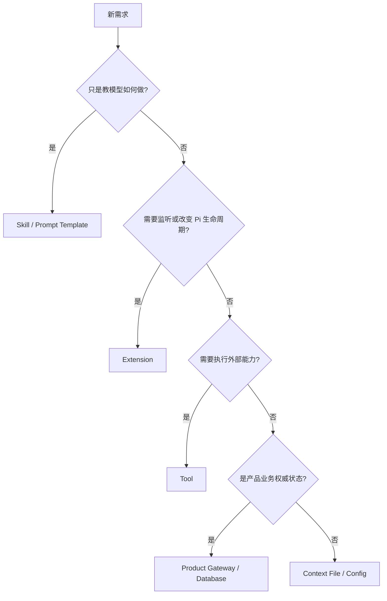

同一能力经常由多种机制配合，但必须明确谁是权威。

## 2. 五种机制的本质

| 机制 | 本质 | 能执行代码 | 是否进入模型 Context | 是否适合保存权威业务状态 |
|---|---|---:|---:|---:|
| Skill | 工作流知识文档 | 否 | 按需加载 | 否 |
| Prompt Template | 参数化用户输入模板 | 否 | 展开为输入 | 否 |
| Extension | 进程内生命周期插件 | 是 | 可通过 Hook 注入 | 否，除非调用产品存储 |
| Tool | 模型可调用的外部动作 | 是 | Schema + Result | 副作用状态应在 Tool 后端 |
| Product Gateway | 产品业务服务 | 是 | 通过 Adapter 投影 | 是 |

## 3. ResourceLoader 是资源发现的权威入口

`DefaultResourceLoaderOptions` 包含：

```ts
interface DefaultResourceLoaderOptions {
    cwd: string;
    agentDir: string;
    additionalExtensionPaths?: string[];
    additionalSkillPaths?: string[];
    additionalPromptTemplatePaths?: string[];
    additionalThemePaths?: string[];
    extensionFactories?: InlineExtension[];
    noExtensions?: boolean;
    noSkills?: boolean;
    noPromptTemplates?: boolean;
    noThemes?: boolean;
    noContextFiles?: boolean;
    skillsOverride?: (...args) => ...;
    systemPromptOverride?: (base?: string) => string | undefined;
}
```

它不是“扫描几个目录”，而是合并：

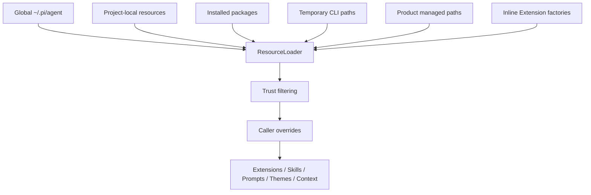

## 4. Project Trust 为什么只是一道加载门

项目目录里的 Extension 是可执行代码。首次进入一个仓库时，Runtime 不应在询问用户前就加载它。

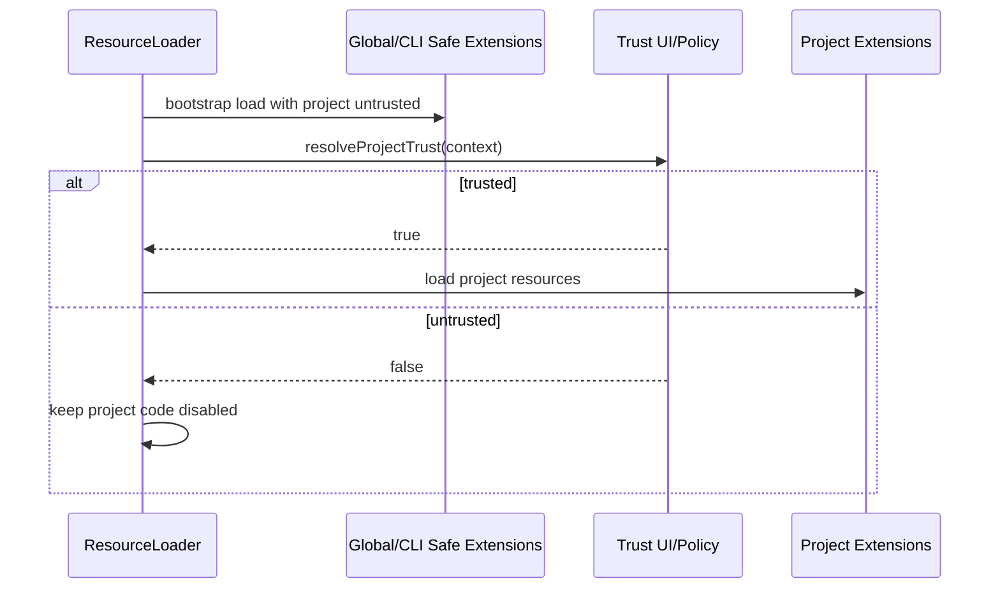

但 Trust 不等于沙箱：

```text
trusted = 允许加载代码
sandboxed = 即使代码恶意，也限制文件/网络/进程权限
```

Pi 默认以当前进程权限运行。真正隔离需容器、VM 或策略沙箱。

## 5. Extension 的生命周期位置

Extension 可以参与：


### 各 Hook 适合做什么

| Hook | 适合 | 不适合 |
|---|---|---|
| `input` | 命令转换、输入拦截 | 隐藏副作用 |
| `before_agent_start` | Session/Turn Context、短目录 | 执行写 Tool |
| `context` | 过滤/投影 AgentMessage | 无界网络检索 |
| `before_provider_request` | Provider Payload 兼容 | 修改产品权威状态 |
| `before_provider_headers` | Trace/Tenant/Gateway Header | Tool 权限 |
| `tool_call` | 审批、参数策略、阻止执行 | 只靠 Prompt 决策权限 |
| `tool_result` | 脱敏、归一化、Usage | 隐藏第二个副作用 |
| `agent_settled` | 审计、提交本地 Outbox | 长时间同步网络上传 |
| `session_shutdown` | 释放资源、保存状态 | 启动新 Session 写入 |

## 6. Extension Context 为什么会过期

Extension Handler 经常捕获 `ctx`：

```ts
pi.on("agent_settled", async (_event, ctx) => {
    cachedCtx = ctx;
});
```

Session Fork、Switch 或 Reload 后，旧 `ctx` 指向：

- 旧 Session；
- 旧 ResourceLoader；
- 旧 Tool Registry；
- 旧 TUI Binding；
- 已 Dispose 的 Listener。

Runtime 必须 invalidate 旧 Context：

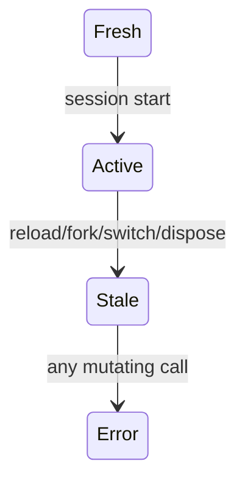

不要自动把旧 Context 转发到新 Session，这会让异步旧任务获得新会话写权限。

## 7. Skill 解决的是“工作方法”，不是执行权

一个好的 Skill 应回答：

```text
什么时候使用
要达到什么结果
有哪些步骤和检查点
需要读取哪些参考资料
哪些情况不适用
完成证据是什么
```

例如：

```yaml
---
name: dataset-preparation
when:
  - 用户要求根据区域、时间和变量准备数据
  - 用户要求比较多个数据产品并生成下载清单
does: 搜索、检查、比较并生成可审批的数据准备计划。
notFor:
  - 普通问答
  - 未经审批直接下载或删除数据
---
```

Skill 可以指导模型调用 Tool，但不能授予 Tool 权限。

## 8. 为什么所有 Skill 全文不能常驻

假设 50 个 Skill，每个 1500 Token：

```text
75k Token 固定开销
+ System Prompt
+ Tool Schema
+ Session History
```

问题不仅是贵：

- 不相关规则冲突；
- Prompt Cache 前缀随安装变化；
- 模型注意力被大量无关流程稀释；
- 产品无法解释本次究竟用了哪个 Skill；
- Skill 更新影响所有请求。

## 9. Skill 渐进披露

推荐三层：

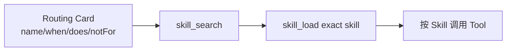

### 第一层：稳定短目录

```json
{
  "name": "dataset-preparation",
  "when": ["准备区域和时间范围数据"],
  "does": "比较数据源并生成可审批下载计划",
  "notFor": ["直接执行未审批下载"]
}
```

### 第二层：Search Result

返回匹配理由、用途和限制，不返回全文。

### 第三层：Load

只读取一个精确 Skill 正文，并标明相对引用目录。

## 10. Routing Card 为什么放产品 Adapter

上游 Skill 类型只需要通用 `name/description/filePath` 等。产品特有的 `when/does/notFor` 属于路由策略。

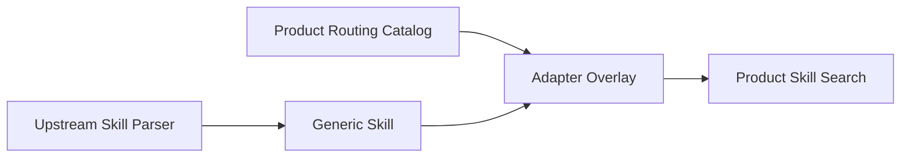

好处：

- 不 Fork 上游 Skill Parser；
- 产品可以为第三方 Skill 补路由信息；
- 未获得产品 Routing Card 的缓存 Skill 可保持隐藏；
- 上游升级不反复冲突。

## 11. Prompt Template 与 Skill 的区别

Prompt Template 更像参数宏：

```markdown
分析 ${1} 模块，重点检查 ${2:-取消与并发}，输出修复计划。
```

展开后是用户输入。它不提供长期工作流资源发现，也没有 Tool 权限。

| 需求 | 选择 |
|---|---|
| 重复输入格式 | Prompt Template |
| 多步骤领域流程 | Skill |
| 监听 Runtime Event | Extension |
| 执行动作 | Tool |

## 12. Tool 是能力，不是知识

Tool Schema 应描述：

```text
做什么
输入字段
输出/错误
风险
是否顺序执行
是否可重放
```

但模型何时选择它、如何组合多个 Tool，更适合 Skill。

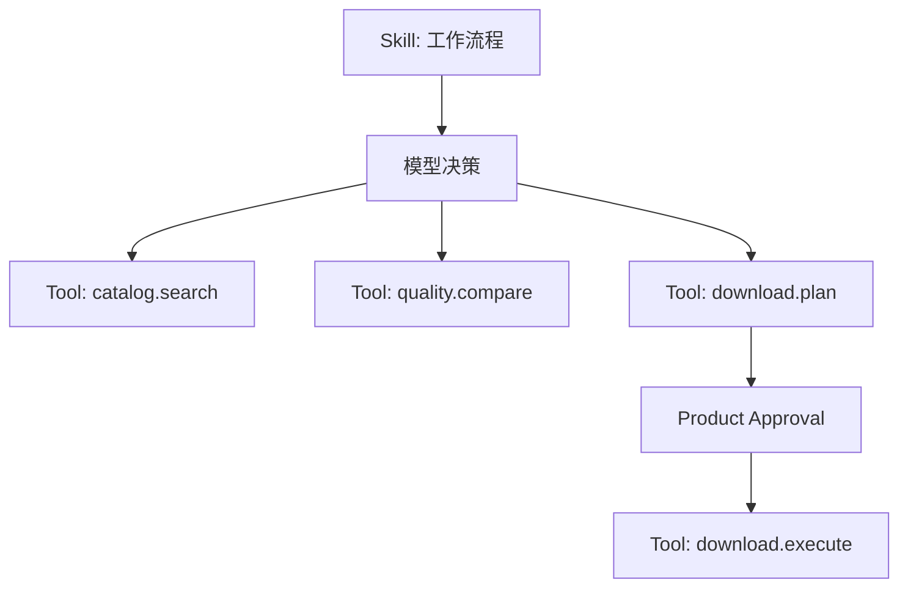

## 13. Tool Catalog 的权威位置

产品 Tool Catalog 可能包含：

```text
name
description
JSON Schema
profile
risk
required permissions
approval policy
execution route
version/revision
```

它应在 Product Gateway 或受控 Adapter 中，而不是完全交给模型，因为：

- 模型不能授予权限；
- Catalog 需要租户过滤；
- Schema 与执行版本必须一致；
- 风险策略是产品规则；
- Tool 移除/更新需要审计。

Runtime 只注册当前授权并披露的 Schema。

## 14. Tool Search/Load 的稳定前缀

```text
固定 Tool：tool_search、tool_load
稳定 Route Catalog：只有 name + bounded does
完整 Schema：Host 内保存，不常驻模型
```

`tool_load` 流程：

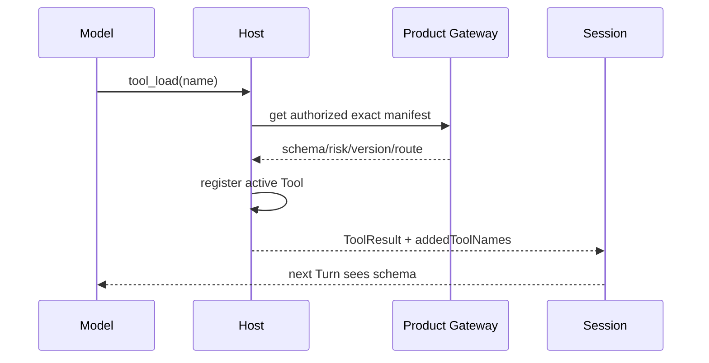

## 15. Context File、System Prompt 与 Product Memory

### Context File

项目稳定规则，例如：

```text
AGENTS.md
CLAUDE.md
PROJECT.md
AGENTS.override.md
```

它们与 cwd/目录层级绑定。

### System Prompt

Runtime 的固定角色、工具规则和当前激活能力说明。

### Product Memory

跨 Session 的用户/项目稳定事实，由产品数据库管理并在请求前注入。

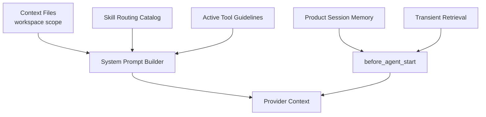

不要把 transient 检索永久 append 到 Session；也不要把产品权威 Memory 写回 Context File。

## 16. Custom Entry 与 Custom Message 的选择

| 需求 | 选择 |
|---|---|
| 插件内部 Revision | Custom Entry |
| 已披露 Tool Catalog Version | Custom Entry，必要时伴随隐藏 Custom Message |
| “用户已批准 Plan 7”供模型本 Turn 使用 | Custom Message + 产品 DB 权威记录 |
| UI-only 状态 | Display Entry / Product Event |
| 长期 Memory | 产品数据库，不只靠 Session Entry |

Custom Message 进入模型 Context，因此内容必须短、确定、可解释。

## 17. Reload 的正确语义

资源 Reload 可能改变：

- Extension Handler；
- Tool Registry；
- Skill/Prompt/Theme；
- Context File；
- System Prompt；
- Provider；
- Project Trust。

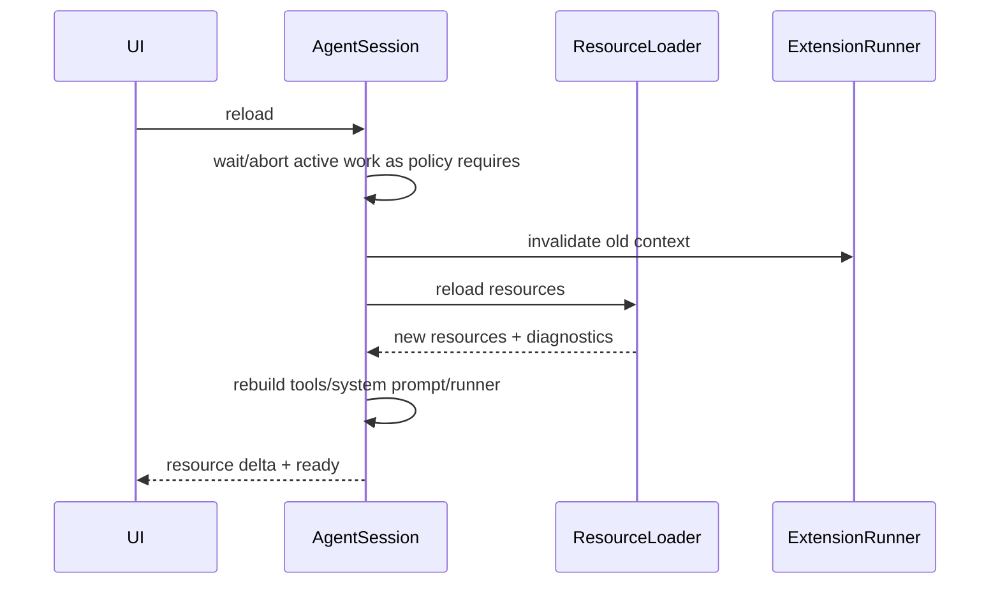

不要每次 Reload 无条件新建 Session；但旧 Extension Context 必须失效。

## 18. Resource Revision 与 Diff

产品 Adapter 可以为 Skill/Tool Catalog 计算规范化 Revision：

```text
canonicalize
→ stable sort
→ hash
```

变化分类：

| 变化 | 是否改变模型 Tool Schema |
|---|---:|
| 只改风险/权限/描述 | 不一定，记录 Catalog Change |
| 新增未激活 Tool | 否 |
| 删除未激活 Tool | 否 |
| 修改已激活 Tool Schema | 是，新的 Cache Generation |
| 删除已激活 Tool | 是，移除并记录 |
| Skill Routing Card 改变 | 更新短目录 Revision |

这样避免每次 `tools.sync` 都重建 Prompt Prefix。

## 19. 产品层必须保留什么

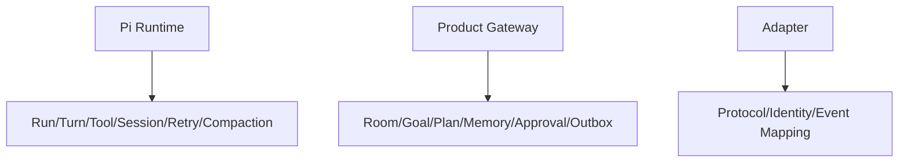

### Pi

- Agent Loop；
- Tool 生命周期；
- Session；
- Model/Provider；
- Retry/Compaction；
- Extension Hook。

### Product Gateway

- 用户与租户；
- Room/WorkItem；
- Goal/Budget；
- Memory/Knowledge；
- Approval/Permission；
- Tool Catalog；
- Lifecycle Outbox；
- 产物和最终交付。

### Adapter

- 将产品身份映射到 Pi Session/Turn；
- 加载授权 Tool；
- 注入产品 Context；
- 将 Pi Event 投影为产品事件；
- 处理版本兼容。

## 20. 常见错误设计

### 所有权限都写进 Prompt

模型可能忽略，且外部调用可绕过。

### Extension 直接保存 Room 状态

Session Reload/Extension 升级会导致产品工作流丢失或重复。

### Skill 自己安装 Plugin

知识文档不应拥有供应链写权限。

### Tool 内部读取 UI 当前状态

UI 是投影，不是权威。Tool 应读取 Product Gateway/Tool Context。

### 每轮将全部 Memory/Skill/Tool 加进 System Prompt

Context 膨胀、Cache 失效、规则冲突。

## 21. 一个完整能力如何拆分

以“长期记忆审阅并应用”为例：

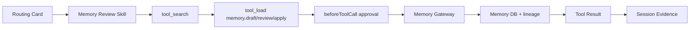

| 部分 | 位置 |
|---|---|
| 何时启动审阅 | Routing Card/Skill |
| 审阅流程 | Skill |
| 查询/生成/应用 | Tool |
| 审批 | Product Gateway + Hook |
| Memory 权威记录 | Product DB |
| 当前对话证据 | Tool Result/Session |
| 失败可靠交付 | Product Outbox |

## 22. 调试 Playbook

### Skill 没被选中

```text
Routing Card 是否存在
when/does 是否过长或模糊
Skill 是否被 noSkills/Trust 过滤
Catalog Revision 是否刷新
skill_search 是否返回
模型是否看到稳定目录
```

### Tool 已 Load 但下一 Turn 不可用

```text
Tool 是否加入 Registry
Active Tool Names 是否更新
Tool Result 是否带 addedToolNames
prepareNextTurn 是否刷新 tools snapshot
Provider 是否支持 message-anchored tool
Session 恢复是否重建 disclosed tools
```

### Reload 后旧行为仍出现

```text
Extension cache 是否清理
旧 Runner 是否 invalidate
Listener 是否 unsubscribe
System Prompt 是否重建
Tool Wrapper 是否仍闭包旧 ctx
```

### 未审批 Tool 被执行

```text
是否只写 Prompt 而没有 beforeToolCall/Gateway policy
Approval Token 是否绑定 Tool/Args Digest/Session
Tool Context 是否读取了 UI projection
Gateway 是否验证过期/租户/幂等
```

## 23. 测试矩阵

- Project untrusted 时不加载项目 Extension；
- Trust 后完整加载；
- Skill Routing Catalog 稳定排序；
- 未路由第三方 Skill 隐藏；
- skill_load 只读取精确路径；
- tool_search 不泄露 Schema；
- tool_load 激活并带 `addedToolNames`；
- 未激活 Catalog 变化不重建 Active Schema；
- 已激活 Schema 变化生成新 Revision；
- Reload 后旧 ctx 报 stale；
- Approval Block/Allow/Expire；
- Product Memory 不进入 Fake UserMessage；
- Transient Context Turn 结束后清空。

## 24. 实验

实现一个 `dataset-preparation` Skill 与四个 Tool：

```text
catalog.search
quality.compare
download.plan
download.execute
```

要求：

1. 初始只披露 Route Catalog；
2. 模型先 `tool_search`；
3. `tool_load` 后下一 Turn 才看到完整 Schema；
4. `download.execute` 需要产品审批；
5. Reload 修改 Skill 文案，不重建未激活 Tool；
6. 修改已激活 Schema，产生明确 Catalog Change；
7. Fork Session 后恢复已披露 Tool；
8. 未审批直接调用必须失败关闭。

## 练习题

1. Extension、Skill、Tool 和 Product Gateway 各自的权威边界是什么？
2. Project Trust 为什么不能替代 Sandbox？
3. `before_provider_headers` 为什么不适合执行 Tool 权限？
4. 所有 Skill 全文常驻会导致哪五类问题？
5. Routing Card 为什么适合放产品 Adapter 而不是修改上游 Skill Parser？
6. Context File、System Prompt、Product Memory 分别存什么？
7. Resource Reload 后为什么旧 Extension Context 必须失效？
8. 已激活和未激活 Tool 的 Catalog 变化为什么要区别处理？
9. 将“记忆审阅”能力拆成 Skill、Tool、Approval、DB、Session 五层。
10. 设计一套测试证明权限无法被 Prompt 绕过。
