# 深挖 08：Runtime Host 协议、并发控制、Session Pool 与可靠交付

## 为什么要有 Runtime Host

Pi CLI 面向单个终端用户。Web Agent 产品通常需要：

- 一个进程承载多个 Session；
- Product Session ID 与 Pi Session ID 映射；
- Prompt 期间仍能 Abort、Snapshot、Steer；
- Tool Catalog 从产品 Gateway 同步；
- Memory/Goal/Approval 由产品提供；
- Runtime 事件通过协议发给 Web Backend；
- 单个模型请求超时不能杀共享 Host；
- Host 重启后 Session 和未发送事件能恢复。

Runtime Host 的正确定位是**产品适配层**，不是第二套 Agent 内核。

## 1. 三层边界

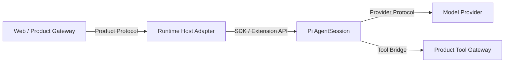

| 层 | 权威状态 |
|---|---|
| Product Gateway | 用户、项目、Room、Memory、Goal、审批、Tool Catalog、产物 |
| Runtime Host | Session Pool、协议关联、Pi 实例、Context Adapter、事件映射 |
| Pi | Run/Turn、Tool Loop、Session、Retry、Compaction、Provider 生命周期 |

Runtime Host 不应复制 `runLoop()`、Session Tree 或 Provider Retry。

## 2. 协议为什么要版本化

最小请求：

```json
{
  "protocolVersion": "2",
  "id": "request-17",
  "method": "session.prompt",
  "params": {
    "sessionId": "product-session-9",
    "turnId": "turn-42",
    "clientMessageId": "msg-88",
    "message": "检查登录问题"
  }
}
```

最小响应：

```json
{
  "protocolVersion": "2",
  "id": "request-17",
  "ok": true,
  "result": {
    "accepted": true
  }
}
```

没有 `protocolVersion`，客户端和 Host 的字段语义变化只能靠运行时猜测。

## 3. 五类身份分别防什么

| 身份 | 作用 | 缺失后的错误 |
|---|---|---|
| Request `id` | 请求/响应匹配 | 两个并发控制请求串线 |
| `sessionId` | 产品会话隔离 | Session A 事件进入 B |
| `turnId` | 一次产品 Run 关联 | Retry/Compaction/新 Turn 混成一轮 |
| `clientMessageId` | 用户输入幂等 | 网络重试产生两次 Prompt |
| `sequence` | Session/Turn 内事件顺序 | 旧 Delta 覆盖新状态 |

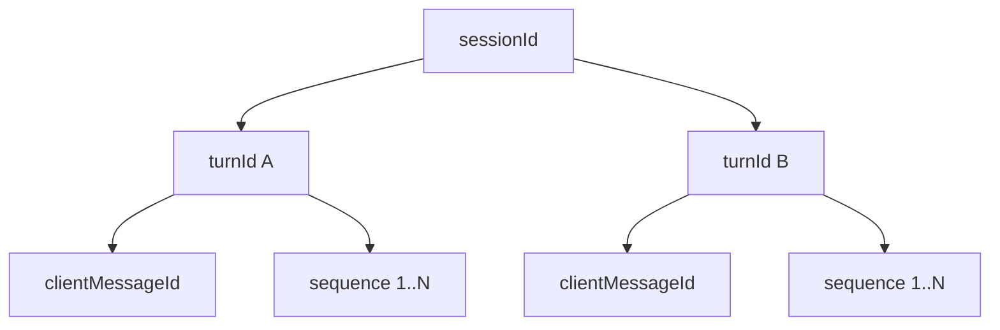

## 4. `hello` 是能力协商，不只是版本字符串

Host 可以返回：

```json
{
  "protocol": "rag-ime.pi-runtime",
  "protocolVersion": "2",
  "hostVersion": "1.0.0",
  "piVersion": "0.84.2",
  "capabilities": {
    "multiSession": true,
    "concurrentControlPlane": true,
    "conversationFork": true,
    "activeTurnMessaging": true,
    "statelessCompletion": true,
    "transientContext": true
  }
}
```

客户端应根据能力启用 UI，不按版本号硬猜功能。

### 当前兼容层

旧 Host 内部仍可能保留旧版本字面量，协议出口通过 `normalizeRuntimeMetadata()` 统一成权威 Pi 基线。这是迁移兼容层，不是理想终态；最终应只保留单一版本来源。

## 5. 为什么 JSONL 不能直接用 Node `readline`

严格协议定义：

```text
只有 LF byte 0x0A 是记录分隔符
CRLF 删除 LF 前的一个 CR
U+2028/U+2029 是 JSON 字符串内容
非法 UTF-8 失败
超大记录失败
EOF 前未遇 LF 的最后记录失败
```

`readline` 可能把 Unicode Line/Paragraph Separator 当换行，错误切断合法 JSON 文本。

## 6. 严格 Framing 的状态机

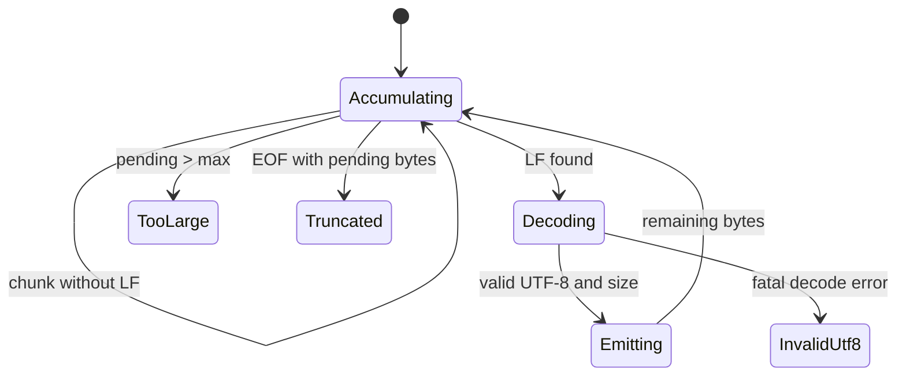

核心源码思路：

```ts
let pending = Buffer.alloc(0);

for await (const chunk of input) {
    pending = Buffer.concat([pending, chunkBytes(chunk)]);

    let newlineIndex = pending.indexOf(0x0a);
    while (newlineIndex >= 0) {
        if (newlineIndex > maximum) throw recordTooLarge();
        yield decodeRecord(pending.subarray(0, newlineIndex));
        pending = pending.subarray(newlineIndex + 1);
        newlineIndex = pending.indexOf(0x0a);
    }

    if (pending.length > maximum) throw recordTooLarge();
}

if (pending.length > 0) throw truncatedRecord();
```

协议解析失败必须隔离在该连接/记录，不能把半条请求交给业务 Handler。

## 7. Dispatcher 为什么不能串行等待 Prompt

错误实现：

```ts
for await (const line of records) {
    const request = parse(line);
    const result = await host.handle(request);
    write(result);
}
```

一个 `session.prompt` 等模型 60 秒时，后面的：

```text
session.abort
session.snapshot
session.steer
health
```

全部排队，控制面失去意义。

### 并发 Dispatcher

```ts
dispatch(line: string): void {
    const task = this.execute(line);
    this.inFlight.add(task);
    void task.finally(() => this.inFlight.delete(task));
}

async settle(): Promise<void> {
    while (this.inFlight.size > 0) {
        await Promise.allSettled([...this.inFlight]);
    }
}
```

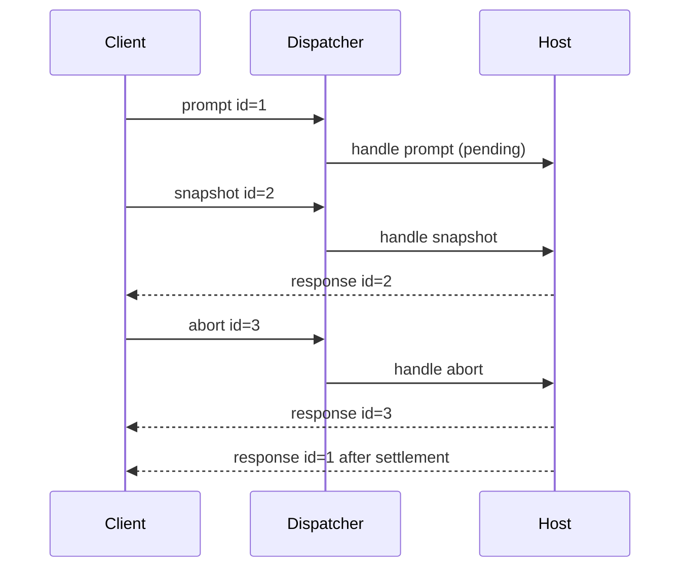

## 8. Dispatcher 并发不等于 Session 内允许并发 Run

协议请求可以并发，但 Session 内仍有状态约束：

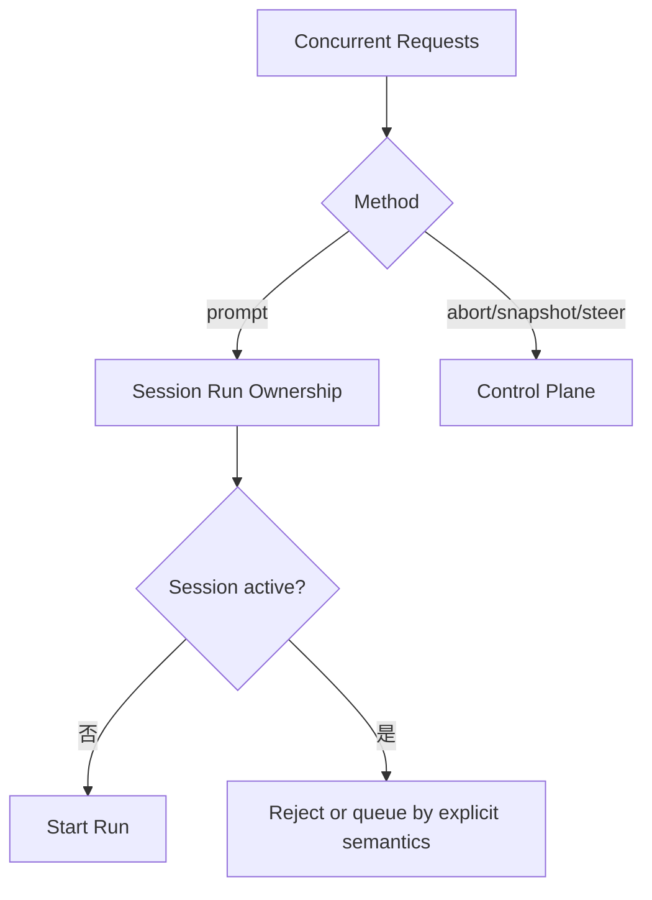

- 不同 Session 的 Prompt 可以并行；
- 同一 Session 同时只能有一个普通 Prompt；
- Active Session 的 Steer/Follow-up 走队列；
- Abort 只取消该 Session/Run；
- Snapshot 可读取权威状态，但要避免半初始化对象。

## 9. Session Pool 为什么需要 Admission Serialization

两个并发 `session.open(S42)`：

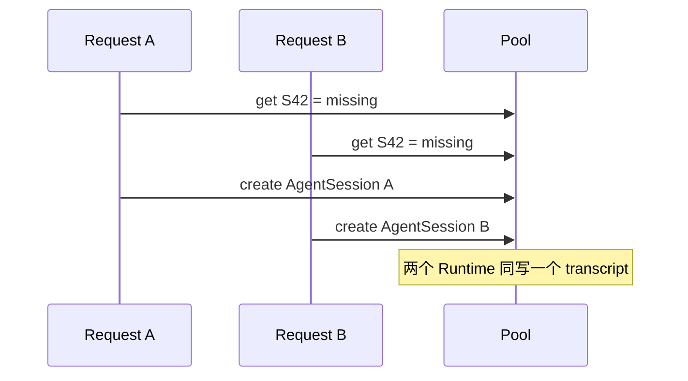

正确做法按 Session ID 串行创建，或全局短临界区：

```text
check existing
→ register creation promise
→ await one factory
→ publish one session
→ all waiters receive same instance
```

Session 创建期间不要持有会阻塞模型请求的全局长锁。

## 10. LRU Pool 的语义

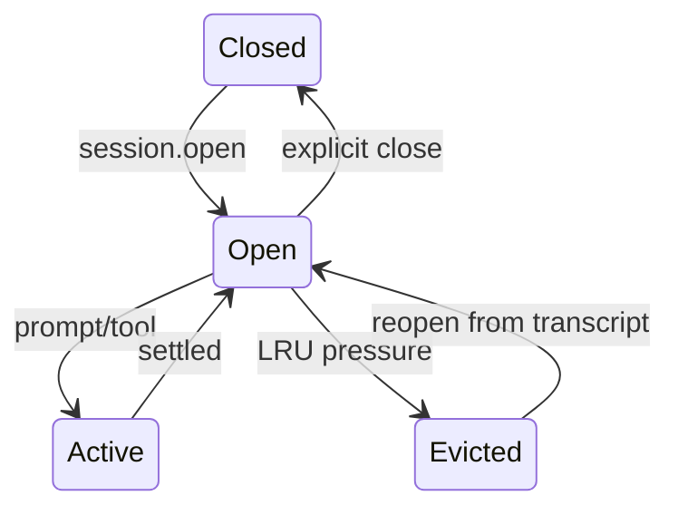

Eviction 应：

- Abort/settle 活跃工作，或只选择 Idle Session；
- `dispose()` 内存 AgentSession/Extension；
- 关闭文件/监听器；
- 保留持久 transcript；
- 保留 Product Session Binding；
- 再次访问通过 SessionManager 恢复。

Eviction 不是 Delete Session。

## 11. 每类请求必须有独立取消域

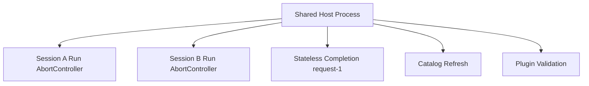

单个 `completion.once` 超时只能取消自己的 Controller：

```ts
const controller = new AbortController();
completions.set(requestId, controller);
try {
    return await modelRuntime.completeSimple(model, context, {
        signal: controller.signal,
        timeoutMs,
    });
} finally {
    completions.delete(requestId);
}
```

禁止：

```text
单请求超时
→ process.exit
→ kill Runtime Host
→ 其他 Session 全部中断
```

## 12. Cancel 的身份必须足够精确

错误接口：

```json
{ "method": "cancel" }
```

不知道取消：

- 哪个 Stateless Completion；
- 哪个 Session Run；
- 哪个 Catalog Refresh；
- 哪个 Plugin Operation。

推荐：

```text
completion.cancel(requestId)
session.abort(sessionId, turnId?)
models.refresh.cancel(operationId)
plugin.validate.cancel(operationId)
```

Host 只能取消自己拥有且身份匹配的 Controller。

## 13. Prompt 接受与最终结算应分离

长请求若只在最终完成返回 HTTP/RPC Response，客户端无法确认：

- 请求是否已被接受；
- 是否重复提交；
- 当前 Turn ID；
- 能否开始监听事件。

推荐：

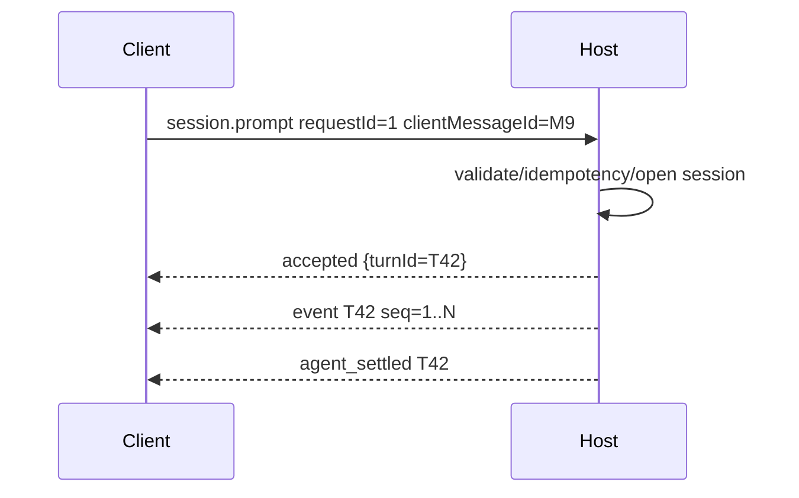

若当前 JSONL 协议仍用一个最终响应，也至少应发独立 accepted Event，并让重试按 `clientMessageId` 返回同一 Turn。

## 14. Client Message Idempotency

网络场景：

```text
Client 发 Prompt
Host 已接受并开始
响应在网络中丢失
Client 重试同一请求
```

没有幂等：同一用户消息执行两次。

产品表：

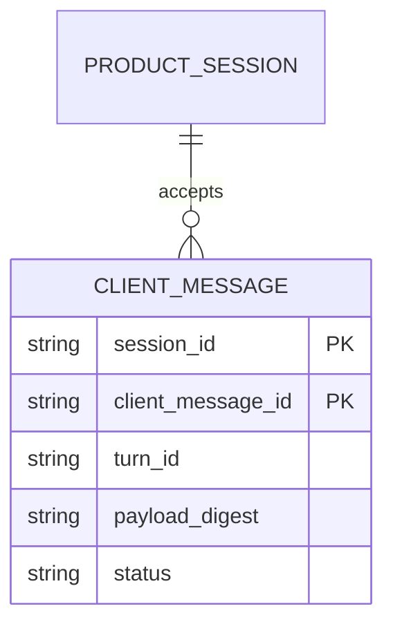

处理：

```text
同 sessionId + clientMessageId 不存在
→ 校验 Payload Digest
→ 创建 Turn

已存在且 Digest 相同
→ 返回原 Turn/状态

已存在但 Digest 不同
→ Reject identity reuse
```

## 15. Sequence 与 Snapshot

事件可能：

- 丢失；
- 重复；
- 重连重放；
- 网络乱序；
- 客户端进程重启。

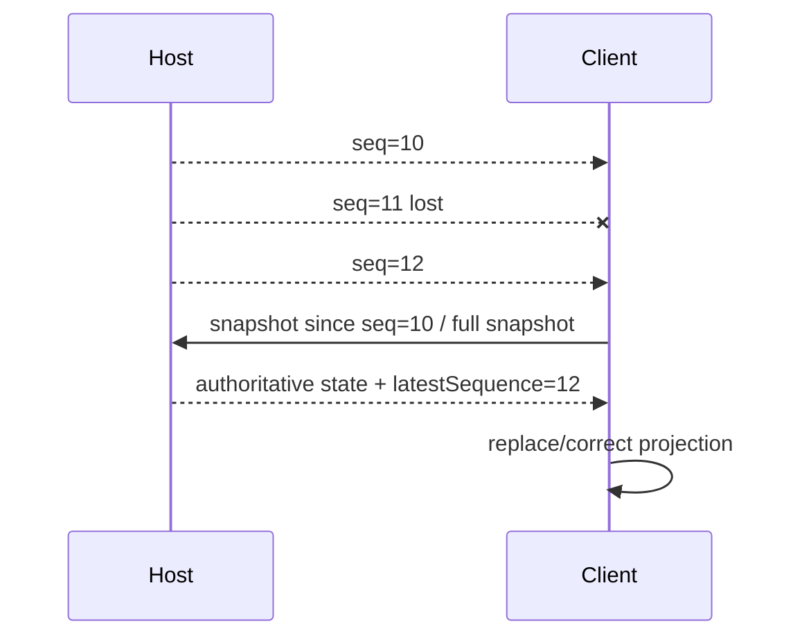

Progress Event 是暂态；Snapshot 是权威校正。不要试图只靠无限事件重放恢复所有 UI。

## 16. Pi Event → Product Event 映射

推荐单一映射器：

```ts
function projectPiEvent(
    binding: SessionBinding,
    turn: ActiveTurn,
    piEvent: AgentSessionEvent,
): ProductEvent[] {
    // attach external sessionId, turnId, sequence
    // convert deltas, tools, retry, compact, settled
}
```

不要让 WebSocket Controller、数据库 Writer 和 UI 各自解释 Pi Event。

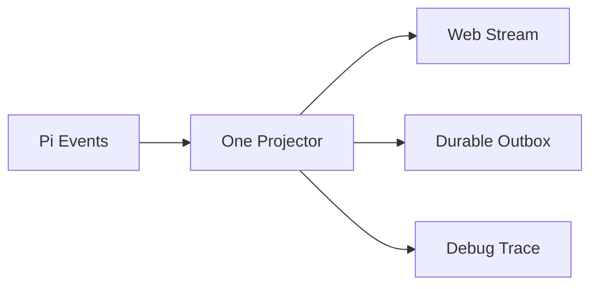

## 17. 哪些事件需要 Durable Outbox

不是每个 token delta 都值得持久化。

| 事件 | 建议 |
|---|---|
| Text Delta | 实时发送，可丢后用 Snapshot 校正 |
| Tool Started/Completed | Completed/Failure 应可靠保存 |
| Approval Requested/Resolved | 必须持久 |
| Compaction Success/Failure | 必须持久 |
| Goal Usage/Settlement | 必须持久且幂等 |
| Agent Settled | 必须持久 |
| Lifecycle Warning | 视产品审计需求 |

## 18. Outbox 模型

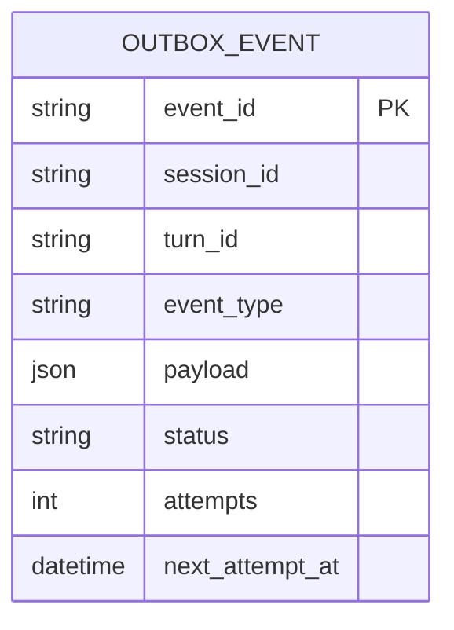

写法：

```text
Runtime Listener
→ 本地原子写 Outbox
→ Listener 返回，允许 settlement
→ Sender 按顺序发送
→ Gateway 幂等接收
→ 标记 delivered
```

不要在 `agent_settled` Listener 里无限等待远程 Gateway；Gateway 不可用会让 Session 永远不 Idle。

## 19. 文件 Outbox 的最低要求

当前产品 Adapter 使用本地待发送文件时，应：

- 目录权限 0700；
- 文件权限 0600；
- 临时文件 + Rename 原子发布；
- 启动扫描恢复；
- 稳定 Event ID；
- 顺序发送；
- Secret/Token 脱敏；
- 最大大小和保留策略；
- 坏文件隔离，不阻塞全部队列。

## 20. Tool Bridge

产品 Tool Catalog 不等于 Pi Tool Instance。Adapter 需要桥接：

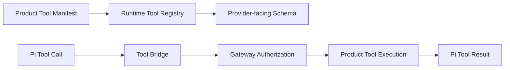

Bridge 必须传递：

```text
externalSessionId
turnId
toolCallId
toolName
manifestRevision
validated args
approval/idempotency context
AbortSignal
```

## 21. Session Context 与 Turn Context

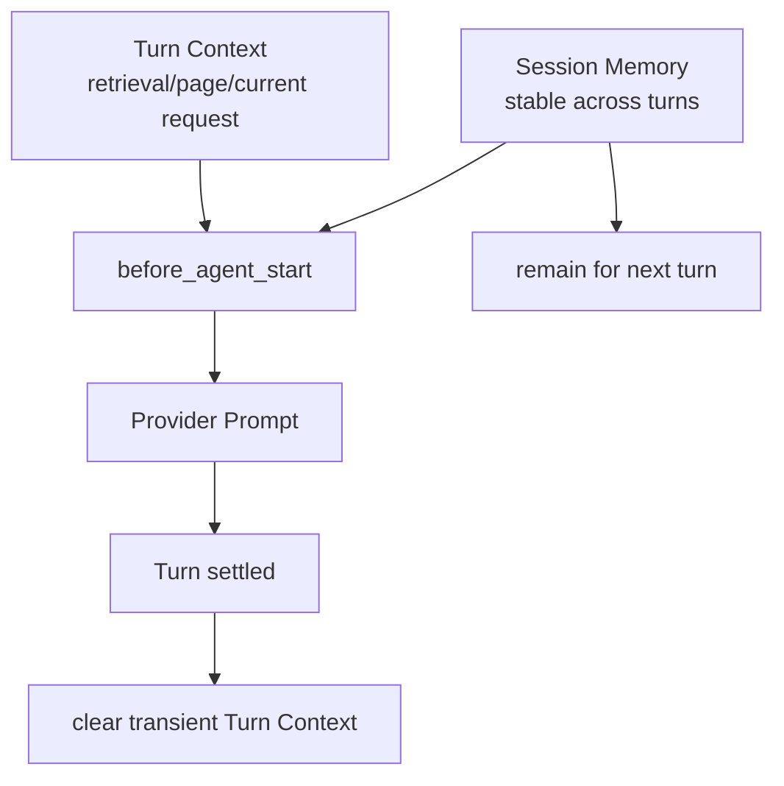

Turn Context 在成功、失败、Abort 或 Preflight 异常后都必须清空，防止上一请求证据泄漏到下一请求。

## 22. Workspace Boundary

`session.open(cwd)` 应：

```text
resolve path
→ realpath
→ 必须是目录
→ 检查是否在 allowed roots
→ 绑定 Session cwd
```

必须防：

- `..` Traversal；
- Symlink 逃逸；
- Session File 指向托管目录外；
- Product Session 切 cwd 后复用旧 Tool；
- 不同租户共享同一工作区绑定。

Prompt 中说“只访问这个目录”不构成安全边界。

## 23. Plugin 管理为何使用 Preview/Apply

插件安装是供应链副作用：

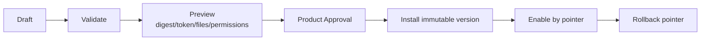

Apply 应验证：

```text
preview token
payload digest
confirmation text
approval token
managed root
no symlink traversal
size/file limits
immutable version
```

Agent 可以生成 Draft 和提案，但不能自行批准并安装。

## 24. Host Shutdown

正确关闭：

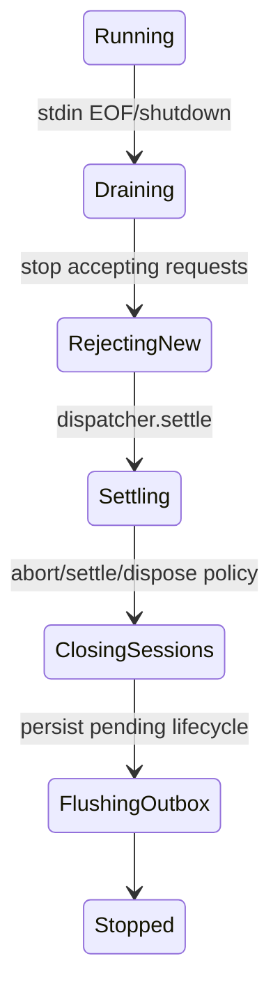

不能收到 EOF 立即退出，否则：

- Prompt Response 丢失；
- Session Message 未持久化；
- Tool Result 未结算；
- Outbox 未写；
- Child Process 留下。

## 25. 常见并发 Bug

### Abort 被 Prompt 阻塞

原因：Dispatcher 串行 Await。

### 同一 Session 创建两份

原因：Open 缺少 Admission Serialization。

### Completion 超时杀死所有 Session

原因：共享 Process/Host AbortController。

### Session A 事件进入 B

原因：事件只带 Request ID，不带稳定 Session/Turn Identity。

### 重连后重复执行 Prompt

原因：没有 `clientMessageId` 幂等表。

### Outbox 让 `agent_settled` 永久卡住

原因：Listener 同步等待远程网络，而非本地 Commit。

## 26. 测试矩阵

### Framing

- Chunk 拆在 UTF-8 多字节中间；
- 一 Chunk 多条记录；
- CRLF；
- U+2028/U+2029；
- Invalid UTF-8；
- Oversized；
- EOF Truncated。

### Dispatcher

- Prompt Pending 时 Snapshot 立即完成；
- Prompt Pending 时 Abort 可达；
- Malformed Request 不影响下一条；
- Response 按 Request ID 匹配；
- Shutdown 等待 In-flight。

### Session Pool

- 并发 Open 同 ID 只创建一次；
- 不同 Session Prompt 并行；
- 同 Session 双 Prompt 拒绝；
- LRU 只 Evict Idle；
- Evict 后恢复 Transcript；
- Close 后 Listener 释放。

### Identity/Recovery

- 同 ClientMessageId 相同 Digest 返回同 Turn；
- 同 ID 不同 Digest 拒绝；
- Late Event 被 Sequence/Turn Guard 拒绝；
- Snapshot 校正丢失 Delta；
- Host Restart 恢复 Session Binding/Outbox。

### Cancellation

- Completion Cancel 不影响 Session；
- Session A Abort 不影响 B；
- Catalog Refresh Cancel 不影响 Run；
- Provider 忽略 Signal，Host 仍停止等待；
- Shutdown 策略明确处理 Active Tool。

## 27. 实验：写一个最小 Host Client

Client 维护：

```ts
type RuntimeClientState = {
    nextRequestId: number;
    pending: Map<string, {
        resolve(value: unknown): void;
        reject(error: Error): void;
    }>;
    sessions: Map<string, SessionProjection>;
};
```

实现：

1. 严格按 LF 写 JSONL；
2. `hello` 协商；
3. Request ID 关联；
4. `session.open`；
5. `session.prompt`；
6. 事件按 Session/Turn/Sequence Reduction；
7. Prompt 中调用 `session.snapshot`；
8. `session.abort`；
9. 进程退出时拒绝全部 Pending；
10. 重连后 Snapshot 恢复。

## 练习题

1. 为什么 Dispatcher 并发与同 Session Run 串行并不冲突？
2. 五种身份分别解决什么问题？
3. `readline` 为什么不适合作为严格 JSONL Protocol Framer？
4. 两个并发 `session.open` 怎样产生双 Runtime？
5. LRU Eviction 与 Session Delete 有什么区别？
6. Stateless Completion 为什么必须有独立 AbortController？
7. Prompt 接受与最终 Settlement 为什么应分离？
8. 哪些事件应该进入 Durable Outbox，哪些只需实时流？
9. 为什么 Outbox Listener 只做本地 Commit，不应等待远程发送？
10. 为 Runtime Host 写一套不少于 25 项的并发与恢复测试。
