# 深挖 09：TUI/Web 的 Delta Reducer、差分渲染、焦点与 Stale Guard

## 为什么 Agent UI 不能按普通聊天界面设计

普通聊天常见流程：

```text
发请求
→ 等完整文本
→ 添加一条回答
```

Agent UI 同一 Turn 中会持续变化：

- Assistant Thinking/Text Delta；
- 多个 Tool 同时开始、更新、结束；
- Steer/Follow-up 队列变化；
- Retry 倒计时与新 Attempt；
- Compaction；
- Approval；
- Abort/Settlement；
- Session Fork/Switch；
- 图片、Markdown、Mermaid、LaTeX；
- 输入法硬件光标。

如果每个事件都创建新卡片或整屏重画，就会出现闪烁、跳动、空卡片和旧消息回魂。

## 1. UI 读取的是事件投影，不是 Runtime 内部对象

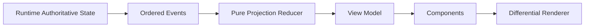

UI 不应该：

- 直接修改 Agent State；
- 根据最后一条文本猜是否 Idle；
- 根据 Tool 卡片数量推断 Pending Tool；
- 将组件局部状态作为 Session 权威状态；
- 在多个组件中分别解释同一 Runtime Event。

## 2. Delta Contract

0.84 的 JSON/RPC `message_update` 只发送 Delta Event，而不是每次发送完整累积 Message。

```text
message_start(initial partial)
message_update(text_delta)
message_update(thinking_delta)
message_update(toolcall_delta)
message_end(authoritative final message)
```

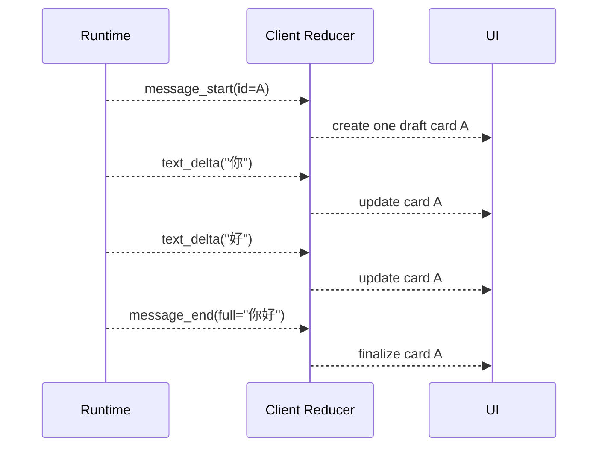

### 为什么改成 Delta

完整累积消息长度为 N 时，总传输量约：

\[
1 + 2 + 3 + \cdots + N = \frac{N(N+1)}{2}
\]

Delta 总量接近：

\[
N
\]

长输出从二次增长变成线性增长。

## 3. Assistant Draft Reducer

概念状态：

```ts
type AssistantDraft = {
    messageId: string;
    content: Array<
        | { type: "text"; text: string }
        | { type: "thinking"; thinking: string }
        | { type: "toolCall"; id: string; name: string; argumentsText: string }
    >;
    stopReason?: string;
};
```

Reducer：

```ts
function reduceAssistantEvent(
    draft: AssistantDraft | undefined,
    event: AssistantMessageEvent,
): AssistantDraft {
    switch (event.type) {
        case "start":
            return fromPartial(event.partial);
        case "text_start":
            return appendTextBlock(draft);
        case "text_delta":
            return appendText(draft, event.delta);
        case "thinking_delta":
            return appendThinking(draft, event.delta);
        case "toolcall_delta":
            return appendToolArguments(draft, event.delta);
        case "done":
        case "error":
            return draft ?? emptyDraft();
    }
}
```

`message_end` 用权威完整 Message 校正 Draft，避免某个 Delta 丢失造成永久差异。

## 4. 为什么 `message_update` 不能 Append 新消息

错误 Reducer：

```ts
case "message_update":
    return { ...state, messages: [...state.messages, event.message] };
```

结果：每个 Token 一个消息卡片。

正确结构：

```text
committedMessages
+ at most one active AssistantDraft per active stream
```

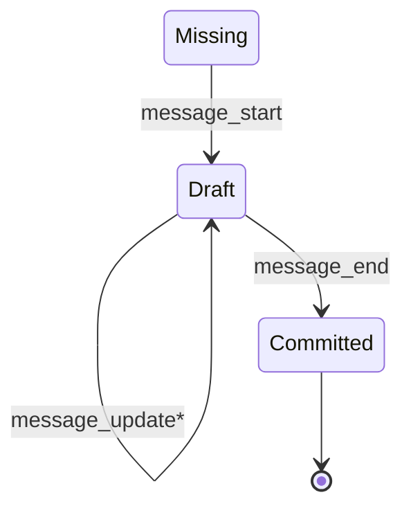

## 5. Tool View Model

Tool 使用 `toolCallId` 作为稳定 Key：

```ts
type ToolView = {
    toolCallId: string;
    name: string;
    args: unknown;
    status: "queued" | "running" | "completed" | "failed" | "cancelled";
    progress?: ToolProgress;
    result?: ToolResultView;
    startedAt?: number;
    endedAt?: number;
};
```

事件归约：

```text
tool_execution_start  → running
tool_execution_update → 更新同一 ToolView.progress
tool_execution_end    → completed/failed
ToolResult message     → 追加模型可见结果摘要/产物
```

不要按 Tool Name 当 Key；同一 Turn 可以调用两次 `read`。

## 6. Tool 完成顺序与展示顺序

两种有效展示：

### 按模型调用顺序固定排列

适合审计和对照 transcript。

### 按开始顺序排列，状态实时更新

适合用户理解并行进度。

无论哪种，都应使用 `toolCallId` 更新原位置，不能 Tool B 先结束就创建第二份 B 卡片。

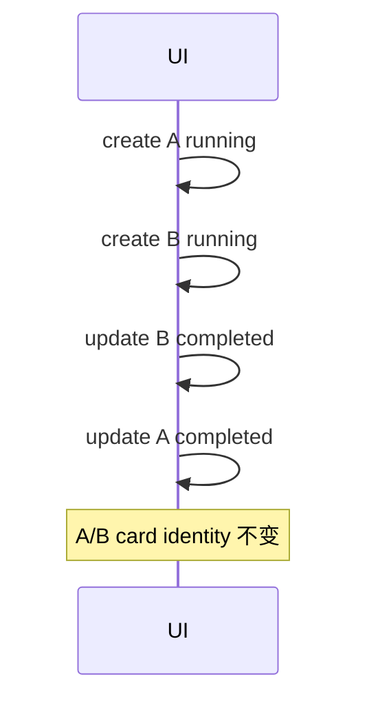

## 7. Turn View Model

```ts
type TurnProjection = {
    sessionId: string;
    turnId: string;
    clientMessageId: string;
    status:
        | "accepted"
        | "running"
        | "retrying"
        | "compacting"
        | "settling"
        | "settled"
        | "failed"
        | "cancelled";
    messages: MessageView[];
    assistantDraft?: AssistantDraft;
    tools: Record<string, ToolView>;
    queue: {
        steering: string[];
        followUp: string[];
    };
    retry?: RetryView;
    compaction?: CompactionView;
    lastSequence: number;
};
```

一个 Turn 卡片可以有多个 Agent Attempt，但产品 Turn ID 保持稳定：

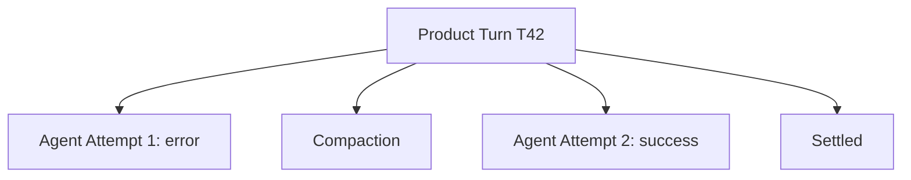

不要把每次 Retry 当成用户发了新消息。

## 8. Identity 与 Sequence Guard

Reducer 第一层：

```ts
function canApply(event: ProductEvent, state: SessionProjection): boolean {
    if (event.sessionId !== state.sessionId) return false;

    const turn = state.turns[event.turnId];
    if (turn && event.sequence <= turn.lastSequence) return false;

    return true;
}
```

还要处理 Sequence Gap：

```ts
if (event.sequence > lastSequence + 1) {
    return markNeedsSnapshot(state);
}
```

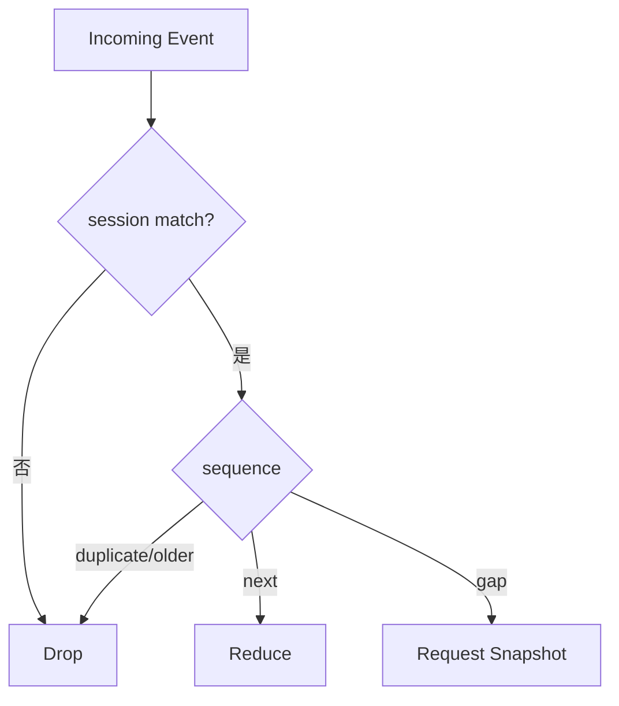

## 9. Session Switch 与 Late Event

用户从 Session A 切换 B：

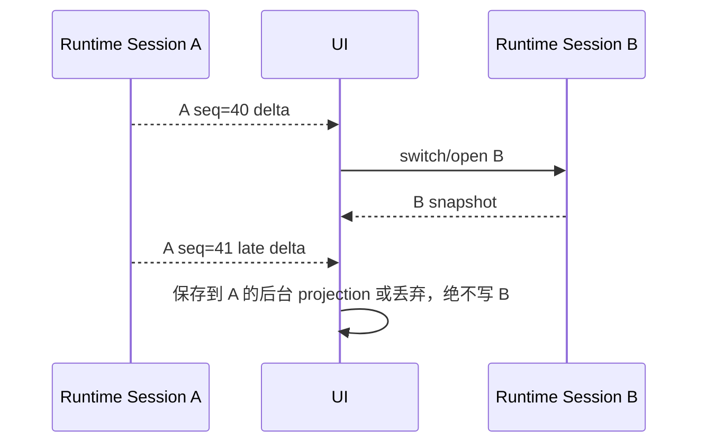

正确产品可以同时维护多个 Session Projection；当前视图只选择其中一个。不要用一个全局 `messages[]` 在切换时清空重用。

## 10. Snapshot 是权威校正

事件用于增量体验，Snapshot 用于恢复：

```ts
type SessionSnapshot = {
    sessionId: string;
    latestSequence: number;
    activeTurn?: TurnProjectionSnapshot;
    messages: MessageView[];
    queues: QueueSnapshot;
    model: ModelView;
    tools: ToolCatalogView;
    status: SessionStatus;
};
```

Reducer收到 Snapshot 应：

```text
校验 Session ID/Revision
→ 用 Snapshot 替换权威字段
→ 清除已被终态覆盖的 Draft
→ latestSequence 前事件视为重复
→ 恢复本地 UI-only 状态（如滚动位置）
```

Snapshot 不应包含完整秘密 Tool 参数和 Credentials。

## 11. Retry 在 UI 中怎么表示

错误 Attempt 不是最终失败：

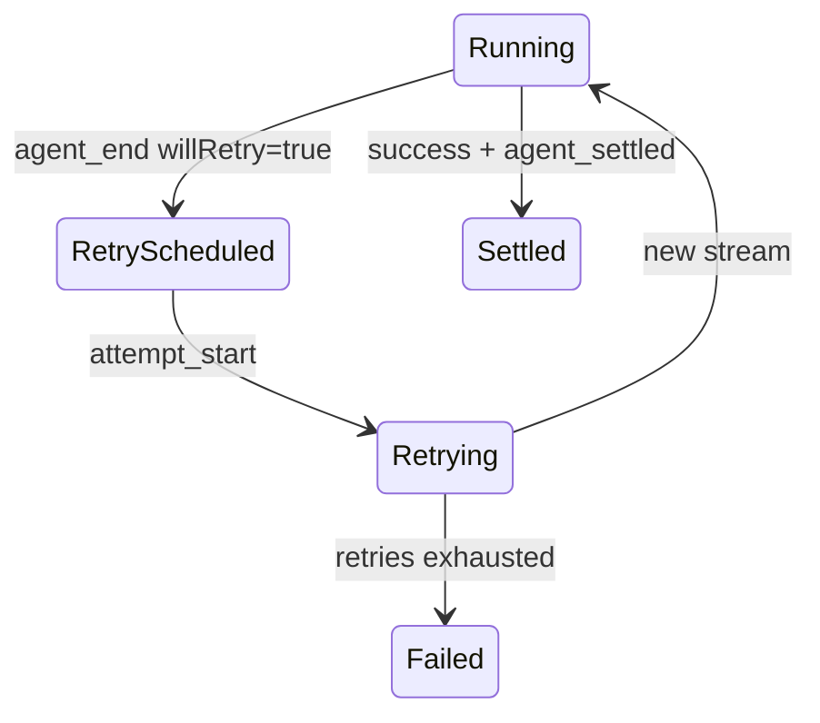

UI 建议：

- 保留错误证据，但标注“将重试”；
- 显示 Attempt 数和可取消等待；
- 新 Attempt 更新同一个 Turn；
- 最终成功后不删除历史错误，可折叠；
- 只有 `agent_settled` 且无后续时关闭 Working。

## 12. Compaction 不应产生空 Assistant Card

Compaction 是维护状态：

```text
Turn.status = compacting
CompactionView = { reason, retryAttempt, progress }
AssistantDraft 保持不存在或保留原最终错误证据
```

错误 UI：收到 `session_before_compact` 就创建 Assistant Bubble “”。

正确 UI：在 Turn/Session 状态区域显示“正在整理上下文”。

## 13. Settlement 与按钮状态

| 状态 | Send 普通 Prompt | Steer | Follow-up | Stop |
|---|---:|---:|---:|---:|
| Idle/Settled | 允许 | 不适用 | 不适用 | 隐藏 |
| Running | 拒绝或转明确 Queue | 允许 | 允许 | 允许 |
| RetryWaiting | 拒绝普通 Prompt | 视产品策略 | 允许排队 | 允许 |
| Compacting | 拒绝普通 Prompt | 应进入保留队列 | 应进入保留队列 | 允许取消压缩/Run |
| Settling | 暂不允许 | 通常不允许 | 可作为下一 Run | 可隐藏/弱化 |

按钮状态来自 Runtime Status，不来自“最后一段文本是否为空”。

## 14. TUI Component 契约

```ts
interface Component {
    render(width: number): string[];
    handleInput?(data: string): void;
    wantsKeyRelease?: boolean;
    invalidate(): void;
}
```

组件根据 View Model 生成行；TUI 管理：

- Terminal；
- Focus；
- Overlay；
- Cursor；
- Input Listener；
- Render Scheduling；
- Differential Output。

## 15. `CURSOR_MARKER` 与中文输入法

编辑器在逻辑光标位置输出零宽标记：

```text
\x1b_pi:c\x07
```

TUI：

```text
查找标记
→ 计算可见列
→ 从输出移除
→ 移动硬件光标
```

终端输入法候选窗根据硬件光标定位。若只画软件光标，中文候选窗可能出现在屏幕错误位置。

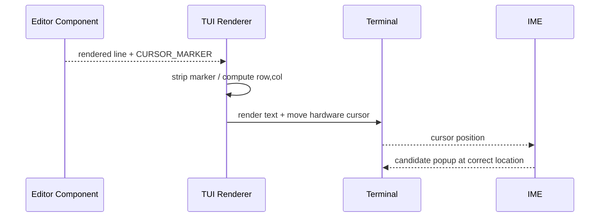

## 16. Render Scheduling

TUI 维护：

```ts
private renderRequested = false;
private lastRenderAt = 0;
private static readonly MIN_RENDER_INTERVAL_MS = 16;
```

普通流式更新：

```text
requestRender
→ 同一 Tick 合并
→ 距上帧不足 16ms 时只等待剩余时间
→ doRender
```

键盘输入：

```text
handleInput
→ requestImmediateRender
→ 抢占已安排的节流 Timer
```

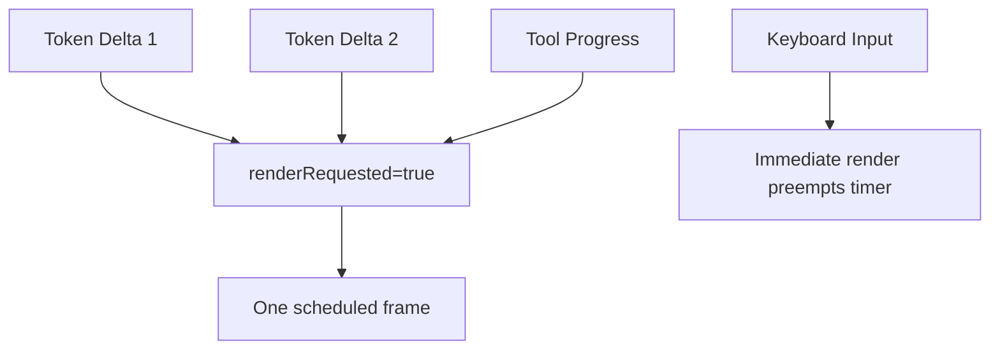

这同时保证流式性能和输入低延迟。

## 17. 差分渲染

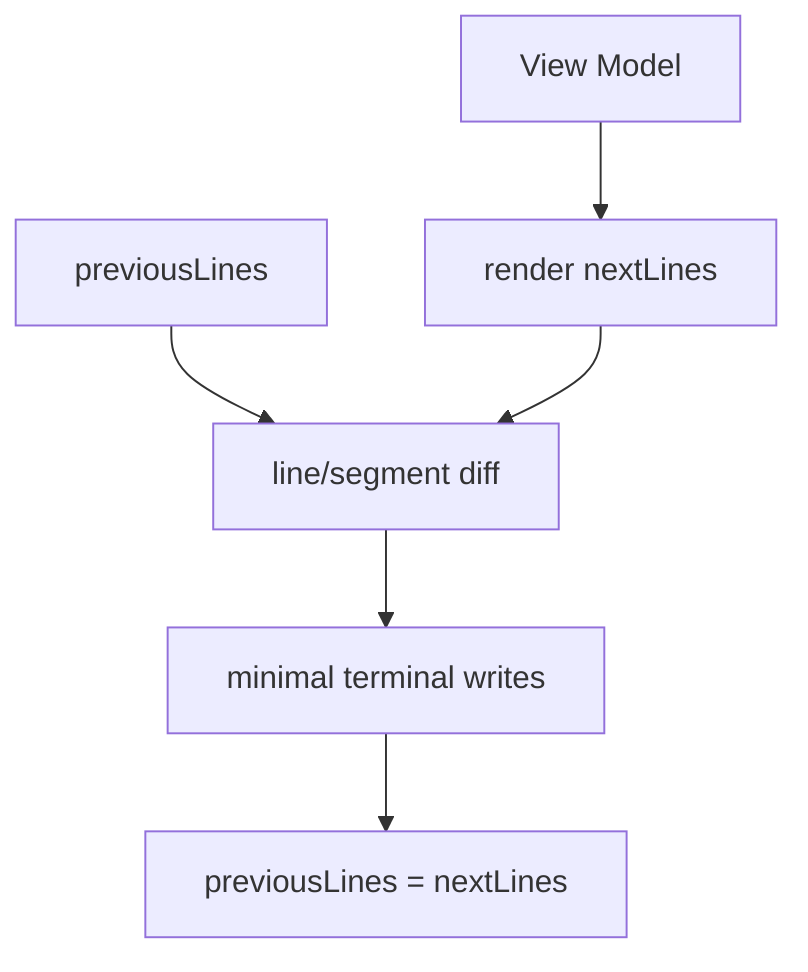

强制全重绘只在：

- Terminal resize；
- Theme/Capability 改变；
- Render State 损坏；
- Alternate Screen 切换；
- 明确 `force=true`。

每个 token 强制全重绘会闪烁，图片还可能重复上传大 Payload。

## 18. Fullscreen Layout

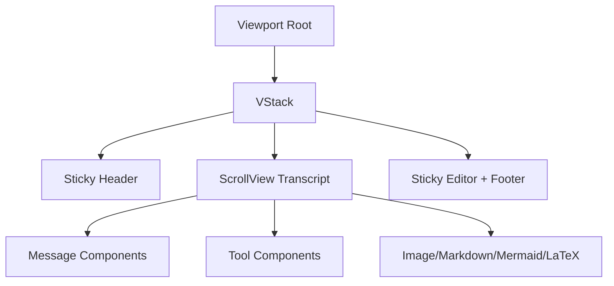

关键状态：

```text
content height
viewport height
scroll offset
auto-follow bottom
manual scroll ownership
sticky region size
selection/search match
```

## 19. Auto-follow 与手动滚动

用户在底部时，流式新内容应自动跟随；用户向上滚动后，新 Delta 不应强制拉回底部。

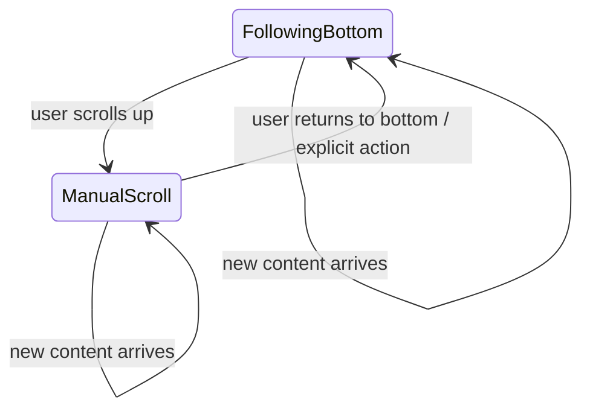

Web 端同样需要 `isNearBottom` 与用户滚动所有权，不能每次 `messages` 改变都 `scrollIntoView()`。

## 20. Overlay 与焦点栈

Overlay 可能是：

- Model Picker；
- Approval Dialog；
- Search；
- Settings；
- Question UI；
- External Auth Code 输入。

每个 Overlay 保存 `preFocus`、可见性和 `focusOrder`：

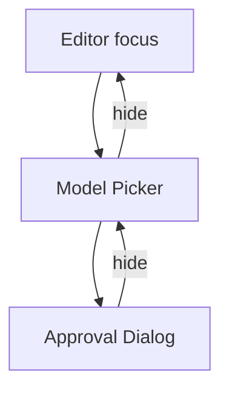

关闭顶部 Overlay 应恢复下一个可见 Overlay 或它的 `preFocus`，不能总回主编辑器。

## 21. Non-capturing Overlay

状态提示、Toast 或不拦截输入的浮层可标记 `nonCapturing`：

```text
显示在前景
但不进入焦点候选
键盘仍交给当前编辑器/Modal
```

若所有 Overlay 都抢焦点，模型流式状态更新会不断打断用户输入。

## 22. 搜索与滚动所有权

Search 需要：

```text
query
matches
active match
scroll target
highlight ranges
```

当用户手动滚动时，不应每帧重新强制定位 active match；只有：

- Query 改变；
- Next/Previous Match；
- Match 不可见且用户主动导航；

才转移滚动所有权。

## 23. CJK、宽字符与 ANSI

终端列宽不等于 JavaScript 字符串长度：

```text
A          → 1 列
中         → 通常 2 列
emoji      → 可能 2 列或 Grapheme Cluster
ANSI color → 0 列
OSC link   → 0 列
```

Overlay 合成、截断和光标定位必须使用 `visibleWidth`/按列切片，而不是 `string.slice()`。

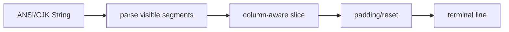

Web 端没有终端列宽问题，但有 Markdown 重排、图片高度和虚拟列表测量问题，本质仍是“视觉尺寸不等于文本长度”。

## 24. 图片与大 Payload

Agent Tool 可能返回图片。TUI 需要：

- 自动缩放；
- Terminal Capability 检测；
- Kitty/iTerm2 等协议；
- Cell Pixel Size；
- 缓存/复用已上传图片；
- Layout 变化时不重复发送可见大 Payload；
- Sticky Dock 不被图片覆盖。

图片 Tool Result 在进入 Provider 前也要按设置归一化，不能 Extension 替换后绕过大小限制。

## 25. Web UI 的对应架构

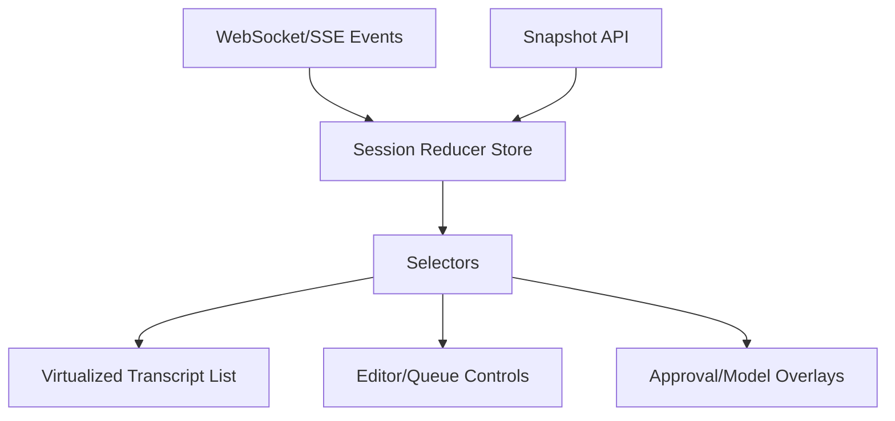

建议：

- Store 按 `sessionId` 分区；
- Turn 按 `turnId` 分区；
- Tool 按 `toolCallId` 分区；
- Delta 只更新 Draft；
- Message End Finalize；
- Snapshot 校正；
- React Component 不直接处理原始 Protocol。

## 26. 卡片身份

推荐 Key：

```text
User Message     → clientMessageId / native entry id
Assistant Draft  → turnId + attempt + message stream id
Tool Card        → toolCallId
Compaction Card  → operation id
Approval Card    → approval id
Lifecycle Notice → event id
```

禁止使用数组索引作为 Key；Fork、Retry 和插入 Tool Result 后索引会变化，造成组件状态错位和闪动。

## 27. 重连流程

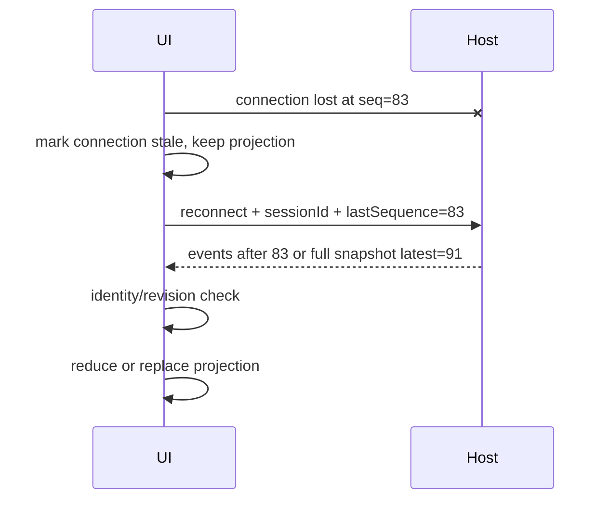

重连期间不要清空整个聊天界面；保留已有 Snapshot，明确显示连接状态。

## 28. 失败投影

Runtime Error 应标准化为：

```ts
type ErrorView = {
    code: string;
    message: string;
    operation: "prompt" | "tool" | "retry" | "compaction" | "auth" | "protocol";
    retryable: boolean;
    action?: "retry" | "login" | "approve" | "inspect" | "reopen";
    evidenceId?: string;
};
```

不要只显示 Stack Trace，也不要只显示“出错了”。

## 29. 常见 UI Bug 的根因表

| 症状 | 常见根因 |
|---|---|
| 页面上下跳 | 每个 Delta 重建列表/强制滚到底部 |
| 文本闪烁 | 强制全重绘、Key 不稳定 |
| 空卡片 | Retry/Compaction Event 错当 Message Start |
| Tool 重复 | `tool_execution_end` Append 而非 Update |
| 一直思考 | 漏 `agent_settled` 或 Reducer拒绝了终态序列 |
| Abort 后回魂 | Session/Turn Stale Guard 缺失 |
| 切 Session 串线 | 全局 messages 数组复用 |
| Overlay 焦点乱跳 | 未保存 preFocus/层级 |
| 中文候选窗错位 | 硬件光标未定位 |
| 长回答越来越卡 | 累积 Message Update O(N²) |
| 图片拖慢渲染 | 每帧重复编码/上传 |

## 30. 测试策略

### Reducer 单元测试

- Start → 多个 Delta → End；
- Delta 重复；
- Sequence Gap；
- Late Session Event；
- 两个 Tool 并行；
- Retry Attempt；
- Compaction Success/Failure；
- Abort → Settled；
- Snapshot 校正 Draft；
- Fork 后两个 Projection 独立。

### TUI Snapshot/Golden Test

- CJK/Emoji；
- ANSI/OSC Link；
- Overlay 在宽字符中间；
- Terminal Resize；
- Sticky Editor；
- Search；
- 图片；
- Hardware Cursor。

### Web Integration

- 1000 Delta 不创建 1000 DOM 节点；
- 用户向上滚动后不被拉回；
- 重连恢复；
- 多 Session 后台流；
- Approval Overlay 不丢编辑器草稿；
- Abort Late Event Guard。

## 31. 实验

实现一个纯 `reduceSessionEvent()`：

1. 输入 JSON Event Log；
2. 输出 Session Projection；
3. 支持 Text/Thinking/ToolCall Delta；
4. 支持 Tool Progress；
5. 支持 Retry/Compaction/Settled；
6. 支持 Session/Turn/Sequence Guard；
7. 支持 Snapshot Replace；
8. 将同一 Event Log 重放两次，结果完全相同；
9. 删除一个中间 Sequence，触发 Snapshot Required；
10. 插入一个旧 Session Late Event，Projection 不变。

随后分别用：

- 简单终端 Component；
- React/任意 Web View；

消费同一个 Projection，证明 UI 与 Runtime Protocol 解耦。

## 练习题

1. `message_update` 为什么只应修改一个 Draft？
2. Message End 为什么仍要携带权威完整消息？
3. Tool Name 为什么不能作为 Tool Card Key？
4. Retry Attempt 与 Product Turn 应怎样建模？
5. Compaction 为什么不应创建 Assistant Bubble？
6. Runtime 已 Abort 后，Stale Guard 仍防什么？
7. 键盘输入为什么要抢占 16ms Render Timer？
8. Auto-follow 与 Manual Scroll 如何避免互相争夺？
9. Overlay 为什么需要 `preFocus` 和 `focusOrder`？
10. CJK/ANSI 为什么不能用字符串长度计算列宽？
11. 为 Web UI 设计 Session/Turn/Tool 分区 Store。
12. 写一套不少于 20 项的 Reducer/TUI/Web 测试矩阵。
