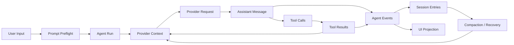
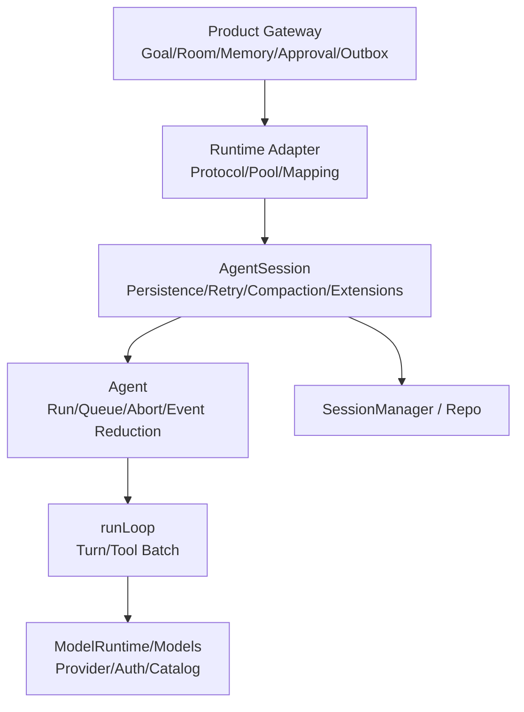

# Pi 机制深挖教材

> 导读课回答“这层为什么存在”；本目录回答“运行时每一步到底发生了什么、状态放在哪里、失败后谁负责收尾”。

## 学习目标

完成全部深挖后，你应当能独立完成以下任务：

- 从 `createAgentSession()` 跟到 Provider 请求和 Tool Result 回流；
- 根据事件序列判断 Runtime 是 Running、Retrying、Compacting、Settling 还是 Idle；
- 为有副作用 Tool 设计参数校验、审批、幂等、取消与恢复；
- 手工读懂 Session JSONL 并还原当前 Branch；
- 解释 Compaction Cut Point、摘要、自动 Retry 与 Overflow Recovery；
- 调试模型目录、Credential Store、OAuth Refresh 和 Prompt Cache；
- 设计 Extension、Skill、Tool 和产品 Gateway 的边界；
- 编写一个并发安全的 Runtime Host Client；
- 将 Runtime delta 稳定投影到 TUI/Web UI。

## 教材目录

| 编号 | 深挖 | 核心产出 |
|---|---|---|
| 01 | [一条 Prompt 的完整调用图](01-runtime-call-graph.md) | 函数级调用链、对象所有权、真实运行值 |
| 02 | [事件、状态归约与 settlement](02-event-lifecycle-settlement.md) | 事件时序、状态机、重试/压缩后的最终结束 |
| 03 | [Tool 执行、副作用与恢复](03-tool-execution-side-effects.md) | Tool Pipeline、并行顺序、审批、幂等、Crash Point |
| 04 | [Session JSONL、树与恢复](04-session-tree-jsonl.md) | Entry 数据模型、Branch 投影、Fork/迁移/修复 |
| 05 | [Compaction、Retry 与长任务](05-compaction-retry-recovery.md) | Token 预算、切点、摘要、Overflow、队列保留 |
| 06 | [ModelRuntime、Provider、Auth 与 Cache](06-model-provider-auth-cache.md) | Provider 组合、凭证锁、目录刷新、缓存前缀 |
| 07 | [Extension、Skill、Tool 与产品边界](07-extension-skill-tool-boundaries.md) | 扩展机制选择、渐进披露、权限边界 |
| 08 | [Runtime Host 协议与并发](08-runtime-host-protocol-concurrency.md) | Framing、请求身份、Session Pool、Cancel Domain、Outbox |
| 09 | [TUI/Web 的增量投影](09-tui-event-rendering.md) | Delta Reducer、差分渲染、焦点、stale guard |

## 阅读方式

每章按同一套问题推进：

```text
真实场景
→ 没有该机制会怎样坏
→ 对象与所有权
→ 调用时序
→ 核心源码带读
→ 运行时真实值
→ 状态变化表
→ 失败/取消/并发
→ 调试入口
→ 可运行实验
→ 练习题
```

## 一张贯穿全书的数据流图



## 一张贯穿全书的所有权图



判断 Bug 时，先问“谁拥有权威状态”，再问“哪个事件更新它”。不要从 UI 表象倒推 Runtime。
