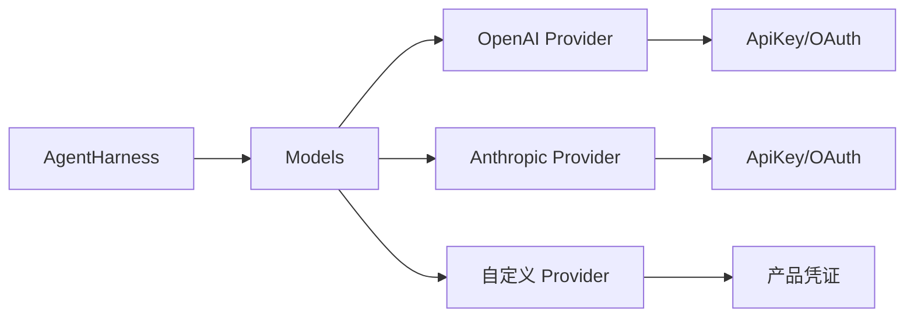
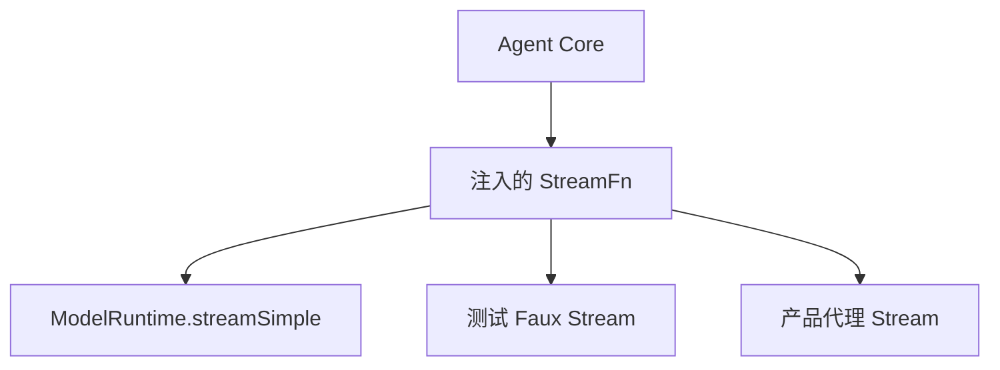
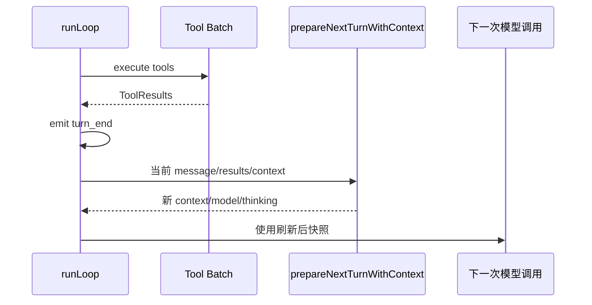
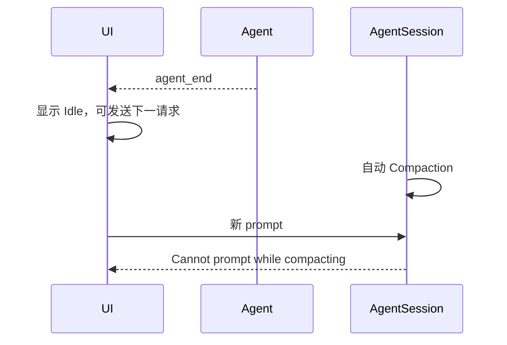
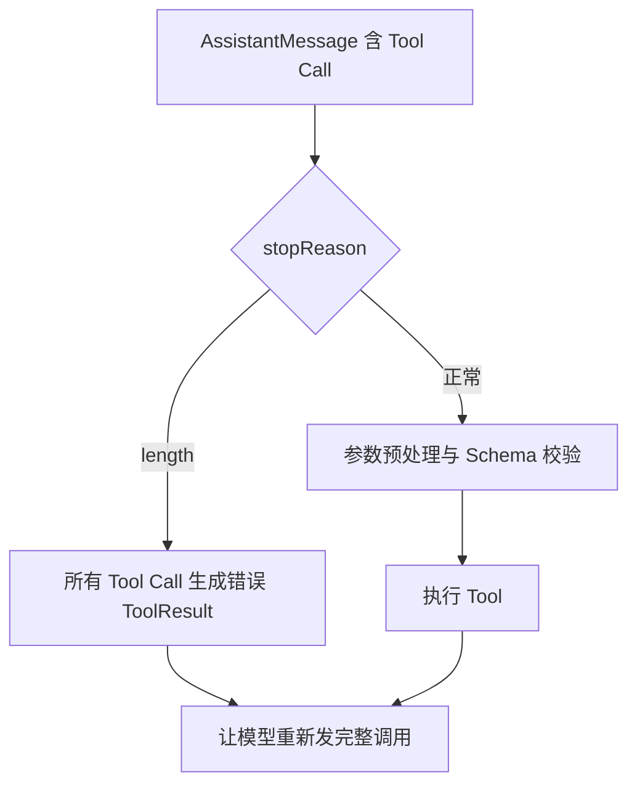
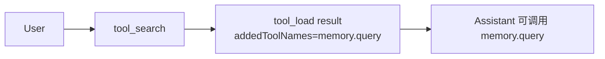

# Pi 0.80：把 Runtime 契约、下一 Turn 和最终结算说清楚

## 本章结论

0.80 不是“换了几个 Provider”。它完成了三项基础收敛：

1. 模型和鉴权从隐式全局能力变成调用者显式提供的 `Models`；
2. Agent Run 的下一 Turn 可以刷新 Context、Model 和 Tool；
3. `agent_end` 与会话真正空闲之间增加清晰的 `agent_settled` 边界。

0.80 后半段又补上 `addedToolNames`，让动态工具具有 transcript 时间位置。

## 1. 0.80.0：为什么 Harness 强制接收 `Models`

### 旧问题

旧调用方式让 Harness 自己获取 API Key 和 Headers：

```text
AgentHarness
├── model
├── getApiKeyAndHeaders()
└── 内部选择 Provider 传输
```

这会产生四个问题：

- OAuth 刷新逻辑和 Runtime 逻辑耦合；
- 自定义 Provider 只能塞 URL/Key，无法完整替换流式行为；
- Compaction 和 Branch Summary 容易走另一条鉴权路径；
- 测试需要伪造全局 Provider 状态。

### 新契约

0.80.0 要求：

```ts
interface AgentHarnessOptions {
    models: Models;
    model: Model<Api>;
    // 不再接 getApiKeyAndHeaders
}
```

Harness 的模型调用、Compaction 和 Branch Summary 都通过同一个 `Models` 集合：



### 设计意义

`Models` 不只是模型数组，而是“模型目录 + Provider 行为 + Auth 解析 + Request Dispatch”的集合。Harness 只表达要调用哪个模型，不再知道凭证来自 `auth.json`、OAuth、环境变量还是产品 Gateway。

### 迁移前后

```ts
// 旧思路：Harness 自己问调用者要 key 和 headers
const harness = createHarness({
    model,
    getApiKeyAndHeaders: async () => ({ apiKey, headers }),
});

// 新思路：调用者构造完整 Models
const models = createModels({ credentials, providers });
const harness = createHarness({ models, model });
```

这为 0.81 的完整 Provider Extension 和 0.84 的可取消 Auth/Refresh 铺路。

## 2. StreamFn 从“默认魔法”走向显式依赖

0.80 将 `StreamFn` 定义为结构化函数：

```ts
type StreamFn = (
    model: Model<any>,
    context: Context,
    options?: SimpleStreamOptions,
) => AssistantMessageEventStream | Promise<AssistantMessageEventStream>;
```

核心价值不是类型漂亮，而是 Agent Core 不必导入全部 Provider：



0.81 一度要求 `streamFn` 必填，随后 0.81.1 为旧 Extension 恢复兼容 fallback。这里能看到上游的真实取舍：

- 内核希望显式依赖；
- 生态又需要迁移窗口；
- 兼容层应放在 SDK/Host，而不是让 Agent Core重新绑定所有 Provider。

## 3. 0.80.3：为什么新增 `prepareNextTurnWithContext`

### 场景

模型完成一个 Tool Batch 后，产品可能需要：

- 加载刚刚披露的新工具；
- 切换模型或 Thinking Level；
- 更新当前 Session Memory；
- 调整 System Prompt；
- 移除已失效的能力。

若下一 Turn 仍使用 Run 开始时的旧快照，这些变化要等下一个用户请求才生效。

### 新入口

```ts
prepareNextTurnWithContext?: (
    context: PrepareNextTurnContext,
    signal?: AbortSignal,
) => AgentLoopTurnUpdate | Promise<AgentLoopTurnUpdate | undefined>;
```

它在 `turn_end` 后、Steer 拉取前执行：



### 当前 0.84 实现中的落点

`AgentSession._installAgentNextTurnRefresh()` 会把当前真实状态重新写入下一 Turn：

```ts
return {
    ...previousSnapshot,
    context: {
        ...previousContext,
        systemPrompt: this._systemPromptOverride ?? this._baseSystemPrompt,
        tools: this.agent.state.tools.slice(),
    },
    model: this.agent.state.model,
    thinkingLevel: this.agent.state.thinkingLevel,
};
```

这就是“Tool 在当前 Turn 加载，下一 Turn 立刻可用”的基础。

## 4. 0.80.4：`agent_settled` 为什么是产品级关键事件

### 只有 `agent_end` 会怎样

Agent Core 发出 `agent_end` 时，Coding Agent 仍可能：

- 判断错误是否需要 Retry；
- 进行 Overflow Compaction；
- 处理 `agent_end` Extension 新排入的消息；
- 写 Session；
- 发送生命周期事件。

前端若在 `agent_end` 立刻显示 Idle，会出现：



### 新边界

0.80.4 增加 Extension/RPC `agent_settled` 和 Session 级 idle wait。

```text
agent_end
→ Retry/Compaction/Queue 后处理
→ Extension agent_settled
→ Session isIdle=true
→ waitForIdle() resolve
```

产品应把“可接受下一次普通 Prompt”的权威边界绑定在 settled，而不是根据文本流结束猜测。

## 5. 0.80.4：Provider Header Hook 与产品接入

`before_provider_headers` 允许 Extension 在真正发送 Provider 请求前注入或修改 Headers。它适合：

- 产品链路追踪 ID；
- 租户路由；
- Gateway 特有 Header；
- Session affinity；
- 不在 transcript 中出现的传输元数据。

但它不适合把权限决策只写在 Header Hook 中。Tool 副作用权限仍需在 `tool_call`/Gateway 执行边界强制。

## 6. 0.80.4：失败关闭与长会话可靠性

这一版的若干修复表面分散，实际上都指向“副作用和恢复不能依赖模糊输入”：

- 被 output length 截断的 Tool Call 全部失败，不尝试执行；
- `null` message content 在入口归一化；
- Split-turn Compaction 串行化，避免单并发 Provider 收到重叠摘要；
- Compaction 预算包含 context-visible custom messages；
- Tool 改变可在同一个 Run 的下一 Provider 请求生效；
- `showCacheMissNotices` 让缓存退化从隐藏成本变成可观察事实。

### 截断 Tool Call 决策图



## 7. 0.80.7：`addedToolNames` 把动态工具锚定在历史位置

### 没有锚点时

产品只能在每轮开头把完整工具集合重新发给模型：

```text
System Prompt + 100 个 Tool Schema + 全部历史 + 新消息
```

这会破坏 Prompt Cache，并让恢复时不知道某个工具从何时开始可见。

### 有锚点后

Tool Result 可携带：

```ts
interface AgentToolResult {
    content: Content[];
    details?: unknown;
    addedToolNames?: string[];
}
```

Loop 将其传播到 `ToolResultMessage`：



它表达的是一条 transcript 事实：**在 E3 之前，模型不知道该工具；从 E3 之后，该工具属于可重放能力集。**

## 8. 0.80 的源码追踪路线

| 机制 | 当前源码 |
|---|---|
| 显式 StreamFn | `packages/agent/src/agent.ts`、`stream-fn.ts` |
| 下一 Turn 刷新 | `packages/agent/src/agent-loop.ts`、`packages/coding-agent/src/core/agent-session.ts` |
| settlement | `Agent.runWithLifecycle()`、`AgentSession._runAgentPrompt()` |
| 动态 Tool 锚点 | `createToolResultMessage()`、Deferred Tool 拆分逻辑 |
| Provider Header Hook | `packages/coding-agent/src/core/sdk.ts`、Extension Runner |

建议实际搜索：

```bash
rg "prepareNextTurnWithContext|agent_settled|addedToolNames|before_provider_headers" packages integrations
```

## 9. 从旧 Fork 迁移到 0.80+ 的检查表

- 删除 Agent Core 中写死的 API Key 获取逻辑；
- 将 Provider/Auth 交给 `Models` 或 `ModelRuntime`；
- 将“请求结束”状态从 `agent_end` 改为 `agent_settled`；
- 动态工具优先使用 `addedToolNames`，不要每轮重建全部 Schema；
- 每 Turn 动态能力更新接入 `prepareNextTurnWithContext`；
- 保留产品权限 Hook，但不复制 Tool Loop。

## 练习题

1. `AgentSession` 为什么可以在 `agent_end` 后再次调用 `agent.continue()`？
2. `prepareNextTurnWithContext` 与每次重新创建 Agent 有什么差别？
3. 设计一个使用 `addedToolNames` 的 Tool Loader，并写出恢复 Session 时需要重建的状态。
4. 为什么被截断的 `edit` 参数即使通过 JSON 解析也不能执行？
5. 画出 `agent_end → retry → continue → agent_end → settled` 的完整状态图。
6. 将一个旧的 `getApiKeyAndHeaders` 设计重构为 Provider/Auth 对象，列出所有权变化。
