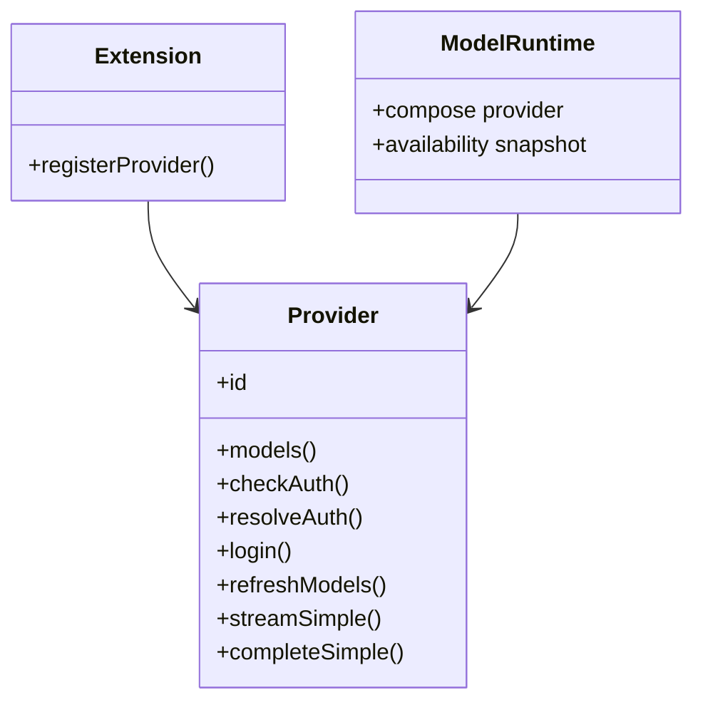
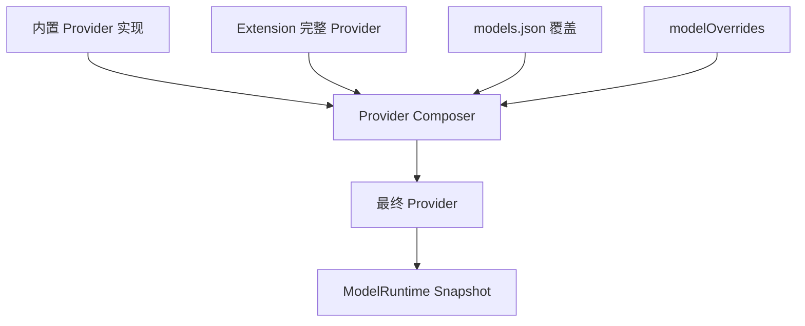
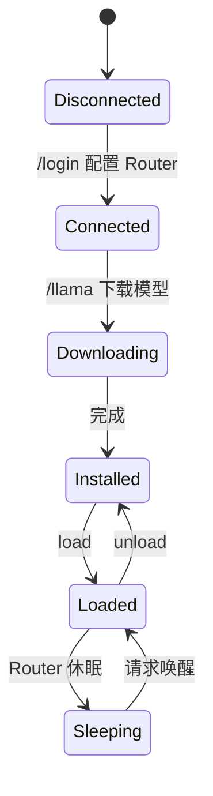
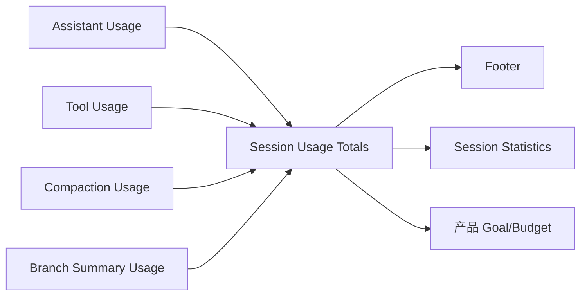
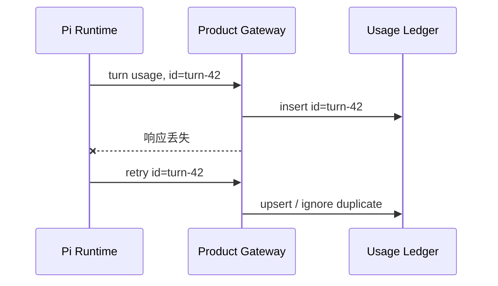
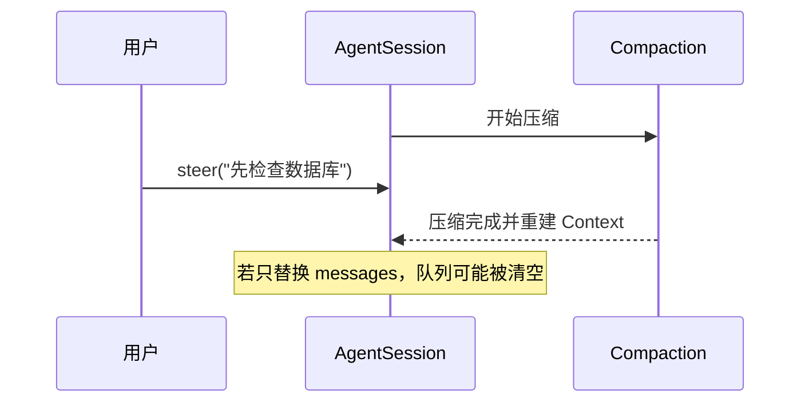
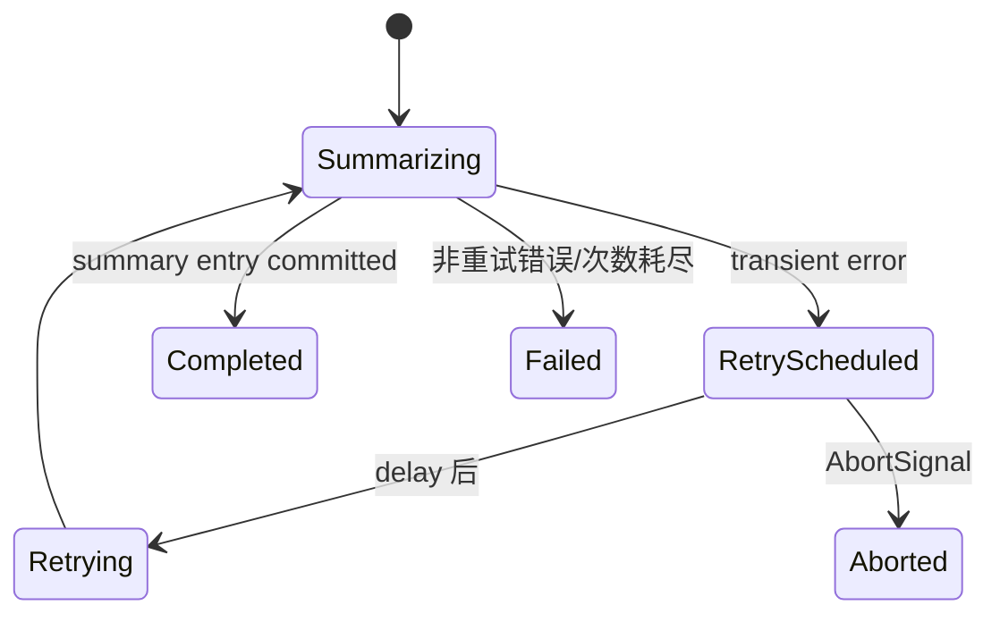
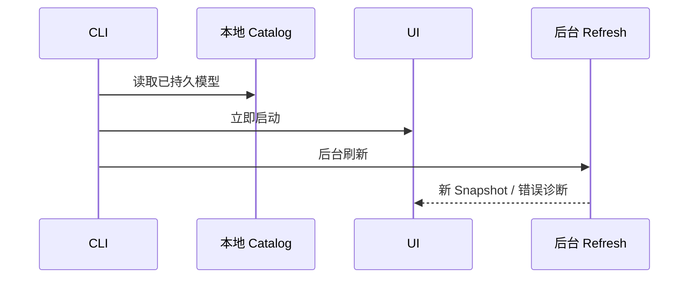

# Pi 0.81：Provider 平台化、完整 Usage 与摘要补偿

## 本章结论

0.81 把 Pi 从“内置 Provider 很多的 Agent”推进为“可以由产品注册完整 Provider 的 Runtime”，同时补齐真实任务成本与长会话摘要的可靠性。

它解决的不是单个功能，而是三条产品化缺口：

```text
自定义模型只能改 URL/Key
→ 可以注册认证、目录刷新、过滤、流式行为完整 Provider

Session 只统计 Assistant Usage
→ Tool、Compaction、Branch Summary 全部进入 Usage 账本

摘要请求失败就中断
→ 使用统一 Retry Policy 并发出可观察生命周期事件
```

## 1. 完整 Provider Extension 为什么重要

### 0.80 以前常见的“自定义 Provider”

很多产品只允许：

```json
{
  "baseUrl": "https://gateway.example/v1",
  "apiKey": "$TOKEN",
  "models": [{ "id": "my-model" }]
}
```

这只适合 OpenAI-compatible 的最简单代理。真实 Provider 还可能需要：

- OAuth 登录和刷新；
- 动态模型目录；
- 按账户过滤模型；
- 自定义 Streaming 协议；
- Provider 特有 Thinking 参数；
- 凭证带出的 Base URL/Headers/Env；
- 使用量和 Stop Reason 转换。

### 0.81 的 Provider 组成



Extension 现在可以注册完整 pi-ai Provider，包括原生认证、模型刷新、过滤和流式行为。产品不必为了一个企业 Gateway Fork `pi-ai`。

## 2. Provider、模型配置和产品覆盖如何叠加



关键规则：

- 完整 Provider 定义能力和传输；
- 本地配置定义部署地址、模型覆盖等；
- `ModelRuntime` 对外发布最终可用快照；
- 组合错误必须可诊断，不能静默生成半有效模型。

## 3. llama.cpp Router 为什么是架构验证，不只是本地模型功能

0.81 增加内置 llama.cpp Router：登录连接、Hugging Face 搜索/下载、显式加载/卸载和进度。

它验证了 Provider 平台必须支持的不只是“发 HTTP 请求”：



模型目录可以随本地进程状态变化，因此启动时网络刷新不能堵住整个 TUI；缓存目录和实时可用性也必须分开。

## 4. Usage 为什么不能只统计 AssistantMessage

一次 Coding Agent 任务可能包含：

```text
主模型调用       40k input + 3k output
Tool 内部模型     8k input + 1k output
自动 Compaction  50k input + 2k output
Branch Summary   20k input + 1k output
```

若只看最后一个 AssistantMessage，产品会把 125k+ Token 的任务记成 43k。

### 0.81 扩展后的账本



Usage 被持久化到对应 Entry/Result，而不是只存在内存统计器：

| 来源 | 持久化位置 | 为什么要持久化 |
|---|---|---|
| Assistant | Message Entry | 恢复后仍能计算 Session 总量 |
| Tool | Tool Result | Tool 内部模型消耗属于该副作用证据 |
| Compaction | Compaction Entry | 压缩不是免费维护动作 |
| Branch Summary | Branch Summary Entry | 分支导航也会产生模型成本 |

## 5. 对产品额度的直接影响

产品不应该用：

```ts
const delta = lastAssistantMessage.usage.totalTokens;
```

更可靠的思路：

```text
Run 开始时读取 Session Usage Ledger 快照 A
Run settled 后读取快照 B
本次消耗 = B - A
```

或者消费 Pi 发出的每类 Usage Entry，使用稳定幂等键写入产品账本。

### 为什么要有幂等键

Lifecycle/Event Delivery 可能重试：



否则可靠交付反而会重复扣费。

## 6. 0.81 修复：Compaction 中排队的消息不能丢

### 竞态



0.81 修复了压缩期间消息保持 Steering/Follow-up 语义。这里的设计原则是：

> Compaction 可以替换活动上下文投影，但不能吞掉在它运行期间新发生的用户意图。

队列属于运行控制状态，不属于待压缩历史文本。

## 7. 0.81 修复：大 Session 不应重复解析

持久 Session 打开时若同时由“恢复模型”和“恢复消息”各解析一次 JSONL，文件越大启动越慢。0.81 把一次解析的 Session Context 作为共享结果。

这看起来是性能修复，实质是权威快照：

```text
同一打开操作
→ 一次读取和迁移
→ 同一份 entries/index/leaf
→ 派生 messages、model、thinking
```

若不同消费者各自读取，文件在两次读取之间变化时还可能得到不一致状态。

## 8. 0.81.1：摘要调用也需要 Retry 生命周期

Compaction 和 Branch Summary 是模型请求，同样会遇到：

- 429；
- DNS/连接中断；
- Provider 短暂不可用；
- 服务端 5xx；
- 可取消的 Retry Delay。

0.81.1 让它们遵循配置的 Retry Policy，并对 Interactive、JSON、RPC、SDK 发出生命周期事件。



上层 UI 因此可以区分：

- “正在总结”；
- “第 2 次重试，等待 1.5 秒”；
- “用户已取消”；
- “最终失败”；
- “成功并继续原 Run”。

## 9. 为什么网络目录刷新移出启动关键路径

0.81 将自动模型目录网络刷新从启动初始化移到运行中的 Interactive/RPC 模式。

### 旧路径

```text
启动
→ 等所有远程 Catalog
→ 算 Footer Provider 数
→ 创建 TUI
```

一个慢 Catalog 就让用户误以为 Pi 卡死。

### 新路径



这是“缓存可用性”和“网络新鲜度”分离。0.84 会进一步加 cancellation 与 generation guard。

## 10. 0.81 的源码追踪路线

```bash
rg "registerProvider|usage-totals|summarization_retry|ModelRuntime|buildSessionContext" packages/coding-agent packages/agent packages/ai
```

| 主题 | 当前源码入口 |
|---|---|
| 完整 Provider 注册 | `packages/coding-agent/src/core/provider-composer.ts`、Extension API |
| 可用模型快照 | `model-runtime.ts` |
| Session Usage | `usage-totals.ts`、`agent-session.ts` |
| Compaction Usage | `compaction/compaction.ts`、Session Entry |
| 摘要 Retry | `pi-ai` Retry 工具、Compaction 调用链 |
| Session 一次解析 | `session-manager.ts`、`sdk.ts` |

## 11. 产品迁移清单

- 自定义模型接入优先注册 Provider，不再 Fork Provider Adapter；
- 产品费用/预算改用完整 Usage Ledger；
- 对 Usage Delivery 使用稳定幂等键；
- 模型目录 UI 先显示缓存，再后台刷新；
- Compaction 中用户输入存入独立队列，不参与历史替换；
- 摘要 Retry 状态映射为明确 UI，而不是一直显示“思考中”。

## 练习题

1. 一个 Tool 内部调用模型，但 Tool Result 不记录 Usage，会让哪三类产品功能失真？
2. 为什么模型目录“本地缓存”和“当前可调用”不能是同一个数组？
3. 设计一个 Provider Extension，列出 Auth、Catalog、Stream 三类接口。
4. Compaction 期间到达的 Steer 应保存在什么状态域？为什么？
5. 为 Summarization Retry 设计前端状态，至少区分五种状态。
6. 解释为什么把远程 Catalog 刷新放在启动关键路径会同时造成性能和一致性问题。
