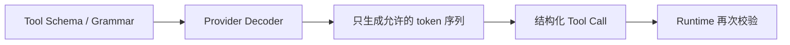
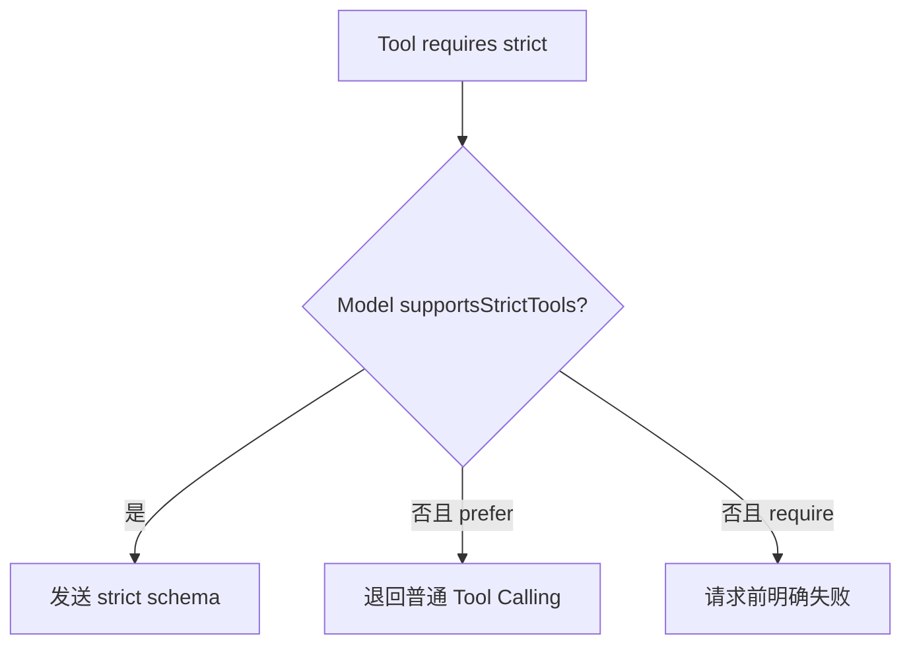
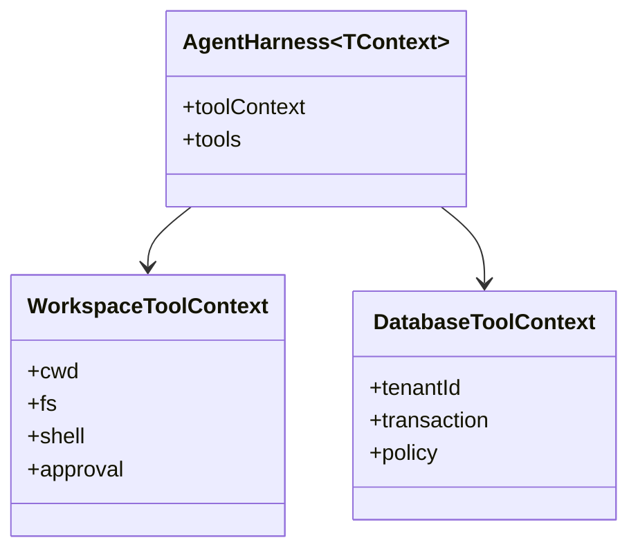
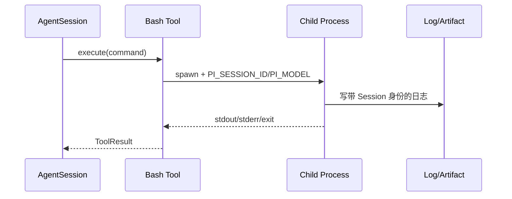
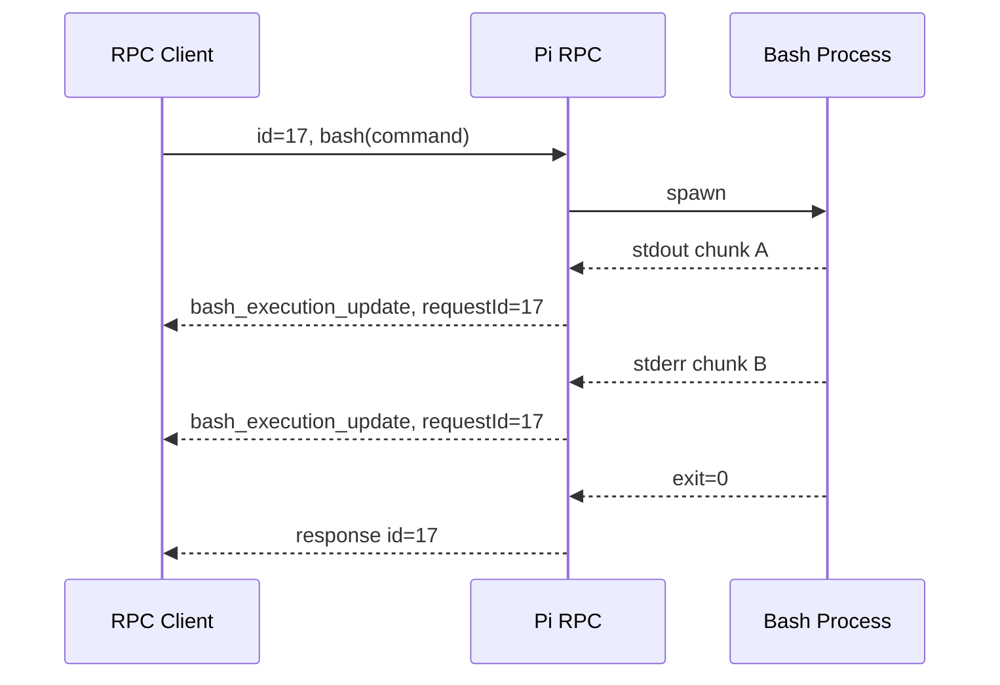
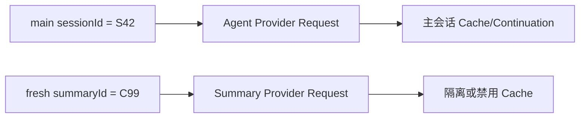
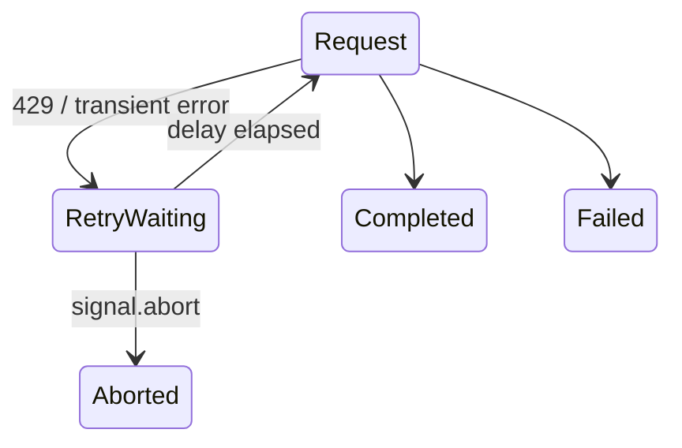

# Pi 0.82：约束工具输入、关联 Bash 与贯穿取消

## 本章结论

0.82 的关键词不是“又支持了两个 OAuth”，而是**把外部副作用前后的契约变得更强**：

- 模型生成 Tool 参数时可以请求严格 JSON Schema 或 Grammar；
- Tool 能得到明确的产品 `toolContext`，不再偷偷依赖通用 ExecutionEnv；
- Bash 执行与 Session、Provider、模型、Thinking 建立关联；
- RPC Bash 输出有请求 ID 与流式事件；
- Provider Retry Delay、模型请求和摘要请求开始响应 AbortSignal；
- Compaction/Branch Summary 使用新的路由 Session ID，避免污染主会话缓存。

## 1. Constrained Sampling 解决的不是普通 JSON 解析

### 只有 Tool Schema 时

常规 Function Calling 仍可能产生：

```json
{
  "path": 42,
  "edits": "replace everything",
  "unexpected": true
}
```

Runtime 会在执行前校验并拒绝，但模型已经浪费一次 Turn，还可能反复修错。

### Constrained Sampling

0.82 增加 `Tool.constrainedSampling`：

```text
strict JSON Schema: prefer / require
OpenAI grammar: Lark / regex
```

Provider 在生成阶段限制输出空间：



注意：约束采样**不能替代 Runtime 校验**。原因包括：

- Provider 可能不支持；
- `prefer` 允许回退；
- 自定义兼容端点可能声称支持但行为不完整；
- 结构合法不代表权限合法；
- 业务约束可能依赖运行时状态。

正确的两道门：

```text
生成阶段约束
+ 执行阶段 Schema/权限/业务校验
```

## 2. 能力元数据为什么必须阻止不支持的请求

0.82 为模型目录增加：

```text
supportsStrictTools
supportsGrammarTools
supportsStrictMode
```

调用者不能因为 Tool 想用 strict，就对任意模型发送同一参数。



这种 fail-before-request 比等待 Provider 400 更容易诊断，也避免对兼容网关发送未知字段。

## 3. Harness `toolContext`：为什么是 Breaking Change

0.82 将 Harness 的通用 `ExecutionEnv` 依赖和 context-free Tool 改为应用定义的 `toolContext`。

### 旧耦合

```text
AgentHarness
└── ExecutionEnv
    ├── cwd
    ├── fs
    ├── shell
    └── process
```

所有应用被迫假设工具运行在同一种执行环境。

### 新模型

```ts
interface AgentHarnessOptions<TContext> {
    toolContext: TContext | (() => TContext | Promise<TContext>);
    tools: AgentHarnessTool<TContext>[];
}
```



Runtime 只负责把 context 交给 Tool，应用定义它的内容。这允许：

- 本地 Coding Tool 使用文件系统上下文；
- SaaS Tool 使用租户和审批上下文；
- 测试传入纯内存 Fake；
- Room 的每个 WorkItem 传入独立工作区身份。

## 4. Session-aware Bash：子进程也要知道自己属于谁

0.82 给内置和工厂创建的 Bash Tool 注入：

```text
PI_SESSION_ID
PI_SESSION_FILE
PI_PROVIDER
PI_MODEL
PI_REASONING_LEVEL
```

### 为什么有价值

一个外部脚本可以：

- 将日志关联到 Session；
- 根据模型/Thinking 标记实验；
- 把产物写入 Session 对应目录；
- 在审计记录中说明是谁触发；
- 避免多个并行 Session 的输出混在一起。



这些环境变量是关联元数据，不是权限系统。子进程仍继承启动它的操作系统权限。

## 5. RPC Bash 为什么必须流式且带 Request ID

直接 RPC Bash 不经过模型 Tool Call，但可能运行很久。若只有最终响应：

- UI 无法显示进度；
- 用户无法区分两个并发命令；
- 连接中断后不知道输出属于哪个请求；
- 取消可能误伤其他命令。

0.82 增加 `bash_execution_update` 并按 RPC request ID 关联：



## 6. Compaction 为什么使用新的路由 Session ID

Provider 的 Prompt Cache 或 WebSocket continuation 可能把相同 `sessionId` 的请求视为同一条连续会话。

但 Compaction Summary 请求的 Prompt 与主 Agent Prompt 完全不同：

```text
主请求：System Prompt + 对话 + Tools
摘要请求：Summarization Prompt + 被压缩历史
```

若共享路由 ID：

- Provider 可能错误复用 continuation；
- Prompt Cache 命中率统计失真；
- 摘要请求破坏主会话的缓存前缀；
- 某些有单并发限制的 Provider 发生重叠。

0.82 使用 fresh routing session ID，并在支持时禁用 Prompt Cache：



## 7. Retry Wait 为什么必须可取消

典型错误：

```ts
await sleep(providerRetryAfterMs);
```

用户已经按 Stop，但 Runtime 仍要等 60 秒才能结束，因为 sleep 不监听 AbortSignal。

正确方式：

```text
Retry Delay
├── timer 完成 → 下一尝试
└── AbortSignal → 立即退出
```



0.82 修复 OpenAI/Anthropic Provider Retry waits，使其遵守 Signal 和最大延迟。这个变化直接决定共享 Runtime Host 的 Stop 是否及时。

## 8. OpenRouter/Kimi OAuth 说明了什么

0.82 增加 OpenRouter PKCE 和 Kimi Code subscription OAuth。对源码学习，更重要的是它验证：

- Provider Auth 不能只建模为 `apiKey: string`；
- 登录可能包含 Browser、Device Code、PKCE、轮询和 Refresh；
- Refresh 必须与 Credential Store 锁、取消、模型目录更新配合；
- 登录完成不应该等待无限期 Catalog Refresh 才返回。

0.83/0.84 会继续收敛最小有效期、刷新锁和取消传播。

## 9. 0.82 的源码追踪路线

```bash
rg "constrainedSampling|supportsStrictTools|supportsGrammarTools|toolContext" packages
rg "PI_SESSION_ID|bash_execution_update|summarization" packages/coding-agent
rg "maxRetryDelayMs|AbortSignal" packages/ai packages/agent
```

| 主题 | 当前源码/文档入口 |
|---|---|
| Tool 参数校验 | `packages/agent/src/agent-loop.ts`、`pi-ai` Tool Schema |
| Tool Context | `packages/agent/src/harness/tools/`、Harness Types |
| Bash Session 环境 | `packages/coding-agent/src/core/tools/bash.ts` 相关实现 |
| RPC Bash Event | `packages/coding-agent/src/modes/rpc/` |
| 摘要路由隔离 | `compaction/compaction.ts`、Branch Summary |
| Retry Cancellation | `packages/ai/src` Retry/Provider Adapter |

## 10. 产品迁移清单

- Tool 选择 `prefer` 还是 `require`，必须基于模型 Capability；
- Runtime 仍执行最终参数校验和权限校验；
- 将应用特有工作区、租户、审批放进 `toolContext`；
- 每个直接 Bash 请求使用独立 request/abort identity；
- 摘要请求不要复用主 Agent 的 Provider continuation identity；
- 所有 Retry Delay、文件锁和网络等待都要接受 Signal；
- OAuth 登录完成与远程 Catalog 新鲜度分离。

## 练习题

1. Strict Tool Sampling 为什么不能替代 `validateToolArguments()`？
2. 为数据准备 Agent 设计 `toolContext`，至少包含工作区、用户、审批和幂等信息。
3. 两个 RPC Bash 同时输出时，客户端怎样按 Request ID 重组？
4. 为什么 Compaction Request 不应复用主 Session 的 Prompt Cache Key？
5. 写一个可取消 Retry Delay 的伪代码，并说明谁拥有 AbortController。
6. 一个模型不支持 Grammar，但 Tool 标记 `require`，应该在哪个边界失败？
