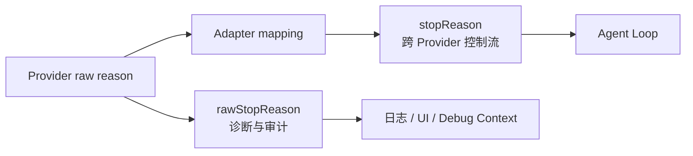
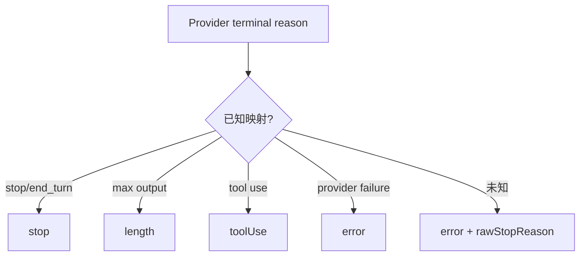
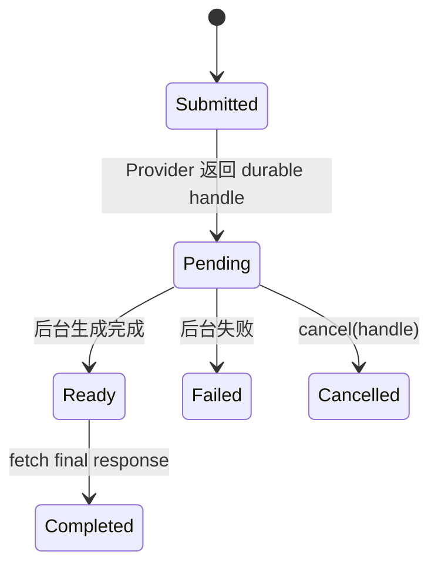
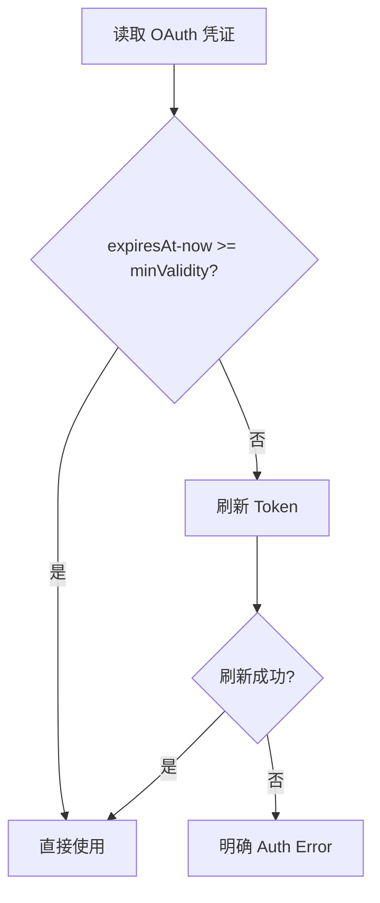
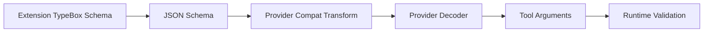
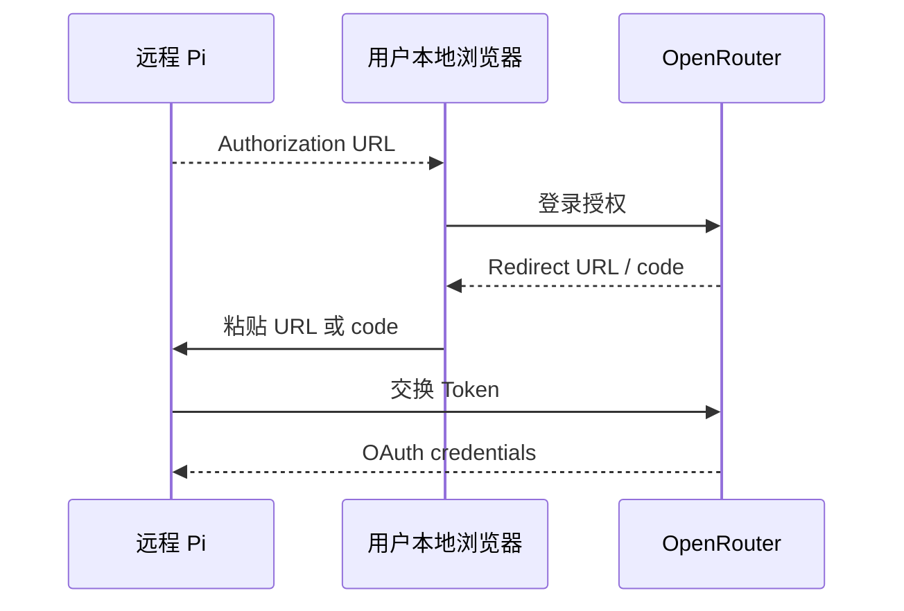

# Pi 0.83：把 Provider 的“结束”、凭证和 Schema 语义变成可依赖事实

## 本章结论

0.83 没有像 0.84 那样出现一个巨大新架构，但它清理了产品最容易误判的三类事实：

1. Provider 说“结束”到底是正常完成、等待后台结果、长度截断还是未知错误；
2. OAuth Token 是否还足够有效，能否安全交给外部客户端；
3. Tool Schema 在 TypeBox 升级和 Provider 转换中到底怎样保持一致。

这些变化看似 Provider 细节，实际上决定 Session 能否正确 Retry、Resume、计费与显示。

## 1. 为什么统一的 `stopReason` 仍然不够

Runtime 常见统一原因：

```text
stop
length
toolUse
error
aborted
```

但 Provider 原始原因可能是：

```text
end_turn
max_output_tokens
content_filter
safety
malformed_function_call
pending_background_response
provider_specific_code
```

若 Adapter 将未知原因都映射成 `stop`，产品会把 Provider 拒绝或中断展示成成功。

## 2. `rawStopReason`：统一语义之外保留证据

0.83 增加 `AssistantMessage.rawStopReason`，并在 Google、Anthropic、Bedrock、Mistral、OpenAI 等流中填充。



两者职责不同：

- `stopReason`：Runtime 是否继续 Tool Loop、Retry 或停止；
- `rawStopReason`：保留 Provider 原始证据，帮助解释映射错误。

### 决策示例



0.83 的原则是：**无法证明是成功，就不能默认为成功。**

## 3. `pending` Stop Reason 与 Deferred Provider

0.83 增加 `pending`，表示流式消息还没有最终结果。例如 Provider 接受请求后转为后台执行：



这与普通 Streaming 的区别：

| 普通 Stream | Deferred/Pending |
|---|---|
| 连接保持，持续收到 delta | 请求可能结束，只返回持久 Handle |
| 进程内 Stream 是进度载体 | Provider 后台状态是权威 |
| 断线通常意味着要重试 | 断线后可凭 Handle 查询 |
| Abort 取消当前 HTTP/WS | Cancel 可能要调用 Provider 专门接口 |

0.84 会把 deferred request contract、durable handle 和 authenticated fetch/cancel 系统化。

## 4. 最小 OAuth 有效期：为什么“没过期”仍然不能用

假设 Token 还有 30 秒到期，外部任务需要：

```text
排队 10 秒
上传 5 秒
模型生成 40 秒
```

虽然当前检查“未过期”，请求中途仍会 401。

0.83 增加 `minOAuthValidityMs`：



Coding Agent 还增加：

```text
pi auth print-api-key
pi auth print-bearer-token
```

用于外部客户端取得经过刷新、满足最小有效期的凭证。外部工具不应直接解析 `auth.json`，因为它会绕过锁、刷新和 Provider 特有规则。

## 5. 为什么存储凭证在剩余五分钟时提前刷新

0.83 将存储 OAuth 的刷新点从“已经过期”提前到“五分钟内将过期”。这解决：

- 长模型请求中途失效；
- 多个并发请求同时发现过期形成刷新风暴；
- 外部 Client 刚打印 Token 就失效；
- Session 恢复后第一轮请求先失败再刷新。

但提前刷新也要求 Credential Store 有正确的单飞/锁与取消。否则所有请求会被一个卡住的刷新阻塞。0.84 进一步修复 stalled refresh 释放锁和等待可取消。

## 6. TypeBox 1.3：为什么依赖升级会影响 Tool Runtime

0.83 将导出的 TypeBox 别名升级到 1.3.7，删除多项废弃 API，并修复 nullable array Tool 参数的编译验证。

### Tool Schema 的实际链



任何一层对 `optional`、`nullable`、`anyOf` 理解不同，都会产生：

- 模型发 `null`，Runtime 错误强转；
- 数组 Nullable 编译器与解释器结果不同；
- Provider strict mode 要求所有字段 required；
- Extension 升级后旧 API 不再生成预期 Schema。

### 迁移原则

- 删除 `Type.Base`、`Type.Awaited`、`Type.Promise` 等已移除 API；
- 对 Tool 输入写真实 Validation Test，不只快照 Schema 文本；
- 分别测试缺失、`null`、空数组、错误类型和额外字段；
- 不假设 Provider 采样约束等同于本地 TypeBox 解释。

## 7. Per-request `fetch` 注入的价值

0.83 允许受支持 Provider 在单次文本/图像请求中注入 `fetch`。

用途包括：

- 产品 Gateway；
- Cloudflare Worker Binding；
- 测试 Mock Transport；
- 请求级 tracing；
- 特定代理/网络栈。

但 Google Adapter 对不支持的非全局实现会明确拒绝，而不是静默绕过。这体现一条重要兼容原则：

> 能力不支持时明确失败，比悄悄使用另一条传输更安全。

## 8. Headless OpenRouter 登录

0.83 支持在 SSH/无浏览器回调环境中粘贴 Redirect URL 或 Authorization Code。



这说明 Auth Flow 是交互协议，不应被硬编码为“本机起一个 localhost callback”。产品 Runtime 应允许 UI Bridge 承载这类交互。

## 9. 模型/Provider 修复应该怎样阅读

0.83 有大量具体模型修复：Thinking 控制、Bedrock Profile、OpenAI Tool Delta、Copilot Claude 等。不要逐条背模型名，而要归类为 Adapter 不变量：

| 不变量 | 典型错误 |
|---|---|
| 请求参数必须是 Provider 真正支持的字段 | `max_tokens` / `max_output_tokens` 混用 |
| Thinking Level 必须映射到 Provider 语义 | off 仍发送不支持 payload |
| Tool Call ID 必须跨历史转换稳定 | 多 Turn replay 找不到 Tool Result |
| Profile/Endpoint 必须服从显式配置 | 环境变量覆盖用户指定 AWS Profile |
| 原始终止原因不能丢 | Provider Error 被映射成 Stop |

## 10. 0.83 的源码追踪路线

```bash
rg "rawStopReason|stopReason: .pending|minOAuthValidityMs" packages/ai packages/coding-agent
rg "print-api-key|print-bearer-token|TypeBox" packages/coding-agent
rg "onResponse|fetch:" packages/ai/src
```

阅读时追两条链：

```text
Provider Event → Adapter Partial → AssistantMessage → Agent Loop
Credential Read → Validity Check → Refresh → Store → Request
```

## 11. 产品迁移清单

- UI/日志同时保存统一 Stop Reason 和原始 Reason；
- 未知 Terminal Reason 必须按错误处理；
- Deferred Request 保存 Provider Handle，而不只保存内存 Promise；
- 外部客户端通过 Auth API 获取凭证，不直接读文件；
- 请求前按预计耗时设置最小 Token 有效期；
- Tool Schema 升级后运行行为测试，不只 TypeScript 编译；
- Headless Auth 通过产品 UI Bridge 完成，而不是假设本机浏览器。

## 练习题

1. 为什么 `rawStopReason` 不能直接替代统一 `stopReason`？
2. 设计一个 Deferred Completion 的持久化记录，至少包含哪些字段？
3. Token 尚余 90 秒、任务预计 120 秒时，Auth Resolver 应怎样处理？
4. 为一个 nullable array Tool 参数写五个测试输入和预期结果。
5. 未知 Provider Stop Reason 为什么应映射为 Error，而不是 Stop？
6. 画出 Headless OAuth 的参与者与信任边界。
