# Pi 0.84：Durable Session、Lane、全链取消与远程 Runtime 基础

## 本章结论

0.84 是 0.80—0.84 中最大的架构拐点，但必须分成两部分看：

```text
已经进入成熟 Coding Agent 路径的能力
- AgentSession / ModelRuntime / RPC / TUI 的大量可靠性改进
- message_update delta
- Provider/Auth/Refresh 取消和 generation guard
- Deferred Tool message anchoring
- session_compact_failed

新的 durable Harness 方向
- v4 Session / SessionRepo / Lane / Operation
- JSONL atomic publication / recovery query
- Protocol / Server / Client 基础
- AgentHarness compile-complete scaffold
- 仍有 HarnessNotImplemented 路径
```

因此，当前产品应升级成熟路径，同时为 durable Harness 做实验验证，而不是一次性重写。

## 1. v4 Session：从“消息树”扩展为“可恢复执行数据库”

经典 `SessionManager` 主要保存：

```text
Message Entry
Model/Thinking Change
Compaction / Branch Summary
Custom Entry
Label / Session Info
```

v4 Harness Session 进一步保存：

```text
Entries
Facts
Lanes
Operations
Pending Writes
Usage Records
Shared Sequence
```

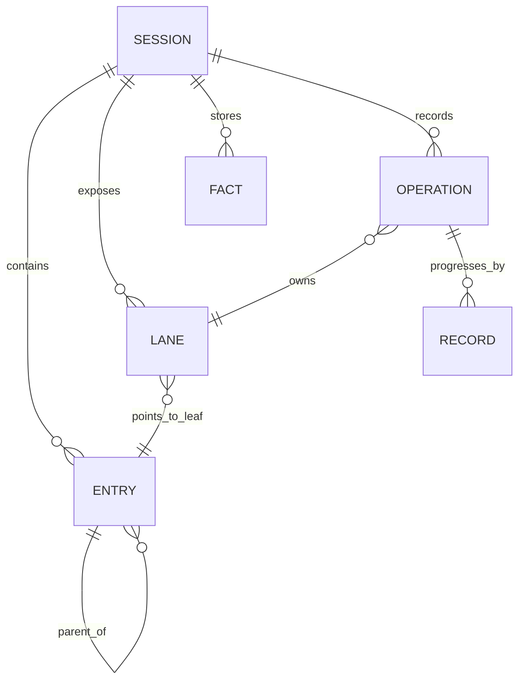

### 为什么只保存 transcript 不够

崩溃发生在 Tool 副作用附近时，历史可能只告诉你：

```text
Assistant 请求 write(file)
```

但不知道：

- Tool 是否开始；
- 文件是否已经写入；
- Tool Result 是否只差落盘；
- 当前恢复应该重放还是补结算；
- 哪个 Lane 拥有这次 Operation。

Durable Operation 的目标是保存程序计数器和意图/结果记录，而不是根据“缺了哪条消息”猜。

## 2. Effect Sandwich：外部副作用前后都要 Commit

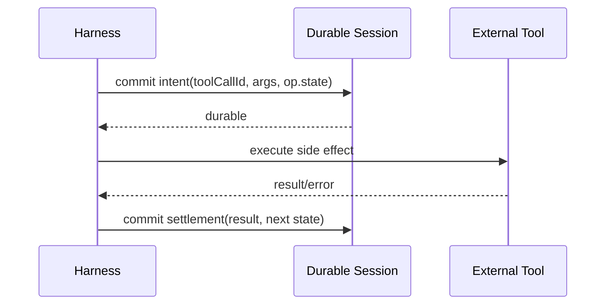

崩溃位置决定恢复策略：

| 崩溃点 | Durable 证据 | 恢复含义 |
|---|---|---|
| Intent 前 | 没有操作记录 | 未开始，可以正常调度 |
| Intent 后、Effect 前 | 有意图，无外部执行证据 | 根据 Tool replay policy 决定 |
| Effect 后、Settlement 前 | 状态不确定 | `replay: never` 不能盲目重放，需要核验/人工处理 |
| Settlement 后 | 结果已提交 | 继续下一 Action |

这与产品层 `DispatchAttempt saga` 同构，但边界不同：Pi 只负责一次 Agent/Tool Operation；Room 的 WorkItem、集成与验收仍由产品管理。

## 3. Lane：并行不是同一个 messages 数组上的两个 Promise

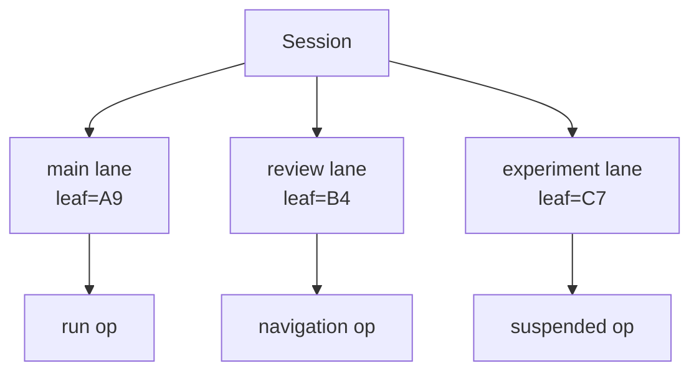

每条 Lane 有独立：

- leaf；
- active operation；
- steer/followUp/nextRun queues；
- pending writes；
- fault/suspended 状态。

同一 Lane 同时只能有一个权威 Operation；不同 Lane 可以共享 Session Entries/Facts，但拥有独立执行游标。

### Lane 不等于 Room Agent

```text
Lane：Pi 内的一条执行游标
Room Partner：产品层的角色、WorkItem、权限和工作区
```

产品可以把一个 WorkItem 映射到一个 Session/Lane，但不能把 Room 的需求、依赖、评审和最终交付全部塞进 Lane。

## 4. v4 JSONL Repository：原子发布与 torn-tail 修复

0.84 增加 `JsonlSessionRepo`，并要求执行环境提供 `renameFile()`，保证同文件系统原子替换。

### 为什么普通 append 仍可能损坏

进程在写一半时崩溃：

```text
{"type":"record","operation":"op-42","state":"settli
```

如果 Reader 把半行当成有效记录，后续所有恢复都不可信。

### 修复流程

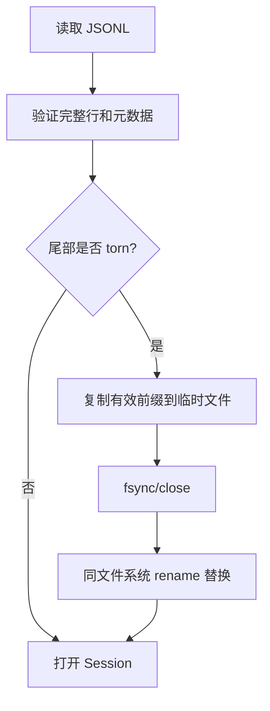

Fork 也使用原子发布，避免创建一半的新 Session。

## 5. Recovery Query：恢复不能全表扫描后猜

v4 API 增加：

```text
Session.findOpenOperations()
RecordQuery.operationKind
findEntriesOnBranch()
findEntryOnBranch()
```

恢复流程应是：

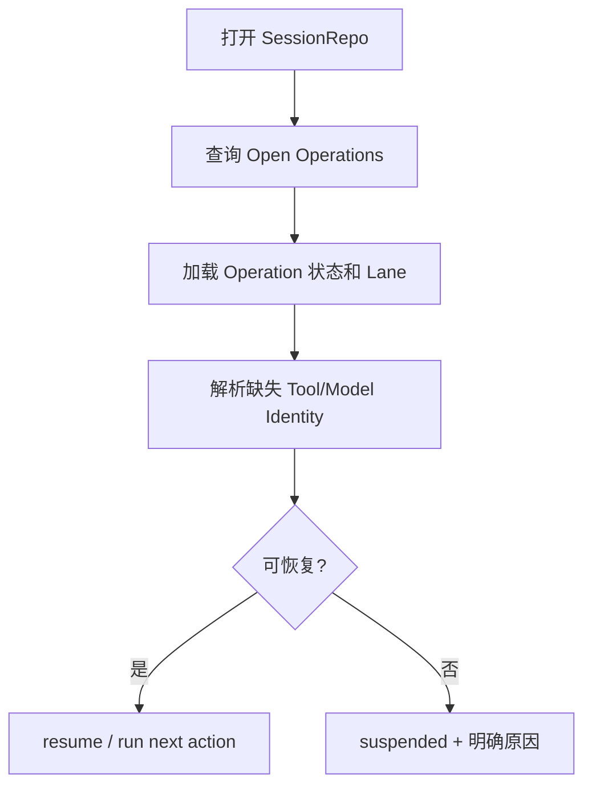

这比遍历 transcript 搜索“有 Tool Call 没 Tool Result”更可靠，因为 Tool 执行可能有 Deferred、Abort、Pending Write 和 Retry。

## 6. `AgentHarness` 当前完成度：接口完整不等于运行完整

0.84 Changelog 明确称其为 compile-complete scaffold，未完成路径拒绝 `HarnessNotImplemented`。当前源码中：

```ts
export class HarnessNotImplemented extends Error {
    constructor(operation: string) {
        super(`AgentHarness.${operation} is not implemented yet`);
    }
}
```

学习时需要逐方法检查：

```bash
rg "HarnessNotImplemented|unavailable\(" packages/agent/src/harness
```

### 判断一项能力真实完成的证据层级

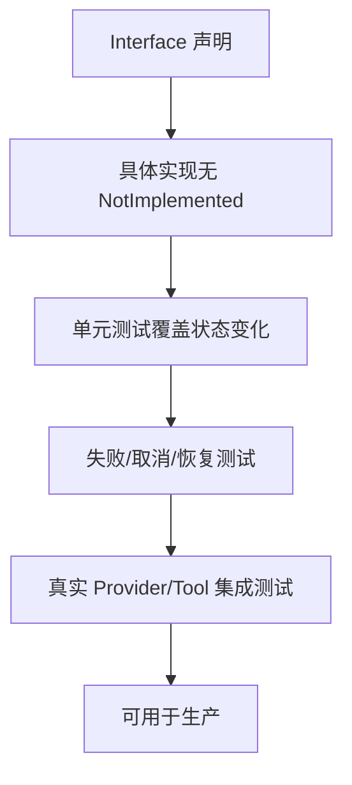

只满足 Interface 和编译，最多说明迁移目标清晰。

## 7. Model Refresh：generation-checked `publish()`

0.84 的 `pi-ai` 对 Provider Refresh 做 Breaking Change：

- `RefreshModelsContext.signal` 必须存在；
- 不再直接访问可写 Store；
- 使用只读 `context.stored`；
- 使用 `context.publish()` 原子更新内存/持久化；
- 过期 generation 的 publish 返回 false。

### 旧错误

```ts
const refreshed = await fetchModels();
currentModels = refreshed;
await store.write(refreshed);
```

两个并发刷新会让旧请求覆盖新结果。

### 新模式

```ts
const refreshed = await fetchModels(context.signal);
if (context.signal.aborted) return;
await context.publish({
    persist: { models: refreshed, checkedAt: Date.now() },
    update: () => { currentModels = refreshed; },
});
```

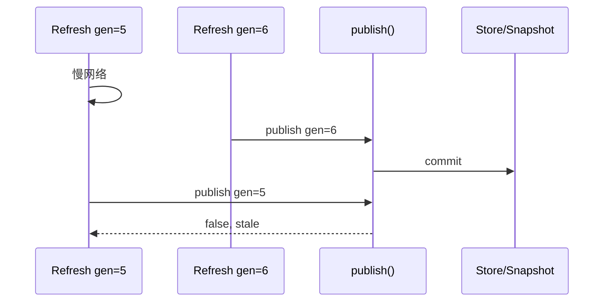

## 8. 全链取消：不只是取消 HTTP 请求

0.84 要求 Provider Login、API Key Check、OAuth Refresh、Model Store、Catalog Refresh 都接受 AbortSignal。

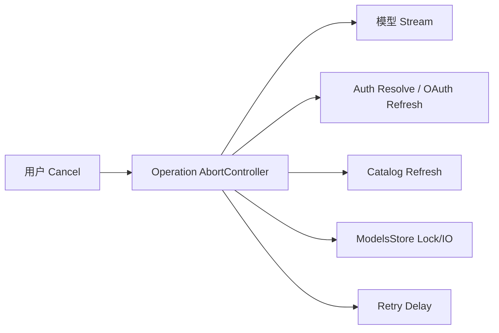

之前即使模型流可取消，Runtime 仍可能卡在：

- 等 Credential Store 锁；
- 等旧 OAuth Refresh；
- 等 Catalog 网络请求；
- 等 Retry Delay；
- 等自定义 Provider 忽略 Signal。

0.84 还修复调用者在自定义 Provider 忽略 Signal 时仍能停止等待。这是 Host 隔离的关键：取消一个请求，不应杀进程，也不应无限等第三方实现。

## 9. JSON/RPC `message_update` 改为 Delta

### 旧累积消息问题

若每个 update 都发送完整 partial：

```text
第 1 个 token：1 字符
第 2 个 token：2 字符
...
第 N 个 token：N 字符
总传输量约为 N²/2
```

长回答导致 RPC 输出二次增长。

### 0.84 新契约

```text
message_start：建立空/初始消息
message_update：只发 assistantMessageEvent delta
message_end：权威完整消息
```

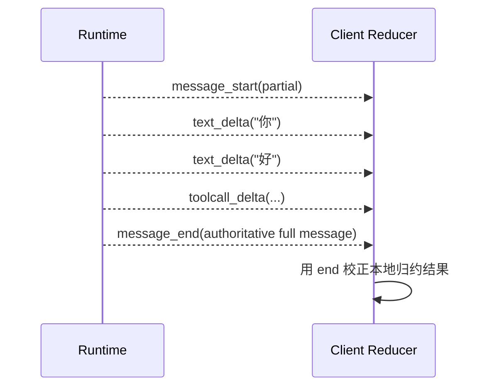

客户端必须维护 reducer，不能再读取每个 update 的完整 `message`。

## 10. `shouldStopAfterTurn`：优雅停止不是 Abort

0.84 将 `AgentOptions.shouldStopAfterTurn` 暴露到高层 Agent：

```text
当前 Assistant + Tool Batch 完整结束
→ 检查 shouldStopAfterTurn
→ true：不拉 Steer，不开启下一模型调用
```

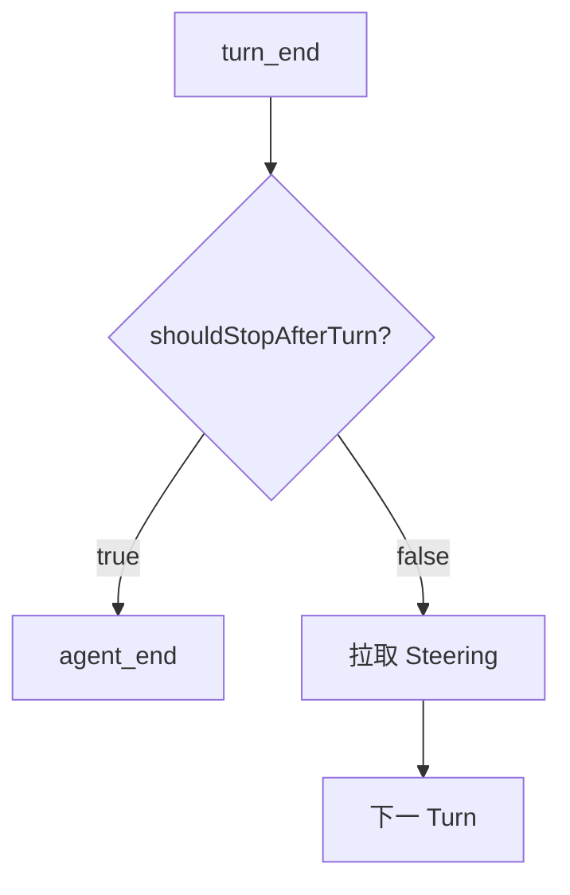

适合：

- `room_commit` 后硬终止当前回合；
- 达到产品预算；
- Tool 返回“本轮必须停止”；
- 需要等待人工审批再开启新 Run。

与 Abort 区别：Abort 可在当前请求中途发生；Graceful Stop 保证当前 Turn 的 Tool Result 和事件配对完整。

## 11. Deferred Tool 的消息锚定

0.84.2 对 OpenAI Responses 优先使用 message-anchored `additional_tools`：

```text
固定 Prompt 前缀
→ tool_load ToolResult
→ 从该消息位置附加新 Tool Schema
→ 后续历史自然重放
```

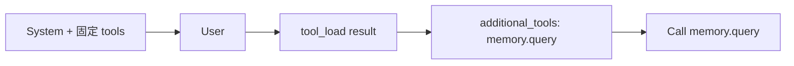

相较每次顶层发送所有 Tool，它同时改善：

- Prompt Cache；
- Session 恢复；
- Capability Audit；
- 工具出现时间的可解释性。

## 12. `session_compact_failed` 与失败可观察性

成熟 Coding Agent 路径新增/继续完善 `session_compact_failed`，包含失败原因、是否 Abort、是否重试、来源等。产品 Outbox 可以直接发送真实失败事件，不再通过“没收到 success”猜。

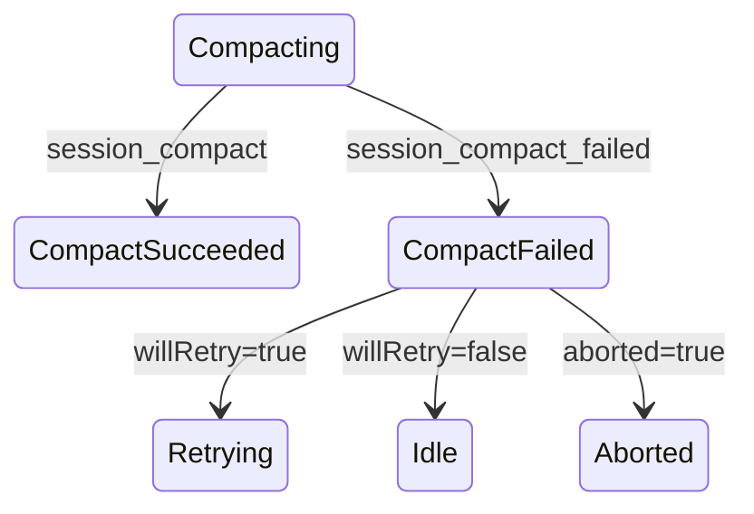

## 13. 全屏 TUI：不是单纯换皮

0.84 增加 Interface-compatible main/alternate-screen renderer、布局树、ScrollView、Sticky Region、Scrollbar、Selection、Search、LaTeX/Mermaid。

### 渲染数据结构

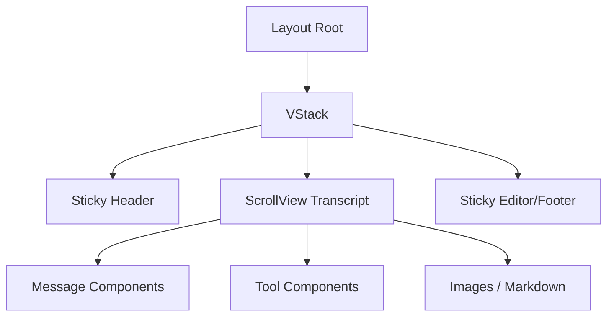

### 为什么值得源码学习

它解决了 Agent UI 特有问题：

- 流式文本持续增长时滚动位置稳定；
- Sticky Editor 不被历史挤走；
- Overlay 与焦点有独立栈；
- 鼠标选择不能被空闲重绘破坏；
- 键盘输入可抢占 16ms 渲染节流；
- Search Match 与手动滚动不互相抢控制权；
- 图片重用不能重复上传大 payload。

这些机制可以直接映射到 Web 前端的 Incremental Card、Virtual List 和 stale event 控制。

## 14. 0.84 新增 Protocol/Server/Client：现在怎样看

新包提供：

```text
packages/protocol
packages/server
packages/client
packages/session-backends/sqlite-node
packages/telemetry
```

方向包括：

- 长度前缀 + CBOR framing；
- 版本协商；
- 权威 Snapshot；
- Progress Event；
- 多 Session；
- Session Lease；
- Unix Socket；
- Server Adapter；
- SQLite Session Backend。

但它们是实验基础设施，协议面尚未覆盖你的产品全部能力（Tool Sync、Approval、Plugin、Goal、Lifecycle Outbox 等）。当前合理做法：

```text
保留产品 Runtime Adapter
→ 逐步用官方 Client/Server 替换传输和 Lease
→ 产品协议仍定义业务命令
→ 不把实验 Protocol 当稳定公共契约
```

## 15. 0.84 源码追踪路线

```bash
rg "HarnessNotImplemented|findOpenOperations|JsonlSessionRepo|renameFile" packages/agent
rg "context.publish|availabilityRefreshSeq|AbortSignal" packages/ai packages/coding-agent
rg "message_update|assistantMessageEvent" packages/coding-agent
rg "additional_tools|addedToolNames" packages/ai packages/agent packages/coding-agent
rg "shouldStopAfterTurn|session_compact_failed" packages
```

推荐顺序：

1. `packages/agent/src/harness/session/`
2. `packages/agent/src/harness/agent-harness.ts`
3. `packages/agent/src/harness/reducer.ts`
4. `packages/coding-agent/src/core/model-runtime.ts`
5. `packages/coding-agent/src/core/agent-session.ts`
6. `packages/tui/src/tui.ts` 与 alternate-screen/layout 实现
7. `packages/protocol`、`server`、`client`

## 16. 产品迁移结论

### 现在就吸收

- 最新 AgentSession、Retry、Compaction 和 `agent_settled`；
- `session_compact_failed`；
- Model/Auth/Store cancellation；
- generation-checked Catalog Refresh；
- RPC delta reducer；
- Deferred Tool message anchoring；
- `shouldStopAfterTurn`；
- TUI 渲染与输入修复。

### 先实验再切换

- AgentHarness v4 执行面；
- Lane 作为 Room/并行底座；
- Protocol/Server/Client 替换自定义 Host；
- SQLite Backend 统一所有产品存储。

### 仍保留产品层

- Room/WorkItem；
- Memory/Knowledge；
- Goal/Plan/Act Gate；
- Approval/Review；
- Tool Catalog 权限；
- Lifecycle Outbox；
- 产品级幂等与最终交付。

## 练习题

1. 为什么 durable operation 不能只通过“Tool Call 后缺少 Tool Result”恢复？
2. `replay: never` 的 Tool 在 Effect 后、Settlement 前崩溃，应怎样处理？
3. 设计一个两条 Lane 的 Session，并说明哪些状态共享、哪些独立。
4. generation-checked publish 与前端 stale guard 的共同不变量是什么？
5. 将旧累积 `message_update` Client 改为 delta reducer，需要保存哪些本地状态？
6. `shouldStopAfterTurn` 与 Abort 分别适合 `room_commit` 的哪个阶段？
7. 为什么现在不应直接用新 Protocol 替换产品 Runtime Host 的全部命令？
8. 列出判断 AgentHarness 一项能力达到生产可用的五层证据。
