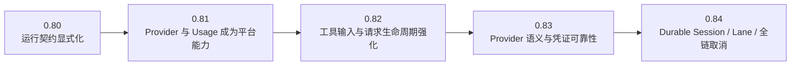
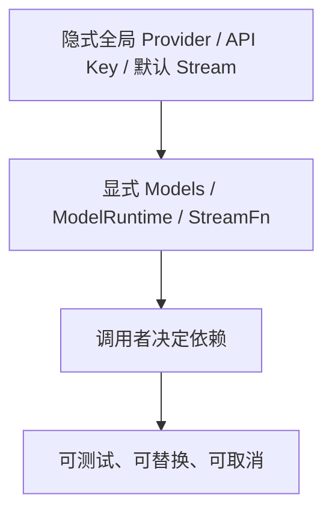
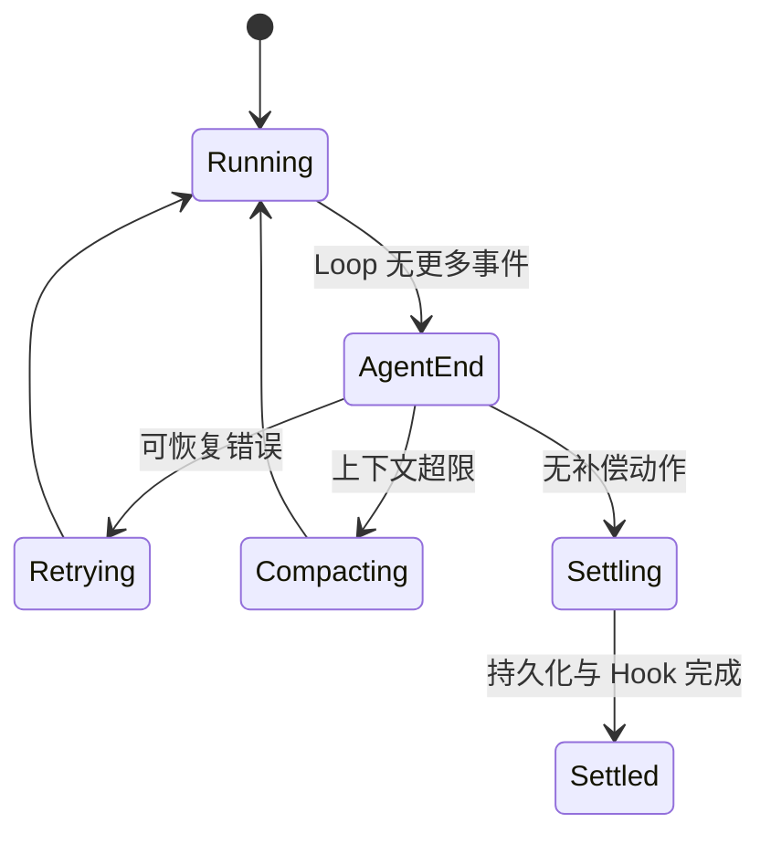
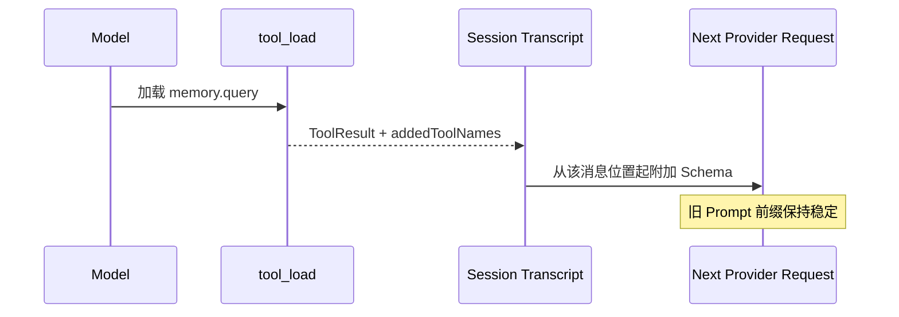
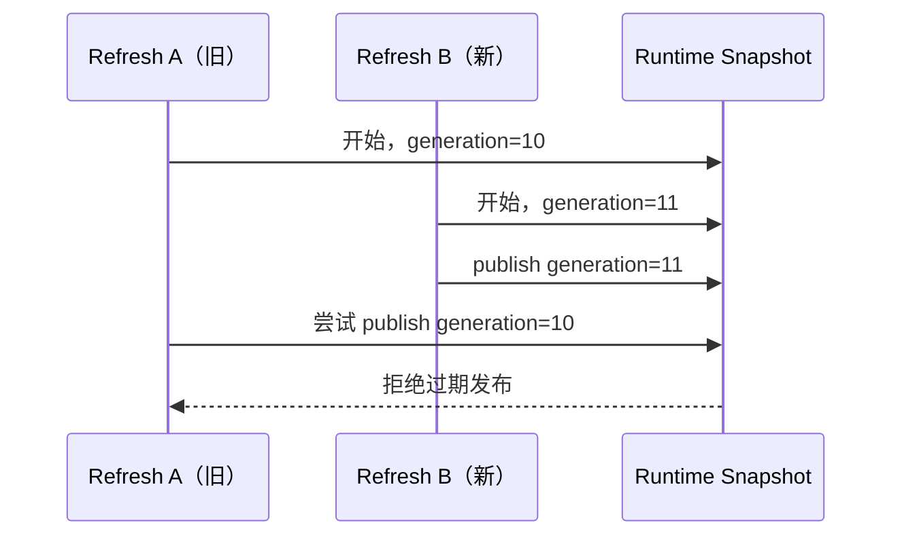

# Pi 0.80 → 0.84 演进专题

> 这不是把 Changelog 翻译成中文，而是解释：Pi 为什么连续重构、每一版把哪一类不确定性收敛到了哪里，以及这些变化怎样影响你自己的 Agent 产品。

## 先看五个版本各自解决的主矛盾

| 版本 | 主要问题 | 核心答案 | 对产品开发者最重要的影响 |
|---|---|---|---|
| 0.80 | 模型、鉴权、下一 Turn、结算边界仍有隐式行为 | 显式 `Models`、StreamFn、`agent_settled`、动态工具锚点 | 不再依赖全局 Provider 与“最后一个 token 就算结束” |
| 0.81 | Provider 只能半定制，Usage 账本不完整，长会话补偿不够 | 完整 Provider Extension、Tool/Compaction/Summary Usage、摘要重试 | 产品可以接自定义模型，同时正确核算一次任务的真实成本 |
| 0.82 | 工具参数约束弱、Bash 与 Session 脱节、取消不能贯穿等待 | Constrained Sampling、Session-aware Bash、可取消 Retry、Harness `toolContext` | 工具调用更可控，控制面请求更适合产品化 |
| 0.83 | 不同 Provider 的终止原因、OAuth 有效性和 Schema 语义不够明确 | `pending`、`rawStopReason`、最小 OAuth 有效期、TypeBox 1.3 | 不再把 Provider 异常误判成正常完成，外部客户端可安全取凭证 |
| 0.84 | 进程内状态难恢复，旧刷新覆盖新状态，UI/RPC 累积消息成本高 | v4 Session/Lane、Durable Operation、generation publish、delta event、全屏 TUI | 为恢复、远程 Runtime 和长任务打底，但新 Harness 执行面仍需辨别完成度 |

## 演进的真正主线

表面上 0.80—0.84 有大量模型、终端和 Provider 更新，但源码层只有四条持续主线。

### 主线一：从隐式全局状态变成显式依赖

0.80 开始要求 Harness 通过 `Models` 处理模型与鉴权；0.84 又把刷新发布改成 generation-checked transaction。变化不是“多了一个参数”，而是把权威状态从全局隐藏逻辑移到明确拥有者。

### 主线二：从事件流变成可结算操作

0.80 的 `agent_settled` 先把经典 `AgentSession` 的结束语义说清楚；0.84 的 durable operation 则试图把 Run、Compaction、Navigation 都变成可持久恢复的操作记录。

### 主线三：从“工具名称列表”变成有时间位置的能力图

0.80.7 增加 `addedToolNames`；0.84.2 的 OpenAI Responses 进一步优先使用消息锚定的 `additional_tools`。这条线直接服务于渐进披露和 Prompt Cache。

### 主线四：从“能跑”变成“旧结果不能覆盖新事实”

0.84 的模型目录、凭证与存储取消传播，解决的就是这类 stale publication。它与 Web 前端 stale guard、本地 Session 晚到事件属于同一类并发问题。

## 专题阅读顺序

1. [0.80：显式 Runtime 契约与 settlement](0.80.md)
2. [0.81：Provider 平台化与完整 Usage](0.81.md)
3. [0.82：工具约束、Bash 关联与取消传播](0.82.md)
4. [0.83：Provider 终止语义与凭证可靠性](0.83.md)
5. [0.84：Durable Session、Lane、Protocol 与全屏 TUI](0.84.md)
6. [从旧 Fork 迁入 0.84 的决策图](migration-map.md)

## 读版本专题时不要犯的错误

- 不要按“新增了多少功能”判断架构重要性；一个 cancellation 参数可能比十个模型条目更重要。
- 不要看到 `AgentHarness` Interface 就假定执行路径已完成；要搜索 `HarnessNotImplemented` 和测试。
- 不要把 Coding Agent Changelog 与 Agent Core Changelog混在一起；前者是产品整合，后者是底层契约。
- 不要只看当前源码猜历史原因；版本专题必须同时看 Changelog、当前实现和迁移前后的类型。
- 不要机械保留 Fork Patch；先判断上游是否已经以不同接口解决同一问题。

## 证据入口

- `packages/agent/CHANGELOG.md`
- `packages/ai/CHANGELOG.md`
- `packages/coding-agent/CHANGELOG.md`
- `packages/tui/CHANGELOG.md`
- `packages/agent/src/agent.ts`
- `packages/agent/src/agent-loop.ts`
- `packages/agent/src/harness/`
- `packages/coding-agent/src/core/model-runtime.ts`
- `packages/coding-agent/src/core/agent-session.ts`

## 练习题

1. 用一句话概括 0.80 到 0.84 的主线，禁止只列功能名称。
2. 为什么 `agent_settled` 和 durable operation 属于同一演进方向，却不在同一抽象层？
3. `addedToolNames` 为什么既是 Tool 功能，也是 Prompt Cache 功能？
4. 模型目录 refresh 与前端 Session stale event 有什么共同并发模型？
5. 为你的产品列出三项应该保留在产品层、三项应该交回上游 Pi 的能力。
