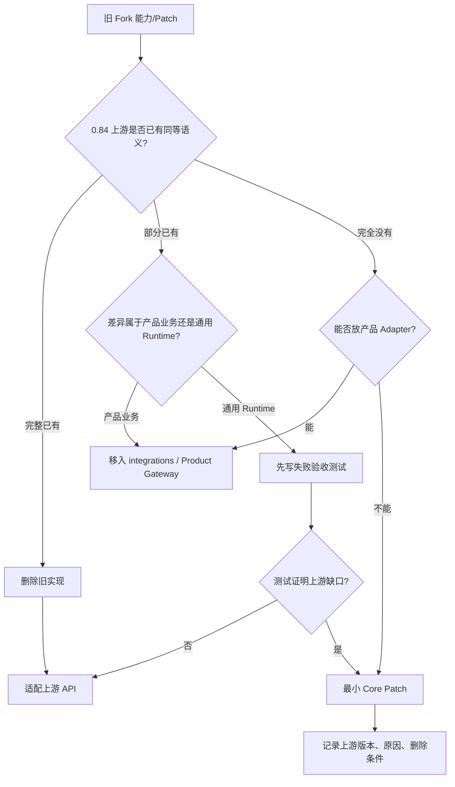
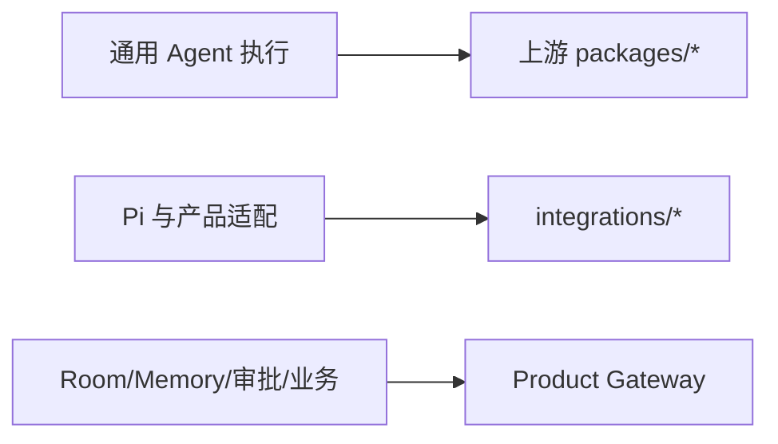
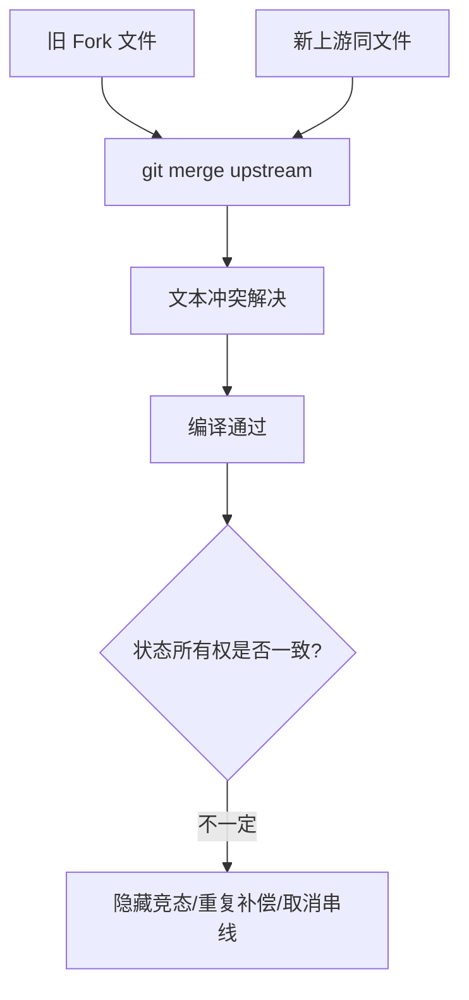

# 从旧 Pi Fork 迁入 0.84：能力归属与移植决策图

## 目标

迁移不是把旧 Fork 的提交逐个 cherry-pick 到新上游，而是回答每一项旧能力：

```text
上游是否已经解决？
→ 若已解决：删除重复实现，接上游接口
→ 若部分解决：产品层保留语义，底层接上游
→ 若未解决：以最小 Patch 或独立 Adapter 保留
```

## 1. 总决策树



## 2. 旧能力映射表

| 旧 Fork 能力 | 0.84 上游状态 | 迁移动作 |
|---|---|---|
| 多 Session Host | 官方有实验 Server/Client，但产品命令不完整 | 保留 Runtime Host Adapter，逐步替换传输/Lease |
| Prompt/Steer/Follow-up/Abort | 成熟 AgentSession 已支持 | 删除重复 Loop，只做协议映射 |
| Session Fork/Rewind | 经典 Session Tree 已支持；v4 方向更强 | 使用 SessionManager/Runtime API，保留产品 ID 绑定 |
| `agent_settled` | 上游已有 | 前端/Host 直接消费，不复制状态推断 |
| Compaction Failure | 上游有 `session_compact_failed` | 产品 Outbox 转发真实事件 |
| `resolveToolForExecution` 类 Patch | 上游有 `addedToolNames`/Deferred Tool | 先跑恢复测试，失败才补最小 Patch |
| Skill Routing Card | 上游 Skill Parser 不需要产品字段 | 放产品 Catalog Adapter，不改上游 Skill 类型 |
| Tool Search/Load | 上游有 Deferred Tool 基础 | 产品保留 Catalog/Policy，激活接 `addedToolNames` |
| Session/Turn Context | Extension 生命周期可注入 | 保留产品 Memory 语义，使用 Hook 接入 |
| Plan/Goal/Act Gate | 上游故意不定义产品工作流 | 保留 Product Gateway |
| Approval/Review/UI Bridge | 产品业务 | 保留 Product Gateway/Adapter |
| Lifecycle Outbox | 产品可靠交付 | 保留独立持久 Outbox |
| Plugin Governance | 产品供应链/审批 | 保留产品层 |
| Model Catalog Alias Patch | 0.84 Provider Composer 更完整 | 改为 Provider/Config 组合，减少 Core Patch |
| Prompt Cache Key Patch | Provider Compat 可能已覆盖部分 | 先验证实际 Gateway，缺失时只加 Compat 字段 |
| JSONL `readline` Host | 上游/产品协议需要严格 framing | 保留 strict LF byte framing，未来迁 CBOR Protocol |

## 3. 三类代码的目标位置



### 上游应拥有

- 模型与 Provider 调用；
- Agent Loop；
- Tool 参数校验与执行生命周期；
- Steer/Follow-up/Abort；
- Session 与 Compaction；
- Retry；
- Extension 生命周期；
- TUI/RPC 基础事件。

### Integration 应拥有

- 产品协议映射；
- Session Pool；
- 严格 framing；
- 产品 Tool Bridge；
- Context Adapter；
- Pi Event → Product Event 映射；
- 上游版本兼容层。

### Product Gateway 应拥有

- 用户、项目和 Room；
- 权限和审批；
- Memory/Knowledge；
- Tool Catalog 权威状态；
- Goal/Budget；
- Lifecycle Outbox；
- 产物与最终交付。

## 4. 为什么普通 Merge 风险最高



Git 只能发现文本冲突，无法发现：

- 两套 Retry 都生效；
- 旧 AgentSession 认为 `agent_end` 已结束，新实现仍在 Compaction；
- Tool Schema 被上游和产品各激活一次；
- 取消 Signal 被旧 wrapper 截断；
- 旧 Refresh 逻辑覆盖 generation-checked Snapshot。

因此正确策略是“新上游为底，按能力重新移植”。

## 5. 分阶段迁移

### 阶段 A：建立干净底座

```bash
git branch archive/pi-custom-old
git switch -c integration/upstream-0.84 upstream/0.84.2
```

验收：上游自身 build/check/test 通过。

### 阶段 B：搬产品 Adapter，不搬 Core Patch

```text
integrations/runtime-host
→ 编译适配 0.84 SDK
→ 先跑 Session/Protocol/Context 测试
```

验收：Host 只通过公开 SDK/Extension API 工作。

### 阶段 C：逐项验证旧 Core Patch

每个 Patch 建一个失败测试：

```text
Given 旧产品场景
When 使用纯上游 0.84
Then 是否已经正确
```

只有 Then 失败，才添加 Patch。

### 阶段 D：恢复和并发验收

```text
Prompt → Tool → Steer → Follow-up → Settled
Abort → 旧事件不再写新 Session
Compaction → Memory 刷新 → Retry
Fork → 源 Session 不变
Host Restart → 无重复副作用
Catalog Refresh → 旧 generation 不覆盖新状态
```

### 阶段 E：实验 durable Harness

独立分支验证：

- Operation Record；
- Tool replay policy；
- Lane；
- Crash recovery；
- Protocol/Client Lease。

不阻塞成熟 AgentSession 路线交付。

## 6. Patch 记录模板

任何仍修改 `packages/*` 的产品 Patch 都应写：

```markdown
### Patch: <name>

- 上游版本：0.84.2
- 修改文件：...
- 产品场景：...
- 上游缺口复现测试：...
- 为什么不能放 Integration：...
- 预期删除条件：上游 issue/接口达到...
- 与上游同步时必跑测试：...
```

没有删除条件的 Patch 会永久变成 Fork 债务。

## 7. 迁移验收矩阵

| 场景 | 权威证据 | 禁止的错误 |
|---|---|---|
| Prompt 完成 | `agent_settled` | 仅凭最后 token |
| Abort | 目标 Run settled | 杀共享 Host |
| Dynamic Tool | `addedToolNames` + active schema | 每轮全量重发 Catalog |
| Fork | 新 Session 文件/ID | 改写源 transcript |
| Compaction | Compaction Entry + lifecycle event | 只在内存替换 messages |
| Catalog Refresh | generation publish | 旧请求覆盖新 Snapshot |
| Usage | 完整 Session Ledger | 只取最后 Assistant |
| Plugin Apply | approval + digest + immutable version | Agent 自行安装 |

## 8. 练习题

1. 为旧 Fork 中一个 Core Patch套用总决策树，写出最终位置。
2. 为什么“文本合并无冲突”不能证明 Runtime 语义兼容？
3. 为 `resolveToolForExecution` 写一个上游 0.84 验收测试场景。
4. 哪些产品能力即使上游提供类似接口，也不应交给 Pi？
5. 为一个必须保留的 Core Patch 写完整删除条件。
6. 设计一组 Crash Point，验证写工具不会被错误重放。
