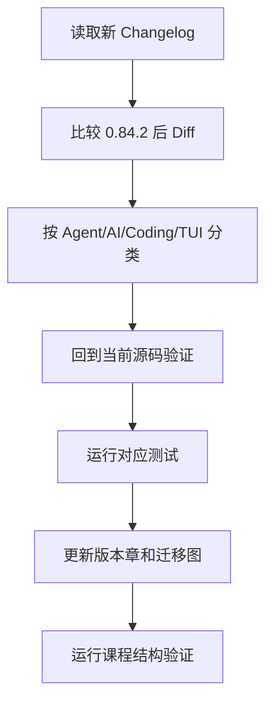

# Pi 0.80—0.84 演进专题的源码证据

## 固定基线

| 项目 | 值 |
|---|---|
| 课程源码分支 | `integration/upstream-0.84-runtime-host` |
| 课程源码提交 | `1cafa4567357ba6d211033e99f58c19385ccacf1` |
| 上游版本 | `0.84.2` |
| 上游提交 | `59a71b235dadb4ad0d67557a8abb0aaa093e68b4` |

## 版本事实来源

版本专题以仓库内 Changelog 为事实索引，再回到当前源码验证机制：

```text
packages/agent/CHANGELOG.md
packages/ai/CHANGELOG.md
packages/coding-agent/CHANGELOG.md
packages/tui/CHANGELOG.md
```

主要源码证据：

```text
packages/agent/src/agent.ts
packages/agent/src/agent-loop.ts
packages/agent/src/harness/
packages/coding-agent/src/core/agent-session.ts
packages/coding-agent/src/core/session-manager.ts
packages/coding-agent/src/core/compaction/
packages/coding-agent/src/core/model-runtime.ts
packages/coding-agent/src/core/provider-composer.ts
packages/coding-agent/src/core/resource-loader.ts
packages/tui/src/tui.ts
packages/protocol/
packages/server/
packages/client/
packages/session-backends/sqlite-node/
```

产品迁移证据：

```text
integrations/rag-ime-runtime-host/
```

## 解释规则

每项变化必须区分：

1. **版本事实**：Changelog 明确记录了什么；
2. **当前机制**：0.84.2 源码现在怎样实现；
3. **演进解释**：旧设计为什么不足，这是基于事实的架构归纳；
4. **迁移建议**：对 `7155/pi` 产品适配器的决策，不代表上游承诺。

不能仅因为接口存在，就宣称执行路径已完成。特别是新 `AgentHarness`：必须检查方法实现、测试和 `HarnessNotImplemented`，再判断能否替换成熟 `AgentSession`。

## 更新专题的步骤



若上游版本变化，只更新版本号而不核对事件顺序、取消域、Session 格式和 Provider Compat，课程会产生危险的半真半假状态。
