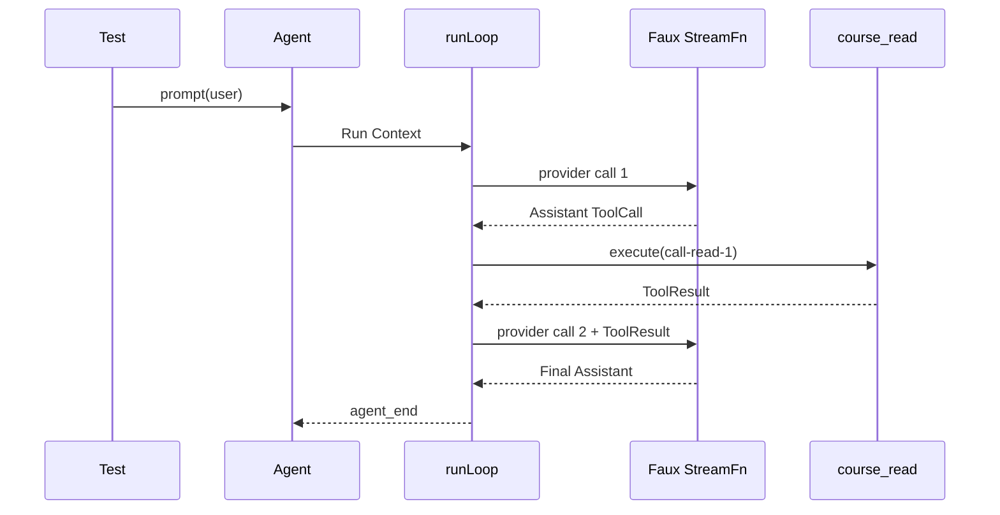

# 实验 01：不用真实 API，跑通 Prompt → Tool → Final Answer

## 实验目标

你将用 Faux Provider 完整证明：

```text
User Message
→ Assistant Tool Call
→ Tool Execute
→ Tool Result
→ 第二次 Provider Call
→ Final Assistant
→ agent_end
→ Listener settlement
```

完成后，你不再只是“知道有 Agent Loop”，而是能观察每个事件和状态。

## 1. 新建实验文件

```bash
mkdir -p packages/agent/test/course-labs
$EDITOR packages/agent/test/course-labs/01-fake-provider-loop.test.ts
```

把下面完整代码写入文件。

```ts
import {
    type AssistantMessage,
    type AssistantMessageEvent,
    EventStream,
    getModel,
} from "@earendil-works/pi-ai/compat";
import { Type } from "typebox";
import { describe, expect, it } from "vitest";
import {
    Agent,
    type AgentEvent,
    type AgentTool,
    type StreamFn,
} from "../../src/index.ts";

class MockAssistantStream extends EventStream<
    AssistantMessageEvent,
    AssistantMessage
> {
    constructor() {
        super(
            (event) => event.type === "done" || event.type === "error",
            (event) => {
                if (event.type === "done") return event.message;
                if (event.type === "error") return event.error;
                throw new Error("Unexpected event type");
            },
        );
    }
}

const EMPTY_USAGE = {
    input: 0,
    output: 0,
    cacheRead: 0,
    cacheWrite: 0,
    totalTokens: 0,
    cost: {
        input: 0,
        output: 0,
        cacheRead: 0,
        cacheWrite: 0,
        total: 0,
    },
};

function assistantText(text: string): AssistantMessage {
    return {
        role: "assistant",
        content: [{ type: "text", text }],
        api: "openai-responses",
        provider: "openai",
        model: "course-mock",
        usage: EMPTY_USAGE,
        stopReason: "stop",
        timestamp: Date.now(),
    };
}

function assistantToolCall(): AssistantMessage {
    return {
        role: "assistant",
        content: [
            {
                type: "toolCall",
                id: "call-read-1",
                name: "course_read",
                arguments: { path: "src/login.ts" },
            },
        ],
        api: "openai-responses",
        provider: "openai",
        model: "course-mock",
        usage: EMPTY_USAGE,
        stopReason: "toolUse",
        timestamp: Date.now(),
    };
}

const readSchema = Type.Object({
    path: Type.String({ minLength: 1 }),
});

const readTool: AgentTool<typeof readSchema, { path: string }> = {
    name: "course_read",
    label: "Course Read",
    description: "Read a teaching fixture",
    parameters: readSchema,
    async execute(toolCallId, params, signal, onUpdate) {
        expect(toolCallId).toBe("call-read-1");
        expect(params).toEqual({ path: "src/login.ts" });
        expect(signal?.aborted).toBe(false);

        onUpdate?.({
            content: [{ type: "text", text: "reading" }],
            details: { path: params.path },
        });

        return {
            content: [
                {
                    type: "text",
                    text: "export function login() { return 'ok'; }",
                },
            ],
            details: { path: params.path },
        };
    },
};

function createTwoTurnStream(): StreamFn {
    let providerCalls = 0;

    return (_model, context) => {
        providerCalls += 1;
        const stream = new MockAssistantStream();

        queueMicrotask(() => {
            if (providerCalls === 1) {
                expect(context.messages.at(-1)?.role).toBe("user");
                stream.push({
                    type: "done",
                    reason: "toolUse",
                    message: assistantToolCall(),
                });
                return;
            }

            expect(providerCalls).toBe(2);
            const last = context.messages.at(-1);
            expect(last?.role).toBe("toolResult");
            if (last?.role !== "toolResult") {
                throw new Error("Expected ToolResult before second model call");
            }
            expect(last.toolCallId).toBe("call-read-1");

            stream.push({
                type: "done",
                reason: "stop",
                message: assistantText("已经读取登录代码，当前实现返回 ok。"),
            });
        });

        return stream;
    };
}

function deferred(): {
    promise: Promise<void>;
    resolve(): void;
} {
    let resolve = () => {};
    const promise = new Promise<void>((done) => {
        resolve = done;
    });
    return { promise, resolve };
}

describe("course lab 01", () => {
    it("runs a complete two-turn tool loop", async () => {
        const events: AgentEvent[] = [];
        const agent = new Agent({
            initialState: {
                model: getModel("openai", "gpt-4o-mini"),
                tools: [readTool],
            },
            streamFn: createTwoTurnStream(),
        });

        agent.subscribe((event) => {
            events.push(event);
        });

        await agent.prompt("读取登录代码并说明当前行为");

        expect(agent.state.isStreaming).toBe(false);
        expect(agent.state.pendingToolCalls).toEqual(new Set());
        expect(agent.state.messages.map((message) => message.role)).toEqual([
            "user",
            "assistant",
            "toolResult",
            "assistant",
        ]);

        expect(events.map((event) => event.type)).toEqual([
            "agent_start",
            "turn_start",
            "message_start",
            "message_end",
            "message_start",
            "message_end",
            "tool_execution_start",
            "tool_execution_update",
            "tool_execution_end",
            "message_start",
            "message_end",
            "turn_end",
            "turn_start",
            "message_start",
            "message_end",
            "turn_end",
            "agent_end",
        ]);
    });

    it("does not become idle before an async agent_end listener settles", async () => {
        const barrier = deferred();
        const agent = new Agent({
            initialState: {
                model: getModel("openai", "gpt-4o-mini"),
            },
            streamFn: () => {
                const stream = new MockAssistantStream();
                queueMicrotask(() => {
                    stream.push({
                        type: "done",
                        reason: "stop",
                        message: assistantText("完成"),
                    });
                });
                return stream;
            },
        });

        agent.subscribe(async (event) => {
            if (event.type === "agent_end") {
                await barrier.promise;
            }
        });

        let promptResolved = false;
        const run = agent.prompt("开始").then(() => {
            promptResolved = true;
        });

        await new Promise((resolve) => setTimeout(resolve, 10));
        expect(promptResolved).toBe(false);
        expect(agent.state.isStreaming).toBe(true);

        barrier.resolve();
        await run;

        expect(promptResolved).toBe(true);
        expect(agent.state.isStreaming).toBe(false);
    });
});
```

## 2. 运行

```bash
npx vitest run packages/agent/test/course-labs/01-fake-provider-loop.test.ts
```

预期：两个测试全部通过。

## 3. 逐行观察 Provider Context

在 `createTwoTurnStream()` 中临时加入：

```ts
console.dir(
    context.messages.map((message) => ({
        role: message.role,
        toolCallId: "toolCallId" in message ? message.toolCallId : undefined,
    })),
    { depth: 5 },
);
```

第一次调用应看到：

```text
[user]
```

第二次调用应看到：

```text
[user, assistant(tool call), toolResult]
```

这证明 Tool Result 真正回到了下一次模型请求。

## 4. 画出本实验对象



## 5. 故障注入 A：参数校验失败

将 Tool Call 改为：

```ts
arguments: { path: 42 }
```

不要修改 Tool。重新运行后，`execute()` 不应被调用；Runtime 应生成 Error ToolResult，再发起下一模型 Turn。

为第二次 Faux Provider Call 增加断言：

```ts
expect(last.isError).toBe(true);
```

解释为什么参数错误仍然回到模型，而不是让整个 Runtime 直接崩溃。

## 6. 故障注入 B：Tool 抛异常

```ts
async execute() {
    throw new Error("fixture read failed");
}
```

断言：

```text
tool_execution_end.isError = true
ToolResult.isError = true
Agent 仍能进入第二 Model Turn
```

## 7. 故障注入 C：被截断的 Tool Call

将 AssistantMessage：

```ts
stopReason: "length"
```

即使参数 JSON 合法，Tool 也不应执行。Pi 会生成说明“参数可能被截断”的 Error ToolResult。

这验证副作用失败关闭。

## 8. 增加 Steer

让第一次 Faux Provider Call 暂停：

```ts
const providerBarrier = deferred();
```

在 Provider 返回 Tool Call 后、Tool Result 后的下一安全边界前调用：

```ts
agent.steer({
    role: "user",
    content: "先不要修改，只做分析",
    timestamp: Date.now(),
});
```

第二次 Provider Context 应为：

```text
user(original)
assistant(toolCall)
toolResult
user(steer)
```

Steer 不能插到 Tool Call 与 Tool Result 中间。

## 9. 增加 Follow-up

最终 Assistant 结束前排入：

```ts
agent.followUp({
    role: "user",
    content: "再总结一下调用链",
    timestamp: Date.now(),
});
```

Faux Stream 需要第三次调用并返回总结。观察它只在原任务本可停止时出现。

## 10. 增加 Abort

创建一个等待 Signal 的 Stream：

```ts
streamFn: (_model, _context, options) => {
    const stream = new MockAssistantStream();
    queueMicrotask(() => {
        stream.push({ type: "start", partial: assistantText("") });
        options?.signal?.addEventListener("abort", () => {
            const aborted = assistantText("");
            aborted.stopReason = "aborted";
            stream.push({
                type: "error",
                reason: "aborted",
                error: aborted,
            });
        }, { once: true });
    });
    return stream;
}
```

启动 Prompt 后调用：

```ts
agent.abort();
await agent.waitForIdle();
```

断言最终 Assistant `stopReason=aborted`，并且事件链仍有 `turn_end` 和 `agent_end`。

## 11. 你必须提交的证据

`EVENT_TRACE.jsonl` 每行保存：

```json
{
  "index": 1,
  "type": "tool_execution_start",
  "state": {
    "isStreaming": true,
    "pendingToolCalls": ["call-read-1"],
    "messageCount": 2
  }
}
```

在 Listener 中记录“事件到达后”的 State，证明 Pi 先归约状态再通知 Listener。

## 验收标准

- 两 Turn Tool Loop 测试通过；
- 参数错误、Tool 异常、Length 截断均不产生未授权副作用；
- Steer 只在 Tool Batch 后进入；
- Follow-up 只在原任务停止点进入；
- Abort 形成完整终态事件；
- Async Listener 未结束前 `prompt()`/`waitForIdle()` 不完成；
- 能口头解释每个事件对应的状态变化。

## 练习题

1. 第一次和第二次 Provider Context 的最后一条消息分别是什么？
2. 为什么 Tool Result Message 也要发 `message_start/message_end`？
3. 参数错误后为什么还会有第二次模型调用？
4. Steer 为什么不能插入 Tool Call 与 Result 中间？
5. Listener Barrier 为什么能证明 `agent_end` 不等于立即 Idle？
