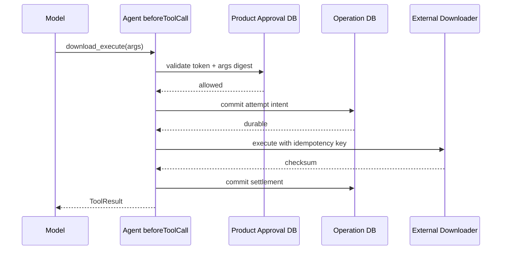

# 实验 02：给写 Tool 加上审批、参数摘要、幂等和 Crash Recovery

## 实验目标

实现一个受控 `download_execute` Tool，并证明：

```text
没有审批          → Tool 不执行
审批与参数不匹配   → Tool 不执行
相同幂等键重复请求 → 外部副作用只发生一次
副作用后本地崩溃   → 状态进入 unknown，不盲目重放
```

## 1. 业务输入

```ts
type DownloadArgs = {
    planId: string;
    planDigest: string;
    approvalToken: string;
    idempotencyKey: string;
};
```

审批不能只绑定 `toolName`。它至少绑定：

```text
sessionId
toolName
planId
planDigest
expiresAt
```

否则用户批准 Plan A 后，模型可以用同一个 Token 执行 Plan B。

## 2. 建立学习文件

```bash
$EDITOR packages/agent/test/course-labs/02-tool-approval-idempotency.test.ts
```

先复用实验 01 中的：

```text
MockAssistantStream
EMPTY_USAGE
assistantText()
```

然后加入下面的核心实现。

## 3. Approval Store

```ts
import { createHash } from "node:crypto";
import { Type } from "typebox";
import type { AgentTool } from "../../src/index.ts";

function canonicalJson(value: unknown): string {
    if (Array.isArray(value)) {
        return `[${value.map(canonicalJson).join(",")}]`;
    }
    if (value && typeof value === "object") {
        const record = value as Record<string, unknown>;
        return `{${Object.keys(record)
            .sort()
            .map((key) => `${JSON.stringify(key)}:${canonicalJson(record[key])}`)
            .join(",")}}`;
    }
    return JSON.stringify(value);
}

function digest(value: unknown): string {
    return createHash("sha256").update(canonicalJson(value)).digest("hex");
}

type Approval = {
    token: string;
    sessionId: string;
    toolName: string;
    argsDigest: string;
    expiresAt: number;
};

class ApprovalStore {
    private readonly approvals = new Map<string, Approval>();

    issue(input: Omit<Approval, "token">): Approval {
        const token = `approval-${this.approvals.size + 1}`;
        const approval = { ...input, token };
        this.approvals.set(token, approval);
        return approval;
    }

    validate(input: {
        token: string;
        sessionId: string;
        toolName: string;
        args: unknown;
        now: number;
    }): { ok: true } | { ok: false; reason: string } {
        const approval = this.approvals.get(input.token);
        if (!approval) return { ok: false, reason: "approval not found" };
        if (approval.expiresAt <= input.now) {
            return { ok: false, reason: "approval expired" };
        }
        if (approval.sessionId !== input.sessionId) {
            return { ok: false, reason: "approval belongs to another session" };
        }
        if (approval.toolName !== input.toolName) {
            return { ok: false, reason: "approval belongs to another tool" };
        }
        if (approval.argsDigest !== digest(input.args)) {
            return { ok: false, reason: "approved arguments changed" };
        }
        return { ok: true };
    }
}
```

## 4. Operation Store

```ts
type OperationStatus =
    | "starting"
    | "running"
    | "completed"
    | "failed"
    | "unknown";

type OperationRecord = {
    idempotencyKey: string;
    status: OperationStatus;
    externalOperationId?: string;
    checksum?: string;
    error?: string;
};

class OperationStore {
    readonly records = new Map<string, OperationRecord>();

    get(key: string): OperationRecord | undefined {
        return this.records.get(key);
    }

    create(key: string): OperationRecord {
        if (this.records.has(key)) {
            throw new Error(`operation already exists: ${key}`);
        }
        const record: OperationRecord = {
            idempotencyKey: key,
            status: "starting",
        };
        this.records.set(key, record);
        return record;
    }
}
```

生产实现应使用数据库唯一约束，而不是“先 `has()` 再 `set()`”；后者在多进程中仍有竞态。

## 5. Fake External Downloader

```ts
class FakeDownloader {
    calls = 0;
    readonly completed = new Map<string, { checksum: string }>();

    async execute(input: {
        externalOperationId: string;
        planId: string;
        signal?: AbortSignal;
    }): Promise<{ checksum: string }> {
        input.signal?.throwIfAborted();
        this.calls += 1;

        const existing = this.completed.get(input.externalOperationId);
        if (existing) return existing;

        const result = { checksum: `sha256:${input.planId}` };
        this.completed.set(input.externalOperationId, result);
        return result;
    }

    inspect(externalOperationId: string): { checksum: string } | undefined {
        return this.completed.get(externalOperationId);
    }
}
```

这里用稳定 `externalOperationId=idempotencyKey` 模拟服务端幂等。

## 6. Tool

```ts
const downloadSchema = Type.Object({
    planId: Type.String({ minLength: 1 }),
    planDigest: Type.String({ minLength: 1 }),
    approvalToken: Type.String({ minLength: 1 }),
    idempotencyKey: Type.String({ minLength: 1 }),
});

function createDownloadTool(
    operations: OperationStore,
    downloader: FakeDownloader,
): AgentTool<typeof downloadSchema, OperationRecord> {
    return {
        name: "download_execute",
        label: "Execute approved download",
        description: "Execute one immutable, approved download plan",
        parameters: downloadSchema,
        executionMode: "sequential",
        async execute(_toolCallId, args, signal, onUpdate) {
            const existing = operations.get(args.idempotencyKey);
            if (existing?.status === "completed") {
                return {
                    content: [{
                        type: "text",
                        text: `Already completed: ${existing.checksum}`,
                    }],
                    details: existing,
                };
            }
            if (existing?.status === "unknown") {
                const inspected = downloader.inspect(args.idempotencyKey);
                if (!inspected) {
                    return {
                        content: [{
                            type: "text",
                            text: "Previous outcome is unknown; external state must be inspected before replay.",
                        }],
                        details: existing,
                        terminate: true,
                    };
                }
                existing.status = "completed";
                existing.checksum = inspected.checksum;
                return {
                    content: [{ type: "text", text: "Recovered completed download." }],
                    details: existing,
                };
            }
            if (existing) {
                return {
                    content: [{ type: "text", text: `Operation is ${existing.status}.` }],
                    details: existing,
                    terminate: true,
                };
            }

            const record = operations.create(args.idempotencyKey);
            record.status = "running";
            record.externalOperationId = args.idempotencyKey;
            onUpdate?.({
                content: [{ type: "text", text: "download started" }],
                details: { ...record },
            });

            try {
                const result = await downloader.execute({
                    externalOperationId: args.idempotencyKey,
                    planId: args.planId,
                    signal,
                });
                record.status = "completed";
                record.checksum = result.checksum;
                return {
                    content: [{
                        type: "text",
                        text: `Download completed: ${result.checksum}`,
                    }],
                    details: { ...record },
                };
            } catch (error) {
                record.status = signal?.aborted ? "unknown" : "failed";
                record.error = error instanceof Error ? error.message : String(error);
                throw error;
            }
        },
    };
}
```

注意：真实系统不能仅凭 `signal.aborted` 判断外部副作用没发生。连接断开后通常应进入 `unknown`，再查询外部状态。

## 7. Before Hook

```ts
const sessionId = "session-course-2";
const approvalStore = new ApprovalStore();

const agent = new Agent({
    initialState: {
        model: getModel("openai", "gpt-4o-mini"),
        tools: [downloadTool],
    },
    streamFn,
    beforeToolCall: async ({ toolCall, args }) => {
        if (toolCall.name !== "download_execute") return;

        const token = (args as { approvalToken: string }).approvalToken;
        const result = approvalStore.validate({
            token,
            sessionId,
            toolName: toolCall.name,
            args,
            now: Date.now(),
        });

        if (!result.ok) {
            return {
                block: true,
                reason: result.reason,
                terminate: true,
            };
        }
    },
});
```

审批发生在参数校验后、副作用前。

## 8. 参数摘要应排除 Token 本身

上面直接对全部 Args Hash 有一个问题：签发 Approval 时还没有 `approvalToken`，加入 Token 后摘要会变化。

改成：

```ts
function approvalPayload(args: DownloadArgs) {
    return {
        planId: args.planId,
        planDigest: args.planDigest,
        idempotencyKey: args.idempotencyKey,
    };
}
```

签发和验证都 Hash `approvalPayload(args)`。这是本实验必须修正的第一个设计问题。

## 9. 必做测试

### 无审批

```text
Tool Call approvalToken=missing
→ beforeToolCall block
→ downloader.calls=0
→ Error ToolResult
→ terminate=true
```

### 审批过期

设置 `expiresAt=Date.now()-1`，断言副作用为 0。

### 参数篡改

审批 `planDigest=A`，Tool Call 使用 `planDigest=B`，断言被拒绝。

### 重复幂等键

两次执行相同参数和 `idempotencyKey`：

```text
downloader.calls = 1
第二次 Result = Already completed
checksum 相同
```

### ID 重用但参数不同

同一 `idempotencyKey`，`planId` 改变，应在审批或 Operation Store 层拒绝，不能返回旧结果伪装成功。为 Operation Record 增加 `argsDigest` 并验证。

## 10. 故障注入：Effect 后、Settlement 前崩溃

在 Downloader 成功后、写 `record.status=completed` 前：

```ts
const result = await downloader.execute(...);
record.status = "unknown";
throw new Error("simulated crash after external success");
```

重试同一请求时：

```text
Operation status=unknown
→ downloader.inspect(idempotencyKey)
→ 找到外部成功
→ 补写 completed/checksum
→ 不再次执行
```

断言 `downloader.calls=1`。

## 11. 事件证据

记录：

```text
tool_execution_start
[approval block 时无 progress]
tool_execution_update
tool_execution_end
toolResult message
turn_end
agent_end
```

审批拒绝仍会有 `tool_execution_start` 和 `tool_execution_end(isError=true)`，因为 Tool Call 生命周期已经开始，但 `execute()` 未发生。

## 12. 产品级正确边界



Pi 负责 Tool 生命周期；产品数据库负责审批和副作用 Attempt 的权威状态。

## 验收标准

- Approval 与 Session/Tool/Args Digest/Expiry 绑定；
- 未授权调用不能触发 Fake Downloader；
- 相同 Idempotency Key 只执行一次；
- Key 与不同参数复用会失败；
- Effect 后崩溃能通过 Inspect 恢复；
- Unknown Outcome 不盲目重放；
- Tool Result 清楚区分 Completed/Blocked/Unknown；
- 事件序列完整。

## 练习题

1. 为什么审批摘要不能包含 `approvalToken` 本身？
2. `idempotencyKey` 只做数据库主键还缺什么校验？
3. Abort 后为什么常常应该标记 `unknown`，而不是 `cancelled`？
4. 哪个 Crash Point 最危险？恢复依据是什么？
5. `beforeToolCall` 与 Tool 内部 Operation Store 各自防哪类错误？
