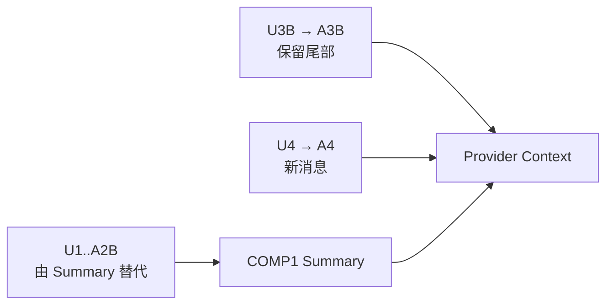

# 实验 03（校正版）：Session Tree、Compaction、Fork 与恢复

> 本文件替代同目录旧 README 中故意保留的错误 Compaction 断言。这里给出可以直接作为验收基准的正确结果。

## 正确的 Compaction 语义

给定当前 Branch：

```text
U1 → A1 → M1 → TH1 → U2 → A2B → U3B → A3B → COMP1 → U4 → A4
```

其中：

```ts
COMP1.firstKeptEntryId = "U3B";
```

Compaction 只用 Summary 替换 `U3B` 之前的活动历史。`U3B` 开始的保留尾部，以及 Compaction 之后的新 Entry，都继续进入 Provider Context。



因此：

```ts
const activeEntries = buildContextEntries(entries, "A4");
expect(activeEntries.map((entry) => entry.id)).toEqual([
    "COMP1",
    "U3B",
    "A3B",
    "U4",
    "A4",
]);
```

对应 Provider Context：

```ts
const context = buildSessionContext(entries, "A4");
expect(context.messages.map((message) => message.role)).toEqual([
    "compactionSummary",
    "user",
    "assistant",
    "user",
    "assistant",
]);
```

完整 Session Entry 仍保留：

```ts
expect(entries.some((entry) => entry.id === "U1")).toBe(true);
expect(entries.some((entry) => entry.id === "A2B")).toBe(true);
```

这证明：

```text
Compaction 改变活动 Context 投影
≠ 删除完整 Session 历史
```

## 其余实验验收

继续完成旧 README 中的其他部分，但以本文件作为 Compaction 断言基准：

1. 同一个 Append-only Entry List 根据不同 Leaf 生成 Branch A/B；
2. Model/Thinking 从当前 Branch 恢复；
3. `custom` 不进入 Provider Context，`custom_message` 会进入；
4. v1 线性 Entry 稳定迁移到 v3 Tree；
5. Tree Validator 检测 Missing Parent、重复 ID 和 Parent Cycle；
6. Fork 创建新 Session Identity，源 Session/Leaf 不变；
7. Session Replacement 后旧 Extension Context 变为 stale；
8. Reopen 恢复 Messages、Model、Thinking、Compaction、Dynamic Tool、cwd 和 Binding。

## 为什么不保留“先运行错误断言再修”的教学方式

课程目标是让 README 本身成为可执行教材。故意提供失败的最终断言会让读者无法区分：

- 实验预期故障；
- 课程错误；
- 上游行为变化；
- 自己实现错误。

故障注入应有明确标签和预期结果；基线测试必须先是正确的。
