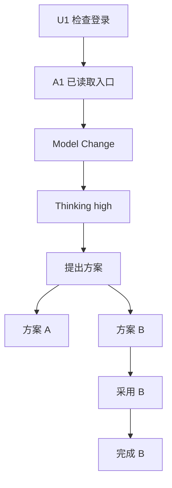

# 实验 03：手工构造 Session Tree，验证 Branch、Compaction、Fork 与恢复

## 实验目标

你将直接操作 Session Entry，证明：

- JSONL 物理顺序不等于当前 Branch；
- `leafId` 决定活动路径；
- Model/Thinking 从 Branch 恢复；
- Custom Entry 不进入模型，Custom Message 会进入；
- Compaction 只改变 Context 投影，不删除旧 Entry；
- Fork 前后源 Branch 保持不变；
- 中间坏 Parent 必须失败关闭或显式诊断。

## 1. 新建测试

```bash
mkdir -p packages/coding-agent/test/course-labs
$EDITOR packages/coding-agent/test/course-labs/03-session-tree-recovery.test.ts
```

## 2. 完整测试骨架

```ts
import type { AgentMessage } from "@earendil-works/pi-agent-core";
import type { AssistantMessage } from "@earendil-works/pi-ai/compat";
import { describe, expect, it } from "vitest";
import {
    buildContextEntries,
    buildSessionContext,
    migrateSessionEntries,
    type FileEntry,
    type SessionEntry,
} from "../../src/core/session-manager.ts";

const EMPTY_USAGE = {
    input: 0,
    output: 0,
    cacheRead: 0,
    cacheWrite: 0,
    totalTokens: 0,
    cost: {
        input: 0,
        output: 0,
        cacheRead: 0,
        cacheWrite: 0,
        total: 0,
    },
};

function user(text: string, timestamp: number): AgentMessage {
    return { role: "user", content: text, timestamp };
}

function assistant(text: string, timestamp: number): AssistantMessage {
    return {
        role: "assistant",
        content: [{ type: "text", text }],
        api: "openai-responses",
        provider: "openai",
        model: "course-model",
        usage: EMPTY_USAGE,
        stopReason: "stop",
        timestamp,
    };
}

function messageEntry(
    id: string,
    parentId: string | null,
    message: AgentMessage,
): SessionEntry {
    return {
        type: "message",
        id,
        parentId,
        timestamp: new Date(message.timestamp ?? 0).toISOString(),
        message,
    };
}

function rolesAndText(context: ReturnType<typeof buildSessionContext>) {
    return context.messages.map((message) => {
        if (message.role === "assistant") {
            return `assistant:${message.content
                .filter((block) => block.type === "text")
                .map((block) => block.text)
                .join("")}`;
        }
        if (message.role === "user") {
            return `user:${typeof message.content === "string"
                ? message.content
                : message.content
                    .filter((block) => block.type === "text")
                    .map((block) => block.text)
                    .join("")}`;
        }
        if (message.role === "custom") {
            return `custom:${message.customType}`;
        }
        return message.role;
    });
}

function baseTree(): SessionEntry[] {
    return [
        messageEntry("U1", null, user("检查登录", 1)),
        messageEntry("A1", "U1", assistant("已读取入口", 2)),
        {
            type: "model_change",
            id: "M1",
            parentId: "A1",
            timestamp: new Date(3).toISOString(),
            provider: "openai",
            modelId: "course-model",
        },
        {
            type: "thinking_level_change",
            id: "TH1",
            parentId: "M1",
            timestamp: new Date(4).toISOString(),
            thinkingLevel: "high",
        },
        messageEntry("U2", "TH1", user("提出修复方案", 5)),
        messageEntry("A2A", "U2", assistant("方案 A：修改前端", 6)),
        messageEntry("A2B", "U2", assistant("方案 B：修复 Session 提交", 7)),
        messageEntry("U3B", "A2B", user("采用方案 B", 8)),
        messageEntry("A3B", "U3B", assistant("已完成方案 B", 9)),
    ];
}

describe("course lab 03", () => {
    it("builds two different branches from one append-only entry list", () => {
        const entries = baseTree();

        const branchA = buildSessionContext(entries, "A2A");
        const branchB = buildSessionContext(entries, "A3B");

        expect(rolesAndText(branchA)).toEqual([
            "user:检查登录",
            "assistant:已读取入口",
            "user:提出修复方案",
            "assistant:方案 A：修改前端",
        ]);

        expect(rolesAndText(branchB)).toEqual([
            "user:检查登录",
            "assistant:已读取入口",
            "user:提出修复方案",
            "assistant:方案 B：修复 Session 提交",
            "user:采用方案 B",
            "assistant:已完成方案 B",
        ]);

        expect(branchA.model).toEqual({
            provider: "openai",
            modelId: "course-model",
        });
        expect(branchA.thinkingLevel).toBe("high");
    });

    it("keeps custom state out of context but projects custom messages", () => {
        const entries = baseTree();
        entries.push(
            {
                type: "custom",
                id: "CSTATE",
                parentId: "A3B",
                timestamp: new Date(10).toISOString(),
                customType: "course.approval-state",
                data: { approvalId: "approval-7" },
            },
            {
                type: "custom_message",
                id: "CMSG",
                parentId: "CSTATE",
                timestamp: new Date(11).toISOString(),
                customType: "course.approval-context",
                content: "用户已批准只执行 Plan 7。",
                display: false,
                details: { approvalId: "approval-7" },
            },
        );

        const context = buildSessionContext(entries, "CMSG");
        const customMessages = context.messages.filter(
            (message) => message.role === "custom",
        );

        expect(customMessages).toHaveLength(1);
        expect(customMessages[0]).toMatchObject({
            customType: "course.approval-context",
        });
        expect(JSON.stringify(context.messages)).not.toContain(
            "course.approval-state",
        );
    });

    it("uses the latest compaction summary plus retained tail", () => {
        const entries = baseTree();
        entries.push({
            type: "compaction",
            id: "COMP1",
            parentId: "A3B",
            timestamp: new Date(10).toISOString(),
            summary: "目标：修复登录；已选择方案 B；下一步运行测试。",
            firstKeptEntryId: "U3B",
            tokensBefore: 120_000,
            details: {
                readFiles: ["src/login.ts"],
                modifiedFiles: ["src/session.ts"],
            },
        });
        entries.push(
            messageEntry("U4", "COMP1", user("运行测试", 11)),
            messageEntry("A4", "U4", assistant("测试通过", 12)),
        );

        const activeEntries = buildContextEntries(entries, "A4");
        expect(activeEntries.map((entry) => entry.id)).toEqual([
            "COMP1",
            "U4",
            "A4",
        ]);

        const context = buildSessionContext(entries, "A4");
        expect(context.messages.map((message) => message.role)).toEqual([
            "compactionSummary",
            "user",
            "assistant",
        ]);

        // 完整树仍然保留压缩前 Entry。
        expect(entries.some((entry) => entry.id === "U1")).toBe(true);
        expect(entries.some((entry) => entry.id === "A2B")).toBe(true);
    });

    it("migrates a v1 linear session into a tree", () => {
        const fileEntries: FileEntry[] = [
            {
                type: "session",
                id: "legacy-session",
                timestamp: new Date(0).toISOString(),
                cwd: "/tmp/course",
            },
            {
                type: "message",
                message: user("旧消息 1", 1),
            } as unknown as FileEntry,
            {
                type: "message",
                message: assistant("旧消息 2", 2),
            } as unknown as FileEntry,
        ];

        migrateSessionEntries(fileEntries);

        const header = fileEntries[0];
        expect(header.type).toBe("session");
        if (header.type !== "session") throw new Error("expected header");
        expect(header.version).toBe(3);

        const first = fileEntries[1] as SessionEntry;
        const second = fileEntries[2] as SessionEntry;
        expect(first.id).toBeTruthy();
        expect(first.parentId).toBeNull();
        expect(second.parentId).toBe(first.id);
    });
});
```

## 3. 运行

```bash
npx vitest run packages/coding-agent/test/course-labs/03-session-tree-recovery.test.ts
```

## 4. 手工画树



物理数组中 A2A 先于 A2B，但 leaf=A3B 时 A2A 不在 Context。

## 5. 为什么 Compaction 测试里没有保留 `U3B`

本测试把 `CompactionEntry` 追加在 `A3B` 之后，而 `firstKeptEntryId=U3B` 位于 Compaction 之前。当前 `buildContextEntries()` 会：

```text
Compaction Entry
+ 从 firstKeptEntryId 到 Compaction 前的 retained entries
+ Compaction 后的新 entries
```

因此更严格的预期应包含：

```text
COMP1, U3B, A3B, U4, A4
```

请先运行测试观察失败，再把断言改成真实结果。这是本实验故意留下的“读实现而不是相信教材断言”的任务。

修正后检查 Provider Context：

```text
compactionSummary
user:采用方案 B
assistant:已完成方案 B
user:运行测试
assistant:测试通过
```

## 6. 增加坏 Parent 诊断

加入：

```ts
messageEntry("BROKEN", "DOES_NOT_EXIST", user("坏节点", 20))
```

当前低层 `buildSessionPath()` 找不到 Parent 时会在已找到节点处停止。产品导入/修复流程不能把这种结果当成健康 Session。

写一个验证器：

```ts
function validateTree(entries: SessionEntry[]): string[] {
    const ids = new Set(entries.map((entry) => entry.id));
    const errors: string[] = [];

    for (const entry of entries) {
        if (entry.parentId && !ids.has(entry.parentId)) {
            errors.push(`${entry.id}: missing parent ${entry.parentId}`);
        }
    }
    return errors;
}
```

再补：

- 重复 ID；
- Parent 循环；
- 多个 Header；
- 不支持的版本；
- Compaction `firstKeptEntryId` 不在当前 Branch。

## 7. 模拟 Fork

Fork 的核心不是复制全数组，而是：

```text
选择 target leaf
→ 当前 Branch 作为新 Session 的基础
→ 新 Header 记录 parentSession
→ 源 Session 不改
→ 新 Session 后续独立 Append
```

写教学函数：

```ts
function forkEntries(
    source: SessionEntry[],
    targetLeafId: string,
): SessionEntry[] {
    const active = new Set(
        buildContextEntries(source, targetLeafId).map((entry) => entry.id),
    );
    return source.filter((entry) => active.has(entry.id));
}
```

然后说明它为什么还不等同于生产 `createBranchedSession()`：

- `buildContextEntries()` 会去掉被压缩历史，而生产 Fork 可能需要完整 Branch；
- 没有新 Header/Session ID；
- 没有原子文件发布；
- 没有 Session Shutdown/Extension Invalidating；
- 没有重新绑定 cwd-bound Services。

## 8. 可选扩展：真实持久 Session

使用临时目录：

```ts
import { mkdtemp, readFile, rm } from "node:fs/promises";
import { tmpdir } from "node:os";
import { join } from "node:path";
import { SessionManager } from "../../src/core/session-manager.ts";

const root = await mkdtemp(join(tmpdir(), "pi-course-session-"));
try {
    const manager = SessionManager.create(root, root);
    const u1 = manager.appendMessage(user("hello", Date.now()));
    const a1 = manager.appendMessage(assistant("hi", Date.now()));
    expect(manager.getLeafId()).toBe(a1);

    const file = manager.getSessionFile();
    if (!file) throw new Error("expected persisted session");
    console.log(await readFile(file, "utf8"));
} finally {
    await rm(root, { recursive: true, force: true });
}
```

根据当前构造签名调整 `SessionManager.create()` 参数；先阅读其静态工厂，不凭记忆硬写。

## 9. 恢复清单

恢复 Session 时断言：

```text
messages
model
thinkingLevel
leafId
compaction context
custom state
custom messages
dynamic tools
cwd
session file
parent session
```

只断言聊天文本不足以证明恢复正确。

## 验收标准

- 两个 leaf 生成不同 Branch；
- Model/Thinking 从 Branch 恢复；
- Custom State 与 Custom Message 可区分；
- Compaction Context 断言按真实实现修正；
- 完整旧 Entry 仍在内存/文件；
- v1 Session 稳定迁移到 v3；
- Tree Validator 检测 Missing Parent/重复/循环；
- 能解释教学 Fork 与生产 Fork 的差距；
- 写出完整恢复字段清单。

## 练习题

1. 为什么本实验故意放了一个错误 Compaction 断言？
2. `buildContextEntries()` 与完整 Branch 有什么区别？
3. Fork 为什么不能只复制当前 Provider Context？
4. 缺失 Parent 时静默截断会造成什么假象？
5. Session 恢复只对比消息文本会漏掉哪些状态？
