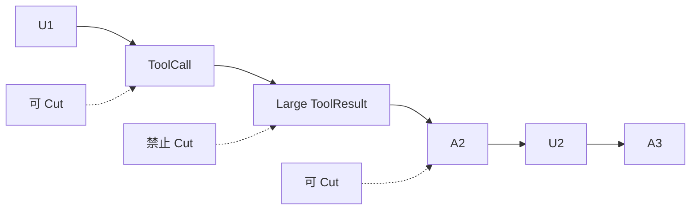

# 实验 04：手算 Context，触发 Compaction，注入 Retry 与 Abort

## 实验目标

不用真实 API 先证明：

- Provider Usage 与 trailing messages 怎样合成 Context Estimate；
- Threshold 怎样计算；
- Tool Result 不能作为 Cut Point；
- Split Turn 怎样定位 Turn Start；
- Overflow Recovery 为什么只能有限执行；
- Retry Delay 和 Summary Request 必须可取消；
- Compaction 期间 Steer/Follow-up 不丢失。

## 1. 纯函数实验

新建：

```bash
$EDITOR packages/coding-agent/test/course-labs/04-compaction-math.test.ts
```

```ts
import type { AgentMessage } from "@earendil-works/pi-agent-core";
import type { AssistantMessage, Usage } from "@earendil-works/pi-ai/compat";
import { describe, expect, it } from "vitest";
import {
    calculateContextTokens,
    DEFAULT_COMPACTION_SETTINGS,
    estimateContextTokens,
    findTurnStartIndex,
    shouldCompact,
} from "../../src/core/compaction/compaction.ts";
import type { SessionEntry } from "../../src/core/session-manager.ts";

function usage(totalTokens: number): Usage {
    return {
        input: totalTokens - 100,
        output: 100,
        cacheRead: 0,
        cacheWrite: 0,
        totalTokens,
        cost: {
            input: 0,
            output: 0,
            cacheRead: 0,
            cacheWrite: 0,
            total: 0,
        },
    };
}

function assistant(text: string, totalTokens: number): AssistantMessage {
    return {
        role: "assistant",
        content: [{ type: "text", text }],
        api: "openai-responses",
        provider: "openai",
        model: "course-model",
        usage: usage(totalTokens),
        stopReason: "stop",
        timestamp: Date.now(),
    };
}

describe("course lab 04 compaction math", () => {
    it("uses the latest valid assistant usage plus trailing messages", () => {
        const messages: AgentMessage[] = [
            { role: "user", content: "x".repeat(4_000), timestamp: 1 },
            assistant("baseline", 50_000),
            {
                role: "toolResult",
                toolCallId: "call-1",
                toolName: "read",
                content: [{ type: "text", text: "y".repeat(8_000) }],
                isError: false,
                timestamp: 3,
            },
        ];

        const estimate = estimateContextTokens(messages);

        expect(estimate.usageTokens).toBe(50_000);
        expect(estimate.trailingTokens).toBe(2_000);
        expect(estimate.tokens).toBe(52_000);
        expect(estimate.lastUsageIndex).toBe(1);
    });

    it("does not use aborted or zero usage as a baseline", () => {
        const aborted = assistant("", 0);
        aborted.stopReason = "aborted";

        const messages: AgentMessage[] = [
            { role: "user", content: "a".repeat(4_000), timestamp: 1 },
            aborted,
        ];

        const estimate = estimateContextTokens(messages);
        expect(estimate.usageTokens).toBe(0);
        expect(estimate.lastUsageIndex).toBeNull();
        expect(estimate.tokens).toBeGreaterThanOrEqual(1_000);
    });

    it("calculates the threshold independently from keepRecentTokens", () => {
        const settings = {
            ...DEFAULT_COMPACTION_SETTINGS,
            reserveTokens: 16_384,
            keepRecentTokens: 20_000,
        };

        expect(shouldCompact(111_616, 128_000, settings)).toBe(false);
        expect(shouldCompact(111_617, 128_000, settings)).toBe(true);

        const changedKeepRecent = {
            ...settings,
            keepRecentTokens: 2_000,
        };
        expect(shouldCompact(111_617, 128_000, changedKeepRecent)).toBe(true);
    });

    it("finds the user-like start of a turn", () => {
        const entries: SessionEntry[] = [
            {
                type: "message",
                id: "U1",
                parentId: null,
                timestamp: new Date(1).toISOString(),
                message: { role: "user", content: "修复登录", timestamp: 1 },
            },
            {
                type: "message",
                id: "A1",
                parentId: "U1",
                timestamp: new Date(2).toISOString(),
                message: {
                    ...assistant("", 10_000),
                    content: [{
                        type: "toolCall",
                        id: "call-1",
                        name: "read",
                        arguments: { path: "src/login.ts" },
                    }],
                    stopReason: "toolUse",
                },
            },
            {
                type: "message",
                id: "T1",
                parentId: "A1",
                timestamp: new Date(3).toISOString(),
                message: {
                    role: "toolResult",
                    toolCallId: "call-1",
                    toolName: "read",
                    content: [{ type: "text", text: "file content" }],
                    isError: false,
                    timestamp: 3,
                },
            },
        ];

        expect(findTurnStartIndex(entries, 2, 0)).toBe(0);
        expect(findTurnStartIndex(entries, 1, 0)).toBe(0);
    });

    it("uses totalTokens when the provider supplies it", () => {
        expect(calculateContextTokens(usage(42_000))).toBe(42_000);
    });
});
```

运行：

```bash
npx vitest run packages/coding-agent/test/course-labs/04-compaction-math.test.ts
```

## 2. 手算验证

第一个测试：

```text
Last valid Assistant Usage = 50,000
Trailing Tool Result chars = 8,000
本地估算 = ceil(8,000 / 4) = 2,000
总 Context Estimate = 52,000
```

注意前面的 User 4,000 字符已经包含在 Assistant Usage 中，不能再次相加。

## 3. Cut Point 手工实验

构造：

```text
U1(100 tokens)
A1 ToolCall(100)
T1(20,000)
A2(100)
U2(100)
A3(100)
```

从末尾向前累加，`keepRecentTokens=20,250` 时可能跨过 T1。

不能选择 T1 作为第一保留 Entry。可选择：

- A1：保留 Tool Call + T1；
- A2：完全舍弃 A1/T1，并由摘要覆盖；

具体选择取决于当前算法的有效 Cut Point 与累计值。



把源码中的 `findValidCutPoints()`、向后累计逻辑和 `findTurnStartIndex()` 按真实输入手算一遍，记录每步累计 Token。

## 4. 从现有测试复制一个 Faux Compaction Fixture

源码已有：

```text
packages/coding-agent/test/agent-session-compaction.test.ts
packages/coding-agent/test/agent-session-auto-compaction-queue.test.ts
packages/coding-agent/test/agent-session-retry.test.ts
```

真实 API E2E 会因没有 Key 被 Skip。你的实验应复制其 Session 构造方式，但把 Agent Stream 和 Summary Completion 替换为 Faux Provider。

最小构造对象：

```text
Agent
SessionManager.inMemory()
SettingsManager with small compaction limits
ModelRuntime test fixture
Test ResourceLoader
AgentSession
Event collector
```

## 5. Faux Summary Provider 设计

让 Provider 根据 System Prompt 或调用序号识别请求：

```ts
let calls = 0;

const streamFn: StreamFn = (_model, context) => {
    calls += 1;
    if (context.systemPrompt?.includes("Summarize")) {
        return doneStream("Goal: course compaction; Pending: continue test.");
    }
    if (calls === 1) {
        return errorStream("context_length_exceeded");
    }
    return doneStream("Recovered after compaction");
};
```

当前 Compaction 可能通过 `ModelRuntime.completeSimple()` 而不是 Agent StreamFn；阅读 `_getSummarizationRequestAuth()` 和 `compact()` 调用链，把 Faux 放在真正的摘要入口，不要只 Mock 错函数。

## 6. 必做 Overflow Recovery 断言

事件应表达：

```text
第一次 Agent Run error overflow
agent_end(willRetry/compaction path)
compaction_start reason=overflow
Compaction Entry committed
第二次 Agent continue
最终 Assistant success
agent_settled
```

断言：

- UserMessage 只持久化一次；
- Compaction Entry 恰好一条；
- Overflow Recovery 不超过一次；
- 最终只有一个产品级 `agent_settled`；
- Compaction Usage 进入 Session Stats。

## 7. Retry Delay Abort

写可取消 Delay 测试：

```ts
const controller = new AbortController();
const waiting = sleepWithSignal(10_000, controller.signal);
controller.abort();
await expect(waiting).rejects.toThrow();
```

再把同样 Signal 贯穿：

```text
AgentSession.abort
→ Retry Controller
→ Summary Request
→ Auth Resolve
→ Delay
```

只取消外层 Promise、内部 Timer 仍存活不算完整。

## 8. Compaction 期间排队消息

基于 `agent-session-auto-compaction-queue.test.ts`，创建 Barrier：

```text
Compaction 已开始但未完成
→ session.steer("先检查数据库")
→ session.followUp("完成后总结")
→ 释放 Summary Barrier
```

断言：

```text
Steer/Follow-up Queue 在 Context 替换后仍存在
下一安全边界按原语义消费
消息没有重复持久化
```

## 9. `session_compact_failed` 故障注入

让 Faux Summary 抛：

```text
429 可重试
永久 400
AbortError
```

产品投影至少验证：

| 场景 | `aborted` | `willRetry` | 最终状态 |
|---|---:|---:|---|
| 429 且有次数 | false | true | 仍 Working |
| 重试耗尽 | false | false | Failed/Settling |
| 用户取消 | true | false | Cancelled/Settled |

不要把失败当成 `session_compact` 成功事件。

## 10. 摘要质量验收

给 Faux Summary 输入一段包含：

```text
Goal
Architecture decision
Read files
Modified files
Failing test
Pending work
User constraint
```

断言摘要正文保留每类字段。摘要文本不是随便短就合格。

建议输出结构：

```markdown
## Goal
## Constraints
## Decisions
## Completed
## Evidence
## Files
## Pending
```

## 11. 故障矩阵

- 无 Provider Usage；
- Usage 后有大 Tool Result；
- Error/Aborted Usage；
- Threshold 边界等于/超过；
- ToolResult 附近 Cut；
- Split Turn；
- Previous Compaction；
- Manual/Threshold/Overflow；
- Summary 429/400/Abort；
- Compaction 中 Steer/Follow-up；
- 两个 Compaction 并发；
- Host Restart 后 Context 恢复；
- Summary 过长仍 Overflow。

## 验收标准

- 纯函数测试全部通过；
- 能手算至少两个 Context Estimate；
- 能解释合法/非法 Cut Point；
- Faux Overflow Recovery 只执行一次；
- Retry Delay 可立即 Abort；
- Compaction 期间队列不丢；
- `session_compact_failed` 投影区分 Abort/Retry/Final Failure；
- 摘要保留完整工程状态；
- Session Stats 包含 Compaction Usage。

## 练习题

1. 为什么 Assistant Usage 前的 User 不再重复估算？
2. `keepRecentTokens` 是否影响触发阈值？
3. Tool Result 为什么不能作为 Cut Point？
4. Faux Summary 应 Mock 哪个真实调用边界？
5. Overflow Recovery 为什么只允许有限次数？
6. Compaction 期间的 Steer 为什么不属于待压缩消息数组？
