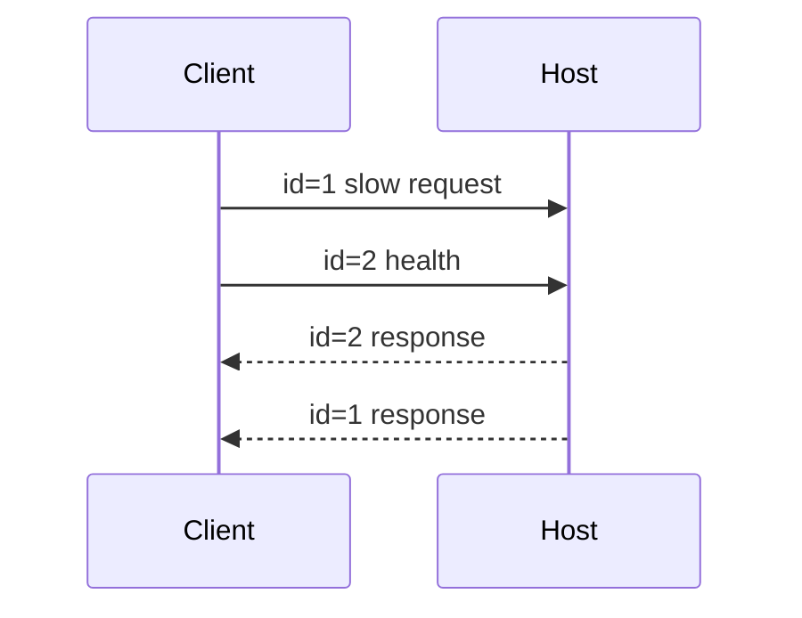

# 实验 05：实现一个并发安全的 Runtime Host Client

## 实验目标

你将写一个最小 TypeScript Client，完成：

```text
spawn Runtime Host
→ strict JSONL read/write
→ hello negotiation
→ request/response correlation
→ Runtime Event routing
→ concurrent requests
→ process close/reject pending
→ Session/Turn/Sequence projection skeleton
```

本实验先验证协议和并发，不要求真实模型 API。

## 1. 构建 Host

```bash
npm run build:rag-ime-runtime-host
```

二进制入口：

```text
integrations/rag-ime-runtime-host/dist/cli.js
```

## 2. 创建测试文件

```bash
mkdir -p integrations/rag-ime-runtime-host/test/course-labs
$EDITOR integrations/rag-ime-runtime-host/test/course-labs/05-runtime-client.test.ts
```

## 3. 完整 Client

```ts
import { spawn, type ChildProcessWithoutNullStreams } from "node:child_process";
import { mkdtemp, mkdir, rm } from "node:fs/promises";
import { tmpdir } from "node:os";
import { join, resolve } from "node:path";
import { describe, expect, it } from "vitest";
import { readStrictJsonl } from "../../src/jsonl-framing.ts";
import type {
    RuntimeEventEnvelope,
    RuntimeRequest,
    RuntimeResponse,
} from "../../src/protocol.ts";

const PROTOCOL_VERSION = "2" as const;

type PendingRequest = {
    resolve(value: unknown): void;
    reject(error: Error): void;
};

type SessionProjection = {
    sessionId: string;
    lastSequence: number;
    activeTurnId?: string;
    events: RuntimeEventEnvelope[];
    needsSnapshot: boolean;
};

export class RuntimeClient {
    private readonly child: ChildProcessWithoutNullStreams;
    private readonly pending = new Map<string, PendingRequest>();
    private readonly sessions = new Map<string, SessionProjection>();
    private nextId = 1;
    private closed = false;
    private readonly reader: Promise<void>;
    readonly stderr: string[] = [];

    constructor(child: ChildProcessWithoutNullStreams) {
        this.child = child;
        child.stderr.setEncoding("utf8");
        child.stderr.on("data", (chunk: string) => this.stderr.push(chunk));
        this.reader = this.readOutput();

        child.once("exit", (code, signal) => {
            this.closed = true;
            const error = new Error(
                `Runtime Host exited: code=${String(code)} signal=${String(signal)}`,
            );
            for (const request of this.pending.values()) {
                request.reject(error);
            }
            this.pending.clear();
        });
    }

    private async readOutput(): Promise<void> {
        for await (const line of readStrictJsonl(this.child.stdout)) {
            const value = JSON.parse(line) as RuntimeResponse | RuntimeEventEnvelope;
            if ("event" in value) {
                this.reduceEvent(value);
                continue;
            }

            const request = this.pending.get(value.id);
            if (!request) {
                throw new Error(`Response for unknown request: ${value.id}`);
            }
            this.pending.delete(value.id);

            if (value.ok) request.resolve(value.result);
            else request.reject(
                new Error(`${value.error.code}: ${value.error.message}`),
            );
        }
    }

    private reduceEvent(event: RuntimeEventEnvelope): void {
        const current = this.sessions.get(event.sessionId) ?? {
            sessionId: event.sessionId,
            lastSequence: 0,
            events: [],
            needsSnapshot: false,
        };

        if (event.sequence <= current.lastSequence) return;
        if (event.sequence > current.lastSequence + 1) {
            current.needsSnapshot = true;
        }

        current.lastSequence = event.sequence;
        current.activeTurnId = event.turnId ?? current.activeTurnId;
        current.events.push(event);
        this.sessions.set(event.sessionId, current);
    }

    request<T>(
        method: RuntimeRequest["method"],
        params: Record<string, unknown> = {},
    ): Promise<T> {
        if (this.closed) {
            return Promise.reject(new Error("Runtime client is closed"));
        }

        const id = `course-${this.nextId++}`;
        const request: RuntimeRequest = {
            protocolVersion: PROTOCOL_VERSION,
            id,
            method,
            params,
        };

        const response = new Promise<T>((resolve, reject) => {
            this.pending.set(id, {
                resolve: (value) => resolve(value as T),
                reject,
            });
        });

        this.child.stdin.write(`${JSON.stringify(request)}\n`);
        return response;
    }

    projection(sessionId: string): SessionProjection | undefined {
        return this.sessions.get(sessionId);
    }

    async close(): Promise<void> {
        if (!this.closed) this.child.stdin.end();
        await this.reader;
        if (!this.closed) {
            await new Promise<void>((resolveExit) => {
                this.child.once("exit", () => resolveExit());
            });
        }
    }
}

async function startHost(root: string): Promise<RuntimeClient> {
    const workspace = join(root, "workspace");
    const appSupport = join(root, "app-support");
    await mkdir(workspace, { recursive: true });
    await mkdir(appSupport, { recursive: true });

    const child = spawn(
        process.execPath,
        [resolve("integrations/rag-ime-runtime-host/dist/cli.js")],
        {
            cwd: process.cwd(),
            env: {
                ...process.env,
                PI_OFFLINE: "1",
                RAG_IME_APP_SUPPORT_DIR: appSupport,
                RAG_IME_WORKSPACE_ROOTS: workspace,
                RAG_IME_PI_MAX_SESSIONS: "2",
            },
            stdio: ["pipe", "pipe", "pipe"],
        },
    );

    return new RuntimeClient(child);
}

describe("course lab 05 runtime client", () => {
    it("negotiates hello and correlates concurrent responses", async () => {
        const root = await mkdtemp(join(tmpdir(), "pi-course-host-"));
        const client = await startHost(root);

        try {
            const [hello, health] = await Promise.all([
                client.request<{
                    protocol: string;
                    protocolVersion: string;
                    piVersion: string;
                    capabilities: Record<string, unknown>;
                }>("hello"),
                client.request<{
                    ok: boolean;
                    openSessions: number;
                    maxSessions: number;
                }>("health"),
            ]);

            expect(hello.protocol).toBe("rag-ime.pi-runtime");
            expect(hello.protocolVersion).toBe("2");
            expect(hello.piVersion).toBe("0.84.2");
            expect(hello.capabilities.concurrentControlPlane).toBe(true);

            expect(health.ok).toBe(true);
            expect(health.openSessions).toBe(0);
            expect(health.maxSessions).toBe(2);
        } finally {
            await client.close();
            await rm(root, { recursive: true, force: true });
        }
    });
});
```

## 4. 运行

```bash
npx vitest run integrations/rag-ime-runtime-host/test/course-labs/05-runtime-client.test.ts
```

若 `dist/cli.js` 不存在，先运行构建命令。测试使用 `PI_OFFLINE=1`，不要求远程模型目录。

## 5. 为什么 Client 也使用严格 Framer

Host 输出同样是一条 JSONL Byte Stream。不要用：

```ts
stdout.setEncoding("utf8");
stdout.on("data", chunk => chunk.split("\n"));
```

Chunk 边界不等于行边界；UTF-8 多字节字符可能跨 Chunk。复用 `readStrictJsonl()` 可以验证：

- Fragmented UTF-8；
- Multiple records in one chunk；
- CRLF；
- Truncated final record；
- Invalid UTF-8。

## 6. 响应为什么可能乱序

两个请求：

```text
course-1 = models.list（可能读配置/检查）
course-2 = health（立即）
```

Host Dispatcher 独立执行，`course-2` 可能先回来。Client 必须按 `id` Resolve，而不是按请求队列头部。



## 7. 添加错误请求测试

Client 的 `request()` 只允许合法 Method。为了测试 Host Error，直接写：

```ts
(client as unknown as { child: ChildProcessWithoutNullStreams }).child.stdin.write(
    `${JSON.stringify({
        protocolVersion: "1",
        id: "bad-version",
        method: "health",
        params: {},
    })}\n`,
);
```

更好的做法是给 Client 增加 `sendRaw()` 测试入口。断言：

```text
UNSUPPORTED_PROTOCOL_VERSION
Host 不退出
后续 health 仍成功
```

Malformed JSON 也应只得到单请求 Error Response；Framing Error（非法 UTF-8/截断）则使整条 Byte Stream 无法继续，Host 会 Dispose。

## 8. 添加 Workspace Open

从 `startHost()` 返回 `workspace`，请求：

```ts
const opened = await client.request("session.open", {
    sessionId: "product-session-1",
    cwd: workspace,
    piSkillsEnabled: false,
    codexSkillsEnabled: false,
});
```

然后：

```ts
const snapshot = await client.request("session.snapshot", {
    sessionId: "product-session-1",
});
```

断言：

- Session 打开一次；
- Snapshot 的 Native Session ID 与 Product ID 有明确映射；
- cwd 是 `realpath` 后的工作区；
- Session File 位于托管 Session Dir；
- 关闭后 `health.openSessions` 下降。

没有可用模型时，Open 可能仍成功，但 Prompt Preflight 应明确失败；不要为了测试 Open 强行配置假 API Key。

## 9. 并发 Open 测试

```ts
const [a, b] = await Promise.all([
    client.request("session.open", { sessionId: "S1", cwd: workspace }),
    client.request("session.open", { sessionId: "S1", cwd: workspace }),
]);
```

断言两个响应绑定同一个 Native Session，而不是创建两个 AgentSession 同写一份 transcript。

## 10. Session Pool LRU

`maxSessions=2`：

```text
open S1
open S2
touch S1
open S3
```

预期 Evict S2，而非 S1。再打开 S2，验证从 transcript 恢复。

若当前 Host 的公开响应未暴露 Eviction 细节，可使用 `health`、`session.snapshot` 和 Debug Context 验证，不直接读 Host 内部 Map。

## 11. Event Projection 测试

不必调用真实模型，直接给 `reduceEvent()` 喂合成 Event：

```ts
const events: RuntimeEventEnvelope[] = [
    {
        protocolVersion: "2",
        event: "agent.event",
        sessionId: "S1",
        turnId: "T1",
        sequence: 1,
        payload: { type: "message_start" },
    },
    {
        protocolVersion: "2",
        event: "agent.event",
        sessionId: "S1",
        turnId: "T1",
        sequence: 2,
        payload: { type: "message_update", delta: "你" },
    },
];
```

测试：

- 重复 seq=2 被忽略；
- 先收到 seq=4 时 `needsSnapshot=true`；
- Session A Event 不修改 B；
- Turn ID 保存；
- Snapshot 后清除 Gap 标志。

## 12. Pending Request 清理

模拟 Host 在请求完成前退出：

```ts
const pending = client.request("models.list");
child.kill();
await expect(pending).rejects.toThrow(/Runtime Host exited/);
```

所有 Pending Promise 都必须 Reject，不能永远挂起。

## 13. Prompt/Abort 的后续扩展

配置一个可用 Faux/Local Provider 后：

```text
session.prompt pending
→ 同时 session.snapshot
→ session.steer
→ session.abort
→ prompt 最终 settlement
```

断言 Abort 只影响目标 Session；另一个 Session 的 `health/snapshot` 正常。

## 14. Client 生产化还缺什么

本实验 Client 仍缺：

- Request Timeout；
- Abort 单个 Pending Request；
- Write Backpressure；
- Event Listener API；
- Snapshot Fetch/Replace；
- Reconnect；
- Client Message Idempotency；
- Process Restart Policy；
- Secret Redaction；
- Metrics；
- Protocol Capability Gating。

把这些列入 `FAILURE_MATRIX.md`，不要把实验代码直接当生产 Client。

## 验收标准

- Host 在 Offline 模式启动；
- Hello 报告 Pi 0.84.2；
- 两个并发请求按 ID 正确匹配；
- Protocol Error 不影响后续请求；
- Workspace Session 可 Open/Snapshot/Close；
- 并发 Open 同 Session 只有一个 Runtime；
- Event Reducer 检测重复和 Sequence Gap；
- Host 退出后全部 Pending Reject；
- Client Close 等 Host 结算退出；
- 能解释 Framing Error 与业务 Request Error 的差异。

## 练习题

1. 为什么并发 Response 不能按请求发送顺序处理？
2. 业务 JSON 错误与 Framing 错误为何影响范围不同？
3. 同 Session 并发 Open 的权威对象应该是什么？
4. Host 退出时为什么必须 Reject 全部 Pending？
5. Event Sequence Gap 之后为什么要请求 Snapshot，而不是继续盲目 Reduce？
