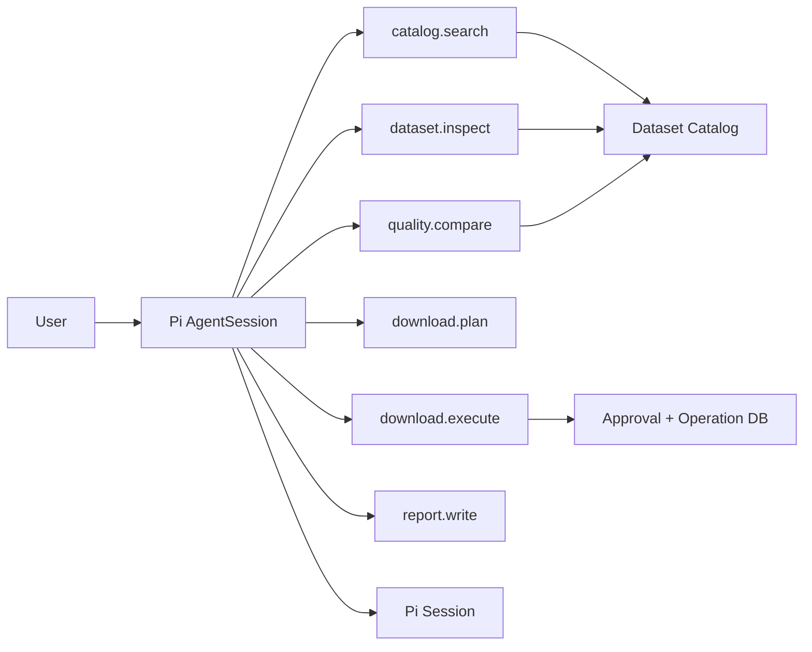
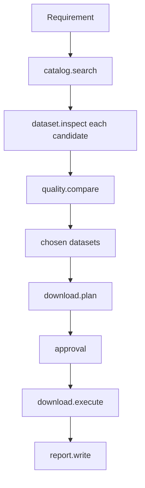

# 实验 06：完成一个可演示、可恢复的数据准备 Agent

## 最终用户场景

用户输入：

> 准备 2015—2017 年 Fimbul 冰架的冰流速度和表面质量平衡数据。检查空间覆盖、时间范围、分辨率和误差，优先权威产品，生成下载计划；批准后再执行，并输出实验摘要。

Agent 最终应交付：

```text
数据集候选与证据
选择理由与冲突
空间/时间/误差检查
不可变下载计划
审批记录
下载结果与 checksum
实验摘要
可恢复 Session 证据
```

## 1. 最小架构



本实验先用内存 Catalog 和本地文件模拟产品数据库，重点验证 Runtime 机制，而不是联网下载真实大数据。

## 2. 项目目录

在个人学习分支创建：

```text
integrations/course-data-agent/
├── src/
│   ├── catalog.ts
│   ├── domain.ts
│   ├── tools.ts
│   ├── approval-store.ts
│   ├── operation-store.ts
│   ├── session.ts
│   └── cli.ts
├── test/
│   ├── tools.test.ts
│   ├── agent-flow.test.ts
│   ├── recovery.test.ts
│   └── failure-matrix.test.ts
├── fixtures/
│   └── catalog.json
├── output/
├── package.json
└── README.md
```

该 Integration 不必加入上游 NPM Workspace；也可以参照 Runtime Host 使用独立 TypeScript Build。

## 3. 领域模型

```ts
export type BoundingBox = {
    west: number;
    south: number;
    east: number;
    north: number;
};

export type DatasetRecord = {
    id: string;
    title: string;
    authority: string;
    variables: string[];
    startYear: number;
    endYear: number;
    resolutionMeters: number;
    coverage: BoundingBox;
    uncertainty?: {
        kind: "rmse" | "standard-deviation" | "unknown";
        value?: number;
        unit?: string;
    };
    sourceUri: string;
    checksum?: string;
    license: string;
};

export type DataRequirement = {
    regionName: string;
    region: BoundingBox;
    startYear: number;
    endYear: number;
    variables: string[];
    maximumResolutionMeters?: number;
    preferredAuthorities?: string[];
};
```

## 4. Fixture Catalog

`fixtures/catalog.json`：

```json
[
  {
    "id": "velocity-authority-1",
    "title": "Antarctic Ice Velocity Mosaic",
    "authority": "Authority A",
    "variables": ["ice_velocity_u", "ice_velocity_v"],
    "startYear": 2014,
    "endYear": 2018,
    "resolutionMeters": 450,
    "coverage": { "west": -2.5, "south": -72.5, "east": 1.5, "north": -69.0 },
    "uncertainty": { "kind": "rmse", "value": 12, "unit": "m/yr" },
    "sourceUri": "fixture://velocity-authority-1.nc",
    "checksum": "sha256:velocity-1",
    "license": "research-use"
  },
  {
    "id": "velocity-fast-lowres",
    "title": "Fast Velocity Preview",
    "authority": "Community Mirror",
    "variables": ["ice_velocity_u", "ice_velocity_v"],
    "startYear": 2015,
    "endYear": 2017,
    "resolutionMeters": 5000,
    "coverage": { "west": -5, "south": -75, "east": 5, "north": -68 },
    "uncertainty": { "kind": "unknown" },
    "sourceUri": "fixture://velocity-fast-lowres.nc",
    "license": "unknown"
  },
  {
    "id": "smb-authority-1",
    "title": "Regional Climate SMB Product",
    "authority": "Authority B",
    "variables": ["surface_mass_balance"],
    "startYear": 1979,
    "endYear": 2025,
    "resolutionMeters": 1000,
    "coverage": { "west": -10, "south": -80, "east": 10, "north": -65 },
    "uncertainty": { "kind": "standard-deviation", "value": 0.12, "unit": "m w.e./yr" },
    "sourceUri": "fixture://smb-authority-1.nc",
    "checksum": "sha256:smb-1",
    "license": "research-use"
  }
]
```

Fixture 里故意放一个低分辨率、无误差、License 不明的候选，让 Agent 必须比较证据，而不是选第一个结果。

## 5. Tool 集合



| Tool | 风险 | 是否需要审批 | 是否应幂等 |
|---|---|---:|---:|
| `catalog_search` | read | 否 | 是 |
| `dataset_inspect` | read | 否 | 是 |
| `quality_compare` | read/compute | 否 | 是 |
| `download_plan` | plan | 否 | 是，按 requirement+selection digest |
| `download_execute` | write/external | 是 | 必须 |
| `report_write` | write file | 可按 workspace policy | 必须 |

## 6. `catalog_search`

```ts
import { Type } from "typebox";
import type { ToolDefinition } from "@earendil-works/pi-coding-agent";

const searchSchema = Type.Object({
    variables: Type.Array(Type.String(), { minItems: 1 }),
    startYear: Type.Integer(),
    endYear: Type.Integer(),
    region: Type.Object({
        west: Type.Number(),
        south: Type.Number(),
        east: Type.Number(),
        north: Type.Number(),
    }),
    maximumResolutionMeters: Type.Optional(Type.Number({ minimum: 1 })),
});

export function createCatalogSearchTool(
    catalog: DatasetRecord[],
): ToolDefinition<typeof searchSchema> {
    return {
        name: "catalog_search",
        label: "Search dataset catalog",
        description: "Find datasets covering requested variables, time and region",
        parameters: searchSchema,
        async execute(_id, args) {
            const candidates = catalog.filter((dataset) => {
                const variablesMatch = args.variables.some((variable) =>
                    dataset.variables.includes(variable),
                );
                const timeMatch =
                    dataset.startYear <= args.startYear &&
                    dataset.endYear >= args.endYear;
                const resolutionMatch =
                    args.maximumResolutionMeters === undefined ||
                    dataset.resolutionMeters <= args.maximumResolutionMeters;
                return variablesMatch && timeMatch && resolutionMatch;
            });

            return {
                content: [{
                    type: "text",
                    text: JSON.stringify(
                        candidates.map((dataset) => ({
                            id: dataset.id,
                            title: dataset.title,
                            authority: dataset.authority,
                            variables: dataset.variables,
                            years: [dataset.startYear, dataset.endYear],
                            resolutionMeters: dataset.resolutionMeters,
                        })),
                    ),
                }],
                details: { candidateIds: candidates.map((item) => item.id) },
            };
        },
    };
}
```

搜索只返回路由所需摘要；完整记录由 `dataset_inspect` 精确读取。

## 7. 覆盖率计算

```ts
function intersectionArea(a: BoundingBox, b: BoundingBox): number {
    const width = Math.max(0, Math.min(a.east, b.east) - Math.max(a.west, b.west));
    const height = Math.max(0, Math.min(a.north, b.north) - Math.max(a.south, b.south));
    return width * height;
}

function coverageRatio(dataset: BoundingBox, requested: BoundingBox): number {
    const requestedArea =
        (requested.east - requested.west) *
        (requested.north - requested.south);
    if (requestedArea <= 0) throw new Error("invalid requested bounding box");
    return intersectionArea(dataset, requested) / requestedArea;
}
```

这只是教学用经纬度矩形近似。生产南极数据应在合适投影坐标中计算，并处理经线、掩膜和实际栅格覆盖。

## 8. `quality_compare`

评分不能代替证据。Tool 返回：

```ts
type ComparisonEvidence = {
    datasetId: string;
    timeCovered: boolean;
    coverageRatio: number;
    resolutionMeters: number;
    uncertaintyKnown: boolean;
    authorityPreferred: boolean;
    licenseKnown: boolean;
    warnings: string[];
};
```

简单教学评分：

\[
score = 30\cdot time + 25\cdot coverage + 15\cdot authority +
15\cdot uncertainty + 10\cdot license + 5\cdot resolution
\]

Tool Result 必须同时返回每项 Evidence，模型不能只看到最终分数。

## 9. Download Plan

```ts
export type DownloadPlan = {
    planId: string;
    digest: string;
    requirement: DataRequirement;
    items: Array<{
        datasetId: string;
        sourceUri: string;
        destination: string;
        expectedChecksum?: string;
    }>;
    status: "draft" | "approved" | "executing" | "completed" | "failed";
    createdAt: string;
};
```

Plan Digest 对 Canonical JSON 计算。审批绑定：

```text
planId
digest
sessionId
expiresAt
```

模型不能在批准后修改目的路径或 Dataset Selection。

## 10. 模拟下载执行

Fixture URI：

```text
fixture://velocity-authority-1.nc
```

执行时创建小文本文件模拟产物：

```ts
await writeFile(
    destination,
    JSON.stringify({
        fixture: item.sourceUri,
        datasetId: item.datasetId,
    }),
    "utf8",
);
```

然后真实计算 SHA-256，而不是相信 Plan 里的期望值。

Operation Store 使用：

```text
planId + item.datasetId
```

形成稳定 Idempotency Key。

## 11. 创建 AgentSession

```ts
import {
    createAgentSession,
    DefaultResourceLoader,
    ModelRuntime,
    SessionManager,
    SettingsManager,
} from "@earendil-works/pi-coding-agent";

const sessionManager = SessionManager.create(workspace, sessionDir);
const settingsManager = SettingsManager.create(workspace, agentDir);
const resourceLoader = new DefaultResourceLoader({
    cwd: workspace,
    agentDir,
    settingsManager,
    noExtensions: true,
    noSkills: true,
    noPromptTemplates: true,
    noThemes: true,
    noContextFiles: true,
    systemPrompt: DATA_AGENT_SYSTEM_PROMPT,
});
await resourceLoader.reload();

const { session } = await createAgentSession({
    cwd: workspace,
    agentDir,
    modelRuntime,
    sessionManager,
    settingsManager,
    resourceLoader,
    noTools: "builtin",
    customTools: [
        catalogSearchTool,
        datasetInspectTool,
        qualityCompareTool,
        downloadPlanTool,
        downloadExecuteTool,
        reportWriteTool,
    ],
});
```

生产版本可以保留 `read` 等内置 Tool，但本实验先让领域 Tool 边界清楚。

## 12. System Prompt 只写行为边界

```text
You are a dataset preparation agent.

Use tools to gather evidence. Do not invent dataset metadata.
Before choosing a dataset, verify variable, time, coverage, resolution,
uncertainty, authority, license, and checksum availability.

Creating a download plan is allowed. Executing a download requires a valid
product approval token bound to the exact immutable plan digest.

When a tool reports an unknown outcome, stop and request inspection; never
blindly replay a write operation.
```

不要把完整 Catalog 数据塞进 Prompt；它由 Tool 提供。

## 13. 真实流程测试

Faux Provider 或真实模型应产生：

```text
catalog_search velocity
catalog_search SMB
dataset_inspect candidates
quality_compare
download_plan
final response requesting approval
```

用户审批后用 Follow-up/新 Run：

```text
download_execute
report_write
final delivery
```

Approval 等待期间不让原 Run无限空转。可使用 Tool `terminate=true` 或 `shouldStopAfterTurn` 在安全点结算，审批完成后开启新 Run。

## 14. Steer 场景

在候选搜索后用户输入：

> 排除 2 km 以上分辨率，并优先 Authority A/B。

通过 Steer 在当前 Tool Batch 后注入。断言：

- 已完成只读 Tool Result 保留；
- 下一次搜索/比较使用新约束；
- 旧 Download Plan 不可继续审批；
- 若 Plan 已生成，创建新 Plan ID/Digest。

## 15. Compaction 场景

生成多轮候选检查和日志，将阈值调低。压缩摘要必须保留：

```text
Fimbul 区域
2015—2017
变量列表
已选 Dataset ID
排除候选及原因
当前 Plan ID/Digest
审批状态
已完成下载和 checksum
未完成步骤
```

压缩后继续 `report_write`，验证这些事实仍存在。

## 16. Fork 场景

从选择数据集前 Fork：

```text
Branch A：优先最高分辨率
Branch B：优先权威和误差完整性
```

断言：

- 两个 Plan ID 不同；
- 源 Session 不变；
- Branch B 不继承 A 的审批；
- 产品审批绑定外部 Session/Plan Digest，不只绑定 Pi Entry。

## 17. Crash Recovery 场景

在每个下载 Item：

```text
Commit Attempt Intent
→ Write Fixture File
→ Compute Checksum
→ Commit Result
```

注入崩溃：

- Intent 前；
- Intent 后写文件前；
- 文件写完 checksum 前；
- checksum 后 DB Commit 前；
- 完成后事件发送前。

重启后：

```text
检查 Operation Store
→ 检查文件存在与真实 checksum
→ 补写 Completed 或标记 Unknown/Failed
→ 不重复覆盖已验证产物
```

## 18. UI Projection

最小终端/Web 状态：

```text
Requirement Card
Candidate Table
Evidence/Warnings
Selected Dataset
Download Plan
Approval Status
Execution Progress
Artifacts + Checksums
Agent Working/Retry/Compaction/Settled
```

UI 从 Event Reducer 读取；不能把“下载按钮已点”当作 Approval 权威状态。

## 19. 完整测试矩阵

### 领域

- 缺变量；
- 时间不覆盖；
- 部分空间覆盖；
- 分辨率过低；
- 误差未知；
- License 未知；
- Checksum 缺失；
- 两权威产品冲突。

### Runtime

- Tool 参数错误；
- Steer；
- Follow-up；
- Abort；
- Retry；
- Compaction；
- Fork；
- Host Restart；
- Session Reopen；
- Dynamic Tool Load（可选）。

### 副作用

- 未审批；
- Approval 过期；
- Plan Digest 改变；
- 重复 Idempotency Key；
- Unknown Outcome；
- Checksum 不匹配；
- Workspace 越界；
- Report 已存在。

## 20. 最终产物

```text
output/
├── plans/<plan-id>.json
├── datasets/*.nc.fixture
├── reports/<session-id>.md
└── evidence/<turn-id>.json
```

最终 Report 至少包含：

```markdown
# Dataset Preparation Report

## Requirement
## Candidate Datasets
## Selection Evidence
## Excluded Candidates
## Coverage / Time / Resolution / Uncertainty
## Download Plan and Approval
## Artifacts and Checksums
## Runtime Evidence
## Known Limitations
## Reproduction Commands
```

## 验收标准

- 用户自然语言需求能进入完整只读闭环；
- 推荐引用 Tool Evidence，不编造元数据；
- Steer 可改变筛选而不破坏已完成 Tool 配对；
- 下载前存在不可变 Plan 和有效 Approval；
- 相同幂等键不会重复执行；
- Crash 后可核验恢复；
- Compaction 后继续完成报告；
- Fork 两路线互不污染；
- Session 和产品 DB 权威状态分离；
- UI 使用 Event/Sequence Reducer；
- 提供完整测试与五分钟 Demo。

## 练习题

1. 为什么 Catalog Search 与 Dataset Inspect 要拆成两个 Tool？
2. Quality Score 为什么必须同时返回 Evidence？
3. Approval 应绑定哪些字段？
4. Steer 改变约束后旧 Plan 为什么必须失效？
5. Pi Session 与产品 Operation Store 分别保存什么？
6. Compaction Summary 要保留哪些领域事实？
7. Fork 后为什么不能继承源分支 Approval？
8. 写出五分钟 Demo 和 90 秒面试表达。
