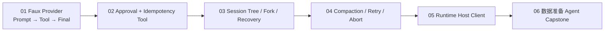

# Pi 动手实验

> 这些实验不是“看完自己想办法写”。每个实验都给出源码入口、可直接放入仓库的测试骨架、预期事件、故障注入和验收证据。

## 实验原则

1. **先用 Faux Provider。** 不把 API Key、网络和模型随机性混进 Runtime 学习。
2. **先写事件断言，再写 UI。** UI 只能投影已证明正确的 Runtime 事件。
3. **每个副作用都注入失败。** 成功一次不能证明可恢复。
4. **README 内保留关键代码。** 不要求读者离开课程才能理解机制。
5. **所有实验建独立分支。** 不直接污染课程或集成分支。

## 开始前

```bash
git switch course/pi-0.84-source-learning
git switch -c learning/pi-labs
npm ci --ignore-scripts
npm run build:offline
npm run check
```

实验测试建议放在对应包的 `test/course-labs/` 下；完成后可保留在个人学习分支，不必合入上游产品分支。

## 实验地图



| 实验 | 你会亲手证明什么 |
|---|---|
| [01 Faux Provider Agent Loop](01-fake-provider-loop/README.md) | Run/Turn/Tool Event 顺序、Listener settlement、Steer/Follow-up |
| [02 Tool 审批与幂等](02-custom-tool-approval/README.md) | Before Hook、权限、稳定 Idempotency Key、Crash Point |
| [03 Session Fork 与恢复](03-session-fork-recovery/README.md) | JSONL Entry、Leaf、Fork、Context 投影、Stale Context |
| [04 长任务 Compaction](04-long-run-compaction/README.md) | Token 估算、Cut Point、Overflow Recovery、可取消 Retry |
| [05 Runtime Host Client](05-runtime-host-client/README.md) | 严格 JSONL、并发请求、Session/Turn/Sequence Reducer、Abort |
| [06 完整数据准备 Agent](06-data-preparation-agent/README.md) | 从领域 Tool 到审批下载、恢复、UI 和面试交付的完整项目 |

## 每个实验必须提交的证据

```text
README-notes.md        学习解释，不是复制课程
EVENT_TRACE.jsonl      真实事件序列
TEST_RESULTS.md        命令与结果
FAILURE_MATRIX.md      注入失败及观察
ARCHITECTURE.md        只画本实验真正涉及的所有权与状态
```

实验完成标准不是“测试绿了”，还要能回答：

- 谁拥有权威状态？
- 哪个事件改变它？
- Abort 能保证什么，不能保证什么？
- 崩溃在哪些点会产生 Unknown Outcome？
- 恢复依据是持久事实还是推测？
