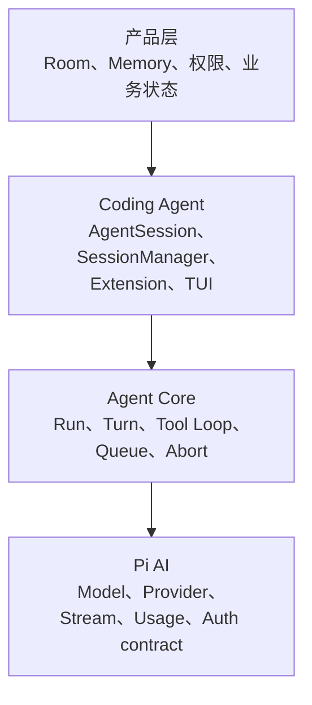
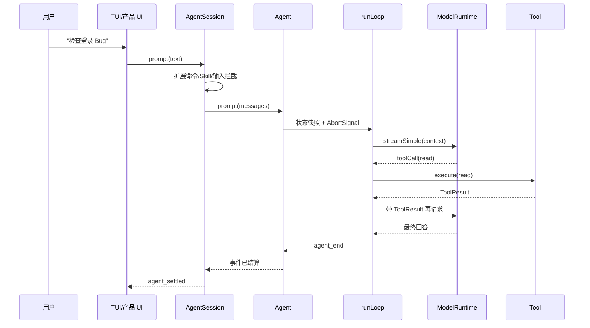

# 第 00 课：先看全局——Pi 到底解决什么问题

## 本课目标

这节不从任何类型定义开始。先建立一个判断：

> 大模型 API 只负责生成下一段输出；Agent 产品还必须负责工具、副作用、用户中途输入、持久化、取消、恢复和 UI。

## 1. 如果只有一次模型调用，会坏在哪里

假设用户说：

> 检查项目里的登录 Bug，修改代码并运行测试。

一次普通 LLM 请求最多能返回“建议”。真正执行时会立刻遇到问题：

| 问题 | 只调用模型为什么不够 |
|---|---|
| 读文件 | 模型本身看不到本地工作区 |
| 改文件 | 需要可审计的工具副作用 |
| 连续工具调用 | 每次结果都要回到下一轮模型上下文 |
| 用户中途改方向 | 不能粗暴地把文本塞进正在生成的响应 |
| 取消 | 要同时取消模型流、工具和后续循环 |
| 长上下文 | 需要压缩但不能破坏工具调用配对 |
| 重启恢复 | 内存数组消失后仍要找回 Session |
| UI | 流式事件必须稳定映射成界面状态 |

Pi 的价值就在于把这些问题分层。

## 2. 四层职责地图



| 层 | 解决什么 | 不应该负责什么 |
|---|---|---|
| `pi-ai` | 统一不同 Provider 的模型与流式协议 | Session、工具工作流、产品业务 |
| `pi-agent-core` | 一次 Agent Run 的状态机 | 文件持久化、CLI 命令、产品 Memory |
| `pi-coding-agent` | 把 Agent 变成可长期使用的 Coding Session | Room、业务审批、产品数据库 |
| 产品适配层 | Persona、Memory、Room、权限与 Web 事件 | 复制 Pi 的 Agent Loop |

## 3. 一条请求的真实旅程



关键点：**一次用户输入可能包含多个 Model Turn**。Turn 是“一个 assistant 响应，加上它产生的工具调用和结果”；Run 才是“用户这次任务从开始到最终停止”。

## 4. 为什么不能从目录顺序学

从 `types.ts` 第一行开始，你会看到大量类型，却不知道它们服务于什么真实问题。更有效的阅读顺序是：

```text
一次 prompt
→ Agent 建立 Run
→ runLoop 产生多个 Turn
→ Tool Result 回流
→ AgentSession 持久化与补偿
→ SessionManager 恢复
→ Extension 和产品层接入
```

本课程每次只追一个功能，不一次解释整个大文件。

## 5. 先记住的三个边界

### 边界一：模型边界

只有到 `streamFunction(model, context, options)` 时，Pi 才真正跨到 Provider。

### 边界二：工具边界

Tool Call 必须经过“找到工具 → 参数校验 → before hook → execute → after hook → Tool Result”。

### 边界三：settlement 边界

`agent_end` 表示 Loop 不再产生新事件；`agent_settled` 才表示 Coding Session 的持久化、重试判断、压缩判断等后处理也结束。

## 6. 练习题

1. 用自己的话解释：为什么“能 Function Calling”不等于“已经有 Agent Runtime”？
2. 用户在模型调用工具后说“先别改数据库”，这句话应该进入当前 Tool 执行、下一次 Model Turn，还是任务结束后的新 Run？说明理由。
3. 画出 `pi-ai`、`agent-core`、`coding-agent` 和产品层的边界，每层只写三个职责。
4. 为什么产品层直接读取和修改 Pi 的 Session JSONL 是危险的？
5. `agent_end` 与 `agent_settled` 若被前端当成同一个状态，可能出现什么 UI Bug？

## 完成标准

不看本文，能在白纸上画出四层架构和一次 prompt 的完整链路，并准确区分 Run、Turn 与 Session。

下一课：[创建 AgentSession：运行时是怎样被装配出来的](../01-create-agent-session/README.md)
