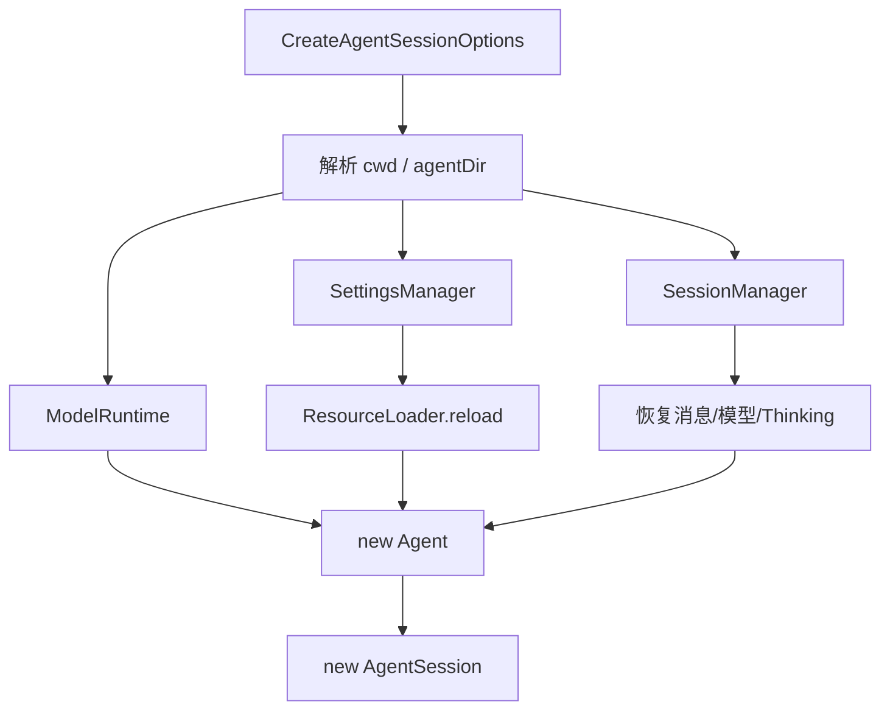
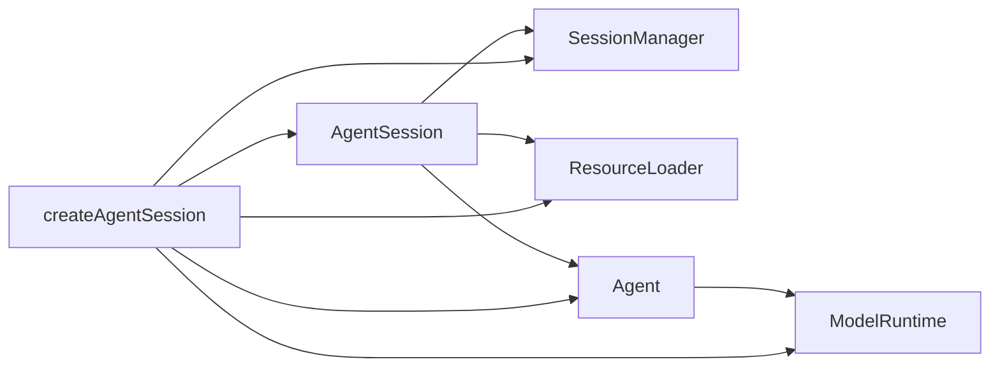

# 第 01 课：`createAgentSession()`——把零件装成可运行 Session

## 先回答：它是干什么的

`createAgentSession()` 不是“创建一个聊天对象”。它把下面这些彼此独立的零件装配成同一个运行时：

- 工作目录与全局 Agent 目录；
- 模型目录、Provider 与凭证；
- Settings；
- Session 持久化；
- Extension、Skill、Prompt、Theme 与上下文文件；
- 内置和自定义工具；
- 最底层 `Agent`；
- 上层 `AgentSession`。

没有这个入口，调用者必须自己保证所有实例使用同一个 `cwd`、同一套模型与同一个 Session，极容易出现状态串线。

## 功能地图

| 功能 | 对外入口 | 怎么实现 | 结果交给谁 |
|---|---|---|---|
| 解析运行目录 | `createAgentSession(options)` | `resolvePath()` | 所有 cwd-bound 服务 |
| 创建模型运行时 | `ModelRuntime.create()` | 读取 auth/models 配置 | `Agent` 与 `AgentSession` |
| 恢复 Session | `buildSessionContext()` | 从当前树叶投影消息 | `Agent.state.messages` |
| 发现资源 | `resourceLoader.reload()` | 加载 Extension/Skill 等 | System Prompt 与工具 |
| 创建核心 Agent | `new Agent(...)` | 注入 Stream、队列、Hook | `AgentSession` |
| 创建会话编排器 | `new AgentSession(...)` | 绑定持久化和补偿逻辑 | CLI、TUI、SDK、产品 Host |

## 1. 装配顺序



这里顺序很重要：资源、设置和 Session 都可能影响初始模型、工具和 System Prompt，不能先随便创建 Agent 再慢慢补。

## 2. 核心源码带读

源码：`packages/coding-agent/src/core/sdk.ts`

```ts
const modelRuntime =
    options.modelRuntime ?? (await ModelRuntime.create({ authPath, modelsPath }));

const settingsManager =
    options.settingsManager ?? SettingsManager.create(cwd, agentDir);

const sessionManager =
    options.sessionManager ?? SessionManager.create(cwd, getDefaultSessionDir(cwd, agentDir));

if (!resourceLoader) {
    resourceLoader = new DefaultResourceLoader({ cwd, agentDir, settingsManager });
    await resourceLoader.reload();
}
```

运行时可以把它理解成：

```text
cwd             = /workspace/pi
agentDir        = ~/.pi/agent
modelRuntime    = 当前可用模型 + 鉴权
settingsManager = steeringMode、默认模型、压缩参数……
sessionManager  = 当前 JSONL 和 leafId
resourceLoader  = 当前 Extension/Skill/AGENTS.md
```

这些字段不是“配置列表”，而是后续每一轮请求的权威输入。

## 3. 为什么先恢复 Session 再选模型

源码会先执行：

```ts
const existingSession = sessionManager.buildSessionContext();
const hasExistingSession = existingSession.messages.length > 0;
```

如果 Session 已有历史，Pi 会优先恢复历史里最后使用的模型和 Thinking Level；恢复失败才寻找默认模型。这避免了重启后悄悄换模型，导致行为和成本突然变化。

## 4. `Agent` 在这里被注入了什么

教学化摘录：

```ts
agent = new Agent({
    initialState: { systemPrompt: "", model, thinkingLevel, tools: [] },
    convertToLlm: convertToLlmWithBlockImages,
    streamFn: async (model, context, options) =>
        modelRuntime.streamSimple(model, context, options),
    transformContext: async (messages) =>
        extensionRunnerRef.current?.emitContext(messages) ?? messages,
    steeringMode: settingsManager.getSteeringMode(),
    followUpMode: settingsManager.getFollowUpMode(),
});
```

重要理解：

- `streamFn` 是一个**函数值**，把 Agent Core 与具体 Provider 解耦。
- `transformContext` 也是函数值，让 Extension 在每次请求前调整上下文。
- 初始 `tools: []` 不代表永远没有工具；工具注册与激活随后由 `AgentSession` 完成。
- `Agent` 不读取 `auth.json`，它只调用被注入的 `streamFn`。

## 5. 谁创建谁



`AgentSession` 不是 `Agent` 的子类，而是组合它。这一点使 Agent Core 能被别的产品复用。

## 6. 失败时会怎样

| 失败 | 应该在哪层暴露 |
|---|---|
| 找不到 cwd | 创建阶段直接失败 |
| Session 中记录的模型不存在 | 产生 fallback message，再选可用模型 |
| 没有任何可用模型 | Session 可创建，但发送 Prompt 前给出明确错误 |
| Resource 加载失败 | 记录诊断，不能静默假装资源已加载 |
| Provider 鉴权过期 | 请求前由 ModelRuntime/AgentSession 报错 |

## 7. 本课 TypeScript

- `options.modelRuntime ?? await ...`：调用者提供就复用，否则创建默认实例。
- `streamFn: async (...) => ...`：把函数作为依赖注入，而不是在 Agent 内写死 Provider。
- `Partial` 和可选字段：允许 SDK 从最简配置逐步扩展，但运行时仍会补齐权威默认值。

## 练习题

1. 为什么 `cwd` 必须在创建 `SettingsManager`、`SessionManager` 和 `ResourceLoader` 之前确定？
2. 若恢复 Session 时模型不可用，直接清空历史重新开始有什么问题？
3. 写出一个最小 `createAgentSession()` 调用，并说明哪些对象由 SDK 默认创建。
4. 将 `streamFn` 写死为 OpenAI SDK，会破坏哪两层边界？
5. 设计一个 Bug：`ResourceLoader` 使用 A 工作区，`SessionManager` 使用 B 工作区。用户会看到什么异常？

## 完成标准

能从零画出装配图，并解释每个实例为什么在创建阶段就必须共享同一个 cwd 与 Session 身份。

下一课：[Agent 状态与一次 Run](../02-agent-state-and-run-lifecycle/README.md)
