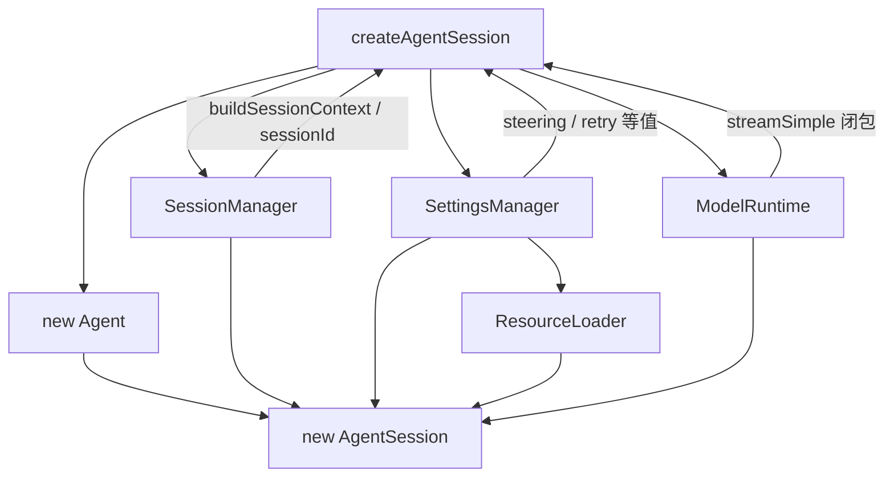

# 第 01 课：`createAgentSession()`——SDK 怎样把零件装成一个 Session

## 先回答：SDK 是什么

这里的 SDK 没有额外魔法。Pi 只是把内部稳定的类、函数和类型通过 package public API `export` 出来，让外部程序可以直接：

```ts
import { createAgentSession } from "@earendil-works/pi-coding-agent";

const { session } = await createAgentSession();
await session.prompt("帮我检查这个项目");
```

因此 SDK 的价值不是“多了一套运行时”，而是让 PAW、CLI、TUI 或其他 Host 可以直接嵌入同一个 Pi Runtime，而不用只能启动 Pi CLI。

## 先记住五个角色

| 对象 | 一句话 |
|---|---|
| `ModelRuntime` | 模型目录、Provider、鉴权与真正的 stream 能力 |
| `SettingsManager` | 当前配置的权威来源 |
| `SessionManager` | Session 历史、树与持久化 |
| `ResourceLoader` | 发现并加载 Extension、Skill、Prompt、AGENTS 等资源 |
| `Agent` | 有状态的执行控制器，真正 Loop 交给 `runAgentLoop()` |
| `AgentSession` | Coding Agent 级编排器，把 Agent 和上面这些 Manager 组合起来 |

## 1. 创建顺序：先看代码，不先背图

源码：`packages/coding-agent/src/core/sdk.ts`

教学化压缩后就是：

```ts
const modelRuntime =
  options.modelRuntime ?? await ModelRuntime.create();

const settingsManager =
  options.settingsManager ?? SettingsManager.create(cwd, agentDir);

const sessionManager =
  options.sessionManager ?? SessionManager.create(cwd);

const resourceLoader =
  options.resourceLoader ?? new DefaultResourceLoader({
    cwd,
    agentDir,
    settingsManager,
  });

await resourceLoader.reload();

const existingSession = sessionManager.buildSessionContext();

const agent = new Agent({
  initialState: {
    systemPrompt: "",
    model,
    thinkingLevel,
    tools: [],
  },

  sessionId: sessionManager.getSessionId(),

  streamFn: async (model, context, options) => {
    const retry = settingsManager.getProviderRetrySettings();
    return modelRuntime.streamSimple(model, context, {
      ...options,
      maxRetries: retry.maxRetries,
    });
  },

  steeringMode: settingsManager.getSteeringMode(),
  followUpMode: settingsManager.getFollowUpMode(),
});

if (existingSession.messages.length > 0) {
  agent.state.messages = existingSession.messages;
}

const session = new AgentSession({
  agent,
  sessionManager,
  settingsManager,
  resourceLoader,
  modelRuntime,
  cwd,
});
```

这段代码比任何架构图都重要：它直接告诉你谁创建谁、谁把什么传给谁。

## 2. 真正的依赖方向



这里有一个很容易画错的地方：

> `ResourceLoader` **不是直接作为对象传进 `new Agent()`**。

`Agent` Core 根本不需要知道 `ResourceLoader`、`SessionManager`、`SettingsManager` 这些 Coding-Agent 高层对象是什么。

上层会把它需要的东西收窄成：

- `initialState`；
- `sessionId`；
- `streamFn`；
- `transformContext`；
- `beforeToolCall` / `afterToolCall`；
- steering / follow-up 等运行参数。

这就是依赖收窄：**底层 Agent 依赖值和函数，而不是依赖整个产品层 Manager。**

## 3. Session 历史不是一个 `Memory` 对象

Pi 没有在这里写：

```ts
const memory = new Memory();
```

而是：

```ts
const existingSession = sessionManager.buildSessionContext();
agent.state.messages = existingSession.messages;
```

因此要区分：

```text
SessionManager
    │
    │ buildSessionContext()
    ▼
完整 Session 历史投影
    │
    │ messages
    ▼
Agent.state.messages
    │
    ▼
当前真正参与 Loop 的 working context
```

所以：

- `SessionManager` 管可恢复、可持久化的 Session 历史；
- `Agent.state.messages` 是当前执行内核持有的工作上下文。

两者不是同一个“Memory”。

## 4. 为什么 `Agent` 刚创建时 `systemPrompt = ""`、`tools = []`

源码创建 `Agent` 时故意先给一个最小状态：

```ts
new Agent({
  initialState: {
    systemPrompt: "",
    model,
    thinkingLevel,
    tools: [],
  }
});
```

这不代表 Pi 没有 Tool 或 System Prompt。

真正的 Coding-Agent Runtime 由 `AgentSession` 构造阶段继续完成：

```text
new AgentSession(...)
    ↓
订阅 Agent Event
    ↓
安装 Tool hooks
    ↓
安装 next-turn refresh
    ↓
_buildRuntime()
    ↓
把 Resource / Extension / Tool / Prompt 组装进当前 Agent Runtime
```

因此更准确的分层是：

```text
Agent          = execution kernel/controller
AgentSession   = coding-agent orchestrator
createAgentSession = composition root
```

## 5. `AgentSession` 才同时持有高层 Manager

最终：

```ts
new AgentSession({
  agent,
  sessionManager,
  settingsManager,
  resourceLoader,
  modelRuntime,
});
```

这说明 `AgentSession` 才是 Coding Agent 层真正的总编排对象。

可以记成：

```text
配置      SettingsManager
历史      SessionManager
资源      ResourceLoader
模型能力  ModelRuntime
执行内核  Agent
────────────────────
会话编排  AgentSession
```

## 6. 为什么这种设计适合产品 Host

PAW 不需要让 Pi Agent Core 认识 `Room`、`Project`、`Participant`。

Host 只需要：

1. 决定这次 Session 的配置、权限和资源；
2. 调 `createAgentSession()` 组装 Runtime；
3. 用 `AgentSession` 控制 prompt / steer / abort / compact；
4. 订阅事件投影到自己的产品状态。

这让 Agent Core 保持窄，而产品逻辑留在 Host。

## 练习题

1. `ResourceLoader` 为什么不应该直接成为 `Agent` Core 的硬依赖？
2. `SessionManager.buildSessionContext()` 与 `agent.state.messages` 分别代表什么？
3. 为什么 `streamFn` 用函数注入比让 `Agent` 自己读取 Provider 配置更干净？
4. `createAgentSession()` 和 `AgentSession` 谁更接近 Composition Root？谁更接近运行期 Orchestrator？
5. 从零写出 `ModelRuntime → SettingsManager → SessionManager → ResourceLoader → Agent → AgentSession` 的创建顺序。

## 完成标准

看到 `createAgentSession()` 源码时，能直接指出：

- 哪些是外围 Manager；
- 哪些值/函数真正进入 `Agent`；
- Session 历史怎样进入 `agent.state.messages`；
- 为什么 `ResourceLoader` 主要由 `AgentSession` 消费；
- 为什么 `AgentSession` 是 Coding-Agent 级编排器。

下一课：[Agent 状态与一次 Run](../02-agent-state-and-run-lifecycle/README.md)
