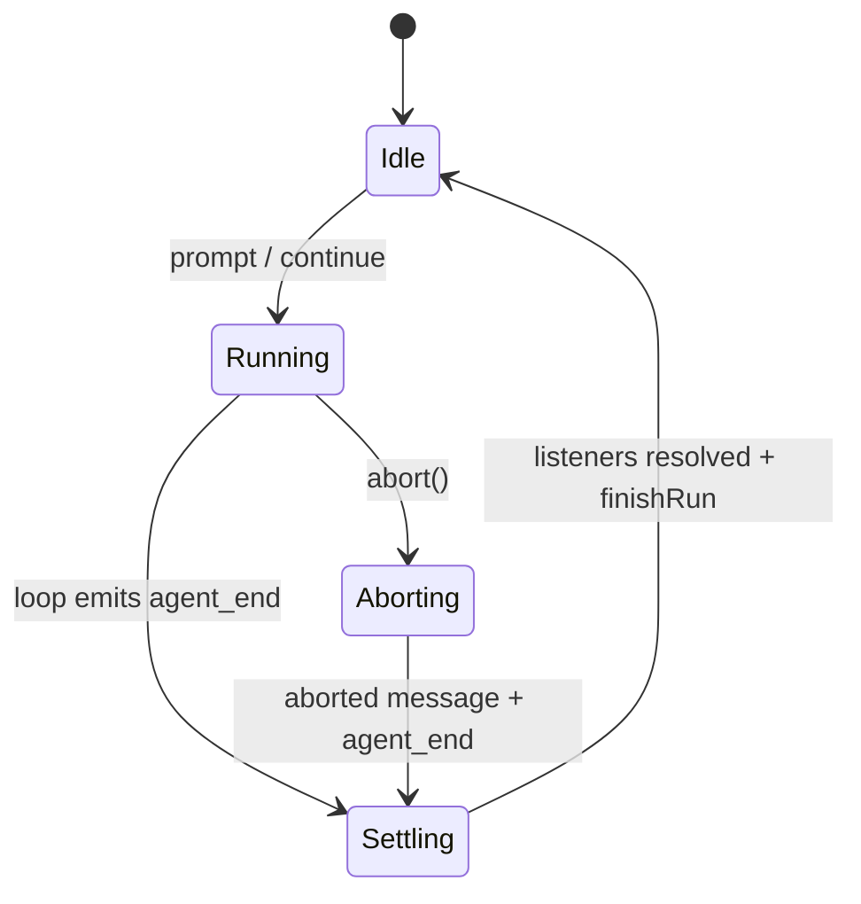
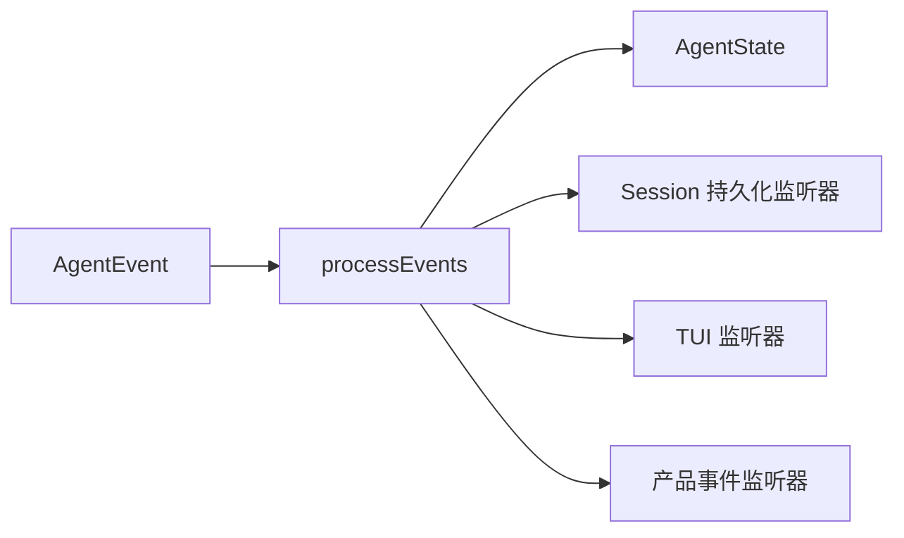

# 第 02 课：`Agent`——一次可取消、可结算的 Run

## 先回答：为什么还需要 `Agent`

模型 SDK 通常只给你一个 Stream。`Agent` 把 Stream 包装成一个有权威状态和生命周期的执行单元：

- 保存 transcript、model、tools 和 thinking level；
- 保证同一时间只有一个 Run；
- 生成并传播 AbortSignal；
- 把 Loop 事件归约成可观察状态；
- 等待事件监听器完成后才真正变成 idle；
- 管理 Steer 和 Follow-up 队列。

## 功能地图

| 功能 | 对外入口 | 修改的状态 | 输出 |
|---|---|---|---|
| 开始请求 | `prompt()` | `activeRun`、`isStreaming` | Loop 事件 |
| 继续未完成上下文 | `continue()` | 同上 | 新 Turn |
| 中途改方向 | `steer()` | `steeringQueue` | 下一安全边界注入 |
| 任务后追加 | `followUp()` | `followUpQueue` | 原任务停止点注入 |
| 取消 | `abort()` | `AbortController` | aborted assistant message |
| 等待结算 | `waitForIdle()` | 不修改 | Run settlement Promise |
| 归约事件 | `processEvents()` | messages、pending tools 等 | Listener |

## 1. `activeRun` 不是布尔值

源码：`packages/agent/src/agent.ts`

```ts
type ActiveRun = {
    promise: Promise<void>;
    resolve: () => void;
    abortController: AbortController;
};
```

运行中它大概是：

```text
activeRun = {
  promise: Promise<pending>,
  resolve: finishRun 时调用,
  abortController: 本次 Run 专属
}
```

三个字段分别解决：

- `promise`：外部能等待完整 settlement；
- `resolve`：Runtime 自己决定什么时候真正结束；
- `abortController`：取消只影响本次 Run。

若只存 `isRunning: true`，你无法等待监听器、无法精确取消，也无法知道谁负责把状态改回 idle。

## 2. 一次 Run 怎样建立

教学化摘录：

```ts
const abortController = new AbortController();
let resolvePromise = () => {};
const promise = new Promise<void>((resolve) => {
    resolvePromise = resolve;
});
this.activeRun = { promise, resolve: resolvePromise, abortController };

this._state.isStreaming = true;
try {
    await executor(abortController.signal);
} finally {
    this.finishRun();
}
```



关键点：`agent_end` 之后还有 `Settling`。监听器可能正在持久化消息或发业务事件，过早显示 idle 会让下一次请求与旧请求尾部并发。

## 3. 为什么 `prompt()` 拒绝并发调用

```ts
if (this.activeRun) {
    throw new Error(
        "Agent is already processing a prompt. Use steer() or followUp()..."
    );
}
```

这不是保守判断，而是权威所有权：一个 Agent 的 transcript 只能有一个正在写入的 Run。并行任务应该创建独立 Agent/Session/Lane，而不是让两个 Promise 同时 push 到同一个 messages 数组。

## 4. 事件怎样变成状态

```ts
case "message_end":
    this._state.streamingMessage = undefined;
    this._state.messages.push(event.message);
    break;

case "tool_execution_start":
    pendingToolCalls.add(event.toolCallId);
    break;

case "tool_execution_end":
    pendingToolCalls.delete(event.toolCallId);
    break;
```

事件不是日志装饰，而是状态变更的输入。



先归约内部状态，再按订阅顺序等待 Listener，这保证监听器看到的是事件对应的新状态。

## 5. 失败为什么也要合成正常事件序列

若 executor 抛错，`Agent` 不只 throw；它会构造一个 `stopReason: "error"` 或 `"aborted"` 的 AssistantMessage，并补齐：

```text
message_start
→ message_end
→ turn_end
→ agent_end
```

这样 Session、UI 和遥测不需要为“异常没有事件”再写第二套状态机。

## 6. 本课 TypeScript

- `get` / `set`：`state.tools` 和 `state.messages` 赋值时复制数组，避免外部继续修改同一个引用。
- `Set<string>`：适合表达当前并行执行的 Tool Call ID。
- 函数成员 `resolve: () => void`：函数本身也是运行时值。
- `finally`：无论成功、失败还是取消，都必须执行 settlement 清理。

## 练习题

1. `agent_end` Listener 需要 300ms 写数据库。为什么这 300ms 内 `waitForIdle()` 不能提前完成？
2. 两个 `prompt()` 同时修改同一个 `messages` 数组，会产生哪三类竞态？
3. 给出 `activeRun` 三个字段的运行时真实值，并逐项说明用途。
4. 为什么失败也要生成 AssistantMessage，而不是只抛异常？
5. 找出一个前端“永远思考中”的可能原因：是漏了哪个事件或 settlement？

## 完成标准

能解释 `activeRun` 为什么不是一个布尔变量，并手推成功、异常、取消三条事件序列。

下一课：[模型 Turn 与 Tool Loop](../03-model-turn-and-tool-loop/README.md)
