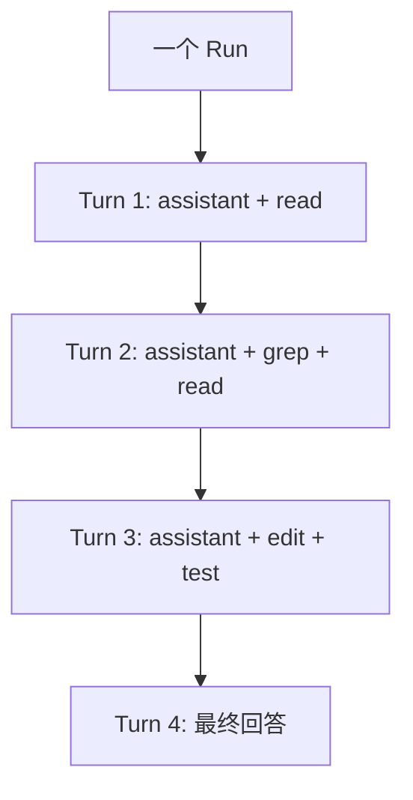
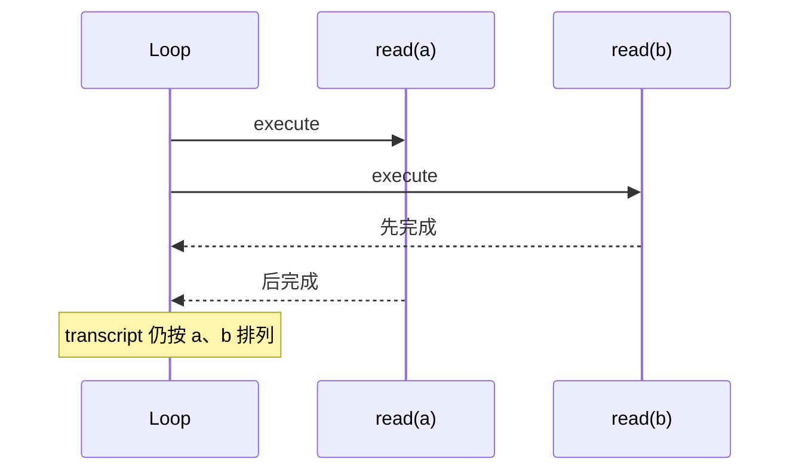

# 第 03 课：`runLoop()`——模型、工具、再模型

## 先回答：Tool Loop 解决什么问题

模型无法直接读取文件。它只能输出一个结构化 Tool Call。Runtime 执行工具后，还必须把 Tool Result 加回上下文，再请模型继续判断。

所以 Agent 不是：

```text
用户 → 模型 → 工具 → 结束
```

而是：

```text
用户 → 模型 → 工具 → Tool Result → 模型 → …… → 最终回答
```

## 1. Run、Turn 与 Tool Batch



- **Run**：从一次用户请求开始，到 Agent 最终停止。
- **Turn**：一个 AssistantMessage，加上它产生的工具结果。
- **Tool Batch**：同一个 AssistantMessage 里的一个或多个 Tool Call。

## 2. 主循环的两层结构

源码：`packages/agent/src/agent-loop.ts`

```ts
while (true) {
    let hasMoreToolCalls = true;

    while (hasMoreToolCalls || pendingMessages.length > 0) {
        const message = await streamAssistantResponse(...);
        const toolCalls = message.content.filter((c) => c.type === "toolCall");
        ...
        pendingMessages = (await config.getSteeringMessages?.()) || [];
    }

    const followUpMessages = (await config.getFollowUpMessages?.()) || [];
    if (followUpMessages.length > 0) {
        pendingMessages = followUpMessages;
        continue;
    }
    break;
}
```

内层循环处理“当前任务仍在继续”：工具和 Steer。外层循环处理“原任务已经可以停止，但用户还有 Follow-up”。

## 3. 一次具体运行

用户：

> 找到登录失败原因并修复。

假设第一轮模型输出：

```json
{
  "type": "toolCall",
  "id": "call-1",
  "name": "grep",
  "arguments": { "pattern": "login failed", "path": "src" }
}
```

Runtime 依次做：

```text
1. emit tool_execution_start
2. 找到 grep Tool
3. 预处理参数
4. 按 Schema 校验
5. 执行 beforeToolCall
6. 调用 tool.execute()
7. 执行 afterToolCall
8. emit tool_execution_end
9. 构造 role=toolResult 消息
10. 下一次模型请求读取该结果
```

## 4. Tool Call 的准备与执行为什么拆开

教学化摘录：

```ts
const preparedToolCall = prepareToolCallArguments(tool, toolCall);
const validatedArgs = validateToolArguments(tool, preparedToolCall);

const beforeResult = await config.beforeToolCall?.({
    assistantMessage,
    toolCall,
    args: validatedArgs,
    context: currentContext,
});
```

准备阶段可以：

- 找不到工具时返回错误 Tool Result；
- 修正兼容格式；
- 拒绝非法参数；
- 经过权限或审批 Hook；
- 在真正产生副作用前响应 AbortSignal。

执行阶段才调用 `tool.execute()`。这让“能不能执行”和“怎样执行”成为不同责任。

## 5. 并行工具的真实语义

若同一 AssistantMessage 请求 `read(a)`、`read(b)`：

- `tool_execution_end` 可以按真实完成顺序出现；
- 但最终写回 transcript 的 Tool Result 仍按 AssistantMessage 中的原始顺序排列。



这样既保留并发性能，又保持 Provider 上下文稳定、可重放。

某个工具声明 `executionMode: "sequential"` 时，整个 Batch 会转为顺序执行，因为它可能依赖前一个副作用。

## 6. 为什么不能执行被截断的 Tool Call

如果 AssistantMessage 因 token limit 以 `stopReason: "length"` 结束，参数可能恰好能解析成 JSON，却缺少尾部内容。Pi 会把该消息中的 Tool Call 全部标记失败，而不是冒险执行一个“语法合法但语义被截断”的命令。

这是副作用系统的重要原则：

> 对自然语言输出可以尽力恢复；对可能修改世界的参数必须失败关闭。

## 7. `addedToolNames` 的作用

Tool Result 可以携带：

```ts
addedToolNames?: string[];
```

表示从这个 transcript 位置开始，有新工具可用。产品的 `tool_load` 因此能做到渐进披露，而不重写之前的稳定 Prompt 前缀。

## 8. 练习题

1. 给定一个 AssistantMessage 同时调用 `read` 和 `edit`，哪种情况必须顺序执行？
2. 为什么 Tool Result 必须有 `toolCallId`？
3. 并行执行时，完成顺序和写入 transcript 的顺序为何不同？
4. `beforeToolCall` 拒绝执行后，为什么仍要生成错误 Tool Result 给模型？
5. 模型输出被截断但 JSON 参数恰好合法，为什么仍不能执行？
6. 手推：用户消息 → read → grep → 最终回答，共有几个 Turn？

## 完成标准

能够不看源码，完整说出 Tool Call 从模型输出到下一轮模型输入的十个步骤。

下一课：[Steer、Follow-up 与 Abort](../04-steer-follow-up-and-abort/README.md)
