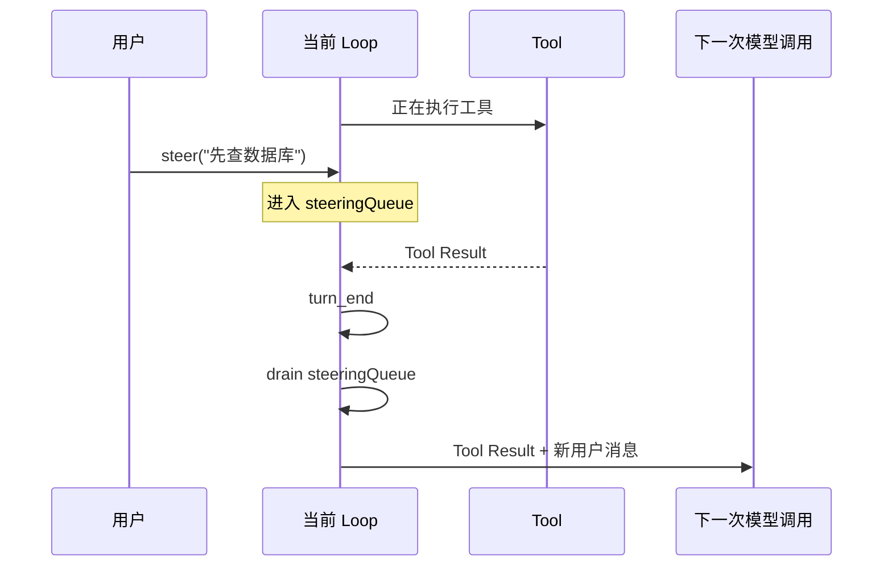

# 第 04 课：中途输入与取消——为什么必须等安全边界

## 真实场景

Agent 正在检查前端，你突然输入：

> 先检查数据库，前端稍后再看。

这句话不能插进正在生成的 token 中，也不应该粗暴杀死已经完成一半的只读工具。Pi 提供三个不同语义：

| 操作 | 语义 |
|---|---|
| `steer` | 当前 Assistant Turn 和工具 Batch 完成后，下一次模型调用前注入 |
| `followUp` | 当前任务本来要结束时，再启动后续 Turn |
| `abort` | 取消当前 Run 的模型流与可响应 signal 的工具，并等待 settlement |

## 1. Steer 的安全边界



Steer 不会跳过当前工具。否则可能产生“副作用已经发生，但 Tool Result 没写入历史”的断裂。

## 2. Follow-up 的停止点

Follow-up 只在下列条件都满足时注入：

```text
没有更多 Tool Call
+ 没有 Steer
+ 当前任务原本要停止
```

典型用途：

> 修完后，再总结一下根因和防复发方案。

它不应该抢占当前工作。

## 3. 队列不是普通字符串数组

Agent 内部的 `PendingMessageQueue` 支持两种 drain 策略：

- `all`：一次注入全部；
- `one-at-a-time`：只取最早一条，其余留给后续安全边界。

这影响模型上下文语义。三条方向修改一次全部注入，可能互相覆盖；逐条注入则允许模型每次响应一个最新变化。

## 4. AgentSession 为什么还维护一份显示队列

`Agent` 维护真正的 `AgentMessage` 队列；`AgentSession` 还维护：

```ts
private _steeringMessages: string[] = [];
private _followUpMessages: string[] = [];
```

它们用于 UI 展示。消息真正进入 Loop 时，Session 根据 `message_start` 移除对应显示项，再发 `queue_update`。

这不是重复状态机：Agent 队列是执行权威；Session 字符串列表是 UI 投影。

## 5. Abort 的传播

源码链：

```text
AgentSession.abort()
→ abortRetry()
→ Agent.abort()
→ ActiveRun.abortController.abort()
→ streamFn / tool.execute 收到 signal
→ Loop 产生 aborted AssistantMessage
→ agent_end
→ AgentSession 后处理
→ agent_settled
→ waitForIdle() 完成
```

`abort()` 不是发出信号后立即返回：

```ts
async abort(): Promise<void> {
    this.abortRetry();
    this.agent.abort();
    await this.waitForIdle();
}
```

因为 UI 或调用者通常需要一个保证：返回时旧 Run 已不会继续写入 Session。

## 6. 常见错误设计

### 错误一：收到新输入就创建第二个 `prompt()`

同一 transcript 出现两个并发写者。

### 错误二：Abort 后立刻清空界面

旧 Run 的最后 `message_end`、`turn_end` 或 settlement 仍可能到达，导致旧内容“回魂”。

### 错误三：把 Steer 当 Follow-up

用户要立刻改变方向，Runtime 却做完整个旧任务后才处理。

## 7. 练习题

1. Agent 正在执行 `edit`，用户 Steer“不要改文件”。Runtime 能保证文件没改吗？应怎样向用户解释？
2. 用户连续发送三条 Steer，`all` 与 `one-at-a-time` 的模型输入分别是什么？
3. 为什么 `AgentSession.abort()` 要等待 `waitForIdle()`？
4. 前端切换 Session 后旧消息闪回，最可能漏了哪个身份或 settlement 检查？
5. 设计一个状态表，列出 Running、Aborting、Settling、Idle 时允许哪些操作。

## 完成标准

能根据用户意图准确选择 Steer、Follow-up 或 Abort，并解释每个操作的生效边界。

下一课：[AgentSession 的编排职责](../05-agent-session-orchestration/README.md)
