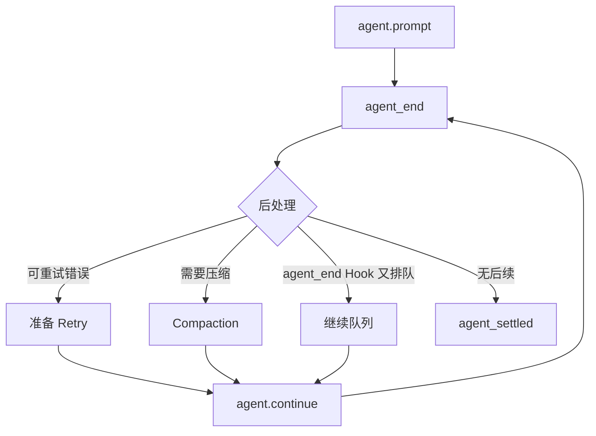

# 第 05 课：`AgentSession`——把一次 Run 变成可长期使用的会话

## 先回答：为什么 `Agent` 之上还要有 `AgentSession`

`Agent` 只保证一次 Run 正确执行。Coding 产品还需要：

- 将消息写入 Session；
- 在每轮触发 Extension；
- 管理 Tool Registry 与 System Prompt；
- 自动重试可恢复错误；
- 达到阈值后 Compaction；
- Session 切换和恢复；
- 最后发出 `agent_settled`。

这些属于“长期会话编排”，不能塞进最小 Agent Loop。

## 功能地图

| 功能 | 实现位置 | 权威状态 |
|---|---|---|
| 消息持久化 | `_handleAgentEvent` | `SessionManager` |
| Extension 事件 | `_emitExtensionEvent` | `ExtensionRunner` |
| 工具激活 | `setActiveToolsByName` | `Agent.state.tools` |
| Prompt 预处理 | `prompt` | 输入、Skill、Template |
| 自动重试 | `_handlePostAgentRun` | retry 状态 |
| 自动压缩 | `_checkCompaction` | compaction 状态 |
| 最终结算 | `_emitAgentSettled` | `_isAgentRunActive` |

## 1. 构造时绑定了什么

```ts
this._unsubscribeAgent = this.agent.subscribe(this._handleAgentEvent);
this._installAgentToolHooks();
this._installAgentNextTurnRefresh();

this._buildRuntime({
    activeToolNames: this._initialActiveToolNames,
    includeAllExtensionTools: true,
});
```

这几行说明 `AgentSession` 通过组合和订阅扩展 Agent：

- 不修改 Agent Loop 源码也能持久化事件；
- Tool 前后 Hook 始终读取当前 ExtensionRunner；
- 每个下一 Turn 都刷新模型、Thinking、System Prompt 和工具快照；
- reload 后可以换 ExtensionRunner，而不用重建 Agent Hook。

## 2. 一个 Prompt 为什么可能运行多次 Agent Loop

核心结构：

```ts
private async _runAgentPrompt(messages: AgentMessage | AgentMessage[]) {
    this._isAgentRunActive = true;
    try {
        await this.agent.prompt(messages);
        while (await this._handlePostAgentRun()) {
            await this.agent.continue();
        }
    } finally {
        await this._emitAgentSettled();
    }
}
```



因此 `agent_end` 不等于整个 Session 请求结束。上层必须等待 `agent_settled`。

## 3. Prompt 预处理链

`AgentSession.prompt()` 在交给 Agent 之前依次处理：

```text
Extension Command
→ Compaction 冲突检查
→ input Extension Event
→ Skill / Prompt Template 展开
→ Streaming 时选择 Steer 或 Follow-up
→ 模型与鉴权预检
→ before_agent_start
→ 构造 UserMessage
→ _runAgentPrompt
```

这解释了为什么用户输入不能直接从 TUI 调 `Agent.prompt()`：会绕过扩展、Skill、权限和 Session 规则。

## 4. 事件持久化为什么监听 `message_end`

流式 `message_update` 是暂态画面；只有 `message_end` 才是完整消息。若每个 token 都写 JSONL：

- I/O 放大；
- 崩溃恢复可能读到大量半成品；
- Tool Call 参数在流中可能尚不完整；
- Session Tree 会被 token 级节点污染。

## 5. Tool Hook 放在哪一层

`Agent` 提供通用 `beforeToolCall` / `afterToolCall` 插槽；`AgentSession` 把 ExtensionRunner 接上去。这样：

```text
Agent Core 知道“有 Hook”
但不知道 Extension、审批或产品业务
```

边界清晰，又能让产品拦截工具。

## 6. `agent_settled` 的含义

它至少保证：

- 当前 Agent Run 结束；
- 自动 Retry/Compaction 判断结束；
- agent_end Extension 新排队的消息已处理；
- Session 内部状态已切回 idle；
- Extension 的 `agent_settled` Handler 已完成。

前端的“停止按钮消失”和后端接受下一请求，应以这个结算语义为准，而不是猜最后一个文本 token。

## 7. 练习题

1. 为什么 `AgentSession` 不应该继承 `Agent`？
2. `agent_end` Hook 又追加一条 Steer 时，为什么需要 `agent.continue()`？
3. 为什么消息持久化选择 `message_end`，而不是 `message_update`？
4. 若 UI 收到 `agent_end` 就切换 Session，会出现什么竞态？
5. 把 Prompt 预处理链画成时序图，并标出能拒绝请求的节点。

## 完成标准

能解释 `AgentSession` 怎样通过订阅和 Hook 增强 Agent，以及为什么最终边界是 `agent_settled`。

下一课：[Session 树、Fork 与恢复](../06-session-tree-and-recovery/README.md)
