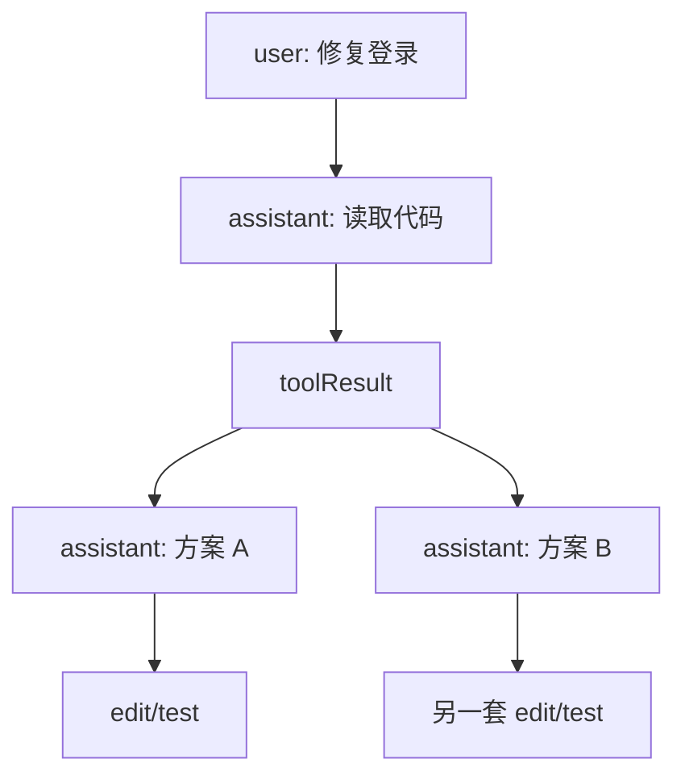
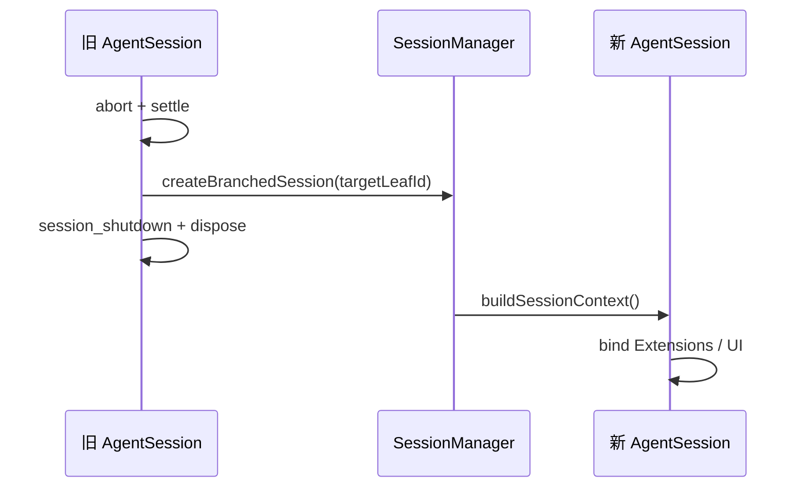

# 第 06 课：`SessionManager`——历史为什么是一棵树

## 先回答：为什么不只保存 `messages[]`

真实 Coding Session 会发生：

- 从旧问题处分叉尝试另一方案；
- Rewind 后重写一条用户消息；
- 压缩旧上下文但保留完整审计历史；
- Extension 保存不进入模型的内部状态；
- 切换模型或 Thinking Level；
- 重启后恢复到某个叶节点。

单一数组无法同时表达“完整历史”和“当前分支”。

## 1. Entry 数据模型

每个 Session Entry 都有：

```ts
interface SessionEntryBase {
    type: string;
    id: string;
    parentId: string | null;
    timestamp: string;
}
```

`parentId` 让 JSONL 中按追加顺序保存的记录形成树。



当前 Context 只沿当前 `leafId` 向父节点回溯，再反转为时间顺序。

## 2. 不同 Entry 是否进入模型

| Entry | 是否进入 LLM Context | 用途 |
|---|---:|---|
| `message` | 是 | 用户、助手、工具结果 |
| `model_change` | 间接 | 恢复当前模型 |
| `thinking_level_change` | 间接 | 恢复 Thinking |
| `compaction` | 是，投影为摘要消息 | 替换旧上下文 |
| `branch_summary` | 是 | 切换分支时保留必要信息 |
| `custom` | 否 | Extension 内部持久状态 |
| `custom_message` | 是 | Extension 显式注入模型上下文 |
| `label` / `session_info` | 否 | 导航和展示 |

`custom` 与 `custom_message` 的区别非常重要：前者是数据库状态，后者是模型可见消息。

## 3. JSONL 为什么适合追加

文件大致是：

```json
{"type":"session","version":3,"id":"...","cwd":"/workspace/pi"}
{"type":"message","id":"a1","parentId":null,"message":{"role":"user", "...":"..."}}
{"type":"message","id":"a2","parentId":"a1","message":{"role":"assistant", "...":"..."}}
{"type":"model_change","id":"a3","parentId":"a2","provider":"openai","modelId":"..."}
```

优点：

- 每次事件追加一行；
- 崩溃时已完成行仍可读；
- 可以保留整棵分支树；
- 迁移可以逐 Entry 处理。

但 JSONL 不是产品 API。外部产品应通过 Pi 的 Session 接口操作，不能自行改 parentId 或 compaction 节点。

## 4. Fork 的真实过程

`AgentSessionRuntime.fork()` 会：

```text
1. 发 session_before_fork，允许取消
2. 校验目标 Entry
3. 确定 position=before 还是 at
4. 为持久 Session 创建新的 branched session 文件
5. abort 并结算旧 Runtime
6. 发 session_shutdown
7. dispose 旧 Session
8. 用新 SessionManager 重建 cwd-bound Runtime
9. 重新绑定 UI/Extension
```



旧 Extension Context 会被显式标记 stale，防止它继续写入新 Session。

## 5. 恢复不是“重新读取聊天文本”

恢复要重建：

- 当前分支 messages；
- 最后模型；
- 最后 Thinking Level；
- Compaction 摘要；
- 动态工具披露记录；
- Extension 自定义状态；
- cwd-bound ResourceLoader 与 Settings。

只恢复聊天气泡会造成“界面看起来有历史，但 Runtime 不知道以前做过什么”。

## 6. 失败与一致性

| 场景 | 关键保护 |
|---|---|
| Fork 前仍在运行 | 先 `abort()` 并等待 settlement |
| 目标 Entry 不存在 | 拒绝 Fork |
| 持久 Session 尚未真正写出 | 拒绝复制不存在的文件 |
| 新 Runtime 创建失败 | 不应让旧、新两个 Runtime 同时活着 |
| 旧 Extension 捕获了 ctx | invalidate 后调用应报 stale |

## 7. 练习题

1. 为什么 Session JSONL 的物理行顺序不能直接等同于当前对话顺序？
2. `custom` 和 `custom_message` 分别举一个产品场景。
3. Fork 到某条用户消息“之前”和 Fork 到某条 AssistantMessage“所在位置”有什么区别？
4. 只恢复 messages、不恢复 model change，会出现什么用户可见差异？
5. 设计一个 Session Tree，包含两条分支和一次 Compaction，并写出当前叶子的 Context 路径。

## 完成标准

能用 `id + parentId + leafId` 手工还原一条分支，并解释 Fork 为什么需要重建整个 cwd-bound Runtime。

下一课：[Context Compaction](../07-context-compaction/README.md)
