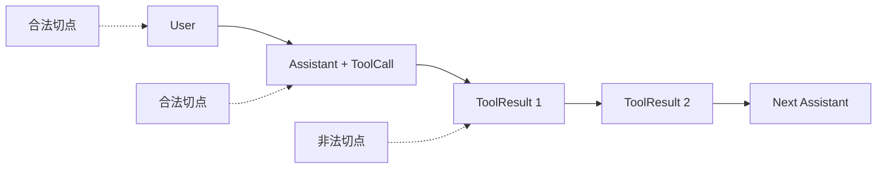
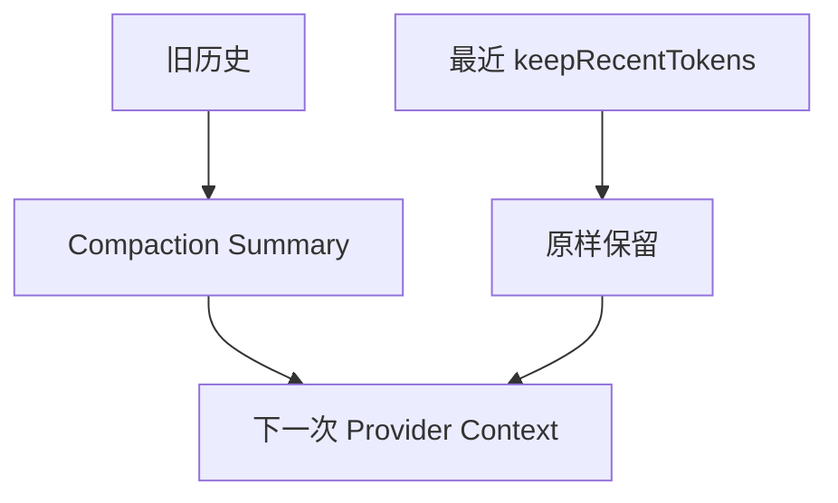

# 第 07 课：Context Compaction——压缩历史但不破坏工作

## 先回答：Compaction 不是删除聊天记录

Session 文件仍保存完整 Entry。Compaction 改变的是**下一次发给模型的活动上下文投影**：

```text
较早历史 → 一条结构化摘要
最近工作 → 原样保留
完整 Session Tree → 仍在磁盘
```

## 1. 何时触发

默认设置：

```ts
export const DEFAULT_COMPACTION_SETTINGS = {
    enabled: true,
    reserveTokens: 16384,
    keepRecentTokens: 20000,
};
```

触发条件：

\[
\text{contextTokens} >
\text{contextWindow} - \text{reserveTokens}
\]

例如：

```text
contextWindow  = 128000
reserveTokens  = 16384
触发阈值       = 111616
当前估计       = 114000
结论           = 触发 Compaction
```

Reserve 不是要保留的历史，而是给下一次模型输出、工具结果和误差留出的安全空间。

## 2. Token 估计为什么混合真实 Usage 与启发式

Pi 优先使用最近一个有效 AssistantMessage 的 Provider Usage，再对它之后新增的消息做估算：

```text
contextTokens
= lastAssistantUsage.totalTokens
+ trailingMessagesEstimate
```

这样比对整段文本全部用 `chars / 4` 更准确，又能覆盖最后一次模型调用之后新增的 Tool Result 和 Steer。

## 3. 安全切点

不能从 Tool Result 前面直接切断，因为模型会看到一个没有对应 Tool Call 的结果。Pi 的切点规则：

- 可以从 User、Assistant、Custom、BranchSummary 等开始；
- 不从 Tool Result 开始；
- 若从带 Tool Call 的 AssistantMessage 开始，它后面的 Tool Result 一并保留；
- 必要时识别“切在一个 Turn 中间”，额外总结该 Turn 的前缀。



## 4. 压缩后的 Context



摘要不仅要记录“聊了什么”，还要保留：

- 当前任务和约束；
- 已完成工作与证据；
- 关键设计决策；
- 已读和已修改文件；
- 尚未解决的问题；
- 继续工作所需的下一步。

否则模型会记得故事，却忘记工程状态。

## 5. 为什么 Compaction 之后不是立刻覆盖 System Prompt

Compaction 的权威产物是 Session 中的 `CompactionEntry`。Extension 可以在成功事件后刷新产品 Memory，但不能偷偷修改已经结算的压缩结果。新的 Session Context 应在下一次正常 `before_agent_start` 组合进入模型。

这样避免两套“压缩后真实上下文”。

## 6. 失败、取消与 Overflow Recovery

Compaction 有三种原因：

- `manual`：用户主动压缩；
- `threshold`：超过预设阈值；
- `overflow`：Provider 已经报上下文过长，需要压缩后重试。

失败或取消会发 `session_compact_failed`，并带上：

```text
reason
errorMessage?
aborted
willRetry
fromExtension
```

上层不能把所有失败都显示成“压缩完成”。

## 7. Compaction 与 Handoff

| 机制 | 是否仍在同一 Session | 主要目的 |
|---|---:|---|
| Compaction | 是 | 缩短活动上下文，继续同一条工作线 |
| Fork | 新 Session 文件/分支 | 从历史位置尝试另一条路线 |
| Handoff 文档 | 可跨 Session/Agent | 把稳定工作状态交给另一个执行者 |

不要为了“上下文长”就无条件新建对话。只要任务身份和历史连续，优先用 Compaction；真正换执行主体或隔离工作线时再 Handoff/Fork。

## 8. 练习题

1. `contextWindow=64k`、`reserveTokens=8k`，当前 57k，是否触发？
2. 为什么最近一个 Assistant Usage 之后还要估算 trailing messages？
3. 画出一个 Assistant Tool Call 后跟两个 Tool Result 的 Turn，列出合法切点。
4. 摘要只写“修复了登录 Bug”，恢复后还缺哪些工程事实？
5. Overflow Compaction 失败但 `willRetry=true`，UI 应显示什么状态？

## 完成标准

能算出触发阈值，解释切点约束，并写出一份能支持继续开发的压缩摘要结构。

下一课：[ModelRuntime 与 Provider 边界](../08-model-runtime-and-provider-boundary/README.md)
