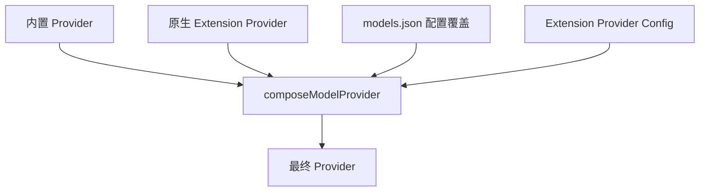
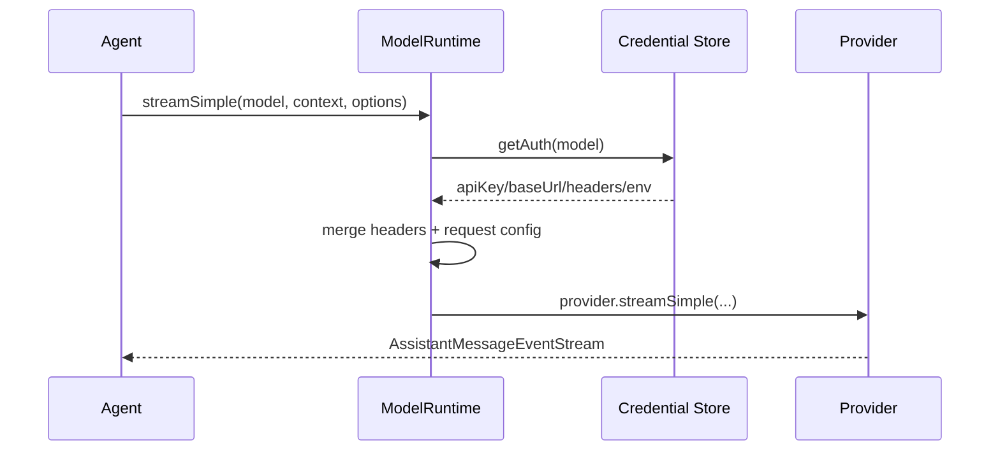

# 第 08 课：`ModelRuntime`——模型目录、鉴权与请求为什么是一体的

## 先回答：模型 ID 不等于可用模型

一个模型出现在静态目录中，不代表当前用户能调用它。真正可用需要同时满足：

```text
Provider 已注册
+ 模型存在
+ 配置可组合
+ 凭证可解析
+ 当前环境/网络可用
```

`ModelRuntime` 是这组事实的权威持有者。

## 1. 内部状态

源码：`packages/coding-agent/src/core/model-runtime.ts`

```ts
private snapshot = {
    all: [],
    available: [],
    configuredProviders: new Set(),
    storedProviders: new Set(),
    auth: new Map(),
};
```

运行时示例：

```text
all                 = [openai/gpt-x, anthropic/claude-y, local/qwen]
configuredProviders = {openai, local}
storedProviders     = {openai}
available           = [openai/gpt-x, local/qwen]
```

`all` 用于展示目录；`available` 才应该用于默认选择和切换。

## 2. Provider 的组合来源



同一个 Provider 可以由内置实现提供流式能力，再由本地配置覆盖 Base URL、Headers 或模型列表。组合失败必须记录错误，而不是悄悄使用半套配置。

## 3. 创建与刷新

`ModelRuntime.create()` 会：

1. 创建 Credential Store；
2. 读取 `models.json`；
3. 创建 Model Store；
4. 注册内置 Provider；
5. 组合配置；
6. 按 `allowModelNetwork` 决定是否联网刷新；
7. 刷新可用性快照。

产品 Runtime Host 使用：

```ts
await modelRuntime.refresh({ allowNetwork: false });
```

表示重新读取本地配置和鉴权，但不让一次用户请求顺手访问远程模型目录。

## 4. 请求边界



Agent Core 不知道 API Key 在文件、环境变量、OAuth 还是产品注入中。它只使用 StreamFn。

## 5. 为什么要用版本序列防止旧刷新覆盖新状态

模型可用性检查可能并发：

```text
刷新 A 开始
用户更新 API Key
刷新 B 开始并先完成
刷新 A 后完成
```

若没有 sequence，旧刷新 A 会把新鉴权结果覆盖。`availabilityRefreshSeq` 和 per-provider sequence 让过时结果失效。

这和前端防止旧请求覆盖新页面的 stale guard 是同一类问题。

## 6. ModelRuntime 不负责什么

- 不管理 Session；
- 不决定何时 Retry/Compaction；
- 不执行 Tool；
- 不管理产品额度；
- 不保存 Room 状态。

它只对“模型、Provider、鉴权、请求”负责。

## 7. 练习题

1. 为什么模型目录中的模型不能直接放进模型切换列表？
2. 画出内置 Provider、models.json 和 Extension Provider 的组合关系。
3. 用户更新 API Key 时两个 Availability Refresh 并发，如何避免旧结果覆盖？
4. 产品 Host 为什么通常应使用 `allowNetwork: false` 刷新本地请求配置？
5. 将 API Key 读取逻辑写进 Agent Core 会造成什么耦合？

## 完成标准

能解释 `all`、`available`、`configuredProviders` 和 `storedProviders` 的差异，并画出一次请求的鉴权链。

下一课：[Extension、Skill 与 ResourceLoader](../09-extensions-skills-and-resources/README.md)
