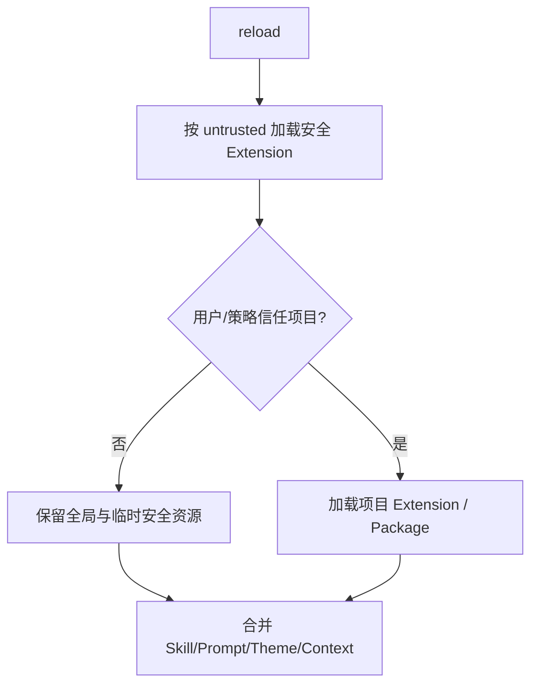
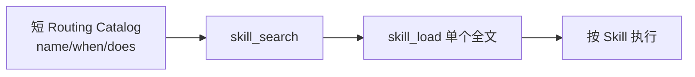

# 第 09 课：Extension、Skill 与 Resource——三种扩展不是一回事

## 先回答三个概念

| 概念 | 本质 | 典型用途 |
|---|---|---|
| Extension | 可执行代码和事件 Hook | 拦截 Tool、注册命令、改 UI、监听 Session |
| Skill | 模型可读取的工作流知识 | 教模型何时、怎样完成一类任务 |
| ResourceLoader | 发现、合并和刷新资源的权威入口 | Extension、Skill、Prompt、Theme、AGENTS.md |

Skill 不应该偷偷执行副作用；Extension 不应该把所有知识永久塞进 System Prompt。

## 1. ResourceLoader 收集什么

```ts
export interface DefaultResourceLoaderOptions {
    additionalExtensionPaths?: string[];
    additionalSkillPaths?: string[];
    additionalPromptTemplatePaths?: string[];
    additionalThemePaths?: string[];
    extensionFactories?: InlineExtension[];
    noExtensions?: boolean;
    noSkills?: boolean;
    noContextFiles?: boolean;
    skillsOverride?: (...) => ...;
}
```

它同时考虑：

- 用户全局资源；
- 项目资源；
- 包管理器资源；
- CLI 临时路径；
- 产品明确传入的路径；
- 信任状态；
- 调用者的 override。

## 2. 为什么要有 Project Trust Bootstrap

项目目录里的 Extension 是代码，加载就可能执行。ResourceLoader 首先在“不信任项目”的状态下只加载安全范围，再让上层决定是否信任项目，之后才加载完整资源。



这不是完整沙箱。Pi 本身仍以当前进程权限运行；强隔离要用容器或沙箱。

## 3. Extension 事件链

Extension 可以监听：

```text
input
before_agent_start
context
before_provider_request
before_provider_headers
after_provider_response
tool_call
tool_result
message_end
turn_end
agent_settled
session_before_compact
session_compact
session_compact_failed
session_shutdown
```

事件按生命周期分布，而不是集中在“模型调用前后”两个 Hook。这使扩展能精确选择边界。

## 4. Skill 的渐进加载

传统做法把所有 Skill 全文放入 Prompt，会带来：

- Token 增长；
- Prompt Cache 前缀不稳定；
- 不相关规则互相干扰；
- 新装 Skill 改变所有请求。

更好的三层披露：



产品适配器可以给旧 Skill 叠加 `when / does / notFor` Routing Card，但不应修改上游通用 Skill 类型。

## 5. Tool 与 Skill 的配合

```text
Skill：告诉模型“什么时候用、流程怎么走”
Tool：提供“真正可执行的能力”
Extension：在调用前后实施权限、审批与观测
```

例如“发布课程”：

- Skill 描述检查目录、验证链接、生成提交的步骤；
- GitHub Tool 真正创建 Blob/Commit/PR；
- Extension/产品策略限制可写仓库和审批。

## 6. Reload 不是清空重建一切

Resource Reload 要考虑：

- 旧 Extension Context 失效；
- 工具集合改变；
- System Prompt 需要重建；
- Provider Schema 前缀是否改变；
- Session 中已披露的动态 Tool 是否恢复；
- 新旧资源差异要能审计。

产品侧应比较 revision/diff，而不是每次无条件重开 Session。

## 7. 练习题

1. 写出 Extension、Skill、Tool 各自最适合承载的一个职责。
2. 为什么项目 Extension 必须经过 Trust，而 Markdown Skill 风险相对不同？
3. 所有 Skill 全文常驻 System Prompt 会产生哪四个问题？
4. 设计一个 `memory-review` Routing Card，包含 `when`、`does`、`notFor`。
5. Reload 后旧 Extension 捕获的 ctx 为什么必须变 stale？

## 完成标准

能够为一个新能力正确选择 Skill、Tool 或 Extension，并画出 ResourceLoader 的信任与加载流程。

下一课：[TUI 的事件驱动与差分渲染](../10-tui-event-driven-rendering/README.md)
