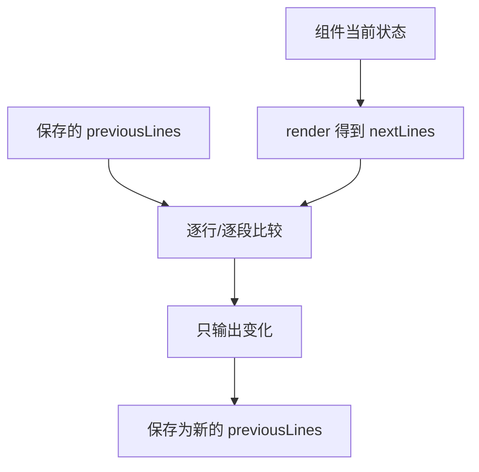

# 第 10 课：TUI——流式更新为什么不必整屏重画

## 先回答：UI 读取的不是 Agent 内存细节

Agent 和 AgentSession 发出事件；TUI 把事件投影成组件状态，再请求渲染。正确边界是：

```text
Runtime 产生权威事件
→ UI 更新自己的投影
→ TUI 比较前后画面
→ 只写变化区域
```

UI 不应该根据“最后一条消息看起来像什么”猜 Runtime 状态。

## 1. 最小组件契约

源码：`packages/tui/src/tui.ts`

```ts
export interface Component {
    render(width: number): string[];
    handleInput?(data: string): void;
    wantsKeyRelease?: boolean;
    invalidate(): void;
}
```

组件只负责把当前状态渲染成终端行。TUI 负责输入、焦点、光标、Overlay 和差分输出。

## 2. 为什么有 `CURSOR_MARKER`

终端中的中文输入法候选窗需要真实硬件光标位置。组件在逻辑光标处输出一个零宽标记，TUI 找到并移除它，再把硬件光标移到对应坐标。

```text
组件字符串: "用户输入...\x1b_pi:c\x07"
TUI       : 找标记 → 计算列 → 去标记 → 移动硬件光标
IME       : 在正确位置弹出候选窗
```

这说明 UI 渲染不仅是“打印文本”，还要维持终端与输入法协议。

## 3. 渲染节流

`TuiBase` 维护：

```ts
private renderRequested = false;
private lastRenderAt = 0;
private static readonly MIN_RENDER_INTERVAL_MS = 16;
```

真正的合并入口不是简单的 `setTimeout(16)`：

```ts
requestRender(force = false): void {
    if (force) {
        this.resetRenderState();
        this.requestImmediateRender();
        return;
    }
    if (this.renderRequested) return;
    this.renderRequested = true;
    process.nextTick(() => this.scheduleRender());
}
```

`renderRequested` 把同一批 token delta 合并成一次画面更新；`scheduleRender()` 再根据距上一帧的时间，只补足剩余延迟。键盘输入走 `requestImmediateRender()`，所以输入反馈不会被流式 token 的节流拖慢。

模型可能每毫秒产生多个 token。每个 token 都立即整屏重画，会闪烁、浪费 CPU，并让终端输出队列堆积。合并渲染不会丢 token，因为组件状态仍接收全部 delta，只是减少把同一中间状态写到终端的次数。

## 4. 差分渲染思路



对流式 AssistantMessage：

- `message_start` 创建消息组件；
- `message_update` 更新同一个组件内容；
- `message_end` 固化；
- Tool Event 更新对应 Tool 组件；
- `agent_settled` 关闭工作指示器。

若每个 `message_update` 都创建新组件，就会出现重复卡片和页面跳动。

## 5. Overlay 与焦点为什么要单独管理

模型选择器、确认框、编辑器都是 Overlay。它们需要：

- 可见性；
- z-order；
- 是否捕获输入；
- 关闭后恢复之前焦点；
- 终端尺寸变化时重新定位。

普通“显示一个弹窗布尔值”无法正确处理多个叠加 Overlay。

## 6. 前端常见错位

| 症状 | 可能的状态问题 |
|---|---|
| 文本一闪一闪 | 每个 delta 重建组件或强制全屏 redraw |
| 空卡片不断出现 | 把 `message_start` 和每次 update 都当新消息 |
| 取消后旧内容回显 | 缺少 Session/Turn 身份 stale guard |
| 一直显示思考中 | 只监听 `agent_end`，漏掉 settled/失败路径 |
| 中文候选窗位置错误 | 没有正确处理硬件光标标记 |

## 7. 练习题

1. 为什么 `message_update` 应更新已有组件，而不是 append 新组件？
2. 16ms 渲染节流解决了什么问题？会不会丢 token？
3. 画出 Runtime Event → UI Projection → Differential Render 的三层关系。
4. Abort 后旧 Turn 的 delta 到达，前端应检查哪些身份？
5. 为什么 Overlay 关闭时不能总是把焦点设回主编辑器？

## 完成标准

能够解释一条流式 AssistantMessage 怎样从事件稳定更新成终端画面，并定位三类闪烁 Bug。

下一课：[Durable AgentHarness 与 Lane](../11-durable-harness-and-lanes/README.md)
