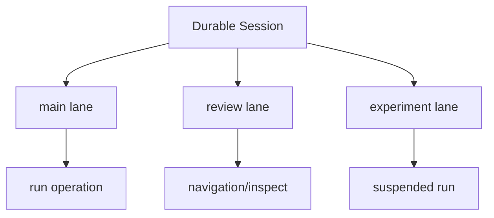

# 第 11 课：Durable `AgentHarness`——新的目标模型与当前边界

## 先说结论

仓库同时存在两条值得学习的线：

| 路线 | 当前状态 | 适合做什么 |
|---|---|---|
| 经典 `Agent` + `AgentSession` | 完整、已有大量真实使用 | 当前产品 Runtime |
| 新 `AgentHarness` | 目标接口已清晰，部分操作仍未实现 | 学 durable lane、恢复、显式动作模型 |

不要因为新接口更漂亮就立刻替换稳定 Runtime。

## 1. Harness 想解决什么

经典 Agent 主要在进程内运行。Durable Harness 希望让运行变成可以持久化、恢复和手动驱动的操作：

```text
Session
└── Lane
    ├── transcript
    ├── leafId
    ├── active operation
    ├── steer/followUp/nextRun queues
    ├── pending writes
    └── suspended operation
```

## 2. Lane 是什么

Lane 是一条有独立 leaf 和操作所有权的执行线。它比“并发调用同一个 Agent”安全，因为每条 Lane 明确拥有自己的：

- 当前叶节点；
- Run/Compaction/Navigation；
- 队列；
- pending writes；
- fault/suspended 状态。



## 3. Result 而不是到处 throw

公开结果形如：

```ts
type RunOutcome =
    | { kind: "completed"; ... }
    | { kind: "aborted"; ... }
    | { kind: "failed"; ... }
    | { kind: "suspended"; deferred: DeferredHandle };
```

而“操作根本不能开始”则是 `LaneBusy`、`InvalidMessage`、`Closed` 等 Rejected 类型。

这样调用者能区分：

- 已接受但最终失败；
- 根本没接受；
- 被取消；
- 因 deferred/crash 挂起，可恢复。

## 4. 自动驱动与手动驱动

Harness 暴露：

```text
peekAction()
executeAction()
runToCompletion()
```

这允许：

- 自动模式：Runtime 连续执行；
- 手动模式：测试或外部调度器逐步执行并观察每个 Action；
- 崩溃恢复：从 durable Session 推导下一 Action，而不是靠内存 Promise。

这与“模型自己继续调用直到结束”相比，更容易审计和复现。

## 5. 当前未完成边界

源码明确存在：

```ts
class HarnessNotImplemented extends Error { ... }
```

并且部分 `AgentHarness` 方法会返回 `unavailable(...)`。这意味着：

- 类型和目标架构不等于功能全部完成；
- 不能仅看 Interface 就宣称支持恢复、多 Lane 或完整 Hook；
- 迁移产品前必须以测试和真实执行路径为证据。

## 6. 与 Room/多 Agent 的关系

Harness 的 Lane 可以成为多 Agent 执行底座的一部分，但 Room 仍需要产品层职责：

```text
Pi/Harness：
Run、Tool、Cancel、Resume、Session、Lane

Room：
用户目标、WorkItem、依赖、工作区边界、集成、独立复核、最终交付
```

不要把 Room 的业务状态硬塞进通用 Agent Harness，也不要让 Room 复制 Agent Loop。

## 7. 迁移判断表

只有满足以下条件才考虑从经典路径切换：

- `prompt/steer/followUp/abort` 全路径完成；
- Tool 副作用与 pending write 可恢复；
- Compaction 和 Navigation 有完整测试；
- deferred/crash 恢复不会重复 Tool；
- 事件和 settlement 能映射现有 UI；
- 产品 Runtime 的 Extension/Skill/Model 能接入；
- 真实 Session 迁移方案已验证。

## 8. 练习题

1. `completed` 与 `Rejected` 有什么本质区别？
2. 为什么 Lane 比“同一个 Agent 上开两个 Promise”更适合并发？
3. `peekAction()` 对测试和恢复有什么价值？
4. 看到完整 Interface 时，怎样验证实现是否真的可用？
5. 列出 Harness 与 Room 各自三个职责，禁止重叠。

## 完成标准

能准确描述 Harness 的目标价值，同时明确指出当前不能凭接口推断哪些能力已经完成。

下一课：[产品 Runtime Host](../12-product-runtime-host/README.md)
