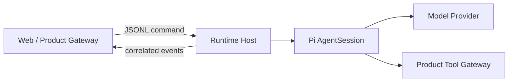
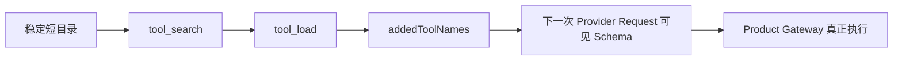

# 第 12 课：产品 Runtime Host——借用 Pi，不复制 Pi

## 场景

你要把 Pi 接到一个 Web Agent 产品中。产品有自己的：

- Persona；
- Memory / Knowledge；
- Room；
- 权限与审批；
- Tool Catalog；
- WebSocket/SSE 事件；
- 数据库。

正确做法不是复制 `AgentSession` 再写一套 Loop，而是建立窄的产品适配器。

## 1. 当前适配器边界

`integrations/rag-ime-runtime-host` 位于 `packages/*` 外，原因是产品策略不应该污染上游 Pi 包、工作区和 lockfile。



| Runtime Host 拥有 | Product Gateway 拥有 |
|---|---|
| Pi Session 生命周期 | Persona 与产品身份 |
| 模型和 Tool Loop | Memory/Knowledge 数据 |
| Compaction 和 Snapshot | Room/WorkItem |
| `agent_settled` | 权限策略与审批决定 |
| 动态工具注册 | 权威 Tool Catalog |
| Session Pool | Web 展示与业务事件 |

## 2. 协议身份

每条请求至少包含：

```text
protocolVersion
id
method
params
```

Session/Turn 相关操作再携带：

```text
sessionId
turnId
clientMessageId
sequence
```

这些身份不是冗余。它们分别解决：

- 请求响应匹配；
- Session 隔离；
- 一次 Run 关联；
- 用户消息幂等；
- 事件排序和 stale guard。

### Dispatcher 为什么允许请求并发

源码：`integrations/rag-ime-runtime-host/src/request-dispatcher.ts`

```ts
dispatch(line: string): void {
    const task = this.execute(line);
    this.inFlight.add(task);
    void task.finally(() => this.inFlight.delete(task));
}

async settle(): Promise<void> {
    while (this.inFlight.size > 0) {
        await Promise.allSettled([...this.inFlight]);
    }
}
```

如果这里把所有 JSONL 命令串行 `await`，一个正在等待模型的 `session.prompt` 会堵住后面的 `session.abort` 和 `session.snapshot`。现在每条请求独立执行，而 `settle()` 只在进程退出时等全部请求收尾。

## 3. 为什么使用严格 JSONL Framing

Runtime CLI 只把 LF `0x0A` 当分隔符：

- CRLF 去除一个 CR；
- U+2028/U+2029 仍是 JSON 字符内容；
- 非法 UTF-8 拒绝；
- 超大记录拒绝；
- EOF 前未结束记录拒绝。

协议层先保证“一条记录是什么”，业务层才能安全解析命令。用普通 `readline` 模糊处理边界，可能让 Unicode 文本被错误拆分。

源码中的关键判断直接按字节查找 LF：

```ts
let newlineIndex = pending.indexOf(0x0a);
while (newlineIndex >= 0) {
    if (newlineIndex > maximum) {
        throw new StrictJsonlFramingError("RECORD_TOO_LARGE", "JSONL record is too large");
    }
    yield decodeRecord(pending.subarray(0, newlineIndex));
    pending = pending.subarray(newlineIndex + 1);
    newlineIndex = pending.indexOf(0x0a);
}
```

`decodeRecord()` 再使用 `TextDecoder("utf-8", { fatal: true })`。因此非法字节不会被静默替换成 `�` 后继续进入业务协议。

## 4. Session Pool

Host 使用有上限的 LRU Pool：

```text
活跃 Session → 保留内存 AgentSession
长时间不用 → dispose 内存对象
持久 Transcript → 不删除
再次访问 → 通过 SessionManager 恢复
```

这避免无限占用模型、Extension 和文件句柄，又不牺牲会话恢复。

## 5. Tool 的渐进披露



产品保留完整 Tool Catalog；模型只看到当前必要 Schema。这样稳定 Prompt 前缀、降低 Token，并维持产品权限权威。

## 6. Memory 与 Context

产品 Memory 不伪装成用户消息。它通过 `before_agent_start` 注入：

- Session 级稳定上下文；
- 本 Turn 的检索证据。

Compaction 后产品可以刷新 Session Memory，但 Pi 的 `session_compact` 仍是权威结算；刷新内容在下一次正常 Provider Start 组合进入。

## 7. 为什么一次 Completion 超时不能杀 Host

Host 可能同时承载多个 Session。`completion.once` 应有自己的 AbortController：

```text
request A 超时 → 只取消 A
Session B 正在执行 → 不受影响
Runtime Host 进程 → 不退出
```

共享 Host 被单个请求杀死，会让普通 Session、Room 和其他用户全部掉线。

源码给每个一次性请求建立独立控制器：

```ts
const controller = new AbortController();
this.completions.set(requestId, controller);

try {
    return await this.modelRuntime.completeSimple(model, context, {
        signal: controller.signal,
        timeoutMs,
    });
} finally {
    this.completions.delete(requestId);
}
```

取消时只根据 `requestId` 找到对应控制器：

```ts
const controller = this.completions.get(requestId);
controller?.abort();
```

这里的所有权关系很清楚：**Host 拥有控制器表，请求只拥有自己的控制器，Session 不借用一次性 Completion 的取消域。**

## 8. 当前迁移基线怎样保持对外权威

当前适配器处于从旧 Host 实现迁到 Pi 0.84.2 的过渡期。`runtime-host.ts` 内仍有旧的版本字面量，但请求分发出口统一经过：

```ts
const result = normalizeRuntimeMetadata(await this.handler.handle(request));
this.output(successResponse(request.id, result));
```

`runtime-baseline.ts` 再把符合 Runtime Hello 形状的响应归一化：

```ts
export const PI_RUNTIME_BASELINE = "0.84.2" as const;

export function normalizeRuntimeMetadata(result: unknown): unknown {
    if (typeof result !== "object" || result === null || Array.isArray(result)) return result;
    const record = result as Record<string, unknown>;
    if (record.protocol !== PROTOCOL_NAME || typeof record.hostVersion !== "string") return result;
    return { ...record, piVersion: PI_RUNTIME_BASELINE };
}
```

这不是理想终态，而是一个明确的兼容层：外部消费者得到权威基线，内部遗留实现可以逐步迁移。学习时要区分“对外协议事实”和“文件里尚待清理的内部字面量”。

## 9. 练习题

1. 为什么产品 Tool Catalog 应在 Gateway，而不是完全交给模型 Runtime？
2. `id`、`sessionId`、`turnId`、`clientMessageId` 分别防什么错误？
3. LRU Eviction 为什么只 dispose，不删除 transcript？
4. Memory 伪装成 UserMessage 会污染哪些语义？
5. 设计一个并发场景，证明一次 Completion 超时不能终止 Host。
6. 说明 Runtime Host 与“第二套 Agent 内核”的区别。

## 完成标准

能画出产品 Gateway—Runtime Host—Pi—Tool Gateway 的边界，并设计一条带稳定身份的请求/事件协议。

下一课：[结课项目：数据准备 Agent](../13-build-your-own-agent-app/README.md)
