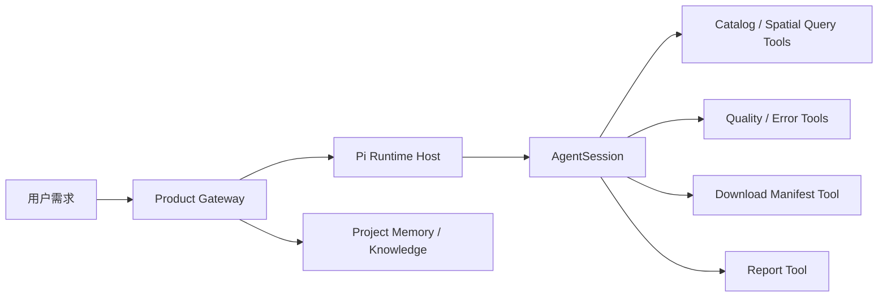
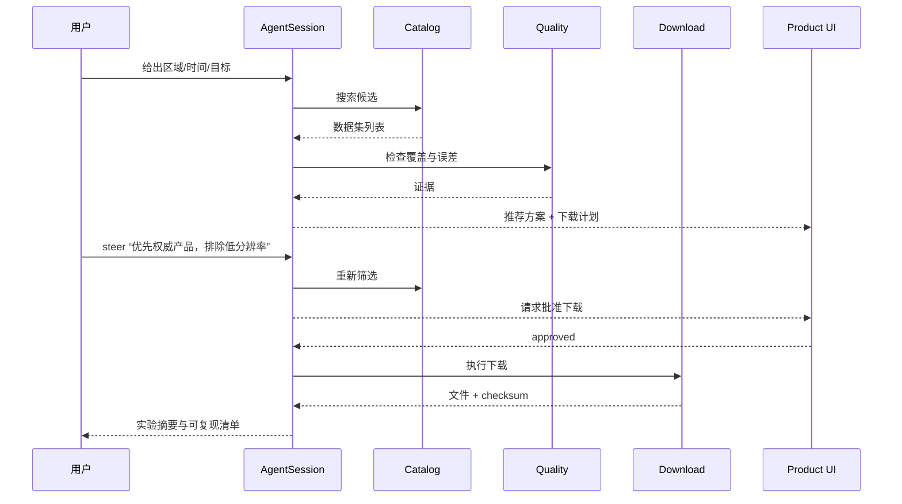

# 第 13 课：结课项目——用 Pi 做一个数据准备 Agent

## 项目目标

把自然语言需求变成一个可审计的数据准备流程：

> “准备 2015—2017 年 Fimbul 冰架区域的数据，检查时间、空间范围和误差，给出推荐数据源、下载清单和实验摘要。”

项目不追求“聊天很聪明”，而追求：

- 每个工具副作用可追踪；
- 中途能 Steer；
- 能取消并结算；
- Session 可恢复；
- 长任务能 Compaction；
- 产品 Memory 与 Pi Runtime 边界清晰；
- 结果能用于面试展示。

## 1. 最小架构



## 2. 先定义产品 Tool，而不是先写 Prompt

建议最小工具集：

| Tool | 输入 | 输出 | 副作用 |
|---|---|---|---|
| `catalog.search` | 时间、区域、变量 | 数据集候选 | 无 |
| `dataset.inspect` | dataset id | CRS、分辨率、时间、缺失值 | 无 |
| `spatial.coverage` | geometry、dataset | 覆盖率和空洞 | 无 |
| `quality.compare` | 多数据集 | 误差与冲突证据 | 无 |
| `download.plan` | 选择的数据 | 下载清单 | 只生成计划 |
| `download.execute` | 已批准计划 | 本地文件与校验和 | 有 |
| `experiment.summarize` | 证据集合 | Markdown 摘要 | 写文件 |

高风险副作用工具只在产品审批后执行。

## 3. 一次完整用户流程



## 4. Session 与产品数据分别存什么

### Pi Session

- 用户与 AssistantMessage；
- Tool Call / Tool Result；
- 模型与 Thinking 变化；
- Compaction；
- 当前分支。

### 产品数据库

- 数据集权威元数据；
- 用户批准记录；
- 下载任务与文件校验和；
- Project Memory；
- Room/WorkItem；
- 产物索引。

不要把下载任务状态只写在聊天文本里。

## 5. 实现顺序

### 里程碑 A：只读闭环

```text
catalog.search
→ dataset.inspect
→ spatial.coverage
→ quality.compare
→ 最终推荐
```

验收：无写文件也能给出带证据的选择。

### 里程碑 B：计划与审批

增加 `download.plan`，但不自动下载。验收：Tool Result 中包含稳定 plan id、目标路径、预计大小和校验策略。

### 里程碑 C：副作用闭环

增加 `download.execute` 与 approval。验收：

- 重复请求不会重复下载；
- Abort 后状态明确；
- 重启后能恢复或判定已完成；
- 最终交付引用真实 checksum。

### 里程碑 D：长任务

加入 Compaction、Session 恢复和产品 Memory。验收：长任务压缩后仍记得区域、时间、选中数据集和未完成步骤。

## 6. 建议代码骨架

```ts
const { session } = await createAgentSession({
    cwd: workspace,
    modelRuntime,
    sessionManager,
    resourceLoader,
    noTools: "builtin",
    customTools: productToolDefinitions,
});

session.subscribe((event) => {
    productEvents.publish(projectEventFromPi(event));
});
```

这段代码的重点不是语法，而是边界：

- Pi 负责 Session 和 Loop；
- Product Tool 通过 Gateway 执行；
- Product Event 是 Pi Event 的投影，不重新猜状态。

## 7. 测试矩阵

| 场景 | 必须验证 |
|---|---|
| 正常只读流程 | 推荐有证据 |
| Tool 参数非法 | 不产生副作用，模型收到错误结果 |
| 用户 Steer | 下一安全边界改变筛选 |
| Follow-up | 完成推荐后再生成摘要 |
| Abort | 旧 Turn 不再继续写入 |
| 下载超时 | 只取消当前请求，不杀 Host |
| Host 重启 | Session 与下载任务不重复 |
| Compaction | 关键目标和未完成步骤仍存在 |
| Fork | 新方案不修改原分支 |

## 8. 面试表达模板

不要说：

> 我调用大模型，再给它几个工具。

应该说：

> 我用 Pi 把一次自然语言数据需求建模为可结算的 Agent Run。Agent Core 负责 Turn 和 Tool Loop，AgentSession 负责持久化、重试和 Compaction，产品 Gateway 保留数据目录、审批和下载任务的权威状态。用户中途修改要求通过 Steer 在 Tool Batch 后注入，副作用工具使用稳定 plan id 与审批记录保证可恢复和幂等。

## 9. 练习题

1. 为 `download.execute` 设计输入 Schema，必须包含哪些幂等和审批字段？
2. 哪些数据应进入 Pi Session，哪些必须进入产品数据库？
3. 用户在下载进行中 Steer“换数据集”，应立即做什么、不能做什么？
4. Host 崩溃后怎样判断下载是未开始、进行中、完成还是结果未知？
5. 写出结课 Demo 的五分钟演示脚本。
6. 把本项目架构讲成一段 90 秒面试回答。

## 结课标准

你能提交一个真实 Demo，并提供：

- 架构图；
- 一条完整 Session 事件证据；
- 至少六类失败/恢复测试；
- 一次 Compaction 后继续运行的证据；
- Tool 权限与审批说明；
- 面试版 README；
- 90 秒和 5 分钟两个讲解版本。

返回：[课程首页](../../README.md)
