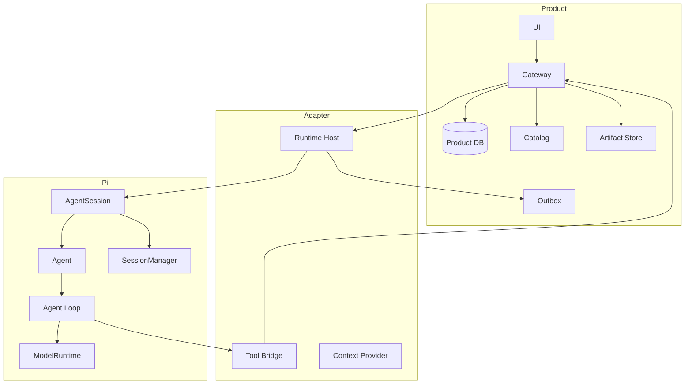
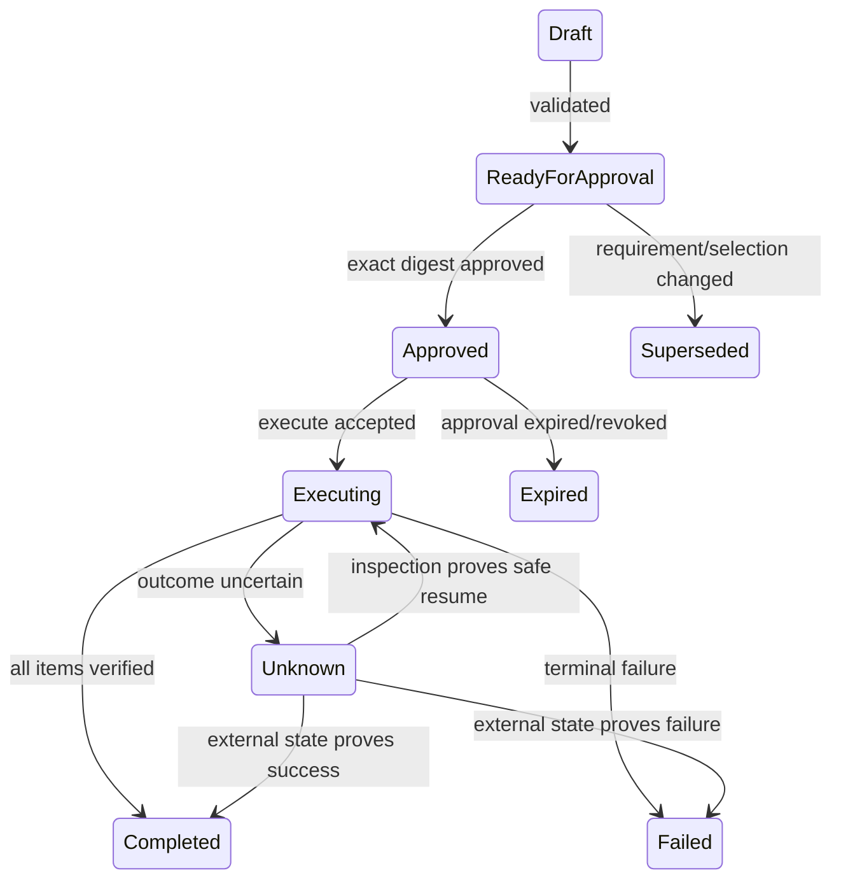
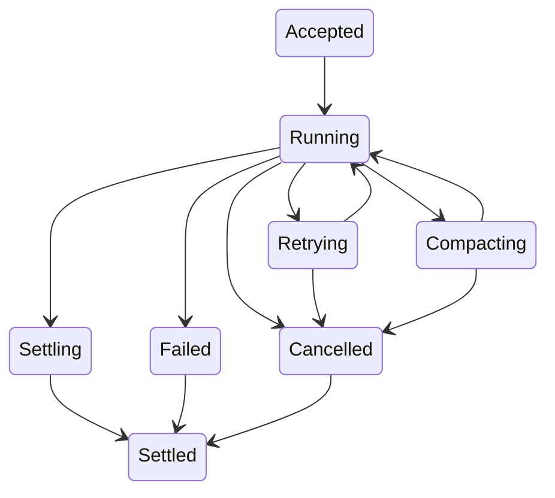

# 项目 01：冻结需求、非目标、职责边界与验收

## 1. 产品问题

科研和工程用户面对的数据准备工作通常分散在：

```text
网页目录搜索
→ 阅读元数据
→ 比较时间/空间/分辨率
→ 下载
→ 校验
→ 记录实验配置
```

用户真正需要的不是一个“会回答数据集名称”的聊天机器人，而是：

> 把自然语言实验需求转成有证据、可审批、可恢复、可复现的数据准备结果。

## 2. 目标用户

### 主用户

需要为模型或科研实验准备时空数据的工程师/研究人员。

### 主场景

- 给定区域、时间、变量搜索候选数据；
- 检查 Coverage、Resolution、Uncertainty、License；
- 比较权威产品冲突；
- 生成下载清单；
- 审批后执行；
- 输出实验摘要和校验和；
- 中途修改筛选条件；
- 长任务中断后恢复。

## 3. MVP 用户故事

### US-01：结构化需求

```text
作为用户
我希望输入自然语言区域、时间、变量和质量约束
以便系统生成明确、可确认的数据需求。
```

验收：系统产出 `DataRequirement`，所有推断字段标注来源；缺失关键字段时不开始下载。

### US-02：候选搜索

系统只通过 Catalog Tool 获取候选，不编造元数据。

验收：每个候选引用 Dataset ID 和 Tool Evidence。

### US-03：质量检查

系统检查：

```text
变量
时间覆盖
空间覆盖
分辨率
误差/不确定性
权威来源
License
Checksum/Version
```

验收：推荐和排除都有具体理由。

### US-04：可变约束

用户可在 Agent 工作中 Steer：

> 排除 2 km 以上分辨率，优先权威产品。

验收：已完成 Tool Result 保留，新约束在下一安全边界生效，旧 Plan 失效。

### US-05：不可变下载计划

系统先生成 Plan，不直接下载。

验收：Plan 有稳定 `planId`、Canonical Digest、Item、目标路径、预计校验策略。

### US-06：审批后执行

验收：Approval 绑定 Session、Plan ID、Digest、Expiry；未审批或参数变化时 Tool 失败关闭。

### US-07：可恢复执行

验收：相同 Idempotency Key 不重复；Crash 后能判断 Completed/Failed/Unknown，并基于外部证据恢复。

### US-08：可复现实验摘要

验收：报告含 Requirement、选择证据、排除理由、Plan、Approval、Artifact、Checksum、Runtime Evidence 和限制。

### US-09：长任务

验收：Compaction 后仍保留目标、选择、Plan、审批、已下载产物和 Pending Work。

### US-10：分支比较

验收：Fork 能独立比较两种选择策略，源 Session 不被修改，审批不跨分支继承。

## 4. 明确非目标

第一版不做：

- 自动访问所有公开数据站点；
- 真实大文件断点下载和云分发；
- GIS 可视化平台；
- 自动训练模型；
- 自动生成论文结论；
- 多租户计费系统；
- Room 多 Agent 集成；
- 用新 durable AgentHarness 替换成熟 AgentSession；
- 直接修改 Pi Session JSONL；
- 无审批写入任意工作区。

非目标不是永远不做，而是防止第一版同时解决过多系统问题。

## 5. 系统边界



## 6. 职责表

| 能力 | Pi | Runtime Adapter | Product Gateway |
|---|---:|---:|---:|
| Model/Provider/Retry | ✓ | 配置映射 | 账户策略可提供输入 |
| Run/Turn/Tool Loop | ✓ | 不复制 | 不复制 |
| Session/Fork/Compaction | ✓ | Product ID 绑定 | 项目索引 |
| Tool Schema 激活 | ✓ | Catalog Bridge | 权威 Catalog/Policy |
| Tool 执行 | 生命周期 | Bridge | 权限和业务执行 |
| Memory | Hook 接入 | Context Adapter | 权威存储/召回 |
| Approval | Hook 调用 | 传递身份 | 权威状态 |
| Goal/Budget | 可优雅停止 | 映射 | 权威状态 |
| Artifact | Tool Result 引用 | 映射 | 权威存储 |
| Outbox | 发出 lifecycle | 本地可靠提交 | 幂等接收 |
| UI | 基础事件 | Product Event | 展示/交互 |

## 7. 功能需求

### FR-01 Requirement Parser

输入自然语言，输出：

```ts
type DataRequirement = {
    regionName: string;
    region: BoundingBox | GeometryReference;
    startTime: string;
    endTime: string;
    variables: string[];
    constraints: {
        maximumResolutionMeters?: number;
        preferredAuthorities?: string[];
        requireKnownUncertainty?: boolean;
        allowedLicenses?: string[];
    };
};
```

模型输出后由 Schema Validation 检查；关键缺失必须要求用户补充，不自动猜具体区域边界。

### FR-02 Catalog Search

- 支持变量、时间、区域、分辨率过滤；
- 返回稳定 Dataset ID；
- 不返回完整大元数据；
- 结果带 Catalog Revision。

### FR-03 Dataset Inspect

- 精确 Dataset ID；
- 返回完整元数据、版本、Source URI、License、Uncertainty；
- 不允许模糊匹配另一个数据集。

### FR-04 Quality Compare

- 返回 Evidence 与 Warning；
- 分数只作排序辅助；
- 不能隐藏未知信息；
- 冲突产品并列展示差异。

### FR-05 Download Plan

- Canonical JSON；
- 不可变；
- 稳定 Digest；
- 目标路径在工作区内；
- Item 顺序稳定；
- Plan 变更创建新 ID。

### FR-06 Approval

- Token 不直接作为 Plan 状态；
- 绑定 exact Digest；
- 有 Expiry；
- 可撤销；
- 单次/多次使用策略明确；
- 记录批准者和时间。

### FR-07 Execution

- 每 Item 有 Attempt；
- Idempotency Key 唯一；
- 先 Commit Intent；
- 外部执行；
- 再 Commit Settlement；
- Unknown Outcome 可核验；
- Checksum 真实计算。

### FR-08 Report

- 只引用已持久化 Evidence；
- 包含 Reproduction Command；
- 报告写入也幂等；
- 最终交付在 `agent_settled` 后产生。

## 8. Runtime 需求

### RR-01 单 Session 单 Active Run

同 Session 双 Prompt：拒绝或明确转 Steer/Follow-up，绝不并发写 transcript。

### RR-02 Control Plane 可达

Prompt Pending 时：

```text
Snapshot
Steer
Follow-up
Abort
Health
```

仍可执行。

### RR-03 精确取消域

- Session A Abort 不影响 B；
- Completion Cancel 不影响 Session；
- Catalog Refresh Cancel 不影响 Run；
- 单请求超时不退出 Host。

### RR-04 最终 Settlement

产品 Turn 只有在 Pi `agent_settled`、必要 Outbox 本地 Commit 和 Product Projection 更新后进入终态。

### RR-05 Session 恢复

恢复：Messages、Model、Thinking、Branch、Compaction、Dynamic Tool、cwd 和 Product Binding。

### RR-06 长上下文

支持 Threshold/Manual/Overflow Compaction，并可靠报告失败。

## 9. 非功能需求

### NFR-01 可解释

每个选择能追溯到 Tool Evidence；每个副作用能追溯到 Approval、Plan、Attempt。

### NFR-02 可恢复

Host/Client/Gateway 任一重启后，不重复已完成副作用。

### NFR-03 安全

- Workspace Realpath + Allowed Root；
- Secret 不进 Session/Event/Outbox；
- Approval Fail Closed；
- Plugin Preview/Apply；
- Tool 参数 Schema Validation；
- 未知 Outcome 不重放。

### NFR-04 可观测

至少记录：

```text
sessionId
turnId
clientMessageId
sequence
toolCallId
planId
attemptId
operationId
model/provider
stopReason/rawStopReason
settlement
```

### NFR-05 可测试

核心领域逻辑不依赖真实模型和网络；Faux Provider 可复现 Runtime 事件。

### NFR-06 性能

- Catalog Search 本地 Fixture <100ms；
- Control Plane 不被 Prompt 阻塞；
- Delta Event 线性传输；
- 不每轮发送全 Tool Catalog；
- Model Catalog Refresh 不阻塞启动。

## 10. 状态所有权不变量

```text
I1  Product Approval 只以 Product DB 为权威
I2  Pi Transcript 只由 Pi Runtime 写
I3  同一 Product Session 同时只有一个绑定的 Native Runtime 实例
I4  同一 Product Turn 只有一个 clientMessageId
I5  每个 Write Attempt 有唯一 Idempotency Key
I6  Event Sequence 单调递增
I7  agent_end 不等于 Product Turn Settled
I8  Unknown Outcome 不自动重放
I9  Fork 不继承源分支 Approval
I10 UI Projection 可被 Snapshot 覆盖校正
```

每个测试至少对应一个不变量。

## 11. 状态机

### Download Plan



### Product Turn



## 12. MVP 验收场景

### A：正常

```text
Requirement
→ 3 Candidates
→ 2 Selected
→ Plan
→ Approval
→ 2 Artifacts
→ Checksums
→ Report
```

### B：Steer

搜索后改变分辨率约束，旧 Plan Superseded，新 Plan 创建。

### C：拒绝审批

Write Tool 不执行，Turn 在安全点 Settled，可继续聊天。

### D：Abort

下载进行中 Stop；不开始下一 Item；当前 Item进入可证明状态；最终 Settled。

### E：Crash

Effect 后 Settlement 前崩溃；重启 Inspect 外部文件/Checksum，补写 Completed，不重复。

### F：Compaction

长历史压缩后完成报告，关键 Requirement/Plan/Artifact 不丢。

### G：Fork

两种选择策略独立形成 Plan，Approval 不串线。

## 13. 需求冻结产物

在项目仓库建立：

```text
docs/REQUIREMENTS.md
docs/NON_GOALS.md
docs/OWNERSHIP.md
docs/ACCEPTANCE.md
```

任何新增功能必须回答：

```text
属于哪个用户故事？
改变哪个权威状态？
由哪个层拥有？
新增什么失败路径？
验收证据是什么？
是否推迟到非目标？
```

## 练习题

1. 为什么 Download Plan 必须不可变？
2. “Agent 自动选择最佳数据集”还缺哪些可验收定义？
3. Product Approval 为什么不能只写成 Session Custom Message？
4. 为十个所有权不变量各写一个失败测试。
5. 哪些能力应推迟到 MVP 之后？说明取舍。
6. 用户 Steer 后哪些状态可以保留，哪些必须失效？
