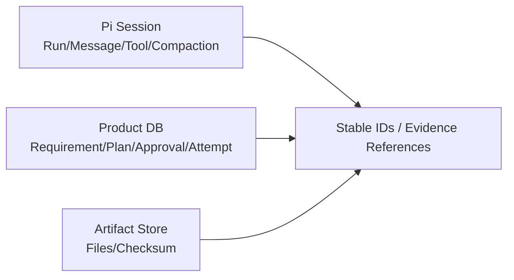
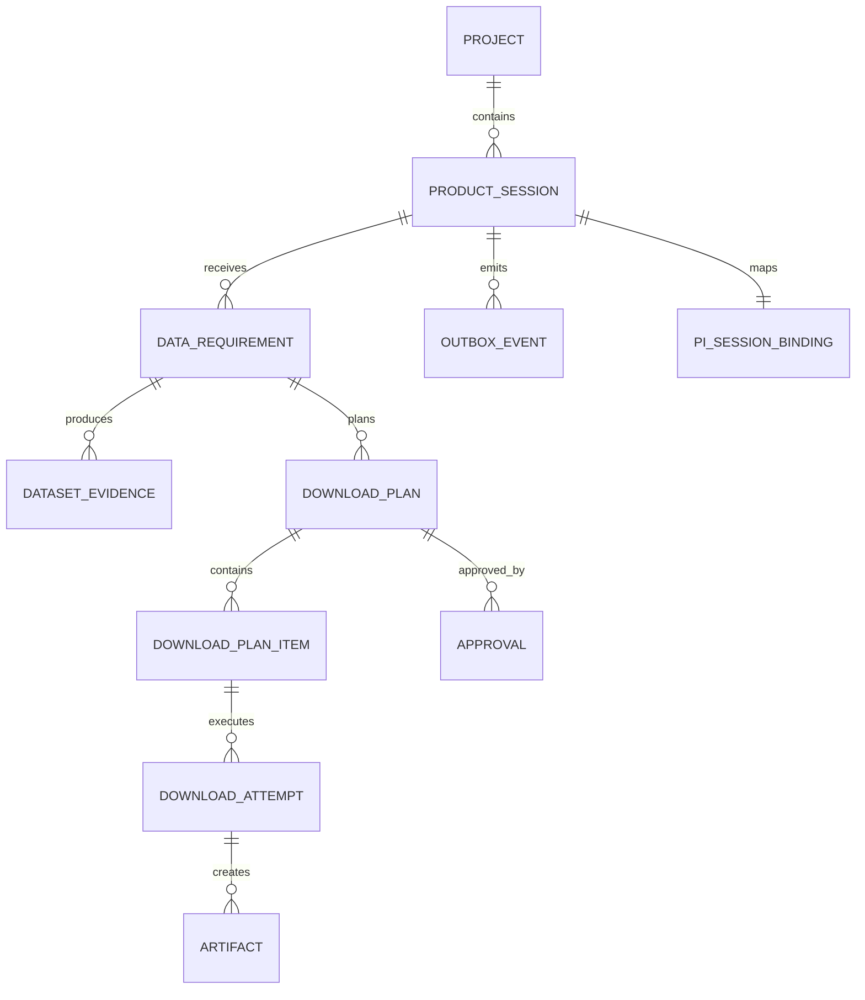
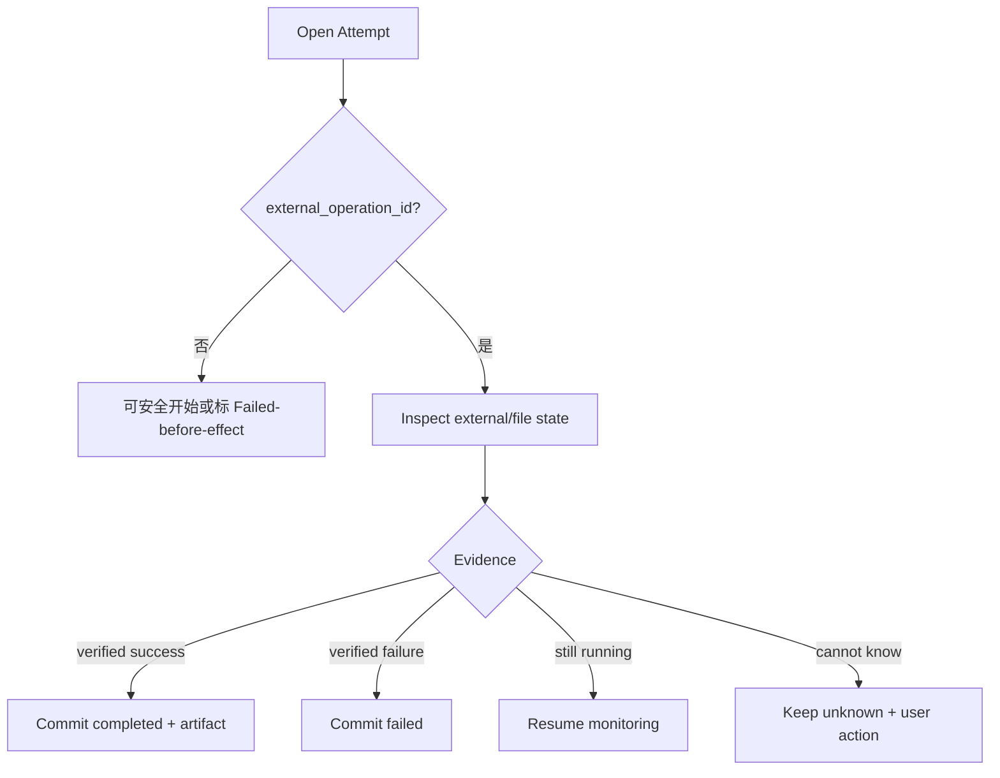

# 项目 02：领域模型、Product Database 与 Pi Session 怎样分工

## 核心原则

> Pi Session 保存 Agent 执行历史；Product Database 保存产品业务事实。两者可以互相引用，但不能互相替代。

错误设计：

```text
“用户已审批”只写在聊天消息
“下载已完成”只看 Tool Result 文本
Product Backend 直接更新 Pi JSONL
```

正确设计：



## 1. Product Aggregate



## 2. Project

```sql
CREATE TABLE projects (
    project_id          TEXT PRIMARY KEY,
    name                TEXT NOT NULL,
    workspace_root      TEXT NOT NULL,
    created_at          TEXT NOT NULL,
    updated_at          TEXT NOT NULL,
    version             INTEGER NOT NULL DEFAULT 1
);
```

不变量：

- `workspace_root` 创建时 Realpath 并固定；
- Tool 目标路径必须位于该 Root；
- 修改 Root 是显式迁移，不是更新一列后继续使用旧 Session。

## 3. Product Session 与 Pi Binding

```sql
CREATE TABLE product_sessions (
    session_id          TEXT PRIMARY KEY,
    project_id          TEXT NOT NULL REFERENCES projects(project_id),
    status              TEXT NOT NULL CHECK (
        status IN ('open', 'archived', 'closed')
    ),
    title               TEXT,
    created_at          TEXT NOT NULL,
    updated_at          TEXT NOT NULL,
    version             INTEGER NOT NULL DEFAULT 1
);

CREATE TABLE pi_session_bindings (
    session_id          TEXT PRIMARY KEY REFERENCES product_sessions(session_id),
    native_session_id   TEXT NOT NULL,
    session_file        TEXT,
    cwd                 TEXT NOT NULL,
    pi_version          TEXT NOT NULL,
    binding_revision    INTEGER NOT NULL DEFAULT 1,
    bound_at            TEXT NOT NULL,
    UNIQUE(native_session_id)
);
```

### 为什么有三种身份

```text
session_id        Product API/数据库稳定身份
native_session_id Pi Header/Provider affinity 身份
session_file      物理实现路径
```

Fork 后 Product Session 与 Native Session 都应新建；Session File 可能变化，不能作为公共 ID。

## 4. Product Turn

```sql
CREATE TABLE product_turns (
    turn_id             TEXT PRIMARY KEY,
    session_id          TEXT NOT NULL REFERENCES product_sessions(session_id),
    client_message_id   TEXT NOT NULL,
    payload_digest      TEXT NOT NULL,
    status              TEXT NOT NULL CHECK (
        status IN (
            'accepted', 'running', 'retrying', 'compacting',
            'settling', 'settled', 'failed', 'cancelled'
        )
    ),
    latest_sequence     INTEGER NOT NULL DEFAULT 0,
    accepted_at         TEXT NOT NULL,
    settled_at          TEXT,
    error_code          TEXT,
    error_message       TEXT,
    UNIQUE(session_id, client_message_id)
);
```

`client_message_id + payload_digest` 实现 Prompt 幂等：

- 同 ID、同 Digest：返回同一 Turn；
- 同 ID、不同 Digest：拒绝身份复用。

## 5. Data Requirement

```sql
CREATE TABLE data_requirements (
    requirement_id              TEXT PRIMARY KEY,
    session_id                  TEXT NOT NULL REFERENCES product_sessions(session_id),
    created_by_turn_id          TEXT NOT NULL REFERENCES product_turns(turn_id),
    revision                    INTEGER NOT NULL,
    region_name                 TEXT NOT NULL,
    region_geometry_json        TEXT NOT NULL,
    start_time                  TEXT NOT NULL,
    end_time                    TEXT NOT NULL,
    variables_json              TEXT NOT NULL,
    max_resolution_meters       REAL,
    preferred_authorities_json  TEXT,
    require_known_uncertainty   INTEGER NOT NULL DEFAULT 0,
    allowed_licenses_json       TEXT,
    status                      TEXT NOT NULL CHECK (
        status IN ('draft', 'confirmed', 'superseded')
    ),
    canonical_digest            TEXT NOT NULL,
    created_at                  TEXT NOT NULL,
    UNIQUE(session_id, revision),
    UNIQUE(session_id, canonical_digest)
);
```

用户 Steer 改变约束时：

```text
旧 Requirement → superseded
新 Requirement → revision + 1
基于旧 Requirement 的未执行 Plan → superseded
已完成 Artifact → 保留事实，不删除
```

## 6. Dataset Catalog

```sql
CREATE TABLE datasets (
    dataset_id              TEXT PRIMARY KEY,
    catalog_revision        TEXT NOT NULL,
    title                   TEXT NOT NULL,
    authority               TEXT NOT NULL,
    variables_json          TEXT NOT NULL,
    start_time              TEXT NOT NULL,
    end_time                TEXT NOT NULL,
    resolution_meters       REAL NOT NULL,
    coverage_geometry_json  TEXT NOT NULL,
    uncertainty_json        TEXT,
    source_uri              TEXT NOT NULL,
    expected_checksum       TEXT,
    license                 TEXT NOT NULL,
    metadata_json           TEXT NOT NULL,
    updated_at              TEXT NOT NULL
);
```

Catalog 是产品权威元数据，不由模型自由生成。模型只能通过 Tool 查询。

### 版本不变量

同一 Dataset ID 的 Metadata 改变时：

- `catalog_revision` 改变；
- 已生成 Plan 仍保存当时 Snapshot/Digest；
- 执行前检查 Plan Dataset Revision 是否仍允许；
- 不静默把旧 Plan 指向新 Source URI。

## 7. Dataset Evidence

```sql
CREATE TABLE dataset_evidence (
    evidence_id             TEXT PRIMARY KEY,
    requirement_id          TEXT NOT NULL REFERENCES data_requirements(requirement_id),
    dataset_id              TEXT NOT NULL REFERENCES datasets(dataset_id),
    catalog_revision        TEXT NOT NULL,
    time_covered            INTEGER NOT NULL,
    coverage_ratio          REAL NOT NULL,
    resolution_meters       REAL NOT NULL,
    uncertainty_known       INTEGER NOT NULL,
    authority_preferred     INTEGER NOT NULL,
    license_known           INTEGER NOT NULL,
    score                   REAL,
    warnings_json           TEXT NOT NULL,
    evidence_json           TEXT NOT NULL,
    produced_by_tool_call_id TEXT NOT NULL,
    produced_by_turn_id     TEXT NOT NULL REFERENCES product_turns(turn_id),
    created_at              TEXT NOT NULL,
    UNIQUE(requirement_id, dataset_id, catalog_revision)
);
```

Evidence 保存 Tool 产生的结构化事实。最终报告引用 `evidence_id`，而不是重新让模型计算一次。

## 8. Download Plan

```sql
CREATE TABLE download_plans (
    plan_id                 TEXT PRIMARY KEY,
    session_id              TEXT NOT NULL REFERENCES product_sessions(session_id),
    requirement_id          TEXT NOT NULL REFERENCES data_requirements(requirement_id),
    requirement_digest      TEXT NOT NULL,
    canonical_digest        TEXT NOT NULL,
    status                  TEXT NOT NULL CHECK (
        status IN (
            'draft', 'ready_for_approval', 'approved',
            'executing', 'completed', 'failed',
            'unknown', 'superseded', 'expired'
        )
    ),
    created_by_turn_id      TEXT NOT NULL REFERENCES product_turns(turn_id),
    created_at              TEXT NOT NULL,
    approved_at             TEXT,
    completed_at            TEXT,
    UNIQUE(session_id, canonical_digest)
);

CREATE TABLE download_plan_items (
    plan_item_id            TEXT PRIMARY KEY,
    plan_id                 TEXT NOT NULL REFERENCES download_plans(plan_id),
    item_index              INTEGER NOT NULL,
    dataset_id              TEXT NOT NULL REFERENCES datasets(dataset_id),
    dataset_revision        TEXT NOT NULL,
    source_uri              TEXT NOT NULL,
    destination_relative    TEXT NOT NULL,
    expected_checksum       TEXT,
    item_digest             TEXT NOT NULL,
    UNIQUE(plan_id, item_index),
    UNIQUE(plan_id, item_digest)
);
```

### Plan Canonicalization

Plan Digest 输入：

```json
{
  "requirementDigest": "...",
  "items": [
    {
      "datasetId": "...",
      "datasetRevision": "...",
      "sourceUri": "...",
      "destinationRelative": "...",
      "expectedChecksum": "..."
    }
  ]
}
```

字段排序与 Item 顺序稳定。不要把 `createdAt`、Approval Token 等易变字段加入 Digest。

## 9. Approval

```sql
CREATE TABLE approvals (
    approval_id             TEXT PRIMARY KEY,
    plan_id                 TEXT NOT NULL REFERENCES download_plans(plan_id),
    plan_digest             TEXT NOT NULL,
    session_id              TEXT NOT NULL REFERENCES product_sessions(session_id),
    approval_token_hash     TEXT NOT NULL UNIQUE,
    approved_by             TEXT NOT NULL,
    status                  TEXT NOT NULL CHECK (
        status IN ('active', 'consumed', 'revoked', 'expired')
    ),
    expires_at              TEXT NOT NULL,
    created_at              TEXT NOT NULL,
    consumed_at             TEXT
);
```

只保存 Token Hash。验证时同时检查：

```text
Token Hash
Session ID
Plan ID
Plan Digest
Status
Expiry
```

### 单次还是多次

对于不可变 Plan，可允许同一 Approval 覆盖 Plan 内全部 Item，但每个 Attempt 仍使用独立 Idempotency Key。审批消费策略必须明确，不要执行第一个 Item 后意外让剩余 Item 全失效。

## 10. Download Attempt

```sql
CREATE TABLE download_attempts (
    attempt_id              TEXT PRIMARY KEY,
    plan_item_id            TEXT NOT NULL REFERENCES download_plan_items(plan_item_id),
    idempotency_key         TEXT NOT NULL UNIQUE,
    args_digest             TEXT NOT NULL,
    status                  TEXT NOT NULL CHECK (
        status IN (
            'starting', 'running', 'completed',
            'failed', 'cancelled', 'unknown'
        )
    ),
    external_operation_id   TEXT,
    started_at              TEXT NOT NULL,
    updated_at              TEXT NOT NULL,
    completed_at            TEXT,
    error_code              TEXT,
    error_message           TEXT,
    result_json             TEXT
);
```

### 幂等键建议

\[
\text{idempotencyKey} =
\text{hash}(planId, planItemId, itemDigest, executionVersion)
\]

相同 Key 但 `args_digest` 不同必须失败，不能返回旧结果。

## 11. Artifact

```sql
CREATE TABLE artifacts (
    artifact_id             TEXT PRIMARY KEY,
    attempt_id              TEXT NOT NULL REFERENCES download_attempts(attempt_id),
    project_id              TEXT NOT NULL REFERENCES projects(project_id),
    relative_path           TEXT NOT NULL,
    media_type              TEXT,
    size_bytes              INTEGER NOT NULL,
    checksum_algorithm      TEXT NOT NULL,
    checksum_value          TEXT NOT NULL,
    source_dataset_id       TEXT REFERENCES datasets(dataset_id),
    status                  TEXT NOT NULL CHECK (
        status IN ('staged', 'verified', 'quarantined', 'deleted')
    ),
    created_at              TEXT NOT NULL,
    verified_at             TEXT,
    UNIQUE(project_id, relative_path),
    UNIQUE(checksum_algorithm, checksum_value, relative_path)
);
```

Artifact Path 存相对项目 Root 的路径；每次访问重新 `resolve + realpath` 检查边界。

## 12. Report

```sql
CREATE TABLE reports (
    report_id               TEXT PRIMARY KEY,
    session_id              TEXT NOT NULL REFERENCES product_sessions(session_id),
    requirement_id          TEXT NOT NULL REFERENCES data_requirements(requirement_id),
    plan_id                 TEXT REFERENCES download_plans(plan_id),
    report_digest           TEXT NOT NULL,
    relative_path           TEXT NOT NULL,
    generated_by_turn_id    TEXT NOT NULL REFERENCES product_turns(turn_id),
    created_at              TEXT NOT NULL,
    UNIQUE(session_id, report_digest)
);
```

报告正文由已持久 Evidence/Artifact 生成；模型负责解释和组织，但事实字段从 DB 读取。

## 13. Outbox

```sql
CREATE TABLE outbox_events (
    event_id                TEXT PRIMARY KEY,
    aggregate_type          TEXT NOT NULL,
    aggregate_id            TEXT NOT NULL,
    session_id              TEXT,
    turn_id                 TEXT,
    event_type              TEXT NOT NULL,
    payload_json            TEXT NOT NULL,
    status                  TEXT NOT NULL CHECK (
        status IN ('pending', 'delivering', 'delivered', 'dead_letter')
    ),
    attempts                INTEGER NOT NULL DEFAULT 0,
    next_attempt_at         TEXT NOT NULL,
    created_at              TEXT NOT NULL,
    delivered_at            TEXT
);
```

Gateway 接收端也按 `event_id` 幂等。

## 14. Product Memory

第一版可以使用：

```sql
CREATE TABLE project_memory_facts (
    fact_id                 TEXT PRIMARY KEY,
    project_id              TEXT NOT NULL REFERENCES projects(project_id),
    namespace               TEXT NOT NULL,
    key                     TEXT NOT NULL,
    value_json              TEXT NOT NULL,
    confidence              REAL NOT NULL,
    source_evidence_json    TEXT NOT NULL,
    status                  TEXT NOT NULL CHECK (
        status IN ('active', 'superseded', 'retracted')
    ),
    created_at              TEXT NOT NULL,
    updated_at              TEXT NOT NULL,
    UNIQUE(project_id, namespace, key, status)
);
```

Memory 不保存“本次下载进行到 60%”；那是 Attempt 状态。Memory 保存跨 Session 稳定事实，例如：

```text
项目默认区域
允许的 License
偏好权威来源
常用 CRS
质量阈值
```

## 15. Pi Session 保存什么

```text
User/Assistant/ToolResult
Tool Call ID
Model/Thinking Change
Compaction/Branch Summary
Dynamic Tool disclosure
Extension Custom Entry/Message
Session Tree/Fork
Usage
```

Pi Session 不保存为业务权威：

```text
Approval Status
Plan Status
Download Attempt Status
Artifact Verification
Project Membership
Room/WorkItem
```

Tool Result 可以引用这些业务记录：

```json
{
  "planId": "plan-7",
  "attemptId": "attempt-9",
  "artifactId": "artifact-3",
  "status": "completed",
  "checksum": "sha256:..."
}
```

## 16. 事务边界

### 生成 Plan

```text
BEGIN
→ 验证 Requirement active
→ 验证 Evidence revision
→ Canonicalize/Hash Plan
→ INSERT Plan + Items
→ INSERT Outbox plan.created
COMMIT
```

### 审批

```text
BEGIN
→ SELECT Plan FOR UPDATE
→ 验证 ready_for_approval + digest
→ INSERT Approval
→ UPDATE Plan approved
→ INSERT Outbox approval.created
COMMIT
```

### 开始 Attempt

```text
BEGIN
→ 验证 Plan/Approval
→ INSERT Attempt starting（唯一幂等键）
→ UPDATE Plan executing
→ INSERT Outbox attempt.started
COMMIT
→ 外部副作用
```

### 结算 Attempt

```text
BEGIN
→ SELECT Attempt FOR UPDATE
→ INSERT/UPDATE Artifact
→ UPDATE Attempt completed/failed/unknown
→ 重算 Plan 状态
→ INSERT Outbox attempt.settled
COMMIT
```

外部网络/文件副作用不能放在持有数据库长事务的临界区内。

## 17. State Transition Guard

不要允许任意 `UPDATE status=?`。使用显式函数：

```ts
const allowedPlanTransitions: Record<PlanStatus, PlanStatus[]> = {
    draft: ["ready_for_approval", "superseded"],
    ready_for_approval: ["approved", "superseded", "expired"],
    approved: ["executing", "expired", "superseded"],
    executing: ["completed", "failed", "unknown"],
    unknown: ["executing", "completed", "failed"],
    completed: [],
    failed: [],
    superseded: [],
    expired: [],
};
```

每次 Transition 写审计事件。

## 18. Recovery Query

Host/Gateway 重启时查询：

```sql
SELECT * FROM download_attempts
WHERE status IN ('starting', 'running', 'unknown');
```

按 Attempt：



## 19. Fork 数据关系

Fork 新建：

```text
Product Session
Pi Session Binding
后续 Requirement/Plan/Approval
```

可引用源 Session 的只读 Evidence，但必须记录 Provenance：

```sql
CREATE TABLE session_lineage (
    child_session_id        TEXT PRIMARY KEY,
    parent_session_id       TEXT NOT NULL,
    forked_from_entry_id    TEXT,
    created_at              TEXT NOT NULL
);
```

Approval 不复制。Artifact 可共享引用，但新 Plan 必须明确选择。

## 20. 删除与归档

- 关闭 Session 不删除 Product Evidence；
- 删除 Pi Transcript 与删除 Product Session 是不同操作；
- Artifact 删除需要显式状态和文件校验；
- Approval/Attempt 审计通常只归档不硬删；
- Outbox 有保留策略和 Dead Letter；
- Memory Fact 可 Supersede/Retract。

## 21. 数据不变量测试

```text
唯一 clientMessageId
唯一 idempotencyKey
同 Key 参数摘要不变
Approval Digest = Plan Digest
Plan Requirement active
Artifact Path 在 Workspace
Completed Attempt 必有 Verified Artifact 或明确无文件结果
Completed Plan 所有 Item Completed
Superseded Plan 不可审批/执行
Fork Approval 不存在
Outbox Event ID 不重复
```

## 22. SQLite 与 Postgres 取舍

### SQLite 适合 MVP

- 单 Gateway 进程；
- 本地 Demo；
- 事务与唯一约束足够；
- 易携带。

需要：WAL、Busy Timeout、短事务、单 Writer 设计，避免 `database is locked`。

### Postgres 适合多实例

- 行锁；
- `SKIP LOCKED` Outbox；
- 多 Worker；
- 更强并发。

不要因为未来可能多租户，就第一版引入分布式复杂度。

## 23. 练习题

1. 为什么 Pi Session 与 Product DB 必须分开？
2. Plan Digest 应包含和排除哪些字段？
3. Approval 为什么只保存 Token Hash？
4. 同 Idempotency Key 参数改变时为什么不能返回旧 Completed？
5. Effect Sandwich 中数据库事务边界在哪里？
6. `unknown` Attempt 的恢复查询需要哪些外部证据？
7. Fork 后哪些记录可引用，哪些必须重建？
8. 为十个数据不变量各写 SQL/单元测试。
