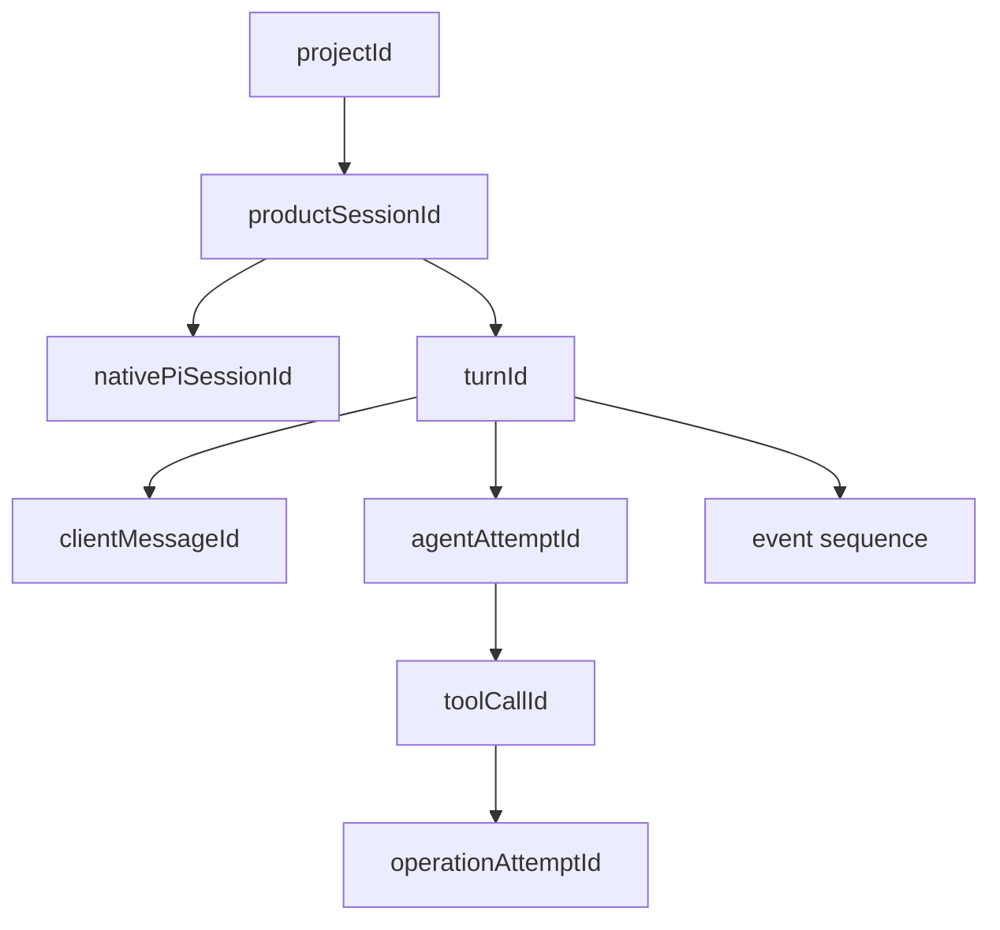
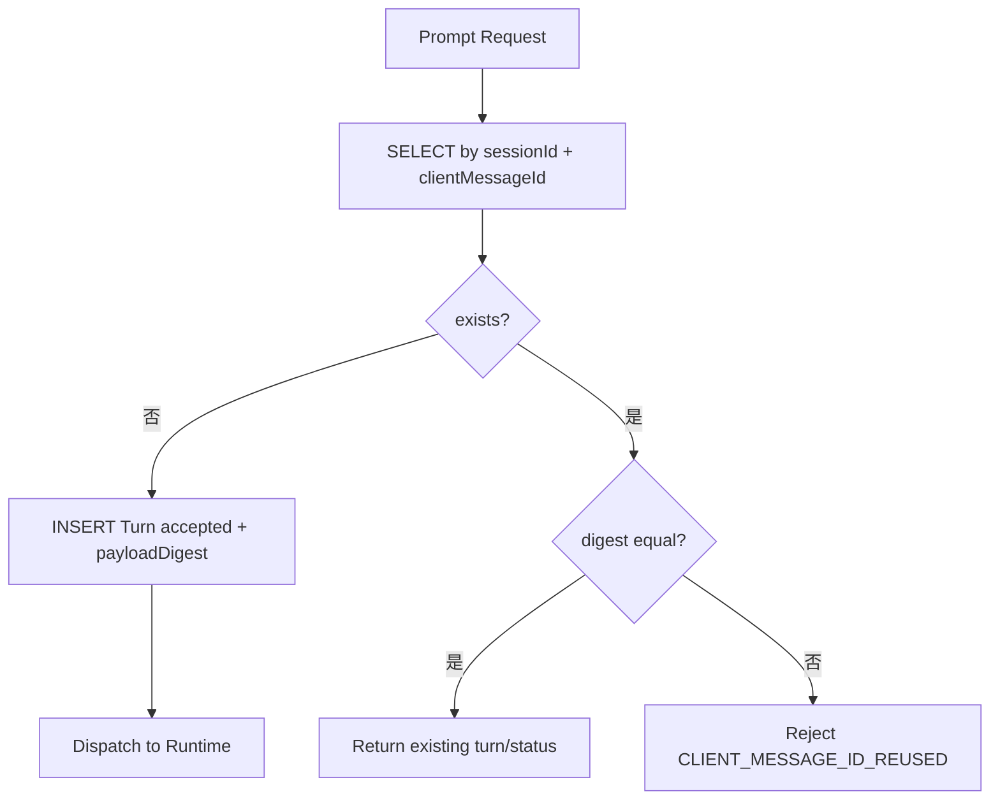
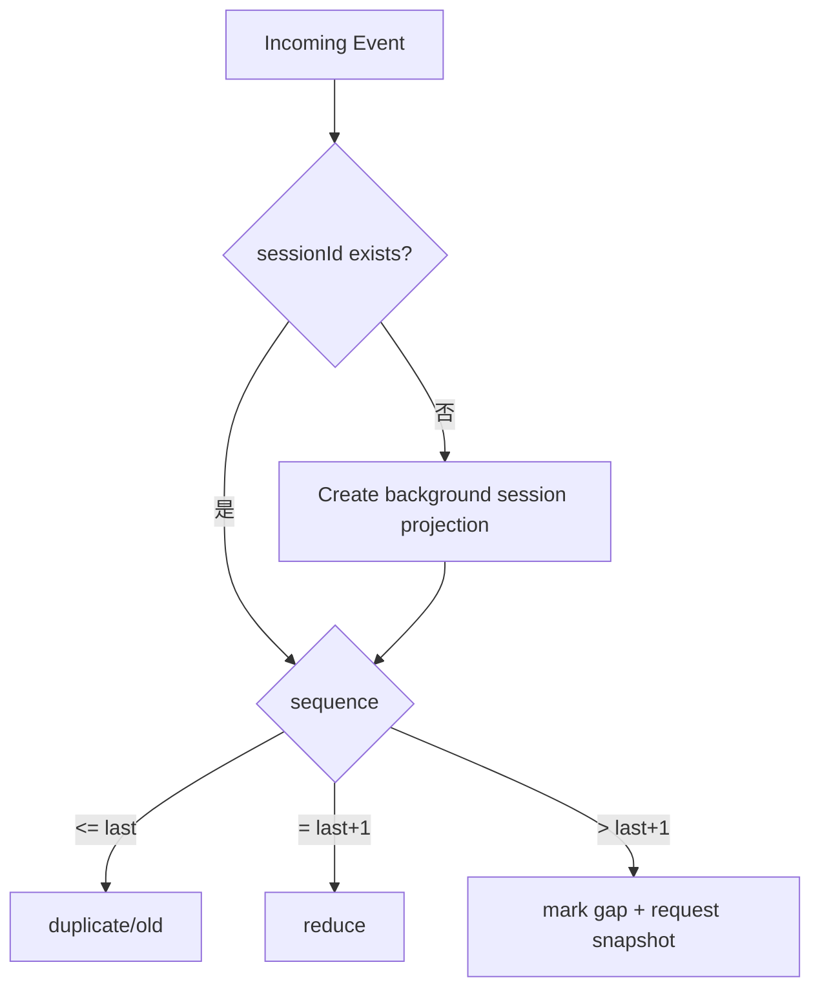
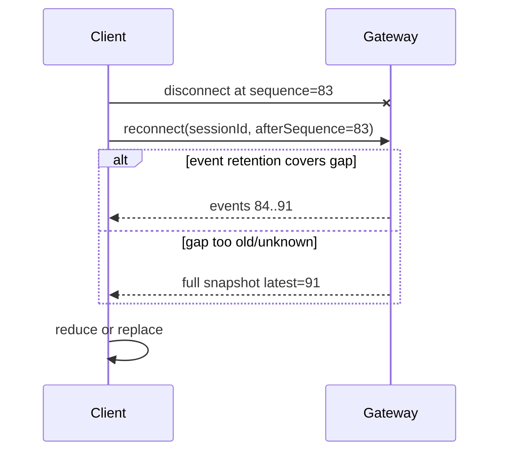
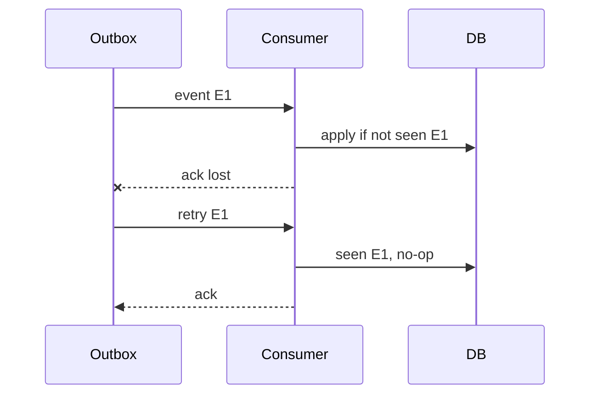
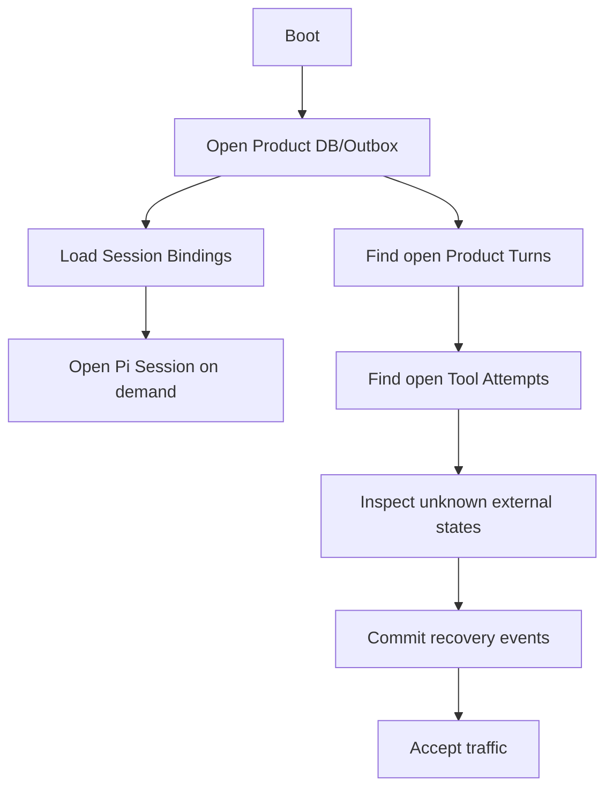

# 项目 03：产品协议、身份链、幂等、事件顺序与可靠交付

## 1. 设计目标

协议必须在以下情况下仍然正确：

- Client 请求超时后重试；
- Host 已接受 Prompt，但 Accepted Response 丢失；
- WebSocket 断开并重连；
- Runtime Event 重复、乱序或缺失；
- Host 重启；
- Gateway 重启；
- Tool 副作用已完成，但 Tool Result/Outbox 尚未交付；
- Session A/B 同时运行；
- 用户切换 Session 后 A 的 Late Event 到达。

## 2. 身份链



| ID | 生成者 | 生命周期 |
|---|---|---|
| `projectId` | Product Gateway | 项目 |
| `sessionId` | Product Gateway | 产品会话 |
| `nativeSessionId` | Pi | Pi Session |
| `turnId` | Product Gateway/Host 接受 Prompt 时 | 一次产品请求，含 Retry/Compaction |
| `clientMessageId` | Client | 一次用户提交的幂等身份 |
| `agentAttemptId` | Runtime Projection | 每次 Agent Core Run/Retry |
| `toolCallId` | Model/Pi | 一个 Tool Call |
| `operationAttemptId` | Product Tool Gateway | 一个副作用 Attempt |
| `sequence` | Runtime Host | Session/Turn 事件顺序 |

## 3. Prompt API

### Request

```json
{
  "protocolVersion": "2",
  "requestId": "req-101",
  "method": "session.prompt",
  "params": {
    "sessionId": "session-9",
    "clientMessageId": "client-msg-77",
    "payloadDigest": "sha256:...",
    "message": "准备 2015—2017 Fimbul 数据",
    "images": [],
    "source": "web"
  }
}
```

### Accepted

```json
{
  "protocolVersion": "2",
  "requestId": "req-101",
  "ok": true,
  "result": {
    "accepted": true,
    "sessionId": "session-9",
    "turnId": "turn-42",
    "clientMessageId": "client-msg-77",
    "status": "accepted"
  }
}
```

Accepted 不表示最终完成，只表示：

```text
Session 绑定有效
+ 幂等记录已提交
+ Turn 身份已生成
+ Runtime 将开始或已经开始
```

## 4. Prompt 幂等算法



伪代码：

```ts
async function acceptPrompt(input: PromptInput): Promise<TurnRecord> {
    return database.transaction(async (tx) => {
        const existing = await tx.turns.findByClientMessage(
            input.sessionId,
            input.clientMessageId,
        );

        if (existing) {
            if (existing.payloadDigest !== input.payloadDigest) {
                throw protocolError(
                    "CLIENT_MESSAGE_ID_REUSED",
                    "The same clientMessageId was reused with different content",
                );
            }
            return existing;
        }

        return tx.turns.insert({
            turnId: uuidv7(),
            sessionId: input.sessionId,
            clientMessageId: input.clientMessageId,
            payloadDigest: input.payloadDigest,
            status: "accepted",
        });
    });
}
```

数据库唯一约束处理两个并发相同请求，不能只依赖应用层 `find()`。

## 5. Gateway 接受与 Host Dispatch 之间的失败

可能：

```text
Turn 已写 DB=accepted
Gateway 在发给 Host 前崩溃
```

需要 Dispatch 状态：

```text
accepted
→ dispatch_pending
→ dispatched
→ running
```

恢复 Worker 查询：

```sql
SELECT * FROM product_turns
WHERE status IN ('accepted', 'dispatch_pending');
```

重新 Dispatch 使用同一 `turnId/clientMessageId`。Host 也必须幂等接受，不创建第二 Run。

## 6. Host 的 Session Prompt Contract

Gateway → Host：

```json
{
  "protocolVersion": "2",
  "id": "host-req-55",
  "method": "session.prompt",
  "params": {
    "sessionId": "session-9",
    "turnId": "turn-42",
    "clientMessageId": "client-msg-77",
    "message": "准备 2015—2017 Fimbul 数据"
  }
}
```

Host 幂等表至少在当前 Process/Binding 中记录：

```text
(sessionId, clientMessageId) → turnId / status
```

更可靠的是由 Gateway Turn 记录作为权威，Host 重启后重新查询/打开 Session，并检查 Pi Transcript 是否已包含该 User Message Entry 或产品自定义关联 Entry。

## 7. Product Event Envelope

```ts
type ProductEvent = {
    schemaVersion: "product.runtime-event.v1";
    eventId: string;
    sessionId: string;
    nativeSessionId?: string;
    turnId?: string;
    clientMessageId?: string;
    sequence: number;
    occurredAt: string;
    type: string;
    payload: unknown;
};
```

### Sequence 范围

推荐每个 Product Session 单调递增：

```text
Session S1: 1,2,3,...
Session S2: 1,2,3,...
```

这样不同 Turn 的 Late Event 也有可比较顺序。Turn 内仍带 `turnId`。

## 8. 事件分类

### 临时进度

```text
assistant.delta
tool.progress
retry.countdown
```

可实时流，丢失后 Snapshot 校正。

### 状态转换

```text
turn.accepted
turn.running
turn.retrying
turn.compacting
turn.settling
turn.settled
turn.failed
turn.cancelled
tool.started
tool.completed
tool.failed
approval.requested
approval.resolved
plan.created
attempt.settled
```

需要持久 Outbox/事件表。

## 9. Pi Event 映射

| Pi Event | Product Event |
|---|---|
| `agent_start` | `agent.attempt.started` |
| `message_start(user)` | `message.committed` 或已有 Client Message 确认 |
| `message_update` | `assistant.delta` |
| `message_end(assistant)` | `assistant.message.completed` |
| `tool_execution_start` | `tool.started` |
| `tool_execution_update` | `tool.progress` |
| `tool_execution_end` | `tool.completed/failed` |
| `auto_retry_*` | `turn.retrying/retry.*` |
| `session_before_compact` | `turn.compacting` |
| `session_compact` | `compaction.completed` |
| `session_compact_failed` | `compaction.failed` |
| `agent_end` | `agent.attempt.ended`，不终结 Turn |
| `agent_settled` | `turn.settled` |

`agent_end` 不能直接映射 `turn.settled`。

## 10. Sequence 分配

事件投影器在同一 Session 上串行分配：

```ts
async function appendEvent(
    tx: Transaction,
    input: Omit<ProductEvent, "eventId" | "sequence">,
): Promise<ProductEvent> {
    const session = await tx.sessions.lock(input.sessionId);
    const sequence = session.latestSequence + 1;
    await tx.sessions.updateSequence(input.sessionId, sequence);

    const event = {
        ...input,
        eventId: uuidv7(),
        sequence,
    };
    await tx.events.insert(event);
    await tx.outbox.insert(toOutbox(event));
    return event;
}
```

多进程场景需要行锁或原子 `UPDATE ... RETURNING`。

## 11. Client Reducer 规则



UI 当前显示 Session B 不代表丢弃 A 的所有事件；可以更新 A 的后台 Projection，但不能写入 B。

## 12. Snapshot API

### Request

```json
{
  "method": "session.snapshot",
  "params": {
    "sessionId": "session-9",
    "afterSequence": 83
  }
}
```

### Response

```ts
type ProductSessionSnapshot = {
    sessionId: string;
    revision: number;
    latestSequence: number;
    status: "open" | "closed";
    activeTurn?: {
        turnId: string;
        clientMessageId: string;
        status: string;
        assistantDraft?: unknown;
        tools: unknown[];
        retry?: unknown;
        compaction?: unknown;
    };
    messages: unknown[];
    queues: unknown;
    model: unknown;
    artifacts: unknown[];
};
```

Snapshot 是权威投影，不要求包含完整 Pi Session Tree；Fork Candidate 可用独立 API 获取。

## 13. 重连协议



Client 重连期间保持已有 UI，并标记连接 Stale；不要清空消息。

## 14. Abort API

```json
{
  "method": "session.abort",
  "params": {
    "sessionId": "session-9",
    "turnId": "turn-42",
    "reason": "user_requested"
  }
}
```

处理：

```text
验证 Turn 仍 Active
→ 写 abort_requested Event/状态
→ 发送 Host Abort
→ Host 等 Pi settlement
→ Gateway 收 turn.settled/cancelled
```

Abort Response 只表示请求已接受，不应提前把 Turn 标记 Settled。

## 15. Steer 与 Follow-up API

```ts
type QueueMessageInput = {
    sessionId: string;
    turnId: string;
    clientMessageId: string;
    message: string;
};
```

它们也要幂等，否则客户端重试会排两次相同消息。

Product DB：

```sql
CREATE TABLE queued_user_messages (
    queue_message_id       TEXT PRIMARY KEY,
    session_id             TEXT NOT NULL,
    turn_id                TEXT NOT NULL,
    client_message_id      TEXT NOT NULL,
    kind                   TEXT NOT NULL CHECK (kind IN ('steer', 'follow_up')),
    payload_digest         TEXT NOT NULL,
    status                 TEXT NOT NULL CHECK (
        status IN ('accepted', 'delivered', 'consumed', 'cleared')
    ),
    UNIQUE(session_id, client_message_id)
);
```

## 16. Tool Execution Contract

Host Tool Bridge → Gateway：

```json
{
  "toolCallId": "call-7",
  "sessionId": "session-9",
  "turnId": "turn-42",
  "toolName": "download_execute",
  "manifestRevision": "catalog-r8",
  "args": {
    "planId": "plan-7",
    "planDigest": "sha256:...",
    "approvalToken": "...",
    "idempotencyKey": "sha256:..."
  }
}
```

Gateway 验证：

```text
Tool 当前存在且版本匹配
Session/Project 权限
Workspace
Schema（防 Adapter 漏校验）
Approval
Args Digest
Idempotency
Budget/Act Gate
```

## 17. Tool Result Contract

```ts
type ProductToolResult = {
    status: "completed" | "failed" | "cancelled" | "unknown";
    operationAttemptId: string;
    idempotencyKey: string;
    summary: string;
    artifacts?: Array<{
        artifactId: string;
        relativePath: string;
        checksum: string;
    }>;
    retryable: boolean;
    safeToReplay: boolean;
    usage?: unknown;
    error?: {
        code: string;
        message: string;
    };
};
```

Host 映射为简洁 Pi Tool Result Content + Structured Details。

## 18. Approval Protocol

### Request

```json
{
  "approvalId": "approval-request-1",
  "sessionId": "session-9",
  "turnId": "turn-42",
  "planId": "plan-7",
  "planDigest": "sha256:...",
  "summary": "Download two datasets into project workspace",
  "items": ["..."],
  "expiresAt": "2026-08-19T12:00:00Z"
}
```

### Resolve

```json
{
  "approvalId": "approval-request-1",
  "decision": "approved",
  "confirmationText": "下载这两个数据集",
  "expectedPlanDigest": "sha256:..."
}
```

Resolve 本身幂等；Decision 一旦 Final 不能被同 ID 改为另一值。

## 19. Outbox Exactly-once 幻觉

网络系统通常只能做到：

```text
At-least-once Delivery
+ Idempotent Consumer
≈ Effectively-once State Transition
```

不能宣称网络层 Exactly Once。



## 20. Error Envelope

```ts
type ProtocolError = {
    code: string;
    message: string;
    retryable: boolean;
    operation?: string;
    details?: Record<string, unknown>;
    correlation?: {
        sessionId?: string;
        turnId?: string;
        requestId?: string;
    };
};
```

推荐代码：

```text
INVALID_PARAMS
UNSUPPORTED_PROTOCOL_VERSION
SESSION_NOT_FOUND
SESSION_BUSY
TURN_NOT_ACTIVE
CLIENT_MESSAGE_ID_REUSED
WORKSPACE_DENIED
MODEL_NOT_AVAILABLE
AUTH_REQUIRED
APPROVAL_REQUIRED
APPROVAL_EXPIRED
PLAN_SUPERSEDED
TOOL_REVISION_MISMATCH
OPERATION_UNKNOWN
REQUEST_ABORTED
```

不要把内部 Stack、文件绝对路径、Token 放进公共 Error。

## 21. Timeout 所有权

| Timeout | 所有者 | 超时后行为 |
|---|---|---|
| Client Request | Client | 停止等待，可按幂等重试 |
| Gateway → Host | Gateway | 查询 Turn/Host 状态，不默认未执行 |
| Provider Request | Pi/ModelRuntime | 取消当前 Request，按 Retry Policy |
| Tool External API | Tool Gateway | Attempt 进入 failed/unknown |
| Approval | Product | Expire，Tool fail closed |
| Outbox Delivery | Sender | Retry，不影响 Runtime settlement |

“请求超时”不等于“操作未发生”。

## 22. 状态恢复顺序

Host 重启：



不必启动时打开所有 Pi Session；可按需恢复，但 Open Turn/Attempt 必须有恢复策略。

## 23. 协议测试矩阵

- 同 Prompt 重试；
- ID 不同内容；
- Gateway Accept 后 Dispatch 前崩溃；
- Host Accept 后 Response 丢失；
- Event Duplicate/Gap/Out of Order；
- Snapshot Replace；
- Reconnect；
- Abort Accepted 但 Settlement Late；
- Steer 重试；
- Tool Revision 变化；
- Approval Resolve 重试；
- Outbox Ack Lost；
- Client/Gateway/Host 分别重启；
- Timeout 后 Operation 已完成；
- Session A/B 事件隔离。

## 练习题

1. Request ID 与 Client Message ID 有什么区别？
2. Accepted Response 丢失后，Client 怎样安全重试？
3. `agent_end` 应映射为什么 Product Event？
4. Sequence Gap 为什么要 Snapshot？
5. Abort Response 为什么不能直接把 Turn 标记 Cancelled/Settled？
6. Tool Revision 为什么要进入执行请求？
7. At-least-once + Idempotency 如何获得 Effectively-once？
8. 为三个重启位置写完整恢复序列。
