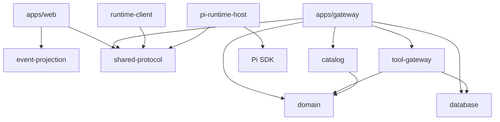
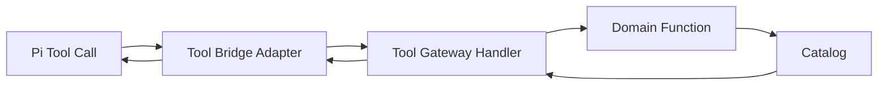
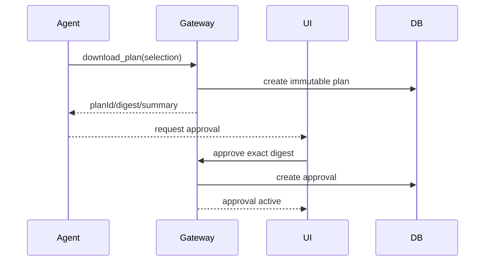
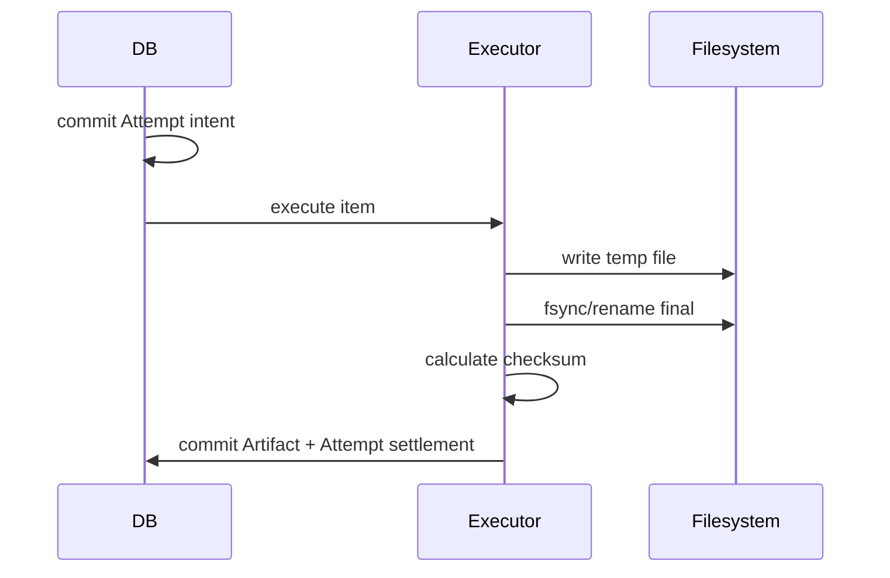
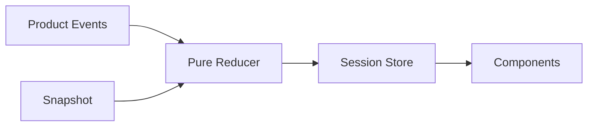
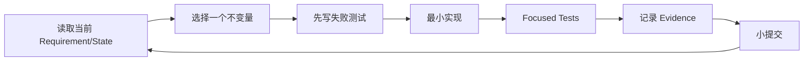

# 项目 04：从零实现的代码路径、里程碑和退出条件

## 总原则

实施顺序按风险排列，而不是按界面排列：

```text
领域正确性
→ 只读 Tool
→ Pi Runtime
→ Plan/Approval
→ 副作用/恢复
→ Host/Client/UI
→ 长任务和交付
```

先做漂亮页面、最后才补幂等与恢复，通常会导致重构整个状态模型。

## 1. 推荐仓库结构

```text
personal-data-agent/
├── apps/
│   ├── gateway/
│   │   └── src/
│   └── web/
│       └── src/
├── packages/
│   ├── domain/
│   ├── database/
│   ├── catalog/
│   ├── tool-gateway/
│   ├── runtime-client/
│   ├── event-projection/
│   └── shared-protocol/
├── integrations/
│   └── pi-runtime-host/
├── fixtures/
├── docs/
├── reports/
└── scripts/
```

若暂时直接在 `7155/pi` 中做 Demo，则产品适配代码保持在 `integrations/*`，不要放进上游 `packages/*`。

## 2. 模块依赖方向



禁止依赖：

```text
domain → Pi
Product DB → TUI
Pi packages → Product Gateway
web → raw Pi Event types
```

## 3. M0：领域模型与 Fixture

### 目标

不用模型、不用 Pi，证明 Catalog/Requirement/Quality/Plan 的领域规则正确。

### 文件

```text
packages/domain/src/
├── requirement.ts
├── dataset.ts
├── evidence.ts
├── plan.ts
├── canonical-json.ts
├── digest.ts
└── state-machine.ts

packages/catalog/src/
├── fixture-catalog.ts
├── coverage.ts
└── search.ts
```

### 必写纯函数

```ts
parseAndValidateRequirement(input): DataRequirement
searchDatasets(catalog, requirement): DatasetRecord[]
inspectDataset(id): DatasetRecord
compareDataset(dataset, requirement): DatasetEvidence
canonicalizePlan(plan): string
digestPlan(plan): string
transitionPlan(current, next): Plan
```

### 测试

- Geometry/Time/Variable；
- Coverage 0/partial/full；
- Resolution；
- Unknown Uncertainty/License；
- Canonical JSON Key/Item Order；
- Plan Digest Stability；
- Illegal State Transition。

### 退出条件

```text
✓ 领域包零 Pi 依赖
✓ Fixture 中所有候选有预期 Evidence
✓ 相同 Plan 不同对象 Key 顺序 Digest 相同
✓ Item 顺序变化按产品规则明确处理
✓ 非法 Requirement 明确错误
```

## 4. M1：只读 Tool Gateway

### 目标

将领域函数包装成 Tool，但仍无写副作用。

### Tool

```text
catalog_search
dataset_inspect
quality_compare
```

### 分层



Tool Gateway Handler 不依赖 Pi Tool 类型；Adapter 负责转换。

### 统一接口

```ts
type ToolRequest<TArgs> = {
    toolCallId: string;
    sessionId: string;
    turnId: string;
    toolName: string;
    manifestRevision: string;
    args: TArgs;
};

type ToolResponse<TDetails> = {
    status: "completed" | "failed";
    summary: string;
    details: TDetails;
    retryable: boolean;
};
```

### 退出条件

```text
✓ 每个 Tool 有 Schema 行为测试
✓ Tool Result 不泄露完整内部 DB
✓ Unknown Metadata 明确返回
✓ 相同查询确定性排序
✓ ToolCallId/SessionId/TurnId 全链可追踪
```

## 5. M2：接入 Pi AgentSession

### 目标

Faux Provider 先跑通领域 Tool Loop，再接真实模型。

### 创建 Runtime

```ts
const { session } = await createAgentSession({
    cwd: workspace,
    agentDir,
    modelRuntime,
    sessionManager,
    settingsManager,
    resourceLoader,
    noTools: "builtin",
    customTools: domainToolDefinitions,
});
```

### Pi 源码对应

| 你写的代码 | Pi 源码入口 |
|---|---|
| Session 创建 | `packages/coding-agent/src/core/sdk.ts` |
| Prompt | `agent-session.ts::prompt` |
| Run | `packages/agent/src/agent.ts` |
| Tool Loop | `packages/agent/src/agent-loop.ts` |
| Session 写入 | `session-manager.ts` |
| Model/Auth | `model-runtime.ts` |

### 先使用 Faux Provider

固定三次响应：

```text
Turn 1 catalog_search
Turn 2 dataset_inspect + quality_compare
Turn 3 final recommendation
```

断言 Event Trace，再接真实模型。真实模型只影响 Tool 选择，不影响状态和权限测试。

### 退出条件

```text
✓ Event Trace 与预期一致
✓ Tool Result 回到下一 Provider Context
✓ Steer/Follow-up/Abort 测试
✓ agent_end Listener settlement 测试
✓ Session Reopen 恢复 Model/Thinking/Messages
✓ 真实模型 Demo 不依赖未验证自由文本事实
```

## 6. M3：Plan、Approval 与 Act Gate

### 新模块

```text
packages/domain/src/approval.ts
packages/database/src/plan-repository.ts
packages/database/src/approval-repository.ts
packages/tool-gateway/src/download-plan.ts
packages/tool-gateway/src/policy.ts
```

### `download_plan`

只读领域元数据、写 Product DB Plan；不下载文件。

### Approval Flow



### Agent 停止等待

生成 Approval Request 后，不让模型无限轮询：

- Tool Result `terminate=true`；或
- `shouldStopAfterTurn` 返回 true；
- Turn 正常 `agent_settled`；
- Approval 后开启新 Prompt/Follow-up。

### 退出条件

```text
✓ Plan Immutable
✓ Approval 绑定 Session/Plan/Digest/Expiry
✓ 用户拒绝后无写副作用
✓ Requirement 改变使旧 Plan Superseded
✓ Approval 不写入 Prompt 作为唯一权威
✓ Agent 在等待外部审批时正常 Settled
```

## 7. M4：执行、Artifact 与 Crash Recovery

### 新模块

```text
packages/database/src/attempt-repository.ts
packages/database/src/artifact-repository.ts
packages/tool-gateway/src/download-execute.ts
packages/tool-gateway/src/recovery.ts
packages/tool-gateway/src/checksum.ts
```

### Effect Sandwich



写文件推荐：

```text
目标同目录临时文件
→ 流式写
→ fsync/close
→ checksum
→ atomic rename
→ Product DB settlement
```

### Recovery Worker

启动或周期查询：

```text
starting/running/unknown Attempts
→ inspect external operation/temp/final file
→ verified completed / failed / still running / unknown
→ commit recovery event
```

### 退出条件

```text
✓ 未审批绝不执行
✓ Idempotency Key 唯一并绑定 Args Digest
✓ 相同 Key 重试不重复副作用
✓ 五个 Crash Point 测试
✓ Checksum 不匹配隔离 Artifact
✓ Abort 后不启动下一个 Item
✓ Unknown Outcome 有人工/自动 Inspect 路径
```

## 8. M5：Runtime Host、Client 与 Web Projection

### Runtime Host

优先复用当前：

```text
integrations/rag-ime-runtime-host
```

逐步泛化命名，但不在这一里程碑重写成熟 Pi 生命周期。

### 必需方法

```text
hello
health
models.list
session.open
session.snapshot
session.prompt
session.steer
session.follow_up
session.abort
session.compact
session.fork.candidates
session.fork
tools.sync
approval.resolve（可留 Gateway API）
```

### Client

```text
Request ID Map
Strict Framing
Event Reducer
Sequence Gap
Snapshot
Reconnect
Process Exit Cleanup
```

### Web Store



### 退出条件

```text
✓ Prompt Pending 时 Abort/Snapshot 可达
✓ 同 Session 双 Prompt 拒绝
✓ 不同 Session 并行
✓ Client 重连与 Snapshot
✓ Late Event 不污染当前 Session
✓ Delta 不产生重复卡片
✓ Host 单请求超时不退出进程
```

## 9. M6：长任务、Fork、Memory、Outbox 与最终交付

### Compaction

- 真实阈值测试；
- Summary 结构化；
- Queue 保留；
- `session_compact_failed`；
- Overflow Recovery 上限；
- Compaction Usage。

### Product Memory

只注入：

```text
项目稳定约束
常用区域/CRS
允许 License
偏好权威来源
```

Transient Tool Evidence 不写长期 Memory。

### Fork

- 新 Product Session/Native Binding；
- Session Lineage；
- Approval 不继承；
- Evidence 可引用但记录 Provenance。

### Outbox

- Turn Settled；
- Approval；
- Attempt；
- Artifact；
- Compaction Failure；
- Goal Usage。

### Final Delivery

只有在：

```text
所有 Plan Item terminal
+ Artifact verified
+ Report committed
+ Pi agent_settled
+ 必要 Outbox 本地 committed
```

才产生一次 Final Delivery。

### 退出条件

```text
✓ 长任务 Compaction 后继续
✓ Fork 两策略互不污染
✓ Host/Gateway Restart 恢复
✓ Outbox Ack Lost 幂等
✓ Final Delivery 恰好一次
✓ Demo/README/Failure Matrix 完整
```

## 10. Commit 策略

推荐小提交：

```text
feat(domain): add requirement and evidence model
feat(tools): add read-only catalog tools
test(runtime): cover faux provider tool loop
feat(plan): create immutable download plans
feat(approval): bind approval to exact plan digest
feat(execution): add idempotent download attempts
feat(recovery): inspect unknown attempts on restart
feat(runtime-host): add session identity mapping
feat(ui): reduce runtime deltas by turn identity
docs: add failure evidence and demo
```

不要把数据库、Runtime、UI 和文档全部塞进一个巨大提交。

## 11. 每日工作闭环



## 12. 依赖上游 Pi 的策略

- 产品 Integration Pin 明确 Pi 版本；
- `packages/*` Core Patch 必须有失败复现和删除条件；
- 上游升级先跑 Runtime Acceptance Matrix；
- Changelog 0.80—0.84 专题用于判断语义变化；
- 不在产品分支复制上游 Agent Loop。

## 13. 练习题

1. 为什么 M0 不应依赖 Pi？
2. 为什么 Faux Provider 应先于真实模型？
3. Approval 后等待用户时，为什么要让当前 Turn Settled？
4. 写文件为什么使用临时文件 + Rename？
5. M5 的 UI 为什么必须消费 Product Event，而不是 Raw Pi Event？
6. Final Delivery 的五个前置证据是什么？
7. 为七个里程碑各写一个不可跳过的退出门。
