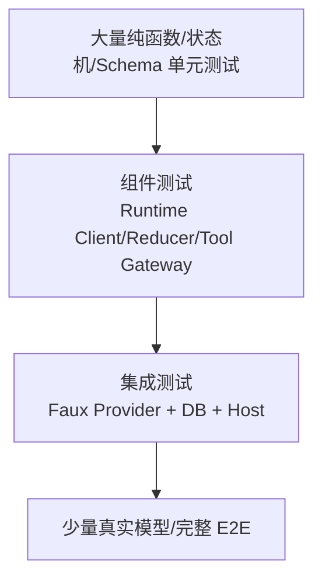
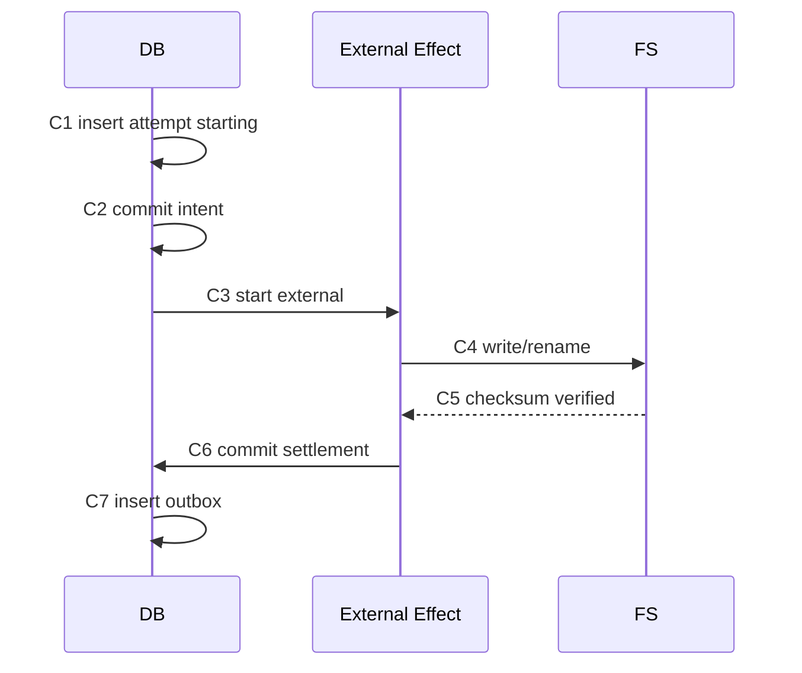

# 项目 05：测试策略、故障注入矩阵与发布门

## 1. 测试目标

这个项目最重要的不是“模型有时能完成任务”，而是证明以下不变量在失败和重启后仍成立：

```text
未审批不执行
同幂等键不重复
未知结果不盲重放
同 Session 单 Active Run
Abort 不杀共享 Host
agent_settled 才是最终边界
Late Event 不污染当前视图
Compaction 不丢用户意图
Fork 不继承 Approval
最终交付恰好一次
```

## 2. 测试金字塔



真实模型 E2E 不能替代底层确定性测试，因为它慢、贵且非确定。

## 3. 测试环境

### 单元环境

```text
In-memory Catalog
In-memory/temporary SQLite
Faux Provider
Temporary Workspace
Fake External Downloader
Deterministic Clock/UUID
```

### 集成环境

```text
真实 Pi AgentSession
真实 SessionManager JSONL
Runtime Host child process
Gateway Test Server
SQLite WAL
Web/TUI Event Reducer
```

### E2E

```text
真实模型
Fixture Catalog
小文件模拟下载
真实 Approval UI
真实 Host Restart
```

## 4. 证据格式

每项失败测试保存：

```json
{
  "caseId": "TOOL-CRASH-04",
  "given": "external effect completed, local settlement missing",
  "injectionPoint": "after checksum before attempt commit",
  "expectedState": {
    "attempt": "unknown",
    "externalCalls": 1,
    "artifact": "inspectable"
  },
  "recovery": "inspect checksum and commit completed",
  "events": ["attempt.unknown", "attempt.recovered", "attempt.completed"],
  "testCommand": "...",
  "result": "passed"
}
```

## 5. Domain Matrix

| ID | 场景 | 预期 |
|---|---|---|
| DOM-01 | Region 西>东/南>北 | Requirement Validation 失败 |
| DOM-02 | start>end | 失败 |
| DOM-03 | variables 空 | 失败 |
| DOM-04 | Dataset 时间完整覆盖 | `timeCovered=true` |
| DOM-05 | 部分时间覆盖 | Warning + 不满足硬约束 |
| DOM-06 | Coverage=0 | 排除 |
| DOM-07 | Coverage=0.75 | 明确比例和 Warning |
| DOM-08 | Resolution 超限 | 排除或降级，取决于硬/软约束 |
| DOM-09 | Uncertainty unknown | 不得伪造数值 |
| DOM-10 | License unknown | Warning/阻止执行按政策 |
| DOM-11 | 同 Plan 不同对象 Key 顺序 | Digest 相同 |
| DOM-12 | Plan Item 顺序变化 | 按定义相同或不同，测试固定 |
| DOM-13 | Illegal Plan Transition | 明确失败 |
| DOM-14 | Superseded Requirement 生成 Plan | 拒绝 |

## 6. Tool Schema 与执行 Matrix

| ID | 场景 | Execute 是否发生 | ToolResult |
|---|---|---:|---|
| TOOL-01 | Tool 不存在 | 否 | Error, model 可修正 |
| TOOL-02 | 必填字段缺失 | 否 | Validation Error |
| TOOL-03 | 类型错误 | 否 | Validation Error |
| TOOL-04 | 额外字段且 Schema 禁止 | 否 | Validation Error |
| TOOL-05 | `prepareArguments` 兼容旧格式 | 是 | 标准参数执行 |
| TOOL-06 | Before Hook Block | 否 | Error + reason |
| TOOL-07 | Before Hook terminate | 否 | Batch 终止策略生效 |
| TOOL-08 | Execute 抛异常 | 已开始 | Error ToolResult |
| TOOL-09 | After Hook 抛异常 | Tool 已完成 | Error ToolResult，副作用事实仍记录 |
| TOOL-10 | Length 截断 Tool Call | 否 | 全部失败关闭 |
| TOOL-11 | Late progress after settle | 不新增副作用 | Update 被忽略 |
| TOOL-12 | Parallel completion reversed | 是 | Event 真顺序，Result 稳定顺序 |
| TOOL-13 | Sequential Tool | 是 | 不并发 |

## 7. Approval Matrix

| ID | 场景 | 预期 |
|---|---|---|
| APP-01 | 无 Token | Block |
| APP-02 | Token 不存在 | Block |
| APP-03 | Token 过期 | Block + Approval Expired Event |
| APP-04 | Token 已撤销 | Block |
| APP-05 | Session 不匹配 | Block |
| APP-06 | Tool 不匹配 | Block |
| APP-07 | Plan ID 不匹配 | Block |
| APP-08 | Plan Digest 不匹配 | Block |
| APP-09 | Requirement 已 Superseded | Block |
| APP-10 | Confirmation Text/Preview 不匹配 | Block |
| APP-11 | Resolve 请求重试 | 同一 Decision，无重复记录 |
| APP-12 | 同 Approval 改 Decision | 拒绝 |
| APP-13 | Fork 使用源 Approval | Block |

## 8. Idempotency Matrix

| ID | 场景 | 外部调用次数 | 结果 |
|---|---|---:|---|
| IDEM-01 | 首次 Key | 1 | Completed |
| IDEM-02 | 同 Key 同 Args 已完成 | 仍为 1 | 返回同结果 |
| IDEM-03 | 同 Key 不同 Args | 仍为 1 | Reject key reuse |
| IDEM-04 | 两并发同 Key | 1 | 一个创建，另一个等待/返回同 Attempt |
| IDEM-05 | Retry 在 Starting | ≤1 | 沿用 Attempt |
| IDEM-06 | Retry 在 Running | ≤1 | 查询当前 Operation |
| IDEM-07 | Retry 在 Unknown | 不自动增加 | Inspect 后决定 |
| IDEM-08 | Gateway Response 丢失 | 1 | Client 重试返回原结果 |
| IDEM-09 | Outbox Ack 丢失 | 业务 effect 1 | Consumer 去重 Event |

## 9. Crash Point Matrix



| ID | Crash Point | 恢复 |
|---|---|---|
| CR-01 | C1 前 | 无记录，安全开始 |
| CR-02 | C1 后 C2 前 | 事务回滚或 incomplete 不可见 |
| CR-03 | C2 后 C3 前 | Intent 存在、无 External ID，可安全开始 |
| CR-04 | C3 后 C4 前 | Inspect external operation |
| CR-05 | C4 后 C5 前 | 检查临时/最终文件，重算 checksum |
| CR-06 | C5 后 C6 前 | Artifact 已存在，补写 Settlement |
| CR-07 | C6 后 C7 前 | 业务完成，恢复时补 Outbox |
| CR-08 | C7 后 Ack 前 | 重发同 Event ID |

每个 Crash Point 至少测试一次 Process Restart，而不是只抛异常继续同进程。

## 10. Agent Lifecycle Matrix

| ID | 场景 | 关键事件/状态 |
|---|---|---|
| AG-01 | 单 Turn final | `agent_end → agent_settled` |
| AG-02 | Tool 两 Turn | 两个 `turn_end`，一次 settled |
| AG-03 | Retry 成功 | 两个 Agent Attempt，一次 Product Turn settled |
| AG-04 | Retry 耗尽 | Final Failed + settled |
| AG-05 | Overflow Compact 成功 | Compaction Entry + continue + settled |
| AG-06 | Compaction 失败 no retry | `session_compact_failed` + settled |
| AG-07 | AgentEnd Listener 延迟 | Idle 不提前 |
| AG-08 | Abort Streaming | aborted message + settled |
| AG-09 | Abort Tool | 后续 Tool 不开始，当前状态明确 |
| AG-10 | `shouldStopAfterTurn` | 当前 Tool Result 完整，不拉下一 Turn |
| AG-11 | Steer | Tool Batch 后注入 |
| AG-12 | Follow-up | 原任务停止点注入 |

## 11. Session Matrix

| ID | 场景 | 预期 |
|---|---|---|
| SES-01 | Branch A/B | Context 按 Leaf 独立 |
| SES-02 | Model/Thinking Change | 恢复最后值 |
| SES-03 | Custom Entry | 不进模型 |
| SES-04 | Custom Message | 进 Context |
| SES-05 | Compaction | Summary + retained tail |
| SES-06 | Fork before User | 新 Leaf 在 User 前，文本返回编辑器 |
| SES-07 | Fork at Entry | 包含目标 Entry |
| SES-08 | Fork 源不变 | 源 File/Leaf 不改 |
| SES-09 | Old Extension Context | Stale Error |
| SES-10 | Torn Tail | 修复有效前缀/明确失败 |
| SES-11 | Missing Parent | Validator 失败 |
| SES-12 | Duplicate ID/Cycle | Validator 失败 |
| SES-13 | Reopen after Eviction | Transcript/Tools/Model 恢复 |

## 12. Compaction/Retry Matrix

| ID | 场景 | 预期 |
|---|---|---|
| CMP-01 | Context=threshold | 不触发（当前实现是 `>`） |
| CMP-02 | Context=threshold+1 | 触发 |
| CMP-03 | Valid Usage + Tail | 正确合成 |
| CMP-04 | Aborted/Zero Usage | 跳过 |
| CMP-05 | Cut near ToolResult | 不从 ToolResult 开始 |
| CMP-06 | Split Turn | 找到 Turn Start/生成 Prefix Summary |
| CMP-07 | Previous Compaction | 继承 Files/State |
| CMP-08 | Compaction 中 Steer | 不丢 |
| CMP-09 | Manual + Auto 并发 | 互斥 |
| CMP-10 | Summary 429 | Retry Event |
| CMP-11 | Retry Delay Abort | 立即停止 |
| CMP-12 | Overflow 两次 | 第二次明确失败，不无限恢复 |
| CMP-13 | Summary 使用主 Cache ID | 测试应防止 |
| CMP-14 | Compaction Usage | 进入 Ledger |

## 13. Model/Auth/Catalog Matrix

| ID | 场景 | 预期 |
|---|---|---|
| MOD-01 | Model 在 all 无 Auth | 不在 available |
| MOD-02 | Session Model 可用 | 恢复 |
| MOD-03 | Session Model 不可用 | Fallback Message |
| MOD-04 | OAuth Near Expiry | Refresh |
| MOD-05 | 两并发 Refresh | 单飞 |
| MOD-06 | 等 Credential Lock Abort | 立即退出 |
| MOD-07 | Auth 动态 Base URL | 请求使用新 URL |
| MOD-08 | Header `null` | 删除继承值 |
| MOD-09 | Catalog 304 | 更新 checkedAt，不替换模型 |
| MOD-10 | Refresh A 慢/B 新 | A Publish 被拒绝 |
| MOD-11 | Provider 忽略 Signal | 调用者停止等待，迟到结果不能发布 |
| MOD-12 | Unknown Stop Reason | Error + raw reason |
| MOD-13 | Unsupported Strict Tool require | 请求前失败 |
| MOD-14 | Summary Routing ID | 与主 Session 隔离 |

## 14. Runtime Host Matrix

| ID | 场景 | 预期 |
|---|---|---|
| HOST-01 | UTF-8 跨 Chunk | 正确重组 |
| HOST-02 | U+2028/U+2029 | 保留在 JSON 字符串 |
| HOST-03 | Invalid UTF-8 | Framing Failure |
| HOST-04 | Oversized | 拒绝 |
| HOST-05 | EOF Truncated | 拒绝 |
| HOST-06 | Prompt Pending + Health | Health 立即响应 |
| HOST-07 | Prompt Pending + Abort | Abort 可达 |
| HOST-08 | 同 Session 并发 Open | 一个 Runtime |
| HOST-09 | 不同 Session Prompt | 并行 |
| HOST-10 | 同 Session 双 Prompt | Reject/明确 Queue |
| HOST-11 | Completion Cancel | 不影响 Session |
| HOST-12 | Session A Abort | B 不受影响 |
| HOST-13 | LRU | 只 Evict Idle，Transcript 保留 |
| HOST-14 | Shutdown | Drain/Settle/Dispose |
| HOST-15 | Child Exit | Client Pending 全 Reject |
| HOST-16 | Malformed Request | 下一请求仍可用 |

## 15. Client/UI Matrix

| ID | 场景 | 预期 |
|---|---|---|
| UI-01 | 100 Delta | 一个 Draft Card |
| UI-02 | Duplicate Sequence | Ignore |
| UI-03 | Sequence Gap | Request Snapshot |
| UI-04 | Message End | Finalize/Correct Draft |
| UI-05 | Two Tools | 按 ToolCallId 更新 |
| UI-06 | Tool B 先结束 | 不重复/不换 Key |
| UI-07 | Retry | 同 Product Turn 多 Attempt |
| UI-08 | Compaction | 无空 Assistant Card |
| UI-09 | Settling | 暂不允许普通 Prompt |
| UI-10 | Late Session A Event | 不污染 B |
| UI-11 | Reconnect | Events/Snapshot 恢复 |
| UI-12 | Manual Scroll | 新 Delta 不拉到底部 |
| UI-13 | Overlay Stack | 关闭恢复正确 Focus |
| UI-14 | CJK/ANSI | 列宽正确 |
| UI-15 | Image | 不每帧重复上传 |

## 16. Security Matrix

- Workspace `..` Traversal；
- Symlink Escape；
- Session File 托管目录外；
- Tool Catalog 租户越权；
- Approval Token 泄露到 Event/Log；
- Provider Token 泄露到 Session；
- Plugin Symlink/大文件/路径穿越；
- Untrusted Project Extension；
- Prompt 绕过权限；
- Tool Result 注入恶意大对象；
- Header Hook 覆盖 Auth；
- Artifact 路径碰撞；
- Report HTML/Markdown Injection。

## 17. 发布门

### P0 必须全绿

```text
Approval Fail Closed
Idempotency/Crash Recovery
Session/Turn Isolation
Abort Isolation
Host Control Plane
agent_settled
Late Event Guard
Workspace Boundary
Secret Redaction
```

### P1

```text
Compaction/Retry
Fork/Reopen
Catalog generation
Outbox replay
UI reconnect
```

### P2

```text
性能、搜索、全屏 TUI、更多 Provider、真实下载优化
```

## 18. 测试报告模板

```markdown
# Validation Report

## Baseline
- Product commit:
- Pi version/commit:
- DB schema version:
- Model/provider:

## Commands

## P0 Results

## Failure Injection

## Recovery Evidence

## Known Unverified Paths

## Artifacts
- Event trace:
- Session fixture:
- Database snapshot:
- Report:
```

无法运行的真实 Provider E2E 必须明确写“未运行”，不能用 Faux Test 冒充。

## 19. 练习题

1. 为什么真实模型 E2E 不能替代 Faux Runtime Test？
2. 哪个 Crash Point最容易造成重复副作用？
3. `contextTokens == threshold` 当前应否触发？
4. 为 Approval、Host、UI 三组各补五个测试。
5. P0 与 P1 怎样划分？
6. 测试报告为什么必须记录 Pi Commit 和 DB Schema Version？
