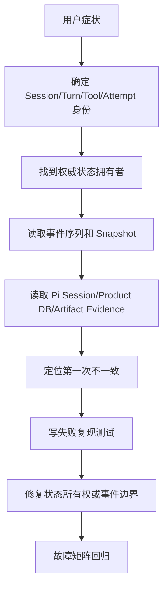
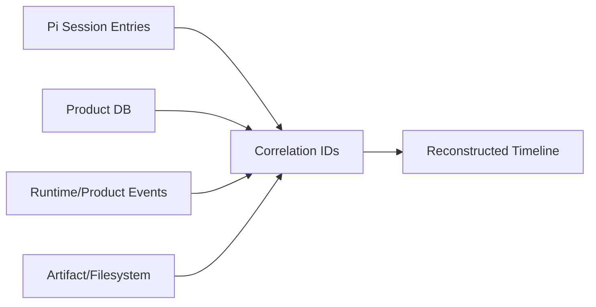
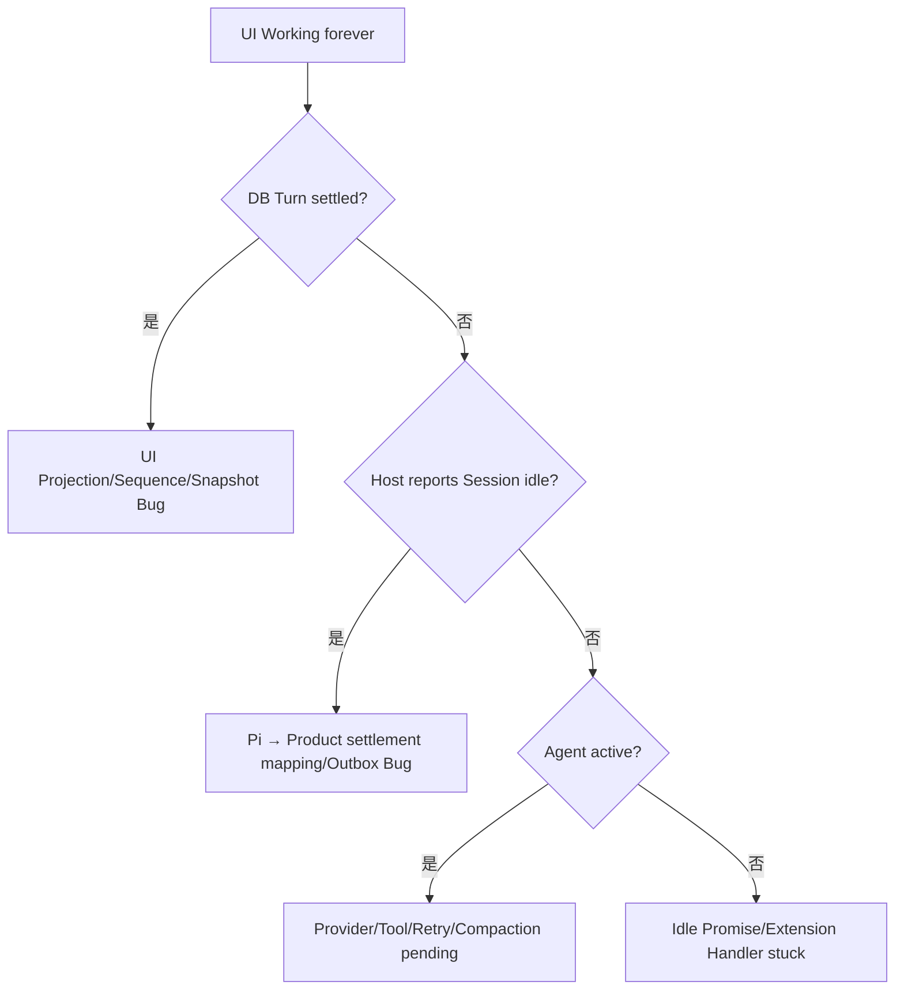
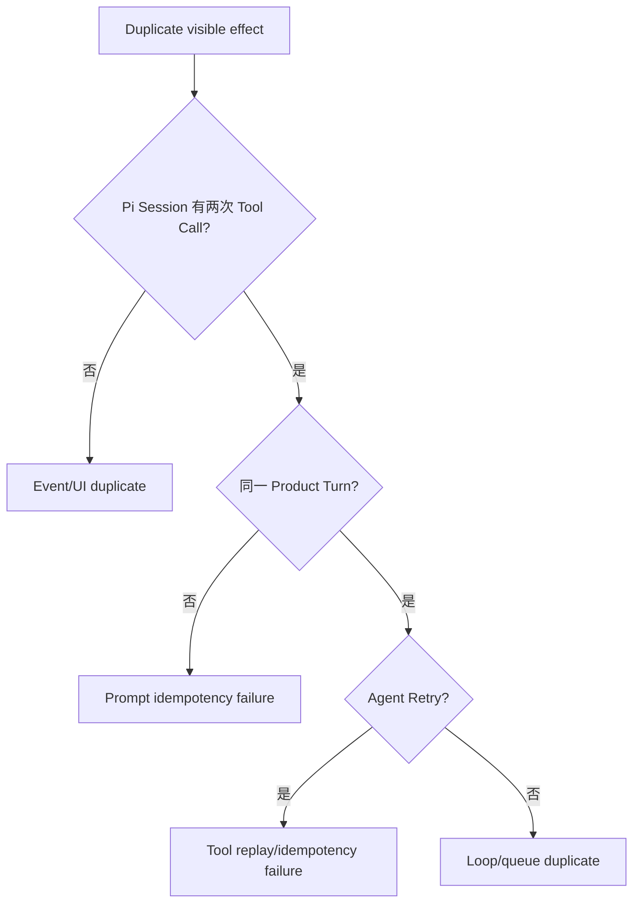
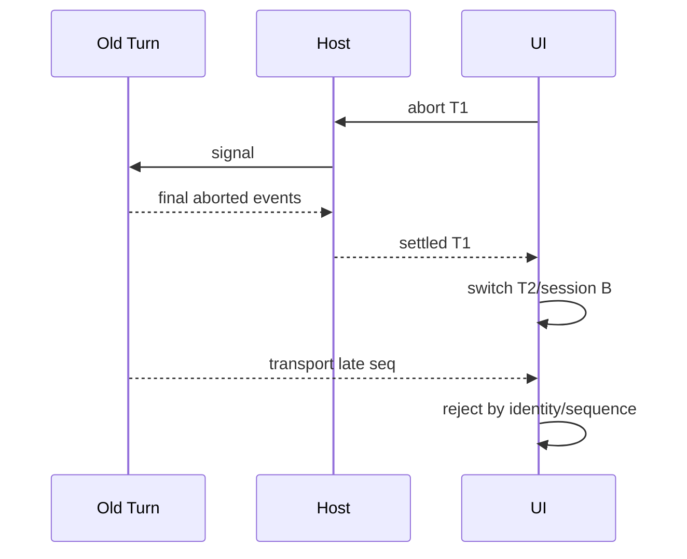
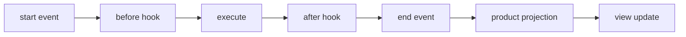
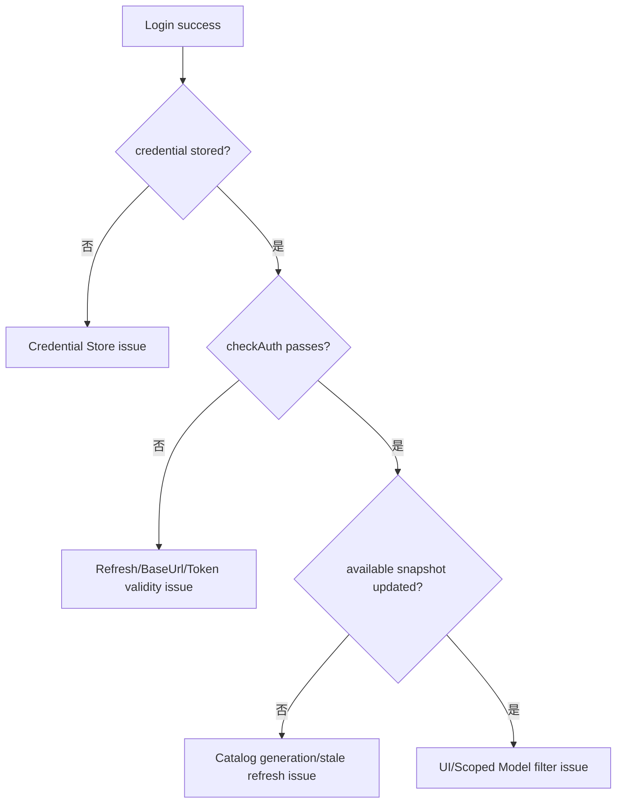

# 项目 06：从用户症状追到权威状态的调试 Playbook

## 1. 调试顺序

不要看到 UI 症状就先加防御判断。按固定顺序：



关键问题：

```text
谁拥有真实状态？
哪个事件应该改变它？
事件有没有产生？
产生后有没有被持久/投影？
迟到结果是否仍有写权限？
```

## 2. 每次先收集 Correlation Bundle

```json
{
  "projectId": "...",
  "sessionId": "...",
  "nativeSessionId": "...",
  "turnId": "...",
  "clientMessageId": "...",
  "agentAttemptId": "...",
  "toolCallIds": ["..."],
  "operationAttemptIds": ["..."],
  "latestSequence": 0,
  "piVersion": "0.84.2",
  "productCommit": "...",
  "sessionFile": "...",
  "workspace": "..."
}
```

没有 Identity，日志很容易把两个并发 Session 拼成一个故事。

## 3. 四份证据怎样对齐



| 证据 | 说明 |
|---|---|
| Pi Session | 模型、Tool、Compaction 实际历史 |
| Product DB | Requirement/Plan/Approval/Attempt 权威状态 |
| Event Trace | UI/外部系统看到了什么 |
| Artifact/External Inspect | 副作用是否真实发生 |

任何一份单独都可能不完整。

## 4. 通用事件检查

```text
sequence 是否连续
turnId 是否一致
agent_end 后是否有 Retry/Compaction
agent_settled 是否到达
Tool start/end 是否配对
message_start/update/end 是否配对
Outbox Event 是否 pending/dead-letter
Snapshot latestSequence 是否高于 Client
```

可用脚本思想：

```ts
function validateEventTrace(events: ProductEvent[]): string[] {
    const errors: string[] = [];
    const lastBySession = new Map<string, number>();
    const openTools = new Set<string>();

    for (const event of events) {
        const last = lastBySession.get(event.sessionId) ?? 0;
        if (event.sequence !== last + 1) {
            errors.push(`${event.sessionId}: expected ${last + 1}, got ${event.sequence}`);
        }
        lastBySession.set(event.sessionId, event.sequence);

        if (event.type === "tool.started") openTools.add(event.payload.toolCallId);
        if (event.type === "tool.completed" || event.type === "tool.failed") {
            openTools.delete(event.payload.toolCallId);
        }
    }

    for (const id of openTools) errors.push(`tool never settled: ${id}`);
    return errors;
}
```

## 5. 症状：一直显示“思考中”

### 先查

```text
Product Turn status
最后 Product Event
是否有 agent_settled
Host Pending Request
Extension settled Handler
Outbox 本地 Commit
Client Sequence Gap
```

### 决策图



### Pi 源码入口

```bash
rg "_emitAgentSettled|_resolveIdleWaitIfIdle|_handlePostAgentRun" \
  packages/coding-agent/src/core/agent-session.ts
rg "finishRun|waitForIdle|processEvents" packages/agent/src/agent.ts
```

### 常见根因

- `agent_end` 被错误当最终，但产品没收到真正 settled；
- `agent_settled` Extension 同步等待不可用 Gateway；
- Retry Delay 不可取消；
- Compaction Summary Pending；
- Client 丢了终态 Sequence 且没 Snapshot；
- UI Reducer因 Turn ID 错误拒绝 settled。

## 6. 症状：重复回复或重复 Tool

### 先查

```text
clientMessageId 是否相同
Product Turn 是否创建两次
Pi Session 是否有两个相同 User Entry
Tool Idempotency Key 是否相同
Provider Retry 还是 Client Retry
Event 是否重复但 Reducer 未去重
```



### 数据库查询

```sql
SELECT session_id, client_message_id, COUNT(*)
FROM product_turns
GROUP BY session_id, client_message_id
HAVING COUNT(*) > 1;

SELECT idempotency_key, COUNT(*)
FROM download_attempts
GROUP BY idempotency_key
HAVING COUNT(*) > 1;
```

## 7. 症状：Abort 后旧消息“回魂”

检查三条边界：

```text
Runtime 是否等 settlement
Transport 中是否已有 Late Event
Client 是否按 Session/Turn/Sequence Guard
```



Runtime 修好不代表网络里没有旧事件；UI Guard 仍必需。

## 8. 症状：一个请求超时导致所有 Session 中断

### 证据

```text
Host Process 是否退出
其他 Session 的 AbortSignal 是否同时 aborted
是否共用一个 AbortController
是否调用 process.kill/exit 处理单请求 timeout
```

### 正确所有权

```text
Host Process
├── Session A Controller
├── Session B Controller
├── Completion request-1 Controller
└── Catalog refresh Controller
```

修复测试：Completion Cancel 后 Session B 的 Faux Stream 仍继续并 settled。

## 9. 症状：Tool 永远 Running

### 逐层排查

```text
1. Model Tool Call ID
2. tool_execution_start
3. Before Hook 是否 Pending
4. Tool.execute Promise
5. Child Process/HTTP 是否响应 Signal
6. Progress Callback 是否阻塞
7. afterToolCall 是否 Pending/抛错
8. tool_execution_end
9. Product Event Mapping
10. UI ToolCallId Reducer
```



找到第一处没有后续证据的位置。

## 10. 症状：Tool 已完成但又执行一次

最危险情况：Effect 后 Settlement 前 Crash。

检查：

```text
Attempt status
external_operation_id
目标文件/远程资源
checksum
Tool replay policy
Idempotency Key
恢复 Worker 的判定
```

禁止仅因为 Pi Session 缺 Tool Result 就重放。

## 11. 症状：Compaction 后忘记项目

### 检查摘要

```text
Goal
Constraints
Decisions
Completed
Evidence
Files
Pending
Plan/Approval/Artifacts
```

### 检查 Context 投影

```text
latest Compaction Entry
firstKeptEntryId
retained tail
Split-turn prefix summary
Product Session Memory
Transient Context 是否错误清空/残留
```

### 源码

```bash
rg "firstKeptEntryId|findTurnStartIndex|collectSourceMessages" \
  packages/coding-agent/src/core/compaction
rg "buildContextEntries|buildSessionContext" \
  packages/coding-agent/src/core/session-manager.ts
```

## 12. 症状：压缩期间用户消息丢失

检查：

- Queue 是否存在 Agent `PendingMessageQueue`；
- Context 替换是否错误重置 Agent；
- `reset()` 是否在 Active Run 使用；
- Manual/Auto Compaction 是否并发；
- Compaction 完成后 `agent.continue()` 是否拉 Queue；
- UI Queue Projection 是否只丢展示而非执行消息。

对照：

```text
packages/coding-agent/test/agent-session-auto-compaction-queue.test.ts
```

## 13. 症状：Session Reopen 后模型/工具不一致

### Model

```text
Session 最后 model_change
ModelRuntime all/available
Auth check
Fallback Message
Thinking clamp
```

### Tool

```text
Session 中 addedToolNames/披露记录
Product Catalog Revision
Runtime Tool Registry
Active Tool Names
prepareNextTurn tools snapshot
```

### cwd

```text
Binding cwd
Session Header cwd
Workspace Root
ResourceLoader cwd
Tool Factory cwd
```

只恢复 Messages 会让 UI 看似正确，但 Tool 指向错误目录。

## 14. 症状：Fork 后两个分支互相污染

检查：

```text
Product Session 是否新 ID
Native Session 是否新 ID/File
Session Lineage
源 Leaf 是否改变
Approval 是否复制
Tool Attempt 是否共用错误 Key
UI Store 是否按 Session 分区
旧 Extension Context 是否 stale
```

```sql
SELECT child_session_id, parent_session_id, forked_from_entry_id
FROM session_lineage
WHERE child_session_id = ?;
```

## 15. 症状：模型登录成功但仍不可用



源码：

```bash
rg "runAvailabilityRefresh|queueAvailabilityRefresh|refreshProviderAvailability" \
  packages/coding-agent/src/core/model-runtime.ts
rg "minOAuthValidityMs|operationSignal|credentialOperations" \
  packages/ai packages/coding-agent
```

## 16. 症状：新 Catalog 被旧结果覆盖

日志至少记录：

```text
refresh generation
provider id
start/end time
abort state
publish result true/false
stored revision/etag
snapshot count
```

修复不应是“加一个最新时间判断”，而是让过期 Generation 无权 Publish。

## 17. 症状：Prompt Cache 一直 Miss

比较两次真实 Provider Payload 的稳定前缀：

```text
System Prompt bytes
Tool Schema 顺序和内容
Session/Prompt Cache Key
Memory 排序
当前时间/随机 ID
Context File 顺序
Compaction routing identity
```

```bash
rg "prompt_cache|cacheRetention|sessionId|additional_tools" packages/ai
```

常见：每轮把 `current_time` 写进 System Prompt 前部。可将当前时间放稳定位置之外或只在确有需要的 Context Block 中更新，并接受明确 Cache Generation。

## 18. 症状：`database is locked`

SQLite 先确认：

```text
谁持写事务
事务内是否做网络/模型/Tool
是否多个 DB 连接并发写
WAL/Busy Timeout
Outbox Worker 是否长事务
Session JSONL 与 Product DB 是否互相等待
```

错误：

```text
BEGIN IMMEDIATE
→ 调 Provider 60 秒
→ 写结果
COMMIT
```

正确：

```text
短事务 Commit Intent
→ 事务外调用 Provider/Tool
→ 短事务 Commit Settlement
```

不要用无限 Retry 掩盖锁所有权错误。

## 19. 症状：前端闪烁/跳动/空卡片

检查：

```text
message_update 是否 append
React Key 是否数组索引
Compaction/Retry Event 是否创建 Message Card
每个 Delta 是否 force full redraw
Auto-follow 是否覆盖 Manual Scroll
Snapshot 是否无条件清空再重建
ToolCallId 是否稳定
```

使用纯 Reducer Event Replay复现，不依赖实时模型。

## 20. 症状：审批明明拒绝却执行了

逐层：

```text
UI Decision
Product Approval DB
Approval Resolve Event
BeforeToolCall Result
Tool Gateway Policy
Tool Attempt Insert
External Call
```

最常见错误是只把拒绝写入聊天文本，Tool Gateway 没有检查 DB。

## 21. 症状：Artifact 文件存在但 DB 没记录

这是典型 C5→C6 Crash：

```text
读取 Attempt=running/unknown
→ 检查目标/临时文件
→ 计算真实 checksum
→ 对比 Plan Item
→ 验证成功则补写 Artifact/Completed
→ 不匹配则 quarantine/failed
```

不要直接删除文件重下，可能浪费且掩盖重复执行。

## 22. 症状：Outbox 堆积

检查：

```text
Gateway 可达
Consumer Idempotency
Event Payload Schema
Secret Redaction Failure
单个 Poison Event 是否阻塞队列
next_attempt_at/Backoff
Dead Letter Threshold
Sender 是否按 aggregate/session 保序
```

Outbox 堆积不应阻止新的 Agent Run，但关键最终交付可能需标记“事件待同步”。

## 23. 最小调试页面/命令

建议产品提供只读 Debug Snapshot：

```text
Session Binding
Active Turn/Attempt
Queues
Model/Auth Summary（无秘密）
Active Tools/Catalog Revision
Last 50 Product Events
Pi Session File/Leaf
Open Product Attempts
Outbox Counts
Artifact Verification
```

禁止在 Debug API 返回 API Key、OAuth Token、完整敏感 Memory 或未脱敏 Tool Args。

## 24. 修复提交标准

每个 Bug 修复提交包含：

```text
复现测试
第一次不一致的权威状态说明
修复代码
对应 Failure Matrix 回归
运行命令和结果
仍未验证路径
```

避免提交信息只写“fix race condition”。

## 25. 练习题

1. “一直思考中”应先查 UI 还是 Product Turn DB？为什么？
2. Tool 重复执行时怎样区分 Client Retry、Agent Retry 和 Event Duplicate？
3. Abort 后旧消息回魂需要哪两层同时修复？
4. Compaction 后忘记目标应检查哪五份证据？
5. SQLite Locked 为什么不能只加无限重试？
6. Catalog Stale Result 的根治不变量是什么？
7. 为一个真实 Bug 写完整 Correlation Bundle 和修复提交说明。
