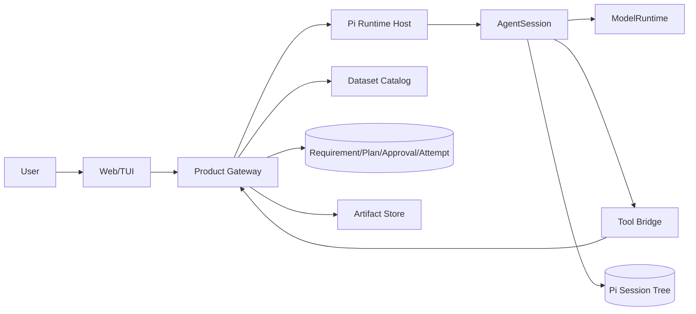
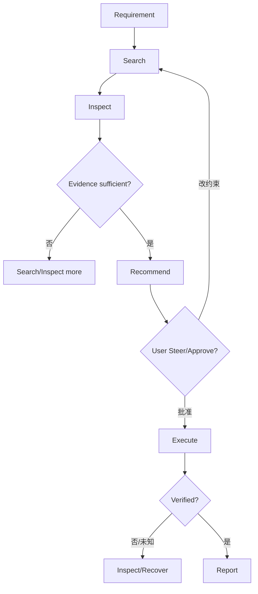

# 项目 07：最终 README、五分钟 Demo、90 秒表达与源码追问准备

## 1. 最终交付不是一段视频

完整交付至少包含：

```text
可运行代码
确定性测试
故障注入证据
事件 Trace
Session/DB/Artifact 样例
架构与状态机文档
五分钟 Demo
90 秒表达
限制与下一步
```

面试官或评审不应只能“相信你演示时刚好成功”。

## 2. 项目 README 首页结构

```markdown
# Data Preparation Agent

一句话：将自然语言时空数据需求转成有证据、可审批、可恢复的数据准备结果。

## Demo
- GIF/视频
- 一条真实输入
- 最终报告与 Artifact

## Why an Agent
解释为什么需要多 Turn Tool Loop、Steer、审批和长任务恢复。

## Architecture
一张产品/Pi/Tool/DB 所有权图。

## One Real Run
按事件展示 Prompt → Tool → Plan → Approval → Execute → Settled。

## Reliability
Approval、Idempotency、Crash Recovery、Abort、Compaction、Fork。

## Results
测试数、失败矩阵、示例报告、已验证边界。

## Source Guide
关键代码路径。

## Run Locally
确定命令。

## Limitations
诚实说明未做真实大文件/多租户/新 Harness 等。
```

README 不要先放 50 行技术栈 Badge；先说明用户价值和真实证据。

## 3. 一张推荐架构图



图旁边必须写所有权：

```text
Pi：Run/Turn/Tool/Session/Retry/Compaction
Product：Requirement/Approval/Attempt/Artifact/Memory
Adapter：Identity/Protocol/Event Mapping
```

## 4. README 的“为什么是 Agent”

不要说：

> 因为大模型很智能，可以自动选数据。

应该展示任务确实需要循环和用户介入：



这是 Agent 的合理性：多步工具决策、反馈、审批和恢复，而不是单次文本生成。

## 5. “一次真实 Run”展示格式

不要截图一长串聊天。用表格：

| Seq | Runtime Event | Tool/状态 | 证据 |
|---:|---|---|---|
| 1 | `turn.accepted` | T42 | clientMessageId M9 |
| 8 | `tool.started` | `catalog_search` | Requirement R3 |
| 14 | `tool.completed` | 3 candidates | Evidence IDs |
| 22 | `tool.completed` | `quality_compare` | coverage/uncertainty |
| 30 | `plan.created` | Plan P7 | digest |
| 34 | `turn.settled` | 等待审批 | Pi `agent_settled` |
| 41 | `approval.resolved` | approved | exact digest |
| 47 | `attempt.started` | Item 1 | idempotency key |
| 55 | `artifact.verified` | velocity fixture | checksum |
| 72 | `turn.settled` | report complete | Report ID |

每一行可链接 `event-trace.jsonl` 或 Product DB 记录。

## 6. Reliability 章节

### Approval

```text
Token Hash
+ Session ID
+ Plan ID
+ Plan Digest
+ Expiry
```

### Idempotency

```text
Unique Key
+ Args Digest
+ Attempt State
+ External Operation ID
```

### Crash Recovery

```text
Intent committed
→ Effect
→ Settlement committed
```

### Runtime Settlement

```text
agent_end
→ Retry/Compaction/Queue
→ agent_settled
```

### UI

```text
Session/Turn/Sequence Reducer
+ Snapshot correction
```

这些是项目的核心工程亮点，不要只把“支持多个 Provider”放在最前面。

## 7. 五分钟 Demo 脚本

### 0:00—0:30：问题

> 科研数据准备不是搜到一个文件就结束。用户要同时检查区域、时间、变量、分辨率、误差、License 和版本；执行下载还有审批、校验和恢复。我做的 Agent 将这条人工链路变成有证据的可恢复工作流。

### 0:30—1:00：架构边界

展示架构图并说：

> Pi 负责模型 Turn、Tool Loop、Session、取消、重试和 Compaction；产品 Gateway 保留 Requirement、Approval、Download Attempt 和 Artifact 的权威状态；Runtime Host 只做协议、身份和 Tool Bridge，不复制第二套 Agent 内核。

### 1:00—2:00：只读决策

输入 Fimbul 需求，展示：

```text
Catalog Search
Dataset Inspect
Quality Compare
候选排除理由
```

强调每个结论引用 Tool Evidence，不来自模型记忆。

### 2:00—2:40：Steer

输入：

> 排除 2 km 以上分辨率，并优先权威产品。

展示 Steer 在 Tool Batch 后进入，旧 Plan 不会继续使用。

### 2:40—3:20：Plan 与 Approval

展示不可变 Plan、Digest、目标路径和 Approval Dialog。先拒绝一次，证明没有文件；再批准精确 Digest。

### 3:20—4:10：Crash Recovery

在“文件完成、DB Settlement 前”注入崩溃。重启后展示：

```text
Attempt=unknown
Inspect file + checksum
Recovered completed
external calls 仍为 1
```

这是 Demo 最重要的一段。

### 4:10—4:40：长任务与 Session

展示 Compaction Summary 保留 Requirement/Plan/Artifact；可选展示 Fork 比较另一选择路线。

### 4:40—5:00：结果

打开最终报告、Artifact Checksum、Event Trace 和测试矩阵。

> 项目验证的不只是模型能跑通，而是取消、重试、Crash、重连和分支后状态仍然一致。

## 8. 90 秒项目表达

> 我做的是一个基于 Pi 的数据准备 Agent。用户输入区域、时间、变量和质量约束后，Agent 通过 Catalog Search、Dataset Inspect 和 Quality Compare Tool 收集证据，而不是让模型凭记忆推荐数据。它先生成不可变 Download Plan；写操作只有在产品数据库中存在绑定 Session、Plan Digest 和 Expiry 的 Approval 后才执行。
>
> Runtime 上我没有在产品层复制 Agent Loop。Pi AgentSession 负责 Turn、Tool、Steer、Abort、Retry、Compaction 和 Session Tree；Product Gateway 负责 Requirement、Approval、Idempotent Attempt、Artifact 和 Memory；Runtime Host 负责稳定身份和事件映射。副作用采用 Intent—Effect—Settlement，并以 Idempotency Key 和外部 Inspect 处理 Effect 后崩溃，避免重复下载。
>
> 前端不根据最后一条文本猜状态，而是按 Session、Turn 和 Sequence 归约 Delta，并用 Snapshot 校正。Demo 中我会注入一次下载成功后本地结算前崩溃，重启后通过 Checksum 恢复，证明外部调用仍只有一次。

## 9. 30 秒版本

> 这是一个可恢复的数据准备 Agent。Pi 负责 Agent Runtime，产品层负责数据目录、审批和副作用状态。模型只通过 Tool 获取证据；下载先生成不可变 Plan，再审批执行；所有写操作有幂等和 Crash Recovery。前端按 Runtime Event/Sequence 投影，不猜状态。

## 10. 源码追问路线

### “一次请求从哪里开始？”

```text
packages/coding-agent/src/core/sdk.ts::createAgentSession
→ agent-session.ts::prompt/_runAgentPrompt
→ packages/agent/src/agent.ts::prompt/runWithLifecycle
→ agent-loop.ts::runLoop
```

### “Tool 怎样执行？”

```text
agent-loop.ts::prepareToolCall
→ validateToolArguments
→ beforeToolCall
→ executePreparedToolCall
→ afterToolCall
→ createToolResultMessage
```

### “为什么 `agent_end` 不是最终结束？”

```text
AgentSession._handlePostAgentRun
→ Retry/Compaction/Queue
→ _emitAgentSettled
```

### “Session 怎样分支？”

```text
session-manager.ts::id/parentId/leafId
→ buildSessionPath/buildSessionContext
→ agent-session-runtime.ts::fork/teardown/create runtime
```

### “Compaction 怎么避免切断 Tool？”

```text
compaction.ts::findValidCutPoints
→ ToolResult 非 Cut Point
→ findTurnStartIndex
→ Split-turn Summary
```

### “模型和 OAuth 谁负责？”

```text
model-runtime.ts
→ Provider Composer
→ RuntimeCredentials
→ Auth/Refresh/Availability Snapshot
```

### “Host 为什么不会被一个请求堵住？”

```text
request-dispatcher.ts::inFlight Set
→ 请求独立执行
→ Session 内仍单 Run所有权
```

## 11. 高质量回答结构

回答源码问题时按：

```text
它解决什么真实问题
→ 谁调用
→ 权威状态在哪里
→ 核心函数链
→ 失败/取消/并发
→ 项目中如何使用
```

不要从类型字段列表开始，也不要只背类名。

## 12. 典型深度追问的回答要点

### 为什么不把 Approval 写进 Pi Session？

- Session 是执行历史，不是产品业务权威；
- Tool Gateway 可以被其他调用方使用；
- Fork/Compaction/模型文本不应改变审批；
- Approval 需要事务、撤销、Expiry、审计；
- Session 只保存 Approval ID/Result 作为证据。

### Abort 能保证什么？

- 不再开始后续工作；
- 尽力取消 Provider/Tool/Retry；
- 等 Runtime settlement；
- 不能撤销已经发生的外部副作用；
- Unknown Outcome 由 Attempt/Inspect 处理。

### 为什么不用新 AgentHarness v4？

- v4 Session/Lane/Operation 方向适合 durable Runtime；
- 当前部分执行路径仍有 `HarnessNotImplemented`；
- 成熟 AgentSession 已满足当前产品；
- 在独立实验分支验证 Crash Recovery/Lane，不阻塞交付。

### 为什么 Runtime Host 不直接用官方新 Protocol？

- 官方 Protocol/Server/Client 仍实验；
- 产品还需 Tool Sync、Approval、Goal、Plugin、Outbox 等业务命令；
- 可逐步替换 Framing/Lease/Transport，产品协议仍由 Adapter 维护。

## 13. 结果数字怎样写

可以写：

```text
P0 failure cases: 通过 X/Y
Runtime Host focused tests: X files / Y tests
Crash points verified: 8
Duplicate external effect under retries: 0
Event reducer replay determinism: 100%
```

只能写真实运行结果。没有真实大文件性能测试，就写：

```text
未验证：真实 TB 级数据下载吞吐与多实例 Gateway。
```

## 14. Limitation 章节

建议明确：

- Fixture Catalog，不代表全部公开数据源；
- 教学 Coverage 使用简化几何，生产需真实 GIS；
- 下载 Fixture 为小文件；
- 单 Gateway/SQLite MVP；
- 新 durable Harness 未切换生产；
- Tool Catalog 和 Memory 仍可继续扩展；
- 真实 Provider E2E 取决于凭证。

诚实限制会增强可信度，不会削弱项目。

## 15. 最终 PR/提交结构

```text
PR 1 Domain + Fixtures
PR 2 Read-only Tools + Faux Agent Flow
PR 3 Plan + Approval
PR 4 Idempotent Execution + Recovery
PR 5 Runtime Host + Client
PR 6 UI Projection + Reconnect
PR 7 Compaction/Fork/Memory/Outbox + Docs
```

每个 PR 都有独立验收证据。

## 16. 最终检查表

### 代码

- [ ] 领域纯函数与 Pi 解耦
- [ ] Tool 权限在执行边界强制
- [ ] 所有写 Tool 幂等
- [ ] Unknown Outcome 可恢复
- [ ] Session/Turn/Sequence 稳定
- [ ] Compaction/Fork/Abort 测试
- [ ] Secret Redaction

### 文档

- [ ] 用户问题
- [ ] 架构和所有权
- [ ] 一次真实 Run
- [ ] 状态机
- [ ] Failure Matrix
- [ ] Source Guide
- [ ] Limitations
- [ ] Reproduction Commands

### 演示

- [ ] 正常流程
- [ ] Steer
- [ ] Approval 拒绝/批准
- [ ] Crash Recovery
- [ ] Compaction 或 Fork
- [ ] 最终 Report/Checksum/Event Trace

## 练习题

1. 为什么 Demo 中必须注入失败，而不是只演示成功？
2. 90 秒表达中最重要的三个工程亮点是什么？
3. 面对“为什么需要 Agent”应展示什么循环？
4. 如何回答“为什么不用新 AgentHarness v4”？
5. 项目结果数字怎样避免夸大？
6. 写出自己的五分钟 Demo 台词并录制一次，检查是否在两分钟内进入真实运行证据。
